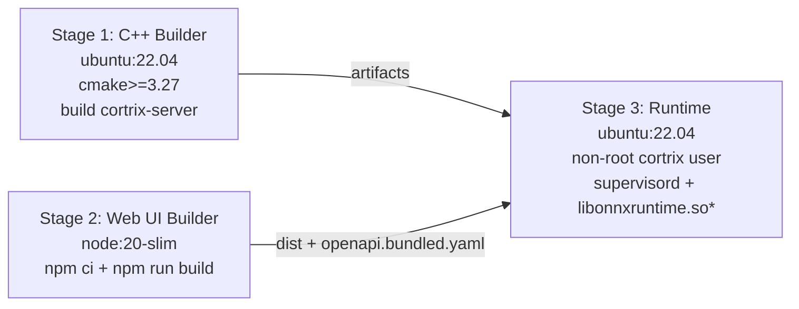
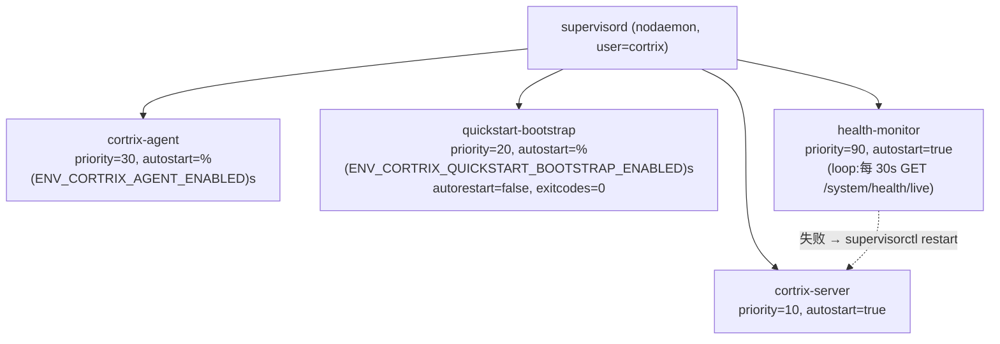
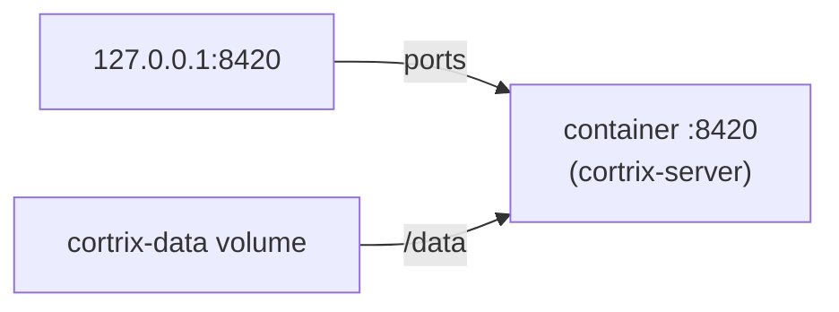
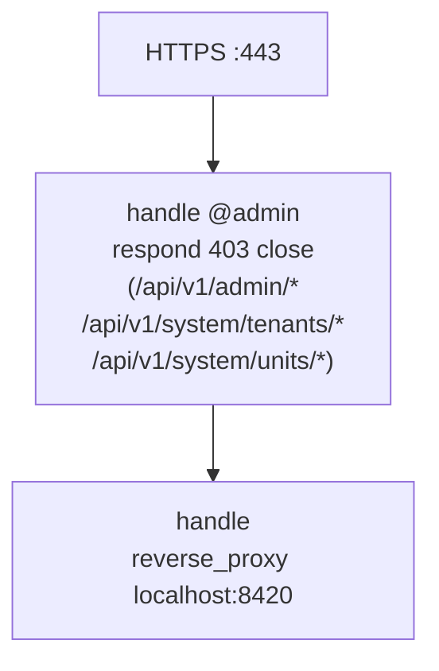

# 40 · 部署 — Dockerfile / Compose / Caddy / Supervisord

> **目标读者**:运维、SRE、平台工程师。
> **阅读时间**:15 分钟。
> **关键事实**:Docker 镜像是 **多阶段构建**(C++ Builder → Web UI Builder → Runtime);**supervisord** 在容器内管 `cortrix-server` + `cortrix-agent` + `quickstart-bootstrap` + `health-monitor`;**Caddy** 在边缘挡 admin 路径。

---

## 1. 镜像(`deploy/Dockerfile`)

### 1.1 三阶段



| 阶段 | 镜像 | 关键命令 | 产物 |
|---|---|---|---|
| 1 | `ubuntu:22.04` | `cmake>=3.27`(pip 装,因 jammy apt 是 3.22 不识别 `DOWNLOAD_EXTRACT_TIMESTAMP`)+ `cmake --build` | `build/cortrix-server`(stripped)+ `cortrix-agent`(源)+ `sdk/python`(源)+ `/wheels` |
| 2 | `node:20-slim` | `npm ci + npm run build` + `npx @redocly/cli bundle` | `web-ui/dist/` + `openapi.bundled.yaml` |
| 3 | `ubuntu:22.04` | `pip install /tmp/wheels/*.whl` + supervisord 配置 | 运行时镜像 |

### 1.2 运行时镜像内容

- `/app/cortrix_server`(二进制)
- `/usr/local/lib/libonnxruntime.so*`(ONNX Runtime `.so`,来自 FetchContent)
- `/app/config/cortrix.yaml` + `sensitive_fields.yaml`(F20 log sanitizer)
- `/app/web-ui/`(静态文件)
- `/app/build/openapi.bundled.yaml`(单文件 OpenAPI)
- `/app/python/cortrix-agent` + `/app/python/sdk/python`
- `/app/scripts/`:docling_bridge.py / paddleocr_bridge.py / download-models.sh / quickstart-bootstrap.sh
- `/etc/supervisor/conf.d/cortrix.conf`
- 非 root user `cortrix`(uid 1000)
- 健康检查:`HEALTHCHECK --interval=5s --timeout=5s --start-period=30m --retries=3 CMD /app/healthcheck.sh`
- ENTRYPOINT `/app/entrypoint.sh`,CMD `start`

### 1.3 镜像体积优化与缓存

- CMake 基础设施(`cmake/`、`CMakeLists.txt`、`VERSION`)单独 COPY,层缓存好。
- Python 源在 C++ 构建**之后** COPY,避免改 Python 触发昂贵的 C++ 重建。
- `--require-hashes` + `pip wheel` 预构建 wheels,运行时不编译。
- `strip build/cortrix-server` 减小体积。

### 1.4 重试与超时

- CMake configure **3 次重试**(`Dockerfile:49-65`):上游 TLS 连接可能中途断。
- pip `PIP_TIMEOUT=120 PIP_RETRIES=5`(`Dockerfile:73-75`)。

---

## 2. Supervisord(`deploy/supervisord.conf`)

容器内跑 4 个 program:



### 2.1 RPC plumbing

`unix_http_server`、`rpcinterface`、`supervisorctl` 三段(`supervisord.conf:11-16`)是 `health-monitor` 调 `supervisorctl restart cortrix-server` 的前提。

### 2.2 各 program 的 env

| Program | 关键 env |
|---|---|
| `cortrix-server` | `CORTRIX_DATA_DIR`、`CORTRIX_HTTP_PORT`、`CORTRIX_SERVER_PORT`、`CORTRIX_LOG_LEVEL`、`CORTRIX_LLM_*`、`CORTRIX_ENABLE_MEMORY` |
| `cortrix-agent` | `PYTHONPATH=/app/python`、`CORTRIX_CONFIG_PATH=/app/config/cortrix.yaml`、`CORTRIX_BASE_URL=http://127.0.0.1:${CORTRIX_HTTP_PORT}` |
| `quickstart-bootstrap` | (从外部 env 取 enabled 开关) |
| `health-monitor` | (读 `CORTRIX_HTTP_PORT` 默认 8420) |

---

## 3. Compose(`deploy/docker-compose.yml`)

CPU 路径只暴露 `:8420 → 127.0.0.1:8420`(`docker-compose.yml:9-10`),不暴露到 LAN。



> `CORTRIX_SERVER_ALLOW_UNAUTHENTICATED_CONTAINER_BIND=true`(`docker-compose.yml:19`)是容器内允许的非 loopback bind(quickstart 专用)。

CUDA 变体:`deploy/docker-compose.cuda.yml`(Linux x86_64 + NVIDIA runtime)。

---

## 4. Caddy(`deploy/caddy/Caddyfile`)



### 4.1 Admin 路径边缘拦截

`Caddyfile:29-38` 注释解释:`AdminGuard`(`src/middleware/admin_guard.cpp` 的 `kAdminPrefixes`)假定 `remote_addr=127.0.0.1`;反代会让所有请求的 remote_addr 变 loopback,所以**必须在边缘**挡这三条前缀。

> **换 nginx/Envoy 时**也要带同样的边缘规则。

### 4.2 安全响应头

```text
X-Content-Type-Options: nosniff
X-Frame-Options: DENY
X-XSS-Protection: 1; mode=block
Referrer-Policy: strict-origin-when-cross-origin
Strict-Transport-Security: max-age=31536000; includeSubDomains
-Server
```

### 4.3 request_body 限制

```text
request_body { max_size 100MB }
```

> 与 `cortrix max_payload_bytes` 匹配(`Caddyfile:64-65` 注释)。

### 4.4 JSON access log

```text
log {
  output file /var/log/caddy/cortrix-access.log {
    roll_size 50MiB
    roll_keep 5
  }
  format json
}
```

---

## 5. Quickstart 容器 vs 源码

| 维度 | Docker quickstart | 源码 dev.sh |
|---|---|---|
| C++ 二进制来源 | 镜像内预编译 | `cmake --build` |
| ONNX Runtime | 镜像自带 | FetchContent |
| 模型下载 | bootstrap 自动 | `deploy/download-models.sh` |
| supervisord | 是 | 否 |
| Web UI | 由 Caddy 静态服务 | Vite dev server |
| 适合谁 | 用户试用 / 演示 | 开发者 / 调试 |

---

## 6. CUDA 切换(`docs/operations/cuda-execution-provider.md`)

不在本手册展开。简言之:

1. 宿主机有 NVIDIA Container Toolkit + 兼容驱动。
2. 用 `deploy/docker-compose.cuda.yml`(而非 CPU 版本)。
3. 或源码构建时设 `CORTRIX_ONNX_RUNTIME_FLAVOR=cuda`。

---

## 7. 部署 checklist

| 项 | 命令 / 文件 |
|---|---|
| Auth 默认关闭 | `auth.enabled: false` + `server.host: 127.0.0.1` |
| AdminGuard 边缘拦截 | `Caddyfile` 的 `handle @admin` |
| CORS / 安全响应头 | Caddyfile 的 `header {}` |
| Request body 上限 | Caddyfile `request_body.max_size` 与服务端 `max_payload_bytes` 对齐 |
| 模型 SHA-256 | `deploy/model-manifest.tsv` |
| Healthcheck | `/app/healthcheck.sh`(`/system/health/live`) |
| 日志 | `log.format=json`、`log.output=stdout` |
| 数据持久化 | `cortrix-data` 命名 volume |

---

## 8. 状态门槛

| 项 | 状态 |
|---|---|
| Docker quickstart(CPU) | 🟡 |
| Docker CUDA | 🟡 |
| 源码构建 | 🟡 |
| macOS CoreML 自动检测 | 🟡 |
| 多租户生产部署 | 🚫(Auth / RBAC Blocked) |

---

## 下一步

👉 **[41 · 测试体系](41-testing-strategy.md)** — C++ gtest + Python pytest + Web vitest + Playwright + Locust。
