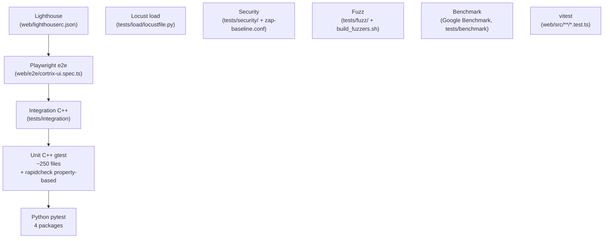

# 41 · 测试体系 — 从 gtest 到 Locust

> **目标读者**:运维、SRE、想跑测试的开发者。
> **阅读时间**:15 分钟。
> **关键事实**:Cortrix 是**多层测试金字塔**:C++ ~250 gtest + integration + security + fuzz + benchmark + Locust;Python 4 套 pytest;Web vitest + Playwright + Lighthouse;CI 三套 workflow。

---

## 1. 测试金字塔



---

## 2. C++ 测试(`tests/CMakeLists.txt`)

### 2.1 编译开关

```bash
cmake -DCMAKE_BUILD_TYPE=Release -DBUILD_TESTS=ON ..
cmake --build build -j
```

### 2.2 测试目标

| 目标 | 内容 | 标签 |
|---|---|---|
| `cortrix_unit_tests` | `tests/unit/**`(~250 gtest + rapidcheck) | `unit` |
| `cortrix_integration_tests` | `tests/integration/**`(F02 reranker real inference、F06 docling/paddleocr real、e2e persistence / concurrency / document lifecycle / cross-feature) | `integration` |
| `cortrix_security_tests` | `tests/security/**`(独立子目录 + CMakeLists) | `security` |

### 2.3 跑测试

```bash
cd build
ctest -L unit
ctest -L integration
ctest -L security
```

### 2.4 Property-based(rapidcheck)

`_RAG_MAX_ATTEMPTS = 3` 注释引用 `RC_GTEST_PROP`(`executor.py:45-48` 旁路)。

- 锁到 commit `ff6af6fc683159deb51c543b065eba14dfcf329b`(`cmake/Dependencies.cmake:42-46`)。
- 单元测试中的"R9 robustness lane"、"R11+ error-path coverage" 都用 rapidcheck。

---

## 3. 集成测试(`tests/integration/`)

| 测试 | 覆盖 |
|---|---|
| `F02 reranker real inference` | 端到端调用 bge-reranker-v2-m3 ONNX |
| `F06 docling/paddleocr real` | 真实解析路径 |
| e2e persistence | 重启后数据保留 |
| e2e concurrency | 并发读 / 写不破 |
| document lifecycle | upload → task → progress → ready |
| cross-feature | F04 + MEM + ACL + GC 联动 |

---

## 4. 安全测试(`tests/security/`)

独立子目录 + `CMakeLists.txt`。

| 文件 | 目的 |
|---|---|
| `test_auth_bypass.cpp` | 各种绕路 |
| `test_injection_attacks.cpp` | SQL / prompt / header 注入 |
| `test_namespace_crossing.cpp` | 跨 NS 越权 |
| `test_sec_*.cpp` | RBAC / Tenant / JWT hardening / Anti-enumeration |
| `zap-baseline.conf` | OWASP ZAP 扫描基线 |

> 当前因 auth-disabled 无法跑全矩阵(`README.md:74`)。

---

## 5. Fuzz / Benchmark / Stability / Load

| 目录 | 工具 | 入口 |
|---|---|---|
| `tests/fuzz/` | 自建 fuzz | `fuzz_query_request_fromjson.cpp` 等 + `build_fuzzers.sh` + seed / crash 归档 |
| `tests/benchmark/` | Google Benchmark | CTest 子目录,beir + bm25 + sparse + phnsw + spc pipeline + store |
| `tests/stability/` | shell | `monitor-24h.sh` + 并发压测 |
| `tests/load/` | Locust | `locustfile.py` |
| `tests/fault_inject/` | macOS `dyld __interpose` | `fault_inject.{cpp,h}`(ASAN 下自动关闭) |
| `tests/scatter/` | F04 Cross-NS 模块单测 | 借给 `unit_tests` 链接 |

---

## 6. Python 测试

### 6.1 SDK(`sdk/python/tests/`)

17 个 `test_*.py` 模块,全部用 `respx` mock httpx,无 live server。

```bash
cd sdk/python
pytest --cov=cortrix
mypy --strict cortrix
ruff check cortrix
```

| 测试模块 | 覆盖 |
|---|---|
| `test_client.py` | 构造 / URL join / 自定义 httpx / 生命周期 / User-Agent |
| `test_base_client.py` | `_build_headers` / `_select_exception_class` L1-by-status / GEN-Agent 4 字段 |
| `test_retry.py` | retry-after-seconds / 指数退避 / max-retries / 400 不重试 / `max_retries=0` |
| `test_trace.py` | X-Client-Id / traceparent / provider 异常吞咽 |
| `test_agent_friendly.py` | T-P03-AGENT-1~5,GEN-Agent 4 字段与 retry_after_ms > Retry-After 优先级 |
| `test_errors.py` | L1 / L2 parametrization / 403 feature / 404 namespace / `CX_ERR_QUOTA_*` / 非 JSON body / request-id 提取 |
| `test_types.py` | `parse_model` 容错 / list 包装 / `_generated.__all__` 34 个 |
| `test_namespaces.py` | CRUD + ACL grant body |
| `test_documents.py` | upload filepath / BytesIO / binary base64 / list / task progress / cancel / `upload_and_wait` / `batch_submit` |
| `test_memory.py` | MEM01–05 / `extract` body / list / create / update=patch / delete=soft / aliases |
| `test_query.py` | cross-NS / `["*"]` / `_adapt_wire_result` 字段翻译 |
| `test_sql.py` | body + 403 → `FeatureNotAvailableError` |
| `test_extended.py` | watchers / sync / auth / system / tenants / `import_database` |
| `test_resource_coverage.py` | 所有 resource 方法参数化 |
| `test_ops_gc.py` | GC + `X-Ops-Confirm: true` |
| `test_async.py` | 全异步对称 |

### 6.2 MCP(`cortrix-mcp/tests/`)

```bash
cd cortrix-mcp
pytest -q
```

包含 e2e Claude Code(`test_e2e_claude_code.py`)+ `stdio_test_server.py` + dual-era 协议握手。

### 6.3 Skills(`cortrix-skills/tests/`)

```bash
cd cortrix-skills
pytest -q
python tools/spec_lint_p12_vs_p14_vs_p04.py
```

### 6.4 Agent(`cortrix-agent/tests/`)

FastAPI test client + `dependency_overrides` + `MockAdapter`:

```bash
cd cortrix-agent
.venv/bin/pytest -q
```

### 6.5 pgcortrix(`sql-extensions/pgcortrix/tests/`)

标准库 `unittest`,无需 PG:

```bash
cd sql-extensions/pgcortrix
python3 -m unittest discover -s tests -v
```

---

## 7. Web 测试

| 类型 | 工具 | 入口 |
|---|---|---|
| 单元 | vitest | `web/src/**/*.test.ts`(`client.test.ts`、`namespaces.test.ts`、`system.test.ts`、`useAppStore.test.ts`、`useSearchStore.test.ts`) |
| e2e | Playwright | `web/e2e/cortrix-ui.spec.ts` |
| 性能 | Lighthouse | `web/lighthouserc.json` |

```bash
cd web
npm test                # vitest
npm run playwright      # e2e(需启动后端)
npm run lighthouse      # 性能
```

---

## 8. 验证清单(测试视角)

- **C++**:`ctest -L unit` 全绿;integration 至少跑过 F02 / F06 / persistence / concurrency / lifecycle。
- **SDK**:`pytest --cov=cortrix` 报告 ≥ 阈值;mypy strict 0 error;ruff 0 warning。
- **MCP**:e2e Claude Code 跑通;stdio 协议握手双版通过。
- **Skills**:`spec_lint_p12_vs_p14_vs_p04` 0 diff。
- **Agent**:dependency_overrides 覆盖 + MockAdapter 单测。
- **pgcortrix**:`unittest discover` 全绿,SQL DDL contract 自检通过。
- **Web**:vitest 全绿;Playwright 至少 1 个 e2e 通过;Lighthouse 不低于阈值。

---

## 下一步

👉 **[42 · CI/CD](42-ci-cd.md)** — GitHub Actions 三套 workflow。
