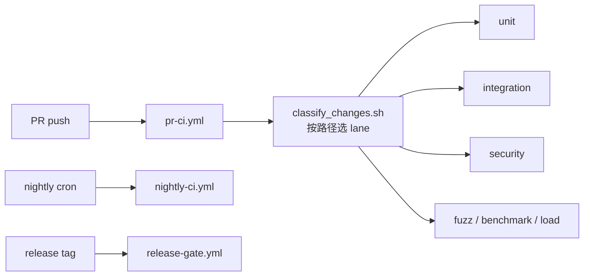
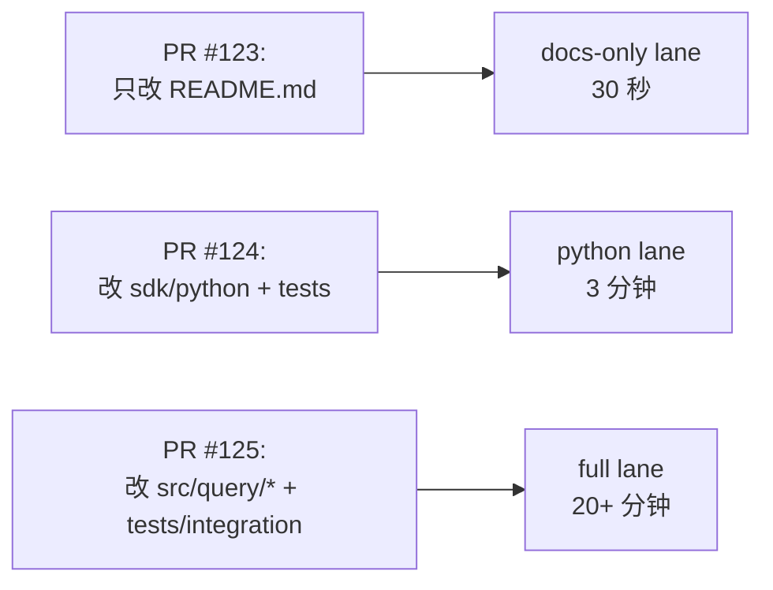

# 42 · CI/CD — 三套 GitHub Actions Workflow

> **目标读者**:运维、维护者、想跑 CI 的人。
> **阅读时间**:10 分钟。
> **关键事实**:**3 个 workflow**(`pr-ci.yml` / `nightly-ci.yml` / `release-gate.yml`);`tests/ci/test_classify_changes.sh` 做**PR 变更分级**,决定跑哪些 lane。

---

## 1. 三套 workflow 总览



---

## 2. `pr-ci.yml`(PR 必跑)

| Job | 触发 | 跑什么 |
|---|---|---|
| docs-only classifier | 每个 PR | `tests/ci/test_classify_changes.sh` 判定是否"仅文档" |
| unit / lint | 改动路径匹配源码 | C++ `BUILD_TESTS=OFF` 编译 + Python pytest + mypy + ruff |
| OpenAPI 校验 | 改 `api/**` | `redocly` lint + `swagger_ui` check |
| 类型生成 smoke | 改 `api/**` | 跑 `sdk/python/scripts/generate_types.py` |
| 文档构建 | 改 `docs/**` | markdownlint |

> 仅文档改动 → 跳过编译 / 测试,只跑 markdown lint。

---

## 3. `nightly-ci.yml`(夜间全跑)

| Job | 跑什么 |
|---|---|
| unit | 全量 gtest |
| integration | F02 / F06 / e2e |
| security | `tests/security/` + ZAP baseline |
| fuzz | `build_fuzzers.sh` 跑 seed corpus |
| benchmark | beir + bm25 + sparse + phnsw + spc pipeline |
| load | Locust 压测 |
| python | 4 个 Python 包全跑 |

> 夜间跑通常**慢**但覆盖全;PR 只跑快速 lane。

---

## 4. `release-gate.yml`(发布门槛)

| Job | 跑什么 |
|---|---|
| 全 C++ lane | unit + integration + security + benchmark 阈值 |
| 全 Python lane | 4 包 pytest + mypy strict + ruff |
| docs site build | 文档站点构建 |
| Docker image build | 多架构(CPU + CUDA) |
| OpenAPI 兼容 | 与上一版本对比(`redocly diff`) |
| Model SHA-256 | `deploy/model-manifest.tsv` 校验 |
| Signature | tag GPG 签名 |
| SBOM | 软件物料清单生成 |

> 只有所有 job 绿才允许 release tag。

---

## 5. `tests/ci/test_classify_changes.sh`

PR 改动的**路径级分类**:

```bash
# 简化示例(实际脚本更长)
DOCS_ONLY="docs/** README.md"
SOURCE="src/** include/** sdk/** cortrix-*/** api/** tests/**"

if changed_files ⊆ DOCS_ONLY:
    return "docs-only"
elif SOURCE paths changed:
    return "full"
elif "sdk/**" only:
    return "python-only"
...
```

按结果选对应 lane:

| 分类 | lane |
|---|---|
| docs-only | markdown lint only |
| python-only | pytest + mypy + ruff |
| cpp-only | cmake build + ctest unit |
| mixed | 全跑 |
| api-only | OpenAPI 校验 + 类型生成 |

---

## 6. 分级触发的价值



> 减少 PR 等待时间,鼓励小步提交。

---

## 7. 本地等价命令

| CI 步骤 | 本地命令 |
|---|---|
| docs lint | `markdownlint-cli2 "docs/**/*.md"` |
| OpenAPI lint | `npx @redocly/cli lint api/openapi.yaml` |
| 类型生成 | `cd sdk/python && python scripts/generate_types.py` |
| Python 测试 | `cd sdk/python && pytest --cov=cortrix` |
| mypy | `cd sdk/python && mypy --strict cortrix` |
| ruff | `cd sdk/python && ruff check cortrix` |
| C++ 编译 | `cmake -S . -B build -DBUILD_TESTS=ON && cmake --build build -j` |
| C++ 测试 | `cd build && ctest -L unit` |

> 提 PR 前先跑对应本地命令,显著减少 CI 失败轮次。

---

## 8. CI 不做的事

| 不做 | 原因 |
|---|---|
| 远程生产部署 | 仓库无 deploy key;release gate 只产出 image |
| 自动 bump 版本号 | `VERSION` 由维护者手 bump |
| 自动 merge PR | 需要 CODEOWNERS 审阅(参考 `MAINTAINERS.md`) |

---

## 9. 状态门槛

| Workflow | 状态 |
|---|---|
| `pr-ci.yml` | ✅ 跑通 |
| `nightly-ci.yml` | ✅ 跑通 |
| `release-gate.yml` | ✅ 跑通 |
| `test_classify_changes.sh` | ✅ 跑通 |
| 远程 release 自动部署 | �️(无) |

---

## 下一步

👉 回到 **[README.md §读者路径](README.md#读者路径从你开始)** — 选下一条路径。
