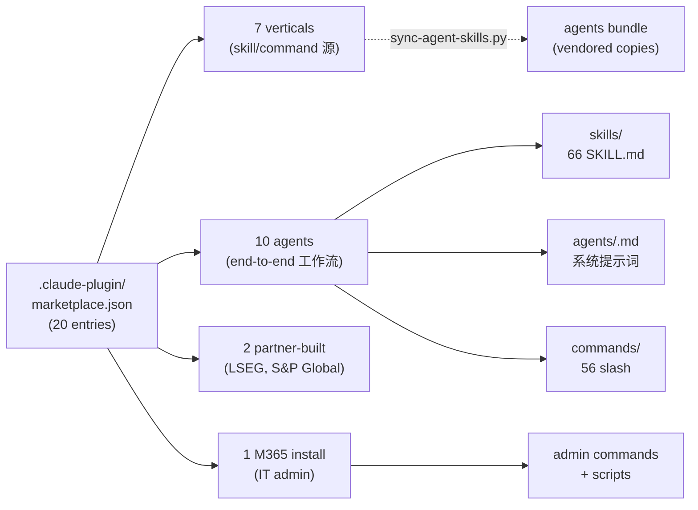

# 00. 仓库是什么 — Claude for Financial Services

> **本节定位** [用户向][开发者向] — 这是 handbook 的开篇,定义仓库边界、目标用户、三种分发渠道与心智模型。

> **术语外行?** 本章出现的 finance 术语(DCF / LBO / MOIC / IC memo / CIM / NAV / AUM / GP / LP / carry / KYC 等)详见 [`00.5-finance-primer.md`](./00.5-finance-primer.md)。

## TL;DR

- Agents own workflows end to end. Skills are the knowledge Claude uses. Commands are explicit triggers. MCPs are the data wires. One system prompt, two ways to run it.
- 同一个 `agents/<slug>.md` 既被 Cowork 插件使用,也被 Managed Agent cookbook 引用 — 这就是 "one source, two wrappers"。
- 仓库里没有任何"投资、法律、税务、会计"建议输出,所有产物都待人工审阅。
- 规模速览:**20 个插件** / **66 个 skill**(55 vertical + 11 partner)/ **56 个 slash command** / **12 个 MCP connector** / **10 个 cookbook** / **7 个 repo 脚本**。

## What you'll learn

读完后,你应该能够:

- 用一句话描述这个仓库解决什么问题(谁用、用在哪、解决什么痛点)
- 区分 Cowork 插件与 Claude Managed Agent 两种分发方式
- 识别一个 `agents/<slug>.md` 在系统中承担什么角色
- 在投行 / 股权研究 / PE / 财富管理 / 基金会计 / 运营这六种角色中,知道自己属于哪一类

## [用户向] What you actually install

跟着一位卖方分析师走一遍早上 9 点到 9 点 15 分:

```text
9:00   打开 Cowork
9:02   Settings -> Plugins -> Add plugin -> 粘贴仓库 URL
       https://github.com/anthropics/financial-services
9:04   从 marketplace list 里勾上:
       [x] financial-analysis          (核心建模)
       [x] pitch-agent                 (投行 pitch)
       [x] investment-banking          (IB 工作流)
9:06   点 Install
9:08   回到 Cowork session,输入:
       /comps CRWD
9:10   Claude 自动调用 comps-analysis skill,从 CapIQ MCP
       拉 4-6 家可比公司数据,在 Excel 里写一组 EV/EBITDA
       倍数 + 75/中位/25 三档统计
9:12   输出: ./comps-CRWD-<date>.xlsx
       + 一段 3-5 句的关键差异总结
9:15   你打开 Excel 复核数字
```

屏幕上的 Excel 文件不是凭空出现的 — 它源自 `plugins/agent-plugins/pitch-agent/agents/pitch-agent.md`(系统提示词告诉 Claude 该做什么) + `plugins/vertical-plugins/financial-analysis/skills/comps-analysis/SKILL.md`(专业知识) + `plugins/vertical-plugins/financial-analysis/.mcp.json`(CapIQ 数据线)三者的协作。本书后续章节会逐一拆解这三层。

## [用户向] What's in the box



**20 插件具体清单**(摘自 `.claude-plugin/marketplace.json`):

| # | plugin | 类型 | 版本 | 作者 | 一句话能力 |
|---|---|---|---|---|---|
| 1 | financial-analysis | vertical | 0.1.1 | Anthropic FSI | DCF / comps / LBO / 3-statement / deck QC / 12 MCP |
| 2 | investment-banking | vertical | 0.2.1 | Anthropic | CIM / teaser / buyer-list / merger-model / process-letter |
| 3 | equity-research | vertical | 0.1.2 | Anthropic FSI | earnings notes / initiating / model-update / thesis / screen |
| 4 | private-equity | vertical | 0.1.2 | Anthropic FSI | sourcing / screen / dd / ic-memo / portfolio / value-creation |
| 5 | wealth-management | vertical | 0.1.2 | Anthropic FSI | client-review / financial-plan / rebalance / tlh / proposal |
| 6 | fund-admin | vertical | 0.1.0 | Anthropic FSI | gl-recon / break-trace / accrual / roll-forward / variance |
| 7 | operations | vertical | 0.1.0 | Anthropic FSI | kyc-doc-parse / kyc-rules |
| 8 | pitch-agent | agent | 0.1.1 | Anthropic FSI | comps + precedents + LBO + branded pitch deck |
| 9 | market-researcher | agent | 0.1.1 | Anthropic FSI | sector overview + competitive + peer comps + ideas |
| 10 | earnings-reviewer | agent | 0.1.1 | Anthropic FSI | earnings call + filings -> model -> note |
| 11 | meeting-prep-agent | agent | 0.1.1 | Anthropic FSI | briefing pack before every client meeting |
| 12 | model-builder | agent | 0.1.0 | Anthropic FSI | DCF / LBO / 3-stmt / comps live in Excel |
| 13 | gl-reconciler | agent | 0.1.0 | Anthropic FSI | GL recon, break trace, sign-off |
| 14 | kyc-screener | agent | 0.1.0 | Anthropic FSI | KYC doc parse + rules engine + escalations |
| 15 | valuation-reviewer | agent | 0.1.1 | Anthropic FSI | GP packages -> valuation -> LP reporting |
| 16 | month-end-closer | agent | 0.1.0 | Anthropic FSI | accruals + roll-forwards + variance commentary |
| 17 | statement-auditor | agent | 0.1.0 | Anthropic FSI | LP statement tie-out before distribution |
| 18 | lseg | partner | 1.0.0 | LSEG | bond RV / swap curves / FX carry / options vol / macro |
| 19 | sp-global | partner | 1.0.1 | Kensho Technologies | tearsheets / earnings-preview / funding-digest |
| 20 | claude-for-msft-365-install | M365 | 0.1.8 | Anthropic | IT admin: 在自家云上配 Claude Office add-in |

> 注:agent 与 vertical 的 author 命名有差异 — 主流是 `"Anthropic FSI"`,但 `investment-banking` 是 `"Anthropic"`。详见 `04-plugin-anatomy.md`。

## [开发者向] The one-source-two-wrapers principle

仓库里**每个 agent 都只有一份系统提示词**,位于 `plugins/agent-plugins/<slug>/agents/<slug>.md`。Cowork 插件直接读这个文件作为 agent 的 brain;Managed Agent cookbook(`managed-agent-cookbooks/<slug>/agent.yaml`)则通过 `system.file: ../../plugins/agent-plugins/<slug>/agents/<slug>.md` 引用,部署时由 `scripts/deploy-managed-agent.sh` 内联到 `POST /v1/agents` 的 system 字段。

```text
plugins/agent-plugins/pitch-agent/agents/pitch-agent.md   <-- 单一源
        |                                                  |
        |--- Cowork 插件: 直接引用                           |
        |                                                  |
        |--- Managed Agent cookbook:                        |
        |       managed-agent-cookbooks/pitch-agent/        |
        |       agent.yaml                                  |
        |       system:                                     |
        |         file: ../../plugins/agent-plugins/        |
        |              pitch-agent/agents/pitch-agent.md     |
        |         append: "You are running headless..."     |
```

这意味着:你在源文件改一行,无论是 Cowork 用户还是 Managed Agent 用户,下次部署都会拿到更新。`scripts/check.py` 也会校验 cookbook 引用确实指向存在的文件。详见 `02-architecture.md` 与 `09-cookbooks.md`。

## [开发者向] When to use Cowork vs. Claude Code vs. Managed Agents

| 维度 | Cowork | Claude Code (CLI) | Claude Managed Agents |
|---|---|---|---|
| **面向角色** | 分析师 / 运营 | 分析师 / 工程师 | 平台工程师 / 后端集成 |
| **部署方式** | SaaS,粘贴 URL 或上传 zip | `claude plugin install` | `POST /v1/agents` |
| **运行环境** | Anthropic 托管 | 本地 Claude Code + 插件市场 | 企业自有后端 |
| **适合场景** | 个人/小团队快速用 | 团队统一管理 CLI 版本 | 企业级合规、定制化、与内部系统集成 |
| **Skill 触发** | 自动(由描述匹配) | 自动 + 显式 `/skill` | 自动 |
| **Command 调用** | `/comps` | `/comps` | 在 steering event 中调用 |
| **可观测性** | Cowork UI 内 | CLI 输出 | 你的 workflow engine 看 session events |
| **多 agent 编排** | 不直接支持 | 受限于 session 上下文 | **原生支持** — `callable_agents` 跨 worker,handoff_request 跨 session |
| **数据驻留** | Anthropic 端 | 本地 + 插件市场 | 你自己的后端 |

简单决策树:

- **"我一个人在 Cowork 里装完就能用"** → Cowork
- **"我团队都装 Claude Code,要统一版本"** → Claude Code
- **"我要把 Claude 集成进我的交易系统,跑在合规后端"** → Managed Agents

## 仓库统计(实际盘点)

| 维度 | 数量 | 出处 |
|---|---|---|
| 全部 .md 文件 | 228 | `find plugins -name '*.md' \| wc -l` |
| SKILL.md 总数(含 vendored) | ~88 | 含 agent bundles 下的副本 |
| 独特 skill | 66 | vertical + partner 下的源(55 + 11)|
| Slash command 总数 | ~50 | 各 vertical/partner |
| `.mcp.json` 总数 | 5 | 1 financial-analysis + 2 partner + 2 hooks 配置 |
| cookbook | 10 | managed-agent-cookbooks/<slug>/ |
| subagent yaml | 30 | 10 agent x 3 subagent |
| 7 个 repo 脚本 | check.py / deploy-managed-agent.sh / validate.py / orchestrate.py / sync-agent-skills.py / version_bump.py / test-cookbooks.sh | scripts/ |
| 3 个 GitHub workflow | plugin-validate / secret-scan / version-bump | .github/workflows/ |
| 1 个 git hook | pre-commit(自动 bump version) | .githooks/pre-commit |

## 仓库历史与起源

仓库最早由 Anthropic FSI 团队在 2024 年创建,作为面向金融行业的 Claude 插件参考实现。**所有插件都是参考模板** — 你负责把它们调成你 firm 的具体形态(参见 README L151-159 "Making It Yours")。

关键节点:

- **2024 中**:首批 agent plugin 起草(earnings-reviewer、pitch-agent、market-researcher)。
- **2025 初**:vertical plugin 系统化(7 个 vertical 统一结构)。
- **2025 中**:Managed Agent cookbook 引入(10 个 agent 都有 cookbook 双 wrapper)。
- **2025 末**:partner-built 协议落地(LSEG、S&P Global 成为第一批外部合作方)。
- **2026 初**:access_policies key 加入 manifest(`version-bump.yml` backstop 与 commit `3865222` 同步)。
- **当前版本**:绑定的 git SHA 是 `38652224c10610fa52eee2acee3ac712dcff01f2`(2026-08-04)。

后续章节会标注每个事实的"源文件"段,便于溯源。

## 谁不该用这个仓库

```text
不适合:
   - 想要 SaaS 一键开箱即用的非金融行业用户
       (本仓库 FSI 特化,通用插件在别的 marketplace)
   - 想要 Claude 替代合规官、风险官的合规场景
       (本仓库"推荐"风险评级,不做"决定";见 KYC Guardrails)
   - 想要 Claude 自动执行交易、入账的流程
       (本仓库产 Excel/Word/PPT 待人工审阅)
   - 想要"黑盒"托管 — 你能看到系统提示词、能 fork、能改

适合:
   - 投资银行 / 股权研究 / PE / WM / 基金会计 / 运营 的工作流提速
   - 想要把 Claude 集成进内部系统的平台工程师
   - 想 fork / 二次定制 / 贡献给上游的研究员
```

## 重要免责声明

> **!IMPORTANT** 本仓库与本 handbook 都不构成投资、法律、税务或会计建议。这些 agent 起草分析师工作产出(模型、备忘录、研究笔记、对账结果),由合格专业人士复核。它们不做投资建议、不执行交易、不承担风险、不入账、不批准 onboarding。每个产物都待人工签字。你负责验证输出与遵守适用的法律法规。

源: `README.md` L7–9(本 handbook 完整镜像此声明,见 [appendix-a-glossary.md](./appendix-a-glossary.md) 的"Legal"段)。

## Cross-references

- 装到 Cowork/Code/Managed Agent 的具体步骤 → `./01-quickstart.md`
- 完整插件目录表 + 选型决策树 → `./03-marketplace-catalog.md`
- 仓库的文件系统结构与"one source two wrappers"模型 → `./02-architecture.md`
- 术语表(所有缩写) → `./appendix-a-glossary.md`

## Source files

- `README.md`(L1–9、L13–34、L101–115、L261–L262)
- `CLAUDE.md`(L1–L66)
- `.claude-plugin/marketplace.json`(L1–L128)
- `managed-agent-cookbooks/README.md`(L1–L39)