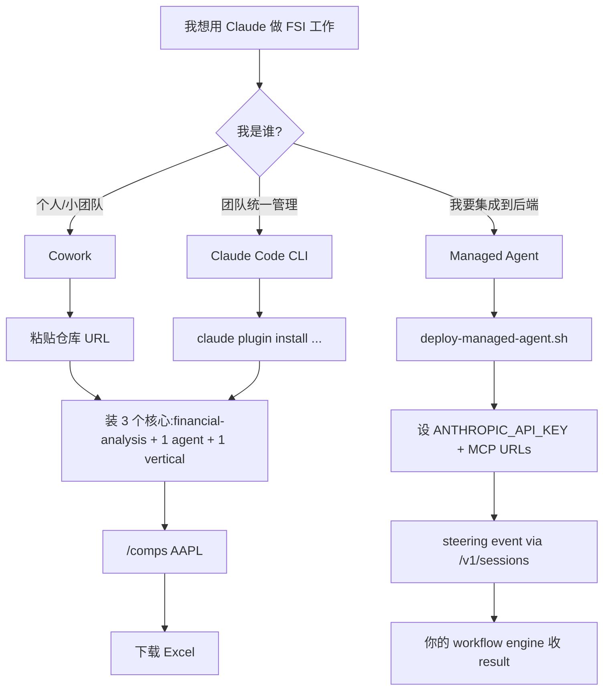

# 01. 5 分钟跑通第一个命令

> **本节定位** [用户向] — 最快速度把仓库里的插件装起来,跑一次 `/comps` 或 `pitch-agent`,看到 Excel / PowerPoint 产物。

> **术语外行?** 本章出现的 finance 术语(DCF / LBO / MOIC / IC memo / CIM / NAV / AUM / GP / LP / carry / KYC 等)详见 [`00.5-finance-primer.md`](./00.5-finance-primer.md)。

## TL;DR

- 三种安装面:**Cowork**(SaaS,粘贴 URL)、**Claude Code**(CLI,`claude plugin install`)、**Managed Agent**(`scripts/deploy-managed-agent.sh` + `POST /v1/agents`)。
- 第一次跑命令:`/comps AAPL` 拉到 4–6 个可比公司;`/dcf MSFT` 出 DCF + 敏感性;`/earnings NVDA` 跑通一条 earnings 笔记。
- 第一次触发 skill:打开一个 Excel 模型(`.xlsx`)Claude 会自动调用 `audit-xls` 输出 Critical/Warning/Info 三级报告。
- 第一次调度 agent:在 Cowork 里把 `pitch-agent` 指派给 `CRWD`,你会拿到一个 Excel + 一个 `.pptx` 双件套。

## What you'll learn

- 三种安装面的具体步骤(从 0 到看到第一个产物)
- `claude plugin marketplace add` 与 `claude plugin install` 的命令语义
- `scripts/deploy-managed-agent.sh` 的输入与输出
- 验证安装是否成功的几条命令(`/help` / 查 marketplace.json / 调用 skill)
- 出错时该跳到哪一章排错

## [用户向] 路径 A — Cowork 在 5 分钟内

```text
1. 打开 Cowork (https://claude.com/product/cowork)
2. 右上角 Settings -> Plugins
3. Add plugin -> 选 "From URL"
4. 粘贴: https://github.com/anthropics/financial-services
5. 出现 "Claude for Financial Services" marketplace
6. 勾选:
       [x] financial-analysis          (核心建模 + 12 MCP)
       [x] pitch-agent                 (你马上要用的)
       [x] investment-banking          (配套 commands)
7. 点 Install
8. 回到 session,输入:
       /comps AAPL
9. 等 30-60 秒,Claude 调用 comps-analysis skill
   从 MCP 拉数据,生成 Excel
10. 下载 ./comps-AAPL-<date>.xlsx,打开复核
```

替代路径:把 `plugins/agent-plugins/pitch-agent/` 整个目录打包成 zip,丢进 Cowork 的 "Upload plugin" 入口。zip 内**必须**包含 `.claude-plugin/plugin.json`,否则 Cowork 不识别。

```bash
cd plugins/agent-plugins/pitch-agent
zip -r /tmp/pitch-agent.zip .
# 然后在 Cowork 里 Upload -> /tmp/pitch-agent.zip
```

## [用户向] 路径 B — Claude Code 在 5 分钟内

```bash
# 1. 注册 marketplace
claude plugin marketplace add anthropics/financial-services

# 2. 装核心 financial-analysis(必装,12 MCP 在这里)
claude plugin install financial-analysis@claude-for-financial-services

# 3. 装一个 agent(pitch-agent 是旗舰示例)
claude plugin install pitch-agent@claude-for-financial-services

# 4. 装配套 vertical(investment-banking 提供 /cim /teaser /buyer-list 等)
claude plugin install investment-banking@claude-for-financial-services

# 5. 验证 — 进入一个 session 看是否生效
claude
> /help
# 你应该能看到:
#   /comps /dcf /lbo /3-statement-model /debug-model /competitive-analysis /ppt-template
# (来自 financial-analysis)
#   /one-pager /cim /teaser /buyer-list /merger-model /process-letter /deal-tracker
# (来自 investment-banking)

# 6. 跑第一个命令
> /comps AAPL
```

## [用户向] 路径 C — Managed Agent 部署

这一路径给平台工程师用,产出是一个可被你后端 workflow engine 调用的 agent_id。完整细节见 `09-cookbooks.md`,这里给一个最小骨架:

```bash
# 1. 设置 API key 与 MCP URL(环境变量名见 cookbook README)
export ANTHROPIC_API_KEY=sk-ant-...
export CAPIQ_MCP_URL=https://your-capiq-mcp.example/mcp
export DALOOPA_MCP_URL=https://your-daloopa-mcp.example/mcp

# 2. 跑 deploy 脚本
scripts/deploy-managed-agent.sh pitch-agent

# 3. 脚本输出:
#    [skills] uploading skills/3-statement-model ... -> skill_id=sk_abc123
#    [skills] uploading skills/comps-analysis     ... -> skill_id=sk_def456
#    [subagent] creating researcher  -> agent_id=ag_111
#    [subagent] creating modeler     -> agent_id=ag_222
#    [subagent] creating deck-writer -> agent_id=ag_333
#    [orchestrator] POST /v1/agents -> agent_id=ag_999
#    [cookbook] anthropics/financial-services/pitch-agent deployed
#    -> id=ag_999 model=claude-opus-4-7 metadata.anthropic_cookbook=anthropics/financial-services/pitch-agent

# 4. 从你的 workflow engine 推一个 steering event
curl -X POST https://api.anthropic.com/v1/sessions \
  -H "x-api-key: $ANTHROPIC_API_KEY" \
  -H "anthropic-version: 2023-06-01" \
  -H "anthropic-beta: managed-agents-2026-04-01" \
  -H "content-type: application/json" \
  -d '{
    "agent": "ag_999",
    "environment_id": "env_default",
    "initial_events": [
      {"type": "user", "content": "Build pitch book: target CRWD, acquirer PANW, thesis: platform consolidation in security"}
    ]
  }'
```

完整字段、错误排查、深度配置 → `09-cookbooks.md` 与 `12-development-workflow.md`。

### 路径 C 的关键环境变量

每个 cookbook 都依赖特定的 MCP URL 环境变量。**变量名是 cookbook 约定的**,在每个 `managed-agent-cookbooks/<slug>/agent.yaml` 里以 `${VAR_NAME}` 形式出现。deploy 脚本会校验变量值只含 `[A-Za-z0-9._/:@-]`(防止注入)。

常见映射:

```text
agent              必需 MCP URL 环境变量
------------------------------------
pitch-agent        CAPIQ_MCP_URL, DALOOPA_MCP_URL
market-researcher  CAPIQ_MCP_URL, FACTSET_MCP_URL
earnings-reviewer  FACTSET_MCP_URL, DALOOPA_MCP_URL
meeting-prep-agent CRM_MCP_URL, CAPIQ_MCP_URL
model-builder      CAPIQ_MCP_URL, DALOOPA_MCP_URL
gl-reconciler      GL_MCP_URL, SUBLEDGER_MCP_URL
kyc-screener       SCREENING_MCP_URL
valuation-reviewer PORTFOLIO_MCP_URL
month-end-closer   GL_MCP_URL
statement-auditor  NAV_MCP_URL
```

**实战**:把这张表打印贴在你 terminal 边。少一个变量,deploy 脚本会在 `yaml2json` 阶段失败并提示具体哪个 `${VAR_NAME}` 缺值。

### 路径 C 的 dry-run 模式

不想真部署?先 dry-run 看 POST 内容:

```bash
scripts/deploy-managed-agent.sh pitch-agent --dry-run
```

`--dry-run` 不发请求,但会:

- 解析所有 YAML → JSON
- 把 `${ENV}` 占位符展开(若已 export)
- 输出每个 POST body 到 stdout(便于人工 review)
- `script_id` 用 `DRYRUN_<slug>` 占位,**不会**真上传到 `/v1/skills`

适合 CI 里跑一次校验 manifest 语法,或者调试 MCP URL 解析时用。

## [用户向] 第一个命令示例 — 6 个常见场景

```text
场景              命令                                  触发哪个 skill               输出
-----------------------------------------------------------------------------------------------------
可比公司         /comps AAPL                          comps-analysis              .xlsx + 摘要
DCF 估值         /dcf MSFT                            dcf-model                    .xlsx + 敏感性表
LBO              /lbo "<target>,<deal details>"      lbo-model                    .xlsx + IRR/MOIC
earnings 笔记    /earnings NVDA Q3 2026              earnings-analysis            .docx/.html note
PE 立项          /ic-memo "<portco name>"            ic-memo                      .docx IC memo
客户会前简报    /client-review "<client name>"      client-review                .md briefing pack
```

如果一个命令**没自动触发**某个 skill,那它就是直接调用一个内联工作流(见 `07-commands.md` 的 slim vs verbose 模板)。

## [用户向] 第一个 skill 自动触发

打开任何一个 Excel 模型(`.xlsx`),在 session 里说:

> "帮我审一下这个模型里的 BS 平衡和现金流钩稽"

Claude 会自动调用 `audit-xls` skill,产出一张 findings 表:

```text
| # | Sheet   | Cell/Range | Category    | Severity | Issue                          | Suggested Fix                    |
|---|---------|-------------|-------------|----------|--------------------------------|----------------------------------|
| 1 | BS      | D28         | Balance     | Critical | Assets != Liab + Equity        | Re-link D28 to L24+E24            |
| 2 | CF      | C15         | Tie-out     | Warning  | CF ending != BS cash change    | Adjust WC line D22                |
| 3 | Assump. | B5          | Hardcode    | Info     | Discount rate hardcoded w/o src| Add cell comment w/ source link   |
| ... 47 more rows
```

这是 `audit-xls` skill 的"Research-style + Audit-style" archetype 输出格式,详见 `08-skills.md`。

## [用户向] 第一个 agent 调度

```text
# Cowork 里:
> 帮我用 pitch-agent 给 CRWD 出一个 first-draft pitch book,
  thesis 是 "platform consolidation in security"

# pitch-agent 会(自动):
# 1. 调用 sector-overview skill 写公司 snapshot
# 2. 用 mcp__capiq__* 拉 comps + precedents
# 3. 调用 comps-analysis skill 铺 trading comps
# 4. 调用 lbo-model skill 起 sponsor case
# 5. 调用 dcf-model + 3-statement-model 建估值
# 6. 生成 football field
# 7. 调用 pitch-deck skill 填银行 PPT 模板
# 8. 调用 ib-check-deck 做 QC
# 9. 停下,等你 review Excel + PPT
```

预计耗时 5–15 分钟,产出 `./pitch-CRWD-<date>.xlsx` + `./pitch-CRWD-<date>.pptx`,每个数字都能 trace 到 Excel 里的具体 cell。

### Cowork 里如何调度 agent

Cowork 里有两种调度 agent 的方式:

**方式 1:Cowork dispatch UI**

```text
1. 打开 Cowork session
2. 在左侧 "Agents" 面板里找到 pitch-agent
3. 点击 → 弹出输入框
4. 填 "Build pitch book: target CRWD, thesis: ..."
5. Send
6. 等 5-15 分钟,Excel + PPT 出现
```

**方式 2:自然语言调用**

```text
1. 在 session 里直接说:
   > 用 pitch-agent 跑 CRWD pitch book,thesis 是 ...
2. Cowork 自动匹配 agent 名
3. 跑
```

两种方式底层一样 — Cowork 把你的输入作为 agent 的 steering event,触发 agent 的 Workflow。

### Managed Agent 里如何调度 agent

```bash
# 拿到 agent_id 后(从 deploy 输出),从 workflow engine 推 steering event
AGENT_ID=ag_999  # 替换为实际
curl -X POST https://api.anthropic.com/v1/sessions \
  -H "x-api-key: $ANTHROPIC_API_KEY" \
  -H "anthropic-version: 2023-06-01" \
  -H "anthropic-beta: managed-agents-2026-04-01" \
  -H "content-type: application/json" \
  -d '{
    "agent": "'"$AGENT_ID"'",
    "environment_id": "env_default",
    "initial_events": [
      {"type": "user", "content": "Build pitch book: target CRWD, acquirer PANW, thesis: platform consolidation in security"}
    ]
  }'

# 后端会返回一个 session_id;然后你可以订阅 message_delta / tool_call 事件
# 或等 file_write 事件看到 ./out/pitch-CRWD-<date>.xlsx
```

详见 `09-cookbooks.md#用户向-完整-walkthrough--部署-gl-reconciler`。

## [用户向] 三条安装路径的对比决策树



## [用户向] 验证安装是否成功

| 路径 | 验证命令 | 期望输出 |
|---|---|---|
| Cowork | 在 session 里输入 `/help` | 看到 `/comps` `/dcf` `/lbo` `/earnings` `/ic-memo` 等 |
| Claude Code | `claude plugin list` | `financial-analysis@...`、`pitch-agent@...` 在表里 |
| Claude Code | `/help` in session | 同上 |
| Managed Agent | `curl -H "x-api-key: $KEY" $BASE/v1/agents/<id>` | 返回 agent metadata |
| Managed Agent | `scripts/test-cookbooks.sh` | "All N cookbooks OK" |

## [用户向] 出错怎么办

- **"插件安装失败"** → 跳到 `./13-troubleshooting.md#用户向-安装失败`
- **"命令不触发"** → 跳到 `./13-troubleshooting.md#用户向-命令不触发`
- **"skill 没自动触发"** → 跳到 `./13-troubleshooting.md#用户向-skill-没自动触发`
- **"MCP 连不上"** → 跳到 `./13-troubleshooting.md#用户向-mcp-连不上`

### 三种安装的快速 debug 流程

**Cowork / Claude Code 调试**:

```bash
# 1. 确认 marketplace 已注册
claude plugin marketplace list
# 应该看到 "claude-for-financial-services"

# 2. 确认插件已装
claude plugin list
# 应该看到 financial-analysis、pitch-agent、investment-banking

# 3. 在 session 里看实际可用命令
claude
> /help
# 应该看到 /comps /dcf /lbo 等

# 4. 看 marketplace.json 的本地状态
cat .claude-plugin/marketplace.json | jq '.plugins[] | {name, version}'
```

**Managed Agent 调试**:

```bash
# 1. dry-run 看 manifest 解析
scripts/deploy-managed-agent.sh pitch-agent --dry-run | jq .

# 2. 验证环境变量已 export
env | grep -E "ANTHROPIC_API_KEY|CAPIQ_MCP_URL|DALOOPA_MCP_URL"
# 应该有这些变量,且值只含 [A-Za-z0-9._/:@-]

# 3. 测试 cookbook 批量 dry-run
scripts/test-cookbooks.sh
# 应该输出 "All N cookbooks OK"

# 4. 单独 deploy 某个 cookbook 看完整输出
scripts/deploy-managed-agent.sh gl-reconciler
# 看是否卡在哪一步(skill upload / subagent / orchestrator)

# 5. 跑 harness-side schema 校验
python3 scripts/validate.py <worker-output.json> <schema.yaml>
```

## [用户向] 安装后的最佳实践

### 装什么 / 不装什么

```text
建议装(任何角色):
   financial-analysis             # 12 MCP + 核心建模

按角色装:
   投行: investment-banking + pitch-agent + model-builder
   股权研究: equity-research + earnings-reviewer + market-researcher
   PE: private-equity + valuation-reviewer
   WM: wealth-management + meeting-prep-agent
   基金会计: fund-admin + gl-reconciler + month-end-closer + statement-auditor
   运营: operations + kyc-screener

可选(看你有什么数据订阅):
   lseg                          # 固收 / 外汇 / 宏观
   sp-global                     # tearsheet / earnings preview

不要装(对你角色无关的):
   不在 vertical / agent 之外的插件
   不要装 1.0.0 之前的 partner-built(可能不稳定)
```

### 升级策略

```bash
# 装新版本后,plugin version 是触发更新的唯一变量
claude plugin update financial-analysis@claude-for-financial-services

# 重启 session 让版本生效
```

Cowork 通常自动更新到最新 marketplace 版本(后台)。用户可以手动 lock 某个版本(在 Cowork 设置里)。

### 维护本地定制

fork 之后,你最常做的两件事:

1. **改 skill / command / agent**:在 `verticals/` 改,然后跑 `sync-agent-skills.py`。
2. **改 prompt**:在 `plugins/agent-plugins/<slug>/agents/<slug>.md` 改 — 因为这是 Cowork 端 + Managed Agent 端共享的源。

详细流程见 `12-development-workflow.md`。


## 重要免责声明

> **!IMPORTANT** 本仓库与本 handbook 都不构成投资、法律、税务或会计建议。这些 agent 起草分析师工作产出(模型、备忘录、研究笔记、对账结果),由合格专业人士复核。它们不做投资建议、不执行交易、不承担风险、不入账、不批准 onboarding。每个产物都待人工签字。你负责验证输出与遵守适用的法律法规。

源: `README.md` L7–9(本 handbook 完整镜像此声明)。

## Cross-references

- 完整安装路径与三种安装面的差异 → `./00-introduction.md#用户向-when-to-use-cowork-vs-claude-code-vs-managed-agents`
- 仓库文件系统结构与"one source two wrappers" → `./02-architecture.md`
- `scripts/deploy-managed-agent.sh` 详解 → `./09-cookbooks.md#开发者向-部署流水线-mermaid`
- 56 个 slash command 的完整目录 → `./07-commands.md`
- 66 个 skill 的触发机制(55 vertical + 11 partner)→ `./08-skills.md`

## Source files

- `README.md`(L49–87,Getting Started 段)
- `.claude-plugin/marketplace.json`
- `scripts/deploy-managed-agent.sh`(L1–L182)
- `managed-agent-cookbooks/README.md`(L1–L39)
- `plugins/agent-plugins/pitch-agent/agents/pitch-agent.md`(L1–L38,Workflow 段)