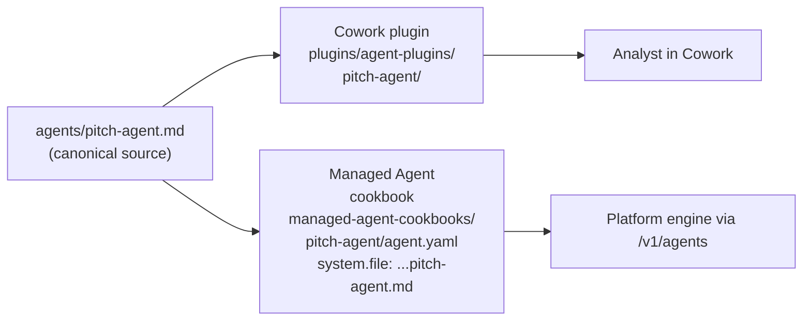
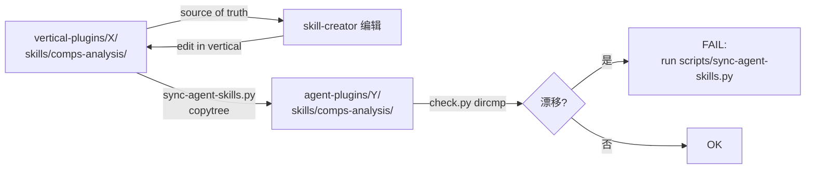
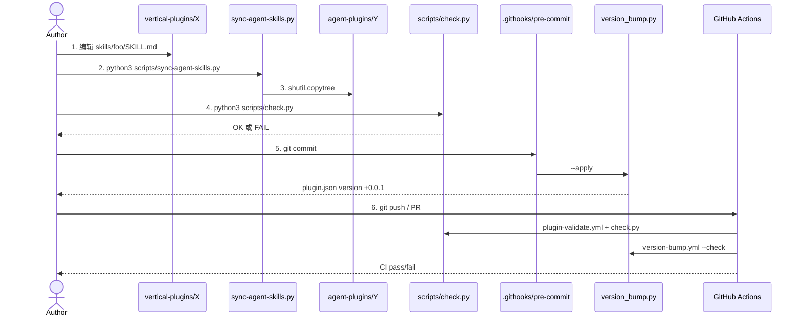

# 02. 架构 — 插件模型与 One Source Two Wrappers

> **本节定位** [用户向][开发者向] — 图最多的一章,确立后续所有章节的心智模型。

> **术语外行?** 本章出现的 finance 术语(DCF / LBO / MOIC / IC memo / CIM / NAV / AUM / GP / LP / carry / KYC 等)详见 [`00.5-finance-primer.md`](./00.5-finance-primer.md)。

## TL;DR

- 仓库是**四层架构**:`marketplace` → `plugin` → `agent+skill` → `MCP`。编辑向上流,数据向下流。
- **One source, two wrappers**:每个 agent 只有一份系统提示词(`agents/<slug>.md`),Cowork 插件与 Managed Agent cookbook 都从它读。
- **Skill 同步机制**:vertical 下的 `skills/` 是 source of truth,agent 下的 `skills/` 是 vendored copies,`scripts/sync-agent-skills.py` 单向同步,`scripts/check.py` 反向守门。
- **版本号管理**:patch 由 `.githooks/pre-commit` 自动 bump,每个分支比 `main` 高一档就够,plugin version 直接决定 Claude Code 的更新下发。
- **ASCII 红线**:Windows PowerShell 5.1 不能正确解析非 BOM 的 UTF-8 `.ps1`,`scripts/check.py` 强制纯 ASCII;handbook 的代码块也遵守此规则。

## What you'll learn

- 仓库四层架构的每个节点做什么
- 为什么 "one source, two wrappers" 是设计核心
- Skill 在 vertical 与 agent 之间的同步流程
- 跨 agent handoff 是怎么实现的(`handoff_request` + `orchestrate.py` allowlist)
- 版本号为何要 patch bump、何时升 minor/major
- CI 三道闸分别拦什么

## [用户向] 四层架构 — 房子类比

```text
+--------------------------------------------------------+
|  Layer 1: MARKETPLACE  (通讯录)                        |
|  .claude-plugin/marketplace.json                       |
|  "20 个地址,你能装哪个"                                |
+--------------------------------------------------------+
                          |
                          v
+--------------------------------------------------------+
|  Layer 2: PLUGIN  (一个房间)                         |
|  plugins/<type>/<slug>/                                |
|  .claude-plugin/plugin.json  (房间铭牌)                |
|  agents/<slug>.md       (主人的大脑)                  |
|  skills/  + commands/  + .mcp.json  (房间里的工具)     |
+--------------------------------------------------------+
                          |
                          v
+--------------------------------------------------------+
|  Layer 3: AGENT + SKILL  (工人 + 知识手册)            |
|  agent: 系统提示词定义"我是谁、我做什么、我怎么写"     |
|  skill: 专业知识("怎么做 DCF、怎么写 IC memo")         |
|  command: 用户显式触发的工作流                           |
+--------------------------------------------------------+
                          |
                          v
+--------------------------------------------------------+
|  Layer 4: MCP  (通向外界的电缆)                       |
|  .mcp.json 中声明的 mcp server                         |
|  Daloopa / FactSet / CapIQ / Moody's / LSEG / ...     |
+--------------------------------------------------------+
```

- marketplace = 通讯录:20 个插件的地址
- plugin = 一个房间:有铭牌(manifest)、有大脑(agent)、有工具箱(skills/commands)
- agent + skill = 工人 + 知识手册:agent 知道要做什么,skill 知道怎么做
- MCP = 电缆:把 Claude 接到你的真实金融数据

## [用户向] One source, two wrappers



**关键不变式**:`scripts/check.py` 会校验每个 cookbook 的 `system.file` 路径必须存在(见 `scripts/check.py` L116–119)。所以改源文件 = 两边都更新;改 cookbook = 必须指向真实文件。详见 `09-cookbooks.md`。

## [用户向] Skill 的"自动触发"是怎么发生的

当你在 session 里说"帮我审一下这个 Excel 模型的 BS 平衡":

1. Claude 读所有已装 skill 的 `SKILL.md` frontmatter `description` 字段
2. `audit-xls` 的 description 包含 `"audit spreadsheets"` `"formula accuracy"` `"model integrity"` 等触发短语
3. 你的请求命中这些触发短语 → Claude 加载 `SKILL.md` 全文,按里面的 Workflow 步骤做
4. 你看到的最终输出是 `audit-xls` skill 的产物格式(那张三色 findings 表)

详细机制见 `08-skills.md` 的 "skill 触发机制" 段。

## [开发者向] 文件系统架构 — 从 marketplace 到 SKILL.md

```text
financial-services/
├── .claude-plugin/
│   └── marketplace.json            [20 plugins: name/displayName/source/description]
├── README.md
├── CLAUDE.md                       [贡献者规则]
├── LICENSE                          (Apache-2.0)
│
├── plugins/
│   ├── agent-plugins/              [10 个命名 agent]
│   │   ├── pitch-agent/
│   │   │   ├── .claude-plugin/plugin.json
│   │   │   ├── agents/pitch-agent.md   [系统提示词]
│   │   │   └── skills/                  [vendored, 与 vertical 同步]
│   │   ├── market-researcher/  ... ...
│   │   └── ...
│   │
│   ├── vertical-plugins/           [7 个 FSI vertical + skill/command 源]
│   │   ├── financial-analysis/
│   │   │   ├── .claude-plugin/plugin.json
│   │   │   ├── .mcp.json             [12 个 MCP connector]
│   │   │   ├── hooks/hooks.json
│   │   │   ├── commands/              [/comps /dcf /lbo ...]
│   │   │   └── skills/                [13 个 SKILL.md]
│   │   └── ...
│   │
│   └── partner-built/              [2 个 partner]
│       ├── lseg/    (LSEG, version 1.0.0, CONNECTORS.md)
│       └── spglobal/ (Kensho, version 1.0.1)
│
├── managed-agent-cookbooks/        [10 个 cookbook = 10 agent]
│   ├── pitch-agent/
│   │   ├── agent.yaml               [deploy manifest]
│   │   ├── README.md                [安全等级 + handoff]
│   │   ├── steering-examples.json   [示例 steering event]
│   │   └── subagents/
│   │       ├── researcher.yaml
│   │       ├── modeler.yaml
│   │       └── deck-writer.yaml     [唯一 Write-holder]
│   └── ...
│
├── claude-for-msft-365-install/    [独立 admin 插件]
│   ├── .claude-plugin/plugin.json
│   ├── commands/                    [9 个 admin command]
│   ├── scripts/                     [build-manifest.mjs + sideload]
│   └── examples/python-bootstrap/   [FastAPI 参考实现]
│
├── scripts/                        [7 个 repo 脚本]
│   ├── check.py                     [linter, 必跑]
│   ├── deploy-managed-agent.sh      [deploy]
│   ├── validate.py                  [子代理 JSON 校验]
│   ├── orchestrate.py               [跨 agent handoff router]
│   ├── sync-agent-skills.py         [vertical → agent 同步]
│   ├── version_bump.py              [plugin version 自动 bump]
│   └── test-cookbooks.sh            [批量 dry-run]
│
├── .githooks/
│   └── pre-commit                   [调用 version_bump.py --apply]
│
└── .github/workflows/
    ├── plugin-validate.yml          [CI: claude plugin validate]
    ├── secret-scan.yml              [CI: gitleaks + internal ref scrub]
    └── version-bump.yml             [CI: backstop for version_bump.py]
```

## [开发者向] Skill 同步机制



关键点(`scripts/check.py` L142–159):

```python
src_by_name = {p.name: p for p in PLUGINS.glob("vertical-plugins/*/skills/*")}
for bundled in sorted(PLUGINS.glob("agent-plugins/*/skills/*")):
    src = src_by_name.get(bundled.name)
    cmp = filecmp.dircmp(src, bundled)
    if cmp.diff_files or cmp.left_only or cmp.right_only:
        err(f"bundled-skill: ... drifted from ... run sync-agent-skills.py")
```

所以**编辑 skill 的正确顺序是**:`verticals/` 里改 → 跑 `python3 scripts/sync-agent-skills.py` → agent 副本自动更新 → `check.py` 校验通过。详见 `12-development-workflow.md`。

## [开发者向] 跨 agent handoff

不同 agent 永远不会直接调用彼此。流程是这样:

```text
[Agent A: gl-reconciler] 完成对账
        |
        |  在最终输出里写一段:
        |  {"type":"handoff_request",
        |   "target_agent":"month-end-closer",
        |   "payload":{"breaks": [...], "as_of": "2026-08-01"}}
        |
        v
[你的 workflow engine / scripts/orchestrate.py]
        |
        |  1. regex 扫描 message_delta 抓出 handoff_request
        |  2. 校验 target_agent 在 allowlist 内
        |     (即已部署的 agent slug 集合)
        |  3. jsonschema 校验 payload 符合 HANDOFF_PAYLOAD_SCHEMA
        |  4. 通过 -> client.beta.agents.sessions.steer(...)
        |     注入到 Agent B 的新 session
        v
[Agent B: month-end-closer] 接收 steering event 启动
```

```text
                          gl-reconciler session
                               |
                               | session.message_delta events
                               v
+----------------------------------------------------+
|  orchestrate.py (reference event loop)            |
|                                                    |
|  +-- 1. regex: {"type":"handoff_request"...}       |
|  +-- 2. allowlist: target_agent in {gl-reconciler, |
|  |                month-end-closer, ...}          |
|  +-- 3. jsonschema: HANDOFF_PAYLOAD_SCHEMA        |
|  +-- 4. POST .../sessions/steer                    |
+----------------------------------------------------+
                               |
                               v
                    month-end-closer session
                    (fresh steering event)
```

`scripts/orchestrate.py` 顶部明确写着 "**REFERENCE ONLY** — replace with your Temporal/Airflow/Guidewire event bus"。所以这不是生产级 router,而是给你模仿的样例。详见 `./09-cookbooks.md#开发者向-跨-agent-handoff-mermaid`。

## [开发者向] 版本号语义 — 为什么 patch 而不是 minor

```text
plugin version = "0.1.1" / "0.2.1" / "1.0.0"

  +-- major bump: 破坏性变化(API 改名、manifest schema 改)
  +-- minor bump: 新功能(新 skill、新 command、新 vertical)
  +-- patch bump: 修复、文案调整、内容刷新

Claude Code 的更新下发逻辑:
  "已安装用户的版本 vs marketplace 上的版本
   不同 -> 提示更新"

所以 patch bump 是触发更新的最轻手段。
```

**自动机制**:`.githooks/pre-commit` 调用 `python3 scripts/version_bump.py --apply`,只对**有 staged 改动**的 plugin 做 patch bump,且只 bump 一次(不会每次 commit 都 bump)。如果某个 plugin 已经在你的分支上比 `main` 高一档了,不会再加。

**手动 vs CI backstop**:

```bash
# 本地:pre-commit hook 自动跑
python3 scripts/version_bump.py --apply

# CI:作为 PR backstop,如果 pre-commit 没装会兜底
python3 scripts/version_bump.py --check --base origin/main
```

详见 `12-development-workflow.md`。

## [开发者向] ASCII 红线 — `.ps1` 必须纯 ASCII

来自 `scripts/check.py` L188–211(注释精简):

```text
Windows PowerShell 5.1 -- 默认 shell 在托管 Windows 上 -- 读
无 BOM 的 .ps1 时用机器的 ANSI code page,不是 UTF-8。
一个 em dash 或 curly quote 会解码成含字面 " 的 mojibake,
提前终止字符串,使整个脚本 PARSE 失败。

在 macOS 上不可见,在 Windows 上是致命的。
```

**实战**:写 `.ps1` 时用 `--` 代替 `—`,用 `"` 代替 `"`,用 `'` 代替 `'`,用 `...` 代替 `…`。

handbook 也遵守此规则:代码块、ASCII 框图用 ASCII 字符。中文叙述段(`00-introduction.md` 这种)允许 UTF-8,但 `.md` 文件保存为 UTF-8 即可(`.md` 不受 Windows ANSI 解析问题影响)。

## [开发者向] CI 三道闸

```text
PR 打开
   |
   +-- .github/workflows/plugin-validate.yml
   |     装 pinned CLI: CLAUDE_VERSION: "2.1.143"
   |     跑 claude plugin validate 对 .claude-plugin/marketplace.json
   |     与每个 plugins/*/.claude-plugin/plugin.json
   |     抓 manifest 错误(如 hooks.json 是 [] 而不是 {"hooks":{}})
   |
   +-- .github/workflows/secret-scan.yml
   |     gitleaks v8.28.0 (sha256-pinned)
   |     + grep scrub .ant.dev / antspace.dev / anthropic-internal / go/<name>
   |     文件类型:.md/.yaml/.yml/.json/.py/.sh
   |
   +-- .github/workflows/version-bump.yml (PR-only)
         python3 scripts/version_bump.py --check --base origin/<base_ref>
         失败 PR 如果改动的 plugin version 不是严格大于 base ref
```

本地 `scripts/check.py` 是更细的 linter,跑在每次 commit 之前;CI 是公共 PR 必备的安全网。详见 `12-development-workflow.md`。

### CI 闸与本地闸的关系

```text
+----------------------------------+
| 本地(commit 前)                  |
| python3 scripts/check.py         |
|   YAML / JSON 解析               |
|   frontmatter 校验               |
|   reference 解析                  |
|   bundled-skill drift 检测       |
|   .ps1 ASCII 红线                |
+----------------------------------+
            |
            v
+----------------------------------+
| pre-commit hook                  |
| python3 scripts/version_bump.py  |
|   --apply                        |
|   自动 patch bump                |
+----------------------------------+
            |
            v
+----------------------------------+
| GitHub Actions(PR)              |
| plugin-validate.yml (manifest)   |
| secret-scan.yml (gitleaks)       |
| version-bump.yml (backstop)      |
+----------------------------------+
```

**关键差异**:本地 `check.py` 覆盖**最细**(YAML 语法、frontmatter 字段、引用解析、ASCII 红线),CI `plugin-validate.yml` 覆盖**CLI 视角**(manifest 是否被 claude CLI 接受),CI `version-bump.yml` 是**pre-commit hook 的 backstop**(如果开发者没装 hook)。

四道闸互为冗余,任何一道 fail 都阻断 PR。

## [开发者向] 完整的"编辑 → 部署"数据流



## [开发者向] 设计原则深度解析

### 原则 1:Source of Truth 单向流(vertical → agent bundle)

仓库强制 skill 的修改只能从 vertical 走,不能反向:

```text
  EDIT HERE (source)               NEVER EDIT (vendored)
  +----------------------+         +----------------------+
  | vertical-plugins/X/  |         | agent-plugins/Y/    |
  | skills/<slug>/       | ---->   | skills/<slug>/       |
  | SKILL.md             | sync    | SKILL.md             |
  +----------------------+         +----------------------+
       ^                                |
       |                                | sync 会覆盖
       +--------------------------------+
```

理由:同一份 skill 在 N 个 agent bundle 里出现时,**只维护一份源文件**。任何 agent 调它都得到同样的输出。`scripts/check.py` 用 `filecmp.dircmp` 检测 vendored copy 与 source 漂移,失败即报错。

**例外情况**:如果某个 skill 在 agent bundle 里被定制(例如少一个 step),目前仓库**不允许** — 约定是 skill 全局一致。要定制的话,新建一个新 skill(不同 slug),不要覆盖原 skill 的 bundle。

### 原则 2:Cookbook 深度 = 1

`callable_agents` 是 Managed Agent 的多 agent 编排能力,但**严格限制**为一个调用深度:

```text
orchestrator (agent.yaml)
   |
   +-- reader.yaml          (depth-1: leaf)
   +-- critic.yaml          (depth-1: leaf)
   +-- resolver.yaml        (depth-1: leaf, Write-holder)
   |
   +-- NEVER:
       +-- sub-sub-worker.yaml
```

理由:多深度调用会让模型上下文指数膨胀,且攻击面随之放大。`scripts/test-cookbooks.sh` 会跑所有 cookbook 的 dry-run,断言每个 subagent 的 `callable_agents: []` 是空数组。

跨 agent 协作走另一条路:`handoff_request` JSON 事件经 `orchestrate.py` 路由(allowlist + jsonschema 校验),生成**新 session**,深度重新计算为 1。

### 原则 3:Write-holder 唯一

每个 cookbook 恰好一个 worker 有 `write` 工具:

```text
Workforce Tier:    reader   critic   builder   resolver
--------------------------------------------------------------
Tools:             read     read     read+bash read+write
                                +edit
MCP:               none     none     (depends) none
Skills:            (some)   (some)   (depends)  xlsx/pptx
callable_agents:   []       []       []         []
output_schema:     REQUIRED (opt)   (opt)      n/a (writes file)
```

**唯一 Write-holder** 决定输出文件路径与命名。orchestrator 自己**没有** write,只是 dispatcher。

**为什么不允许多个 Write-holder** — 多 writer 会让 audit 难做(谁写的?改了哪一行?),且与 untrusted doc → schema-validated JSON → writer 的单向数据流冲突。

### 原则 4:Untrusted documents 只到 Tier A

凡触达"外部可控文档"(custodian statements / onboarding packets / GP packages / LP statements / counterparty docs / etc.)的 worker,都是 Tier A:

```text
- tools: read + grep only
- mcp_servers: []              <-- 不接 MCP(避免不可信 doc 通过 MCP 注入)
- skills: []                  <-- 不带 skill(避免 skill 加载更多 context)
- callable_agents: []        <-- depth-1 leaf
- output_schema: REQUIRED       <-- 强约束 JSON 输出(防注入)
```

Tier A 的输出经 `scripts/validate.py`(或 deploy harness 内嵌)过 schema 校验。Tier B 独立复核。Tier C 只接收 Tier B 验证过的 JSON,从不直接读 untrusted 原文。

完整威胁模型在 `scripts/orchestrate.py` L1-14 注释。

## 重要免责声明

> **!IMPORTANT** 本仓库与本 handbook 都不构成投资、法律、税务或会计建议。这些 agent 起草分析师工作产出(模型、备忘录、研究笔记、对账结果),由合格专业人士复核。它们不做投资建议、不执行交易、不承担风险、不入账、不批准 onboarding。每个产物都待人工签字。你负责验证输出与遵守适用的法律法规。

源: `README.md` L7–9(本 handbook 完整镜像此声明)。

## Cross-references

- marketplace 完整内容与 20 个插件 → `./03-marketplace-catalog.md`
- manifest 字段详解与 author 命名差异 → `./04-plugin-anatomy.md`
- vertical 一览与每个 vertical 的 commands → `./05-verticals.md`
- agent 一览与每个 agent 的工作流 → `./06-agents.md`
- cookbook 内部结构与部署脚本 → `./09-cookbooks.md`
- 编辑 skill / agent / vertical 的实操 → `./12-development-workflow.md`

## Source files

- `README.md`(L36–99,"How It Fits Together" 段)
- `CLAUDE.md`(L1–L66)
- `.claude-plugin/marketplace.json`
- `plugins/agent-plugins/pitch-agent/.claude-plugin/plugin.json`
- `scripts/check.py`(L142–211)
- `scripts/sync-agent-skills.py`(L1–L40)
- `scripts/deploy-managed-agent.sh`(L1–L182)
- `scripts/orchestrate.py`(L1–L80,REFERENCE 段)
- `managed-agent-cookbooks/pitch-agent/agent.yaml`
- `.githooks/pre-commit`(L1–L20)
- `.github/workflows/plugin-validate.yml`
- `.github/workflows/secret-scan.yml`
- `.github/workflows/version-bump.yml`