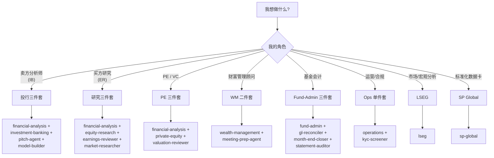

# 03. Marketplace 目录 — 20 个插件速查 + 选型决策树

> **本节定位** [用户向] — 全部 20 个插件的一句话能力 + 安装命令 + 按角色的选型决策树。

> **术语外行?** 本章出现的 finance 术语(DCF / LBO / MOIC / IC memo / CIM / NAV / AUM / GP / LP / carry / KYC 等)详见 [`00.5-finance-primer.md`](./00.5-finance-primer.md)。

## TL;DR

- 20 个插件分四类:**7 vertical** (skill/command 源)、**10 agent** (端到端工作流)、**2 partner-built** (LSEG、S&P Global)、**1 M365 install** (IT admin)。
- **必装**: `financial-analysis`(自带 12 个 MCP connector,其他 vertical 都间接依赖它)。
- **按角色**: 投行 → `investment-banking` + `pitch-agent` + `model-builder`;股权研究 → `equity-research` + `earnings-reviewer` + `market-researcher`;PE → `private-equity` + `valuation-reviewer`;财富管理 → `wealth-management` + `meeting-prep-agent`;基金会计 → `fund-admin` + `gl-reconciler` + `month-end-closer` + `statement-auditor`;运营 → `operations` + `kyc-screener`。

## What you'll learn

- 20 个插件一句话能力
- 按"vertical / agent / partner / 工具"分组的目录
- 按角色(投行/研究/PE/WM/会计/运营)的最小安装集
- 何时不装某个插件
- partner-built 插件的差异

## [用户向] 全部 20 插件速查

| # | plugin | 类型 | 安装命令 | 一句话能力 |
|---|---|---|---|---|
| 1 | financial-analysis | vertical | `claude plugin install financial-analysis@claude-for-financial-services` | DCF / comps / LBO / 3-statement / deck QC + **12 MCP** |
| 2 | investment-banking | vertical | `claude plugin install investment-banking@claude-for-financial-services` | CIM / teaser / buyer-list / merger-model / process-letter / deal-tracker(配 `hooks/hooks.json` + `local.md.example`) |
| 3 | equity-research | vertical | `claude plugin install equity-research@claude-for-financial-services` | earnings / initiate / model-update / morning / screen / thesis / catalyst / sector |
| 4 | private-equity | vertical | `claude plugin install private-equity@claude-for-financial-services` | source / screen / dd / ic-memo / portfolio / value-creation / unit-economics / returns / ai-readiness |
| 5 | wealth-management | vertical | `claude plugin install wealth-management@claude-for-financial-services` | client-review / financial-plan / rebalance / tlh / proposal / client-report |
| 6 | fund-admin | vertical | `claude plugin install fund-admin@claude-for-financial-services` | gl-recon / break-trace / accrual / roll-forward / variance / nav-tieout(**无 command,只能通过 agent**) |
| 7 | operations | vertical | `claude plugin install operations@claude-for-financial-services` | kyc-doc-parse / kyc-rules(**无 command,只能通过 agent**) |
| 8 | pitch-agent | agent | `claude plugin install pitch-agent@claude-for-financial-services` | comps + precedents + LBO + DCF → branded pitch deck |
| 9 | market-researcher | agent | `claude plugin install market-researcher@claude-for-financial-services` | sector overview + competitive + peer comps + ideas shortlist |
| 10 | earnings-reviewer | agent | `claude plugin install earnings-reviewer@claude-for-financial-services` | earnings call + filings → model update → note |
| 11 | meeting-prep-agent | agent | `claude plugin install meeting-prep-agent@claude-for-financial-services` | briefing pack before every client meeting |
| 12 | model-builder | agent | `claude plugin install model-builder@claude-for-financial-services` | DCF / LBO / 3-stmt / comps live in Excel |
| 13 | gl-reconciler | agent | `claude plugin install gl-reconciler@claude-for-financial-services` | GL recon, break trace, sign-off |
| 14 | kyc-screener | agent | `claude plugin install kyc-screener@claude-for-financial-services` | KYC doc parse + rules engine + escalations |
| 15 | valuation-reviewer | agent | `claude plugin install valuation-reviewer@claude-for-financial-services` | GP packages → valuation → LP reporting |
| 16 | month-end-closer | agent | `claude plugin install month-end-closer@claude-for-financial-services` | accruals + roll-forwards + variance commentary |
| 17 | statement-auditor | agent | `claude plugin install statement-auditor@claude-for-financial-services` | LP statement tie-out before distribution |
| 18 | lseg | partner | `claude plugin install lseg@claude-for-financial-services` | bond RV / swap curves / FX carry / options vol / macro(LSEG 数据) |
| 19 | sp-global | partner | `claude plugin install sp-global@claude-for-financial-services` | tearsheets / earnings-preview / funding-digest(Kensho + S&P) |
| 20 | claude-for-msft-365-install | M365 | `claude plugin install claude-for-msft-365-install@claude-for-financial-services` | IT admin:在自家云上配 Claude Office add-in |

> 注 1:`investment-banking` 的 plugin.json author 字段是 `"Anthropic"`,其他 vertical/agent 是 `"Anthropic FSI"`。详见 `04-plugin-anatomy.md`。
>
> 注 2:`sp-global` 的 marketplace 名是 `sp-global` 但插件目录是 `spglobal/`,`claude plugin install` 时用 `sp-global@...`。

## [用户向] 选型决策树



**最小集合实战(IB 第一天)**:

```bash
# 4 个 plugin = 卖方分析师的完整工具链
claude plugin marketplace add anthropics/financial-services
claude plugin install financial-analysis@claude-for-financial-services     # 必装(12 MCP)
claude plugin install investment-banking@claude-for-financial-services    # IB 工作流
claude plugin install pitch-agent@claude-for-financial-services           # 端到端 pitch
claude plugin install model-builder@claude-for-financial-services         # 单独建模
```

## [用户向] 必装清单 vs 按需清单

```text
必装 (任何 FSI 角色都装)
   financial-analysis    <- 12 MCP + 13 skill + 7 command,其他都间接依赖

按 vertical 装 (按角色选 1-3 个)
   investment-banking    <- IB 卖方
   equity-research       <- 研究员
   private-equity        <- PE/VC
   wealth-management     <- 顾问
   fund-admin            <- 基金会计
   operations            <- KYC 运营

按 agent 装 (按任务选 1-5 个)
   pitch-agent           <- 旗舰,做 pitch book 用
   model-builder           <- 自己造模型
   earnings-reviewer     <- 季报后用
   market-researcher     <- 行业/主题研究
   meeting-prep-agent    <- 客户会前
   gl-reconciler         <- 日常对账
   month-end-closer      <- 月结
   statement-auditor     <- LP 对账单复核
   valuation-reviewer    <- 季度估值复核
   kyc-screener          <- KYC onboarding

按 partner 装 (看你有什么数据订阅)
   lseg                  <- 债券/外汇/利率
   sp-global             <- 标准化 tearsheet

工具 (只 IT 管理员需要)
   claude-for-msft-365-install   <- 配 Office add-in
```

## [用户向] 不装任何东西也能用的能力

Claude 原生就有:基本对话、读文件、写文件、bash。这些不需要装任何插件,但也不带任何 FSI 领域知识。装 `financial-analysis` 后才有 MCP 数据访问(否则 Claude 不知道什么是 CapIQ)。

## [用户向] Partner-built 插件的差异

LSEG 与 S&P Global 不是 Anthropic 自家维护,而是合作方发布:

| 维度 | Anthropic 自家 | Partner-built |
|---|---|---|
| 作者 | `Anthropic FSI` / `Anthropic` | `LSEG` / `Kensho Technologies` |
| 版本号 | `0.1.x` 系列(仍在演进) | `1.0.x` 系列(对外正式发布) |
| 配套文档 | 仅 manifest + README | **额外** `CONNECTORS.md`(LSEG) / 完整 README(SP Global) |
| MCP | 用 `financial-analysis` 的 12 MCP | 自带独立 MCP server(LSEG / Kensho) |
| License | Apache-2.0(仓库默认) | Apache-2.0(SP Global) / 看各 partner(LSEG) |

LSEG 的 `plugins/partner-built/lseg/.mcp.json` URL 是 `https://api.analytics.lseg.com/lfa/mcp/server-cl`,与 `README.md` 中的 `.../mcp` 略不同 — **实际配置为准**。详见 `10-mcp-connectors.md`。

## [用户向] 不在 marketplace 里的内容

`managed-agent-cookbooks/` 不是 marketplace entry — 它们是 **Managed Agent 部署清单**(给 `POST /v1/agents` 用),不是给 Cowork 安装的。所以你不会在 `claude plugin marketplace` 里看到它们。完整 cookbook 详解 → `09-cookbooks.md`。

## 按角色装哪个 — 详细清单

### 卖方分析师(Investment Banking)

```text
必装:
   financial-analysis          # 12 MCP + comps/dcf/lbo/audit-xls
   investment-banking          # /cim /teaser /buyer-list /process-letter
   pitch-agent                 # 端到端 pitch book
按需:
   model-builder               # 自己从零建模
   market-researcher           # sector primer(用于 target 的 industry 背景)
不用:
   private-equity, wealth-management, fund-admin, operations
   LSEG(sp-global 等 partner-built 主要供固收/宏观分析师用)
```

### 买方研究员(Equity Research)

```text
必装:
   financial-analysis          # comps/dcf/audit-xls
   equity-research             # earnings / morning-note / thesis / sector
   earnings-reviewer           # post-earnings 自动 agent
按需:
   market-researcher           # thematic primer
   model-builder               # 全新建模
不用:
   investment-banking, private-equity, fund-admin, wealth-management, operations
```

### PE / VC

```text
必装:
   financial-analysis          # comps/audit-xls(用于 portco 估值)
   private-equity              # /source /screen-deal /dd-checklist /ic-memo
   valuation-reviewer          # 季报估值复核
按需:
   pitch-agent                 # 若做 LP-side 演示
   model-builder               # LBO / DCF 全套
不用:
   equity-research, wealth-management, fund-admin, operations, lseg
```

### 财富管理顾问(Wealth Management)

```text
必装:
   wealth-management           # /client-review /financial-plan /rebalance /tlh
   meeting-prep-agent          # 会前 briefing pack
按需:
   financial-analysis          # 若需要 /comps /dcf 做 proposal
不用:
   equity-research, investment-banking, private-equity, fund-admin, operations
```

### 基金会计(Fund Administration)

```text
必装:
   financial-analysis          # audit-xls / xlsx-author
   gl-reconciler                # 每日对账
   month-end-closer            # 月结
   statement-auditor           # LP statement 复核
按需:
   valuation-reviewer          # 季度估值
不用:
   equity-research, investment-banking, private-equity, wealth-management
```

### 运营 / 合规(Operations)

```text
必装:
   operations                  # kyc-doc-parse / kyc-rules
   kyc-screener                # KYC onboarding agent
不用:
   其他 vertical 与 agent(若不需要)
```

### 固收 / 外汇 / 宏观

```text
必装:
   lseg                        # bond RV / swap curves / FX carry / vol
按需:
   sp-global                   # 若做 tearsheet / earnings preview
   financial-analysis          # 若需要 /comps /dcf
不用:
   全部 vertical plugin(LSEG 自带工作流)
```

## 按任务装哪个 — 常见任务映射

```text
任务                              推荐插件
-----------------------------------------------------------
做一个 pitch book (IB)            pitch-agent
对一只股票做 comps               /comps (financial-analysis)
对一只股票做 DCF                 /dcf (financial-analysis)
看一个 sector 行业报告           /sector (equity-research)
或用 market-researcher agent
看一只股 earnings 后             earnings-reviewer agent
draft earnings note
跟踪 thesis                      /thesis (equity-research)
写 IC memo                       /ic-memo (private-equity)
对 LP statement                   statement-auditor agent
对账 GL ↔ subledger              gl-reconciler agent
月结                              month-end-closer agent
跑 KYC 新客户 onboarding         kyc-screener agent
季报 portco 估值                  valuation-reviewer agent
客户会前 briefing                 meeting-prep-agent agent
或 /client-review (wealth-management)
make a tearsheet                  tear-sheet skill (sp-global)
或 LSEG equity research tool
```

## 重要免责声明

> **!IMPORTANT** 本仓库与本 handbook 都不构成投资、法律、税务或会计建议。这些 agent 起草分析师工作产出(模型、备忘录、研究笔记、对账结果),由合格专业人士复核。它们不做投资建议、不执行交易、不承担风险、不入账、不批准 onboarding。每个产物都待人工签字。你负责验证输出与遵守适用的法律法规。

源: `README.md` L7–9(本 handbook 完整镜像此声明)。

## Cross-references

- 仓库的整体心智模型 → `./00-introduction.md`
- 完整安装步骤 → `./01-quickstart.md`
- 每个 vertical 的命令清单与 MCP 配置 → `./05-verticals.md`
- 每个 agent 的工作流与护栏 → `./06-agents.md`
- 56 个 slash command 目录 → `./07-commands.md`
- 66 个 skill 目录(55 vertical + 11 partner)→ `./08-skills.md`
- 12 个 MCP 连接器 → `./10-mcp-connectors.md`
- M365 admin 部署 → `./11-microsoft-365-install.md`

## Source files

- `.claude-plugin/marketplace.json`(L1–L128)
- `README.md`(L13–34,L101–L115)
- 各插件 `plugin.json` × 20(用于校验版本号与 author 字段)
- `plugins/partner-built/lseg/.mcp.json`(LSEG URL 真实形态)
- `plugins/partner-built/lseg/CONNECTORS.md`(partner 独有文档)
- `plugins/partner-built/lseg/README.md`(partner 独有 README)