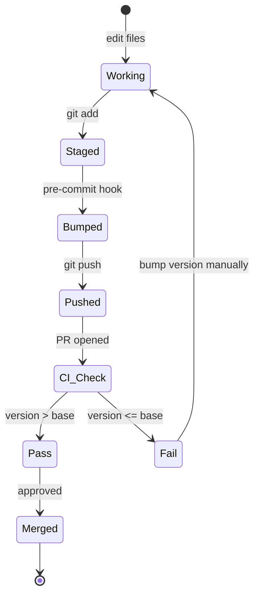

# 04. 插件解剖 — 目录结构、manifest、版本、frontmatter

> **本节定位** [开发者向] — 任何想 fork / 二次定制 / 贡献的人必读。统一所有文件格式与命名约定。

> **术语外行?** 本章出现的 finance 术语(DCF / LBO / MOIC / IC memo / CIM / NAV / AUM / GP / LP / carry / KYC 等)详见 [`00.5-finance-primer.md`](./00.5-finance-primer.md)。

## TL;DR

- 一个插件 = `.claude-plugin/plugin.json` + 可选 `agents/<slug>.md` + 可选 `skills/` + 可选 `commands/` + 可选 `.mcp.json` + 可选 `hooks/hooks.json` + 可选 `.claude/<slug>.local.md.example`。
- manifest 字段:name / version / description / author(必需);displayName / homepage / repository / license / keywords(可选)。
- version 用 semver;**patch bump 由 pre-commit 自动**,minor/major 手动。
- frontmatter 字段:agent 是 `name` + `description` + `tools`;skill 是 `name` + `description`;command 是 `description` + `argument-hint`。
- `.ps1` 必须纯 ASCII(`scripts/check.py` 强制);handbook 也遵守。

## What you'll learn

- 插件目录结构的完整规范
- manifest 字段的含义与 rich schema 示例
- version 字段语义与 bump 规则
- agent / skill / command frontmatter 的字段含义
- `.mcp.json` 格式与 hooks 配置
- ASCII-only `.ps1` 红线的来龙去脉

## 版本管理状态图



注释:`Working` 是本地编辑中;`Staged` 是 `git add` 后;`Bumped` 是 pre-commit hook 通过 `scripts/version_bump.py --apply` 自动 patch bump;`CI_Check` 在 PR 触发;`Fail` 让你手工改 plugin.json 升级 version。

## [开发者向] 目录结构规范

最小插件:

```text
plugins/<type>/<slug>/
└── .claude-plugin/plugin.json
```

典型 vertical 插件(以 `investment-banking` 为例):

```text
plugins/vertical-plugins/investment-banking/
├── .claude-plugin/
│   └── plugin.json
├── .claude/
│   └── investment-banking.local.md.example   # 用户个性化模板(可拷贝改)
├── hooks/
│   └── hooks.json                              # 当前内容 {"hooks":{}}
├── commands/                                   # slash command
│   ├── buyer-list.md
│   ├── cim.md
│   ├── deal-tracker.md
│   ├── merger-model.md
│   ├── one-pager.md
│   ├── process-letter.md
│   └── teaser.md
└── skills/
    ├── buyer-list/SKILL.md
    ├── cim-builder/SKILL.md
    ├── datapack-builder/SKILL.md
    ├── deal-tracker/SKILL.md
    ├── merger-model/SKILL.md
    ├── pitch-deck/SKILL.md
    ├── process-letter/SKILL.md
    ├── strip-profile/SKILL.md            # frontmatter name: fsi-strip-profile
    └── teaser/SKILL.md
```

典型 agent 插件(以 `pitch-agent` 为例):

```text
plugins/agent-plugins/pitch-agent/
├── .claude-plugin/
│   └── plugin.json
├── agents/
│   └── pitch-agent.md                     # 唯一一份系统提示词
└── skills/                                  # 来自 financial-analysis, sync-agent-skills.py 同步
    ├── 3-statement-model/SKILL.md
    ├── audit-xls/SKILL.md
    ├── comps-analysis/SKILL.md
    ├── dcf-model/SKILL.md                 # 含 requirements.txt + TROUBLESHOOTING.md
    ├── deck-refresh/SKILL.md
    ├── ib-check-deck/SKILL.md
    ├── lbo-model/SKILL.md
    ├── pitch-deck/SKILL.md
    ├── pptx-author/SKILL.md
    ├── sector-overview/SKILL.md
    └── xlsx-author/SKILL.md
```

最丰富的 schema(`sp-global`,partner):

```text
plugins/partner-built/spglobal/
├── .claude-plugin/
│   └── plugin.json         # 带 homepage/repository/license/keywords
├── skills/
│   ├── earnings-preview-beta/SKILL.md     # frontmatter name: earnings-preview-single
│   ├── funding-digest/SKILL.md
│   └── tear-sheet/SKILL.md
└── README.md
```

## [开发者向] manifest 字段详解

四个必需字段:

| 字段 | 含义 | 示例 |
|---|---|---|
| `name` | 插件内部名(必须匹配目录名) | `"pitch-agent"` |
| `version` | semver 三段 | `"0.1.1"` / `"1.0.1"` |
| `description` | marketplace 与 `/help` 中展示 | `"Comps, precedents, LBO to a branded pitch deck, end to end"` |
| `author` | 维护方 | `{"name": "Anthropic FSI"}` |

可选字段(rich schema):

| 字段 | 含义 | 示例 |
|---|---|---|
| `displayName` | marketplace list 里展示的人读名 | `"Pitch Agent"` |
| `homepage` | 主页 URL | `"https://www.marketplace.spglobal.com/..."` |
| `repository` | 源代码仓库 | `"https://github.com/kensho-technologies/spglobal-agent-skills"` |
| `keywords` | 检索关键词数组 | `["sp-global", "finance", "capital-iq", "tearsheets"]` |
| `license` | License 标识 | `"Apache-2.0"` |

**极简 vs 丰富对比**:

```jsonc
// 极简(plugins/agent-plugins/pitch-agent/.claude-plugin/plugin.json)
{
  "name": "pitch-agent",
  "version": "0.1.1",
  "description": "Comps, precedents, LBO to a branded pitch deck, end to end",
  "author": { "name": "Anthropic FSI" }
}

// 丰富(plugins/partner-built/spglobal/.claude-plugin/plugin.json)
{
  "name": "sp-global",
  "version": "1.0.1",
  "description": "S&P Global - Financial data and analytics skills ...",
  "author": {
    "name": "Kensho Technologies",
    "email": "spglobal-agent-skills-maintainers@kensho.com"
  },
  "homepage": "https://www.marketplace.spglobal.com/...",
  "repository": "https://github.com/kensho-technologies/spglobal-agent-skills",
  "license": "Apache-2.0",
  "keywords": ["sp-global", "finance", "capital-iq", "tearsheets", "earnings", "transactions", "excel"]
}
```

## [开发者向] author 命名差异

仓库里 author 字段有四种值,不同来源:

| author 值 | 出处 |
|---|---|
| `Anthropic FSI` | 大多数 agent + vertical (主流) |
| `Anthropic` | **唯独** `investment-banking` vertical |
| `LSEG` | `lseg` partner plugin |
| `Kensho Technologies` | `sp-global` partner plugin |

`investment-banking` 是仓库里唯一一个非 FSI 的自家 vertical — 早期由不同的团队维护,所以保留原始 author 字段。**新插件请用 `Anthropic FSI`。**

## [开发者向] version 字段语义与 bump 规则

```text
plugin version = "<major>.<minor>.<patch>"

  major.bump  破坏性变化(API 改名、manifest schema 改、文件重组织)
  minor.bump  新功能(新 skill、新 command、新 MCP、cookbook 新增)
  patch.bump  修复、文案调整、内容刷新

实战中的 bump 频率:
  patch:  大多数 commit(自动)
  minor:  每月 1-2 次(新功能发布)
  major:  极少(破坏性变更)
```

**自动 patch bump**(`scripts/version_bump.py` + `.githooks/pre-commit`):

```python
# scripts/version_bump.py 核心逻辑(精简):
for plugin_dir in plugins_with_staged_changes:
    current_version = read_plugin_json(plugin_dir)['version']
    base_version = read_plugin_json_on_base_ref(plugin_dir)['version']
    if current_version <= base_version:
        # 只 patch bump 一次,即使多个 commit
        new_patch = current_version.patch + 1
        write_plugin_json(plugin_dir, ... patch=new_patch ...)
```

要点:**只 bump 一次**。一个分支上 plugin 已经比 `main` 高一档后,后续 commit 不再 bump,直到下一个分支开出来。

**手动 bump**(minor/major):

```bash
# 编辑 plugins/agent-plugins/<slug>/.claude-plugin/plugin.json
# 把 "0.1.5" 改成 "0.2.0" 或 "1.0.0"
# 然后跑:
python3 scripts/check.py     # 校验仍 OK
```

## [开发者向] agent frontmatter

`plugins/agent-plugins/<slug>/agents/<slug>.md` 顶部:

```yaml
---
name: pitch-agent
description: |
  End-to-end investment banking pitch agent. Given a target company and
  a strategic situation, autonomously pulls comps and precedents,
  builds a DCF and football-field valuation in Excel, and generates
  a branded pitch deck on the bank's PowerPoint template.

  Use when an MD or senior banker asks for a first-draft pitch on a name.
tools: Read, Write, Edit, mcp__capiq__*
---
```

字段:

| 字段 | 含义 |
|---|---|
| `name` | 与目录名 + plugin.json name 一致 |
| `description` | 多行 `\|` block;触发短语 + "Use when..." |
| `tools` | 逗号分隔的工具白名单;`mcp__<server>__*` 是 MCP 工具前缀 |

`scripts/check.py` L91–106 强制 `name` + `description` 必须存在。

## [开发者向] skill frontmatter

`plugins/vertical-plugins/<v>/skills/<slug>/SKILL.md` 顶部:

```yaml
---
name: comps-analysis
description: |
  Build institutional-grade comparable company analyses with operating
  metrics, valuation multiples, and statistical benchmarking in
  Excel/spreadsheet format.

  **Perfect for:**
  - Public company valuation (M&A, investment analysis)
  - Benchmarking performance vs. industry peers
  - Pricing IPOs or funding rounds
  - Identifying valuation outliers
  - Supporting investment committee presentations
  - Creating sector overview reports

  **Not ideal for:**
  - Private companies without comparable public peers
  - Highly diversified conglomerates
  - Distressed/bankrupt companies
  - Pre-revenue startups
  - Companies with unique business models
---
```

字段:

- `name`:大多数情况下与目录名一致。**已知差异**:`strip-profile/` 目录的 frontmatter 是 `fsi-strip-profile`,`earnings-preview-beta/` 的 frontmatter 是 `earnings-preview-single`(源是 `spglobal` partner)。
- `description`:多行 `|` block,含 **Perfect for** 与 **Not ideal for** 两段,加上触发短语列表。
- 可选 `license`:如有第三方依赖标注。

## [开发者向] command frontmatter

`plugins/vertical-plugins/<v>/commands/<slug>.md` 顶部:

```yaml
---
description: Build a comparable company analysis with trading multiples
argument-hint: "[company name or ticker]"
---
```

字段:

- `description`:短句,在 slash 命令自动补全里出现
- `argument-hint`:在 `[brackets]` 里的占位提示,**通常**带 example,如 `[company name or ticker] [quarter, e.g. Q3 2024]`
- 可选 `allowed-tools`:限制该命令能用的工具(只在 `ppt-template.md` 等少数命令出现,值如 `["Read",", "Write",", "Bash",", "Glob"]`)

## [开发者向] `.mcp.json` 与 hooks 格式

`.mcp.json`(在 `financial-analysis` 根):

```jsonc
{
  "mcpServers": {
    "daloopa": {
      "type": "http",
      "url": "https://mcp.daloopa.com/server/mcp"
    },
    "cap-iq": {
      "type": "http",
      "url": "https://kfinance.kensho.com/integrations/mcp"
    }
  }
}
```

每个 server 至少需要 `type` + `url`。**已知 bug**:`plugins/vertical-plugins/financial-analysis/.mcp.json` 当前无法被 `json.load()` 解析(line 46 `egnyte` 块缺逗号),详见 `./13-troubleshooting.md#开发者向-已知-bug`。

`hooks/hooks.json`(在 `investment-banking` 下,目前是空配置):

```json
{
  "hooks": {}
}
```

格式:顶层有 `hooks` key,值是按事件类型(`PreToolUse` / `PostToolUse` / `Stop` 等)的对象数组。当前 `investment-banking` 没启用任何 hook,但保留此文件便于以后扩展。

### `hooks/hooks.json` 可扩展的事件

当前 `investment-banking` 只有空配置 `{"hooks":{}}`,但 schema 支持这些事件(摘自 MCP / Cowork hook 协议):

| 事件 | 触发时机 | 典型用途 |
|---|---|---|
| `PreToolUse` | tool 调用前 | 输入清洗 / 权限校验 |
| `PostToolUse` | tool 调用后 | 输出审计 / 日志 |
| `Stop` | session 终止 | 清理资源 |
| `SessionStart` | session 开始 | 注入额外 context |
| `SessionEnd` | session 结束 | 导出 / 通知 |

实战写法示例(`hooks/hooks.json` 加一条 Stop hook):

```json
{
  "hooks": {
    "Stop": [
      {
        "matcher": "*",
        "hooks": [
          {
            "type": "command",
            "command": "echo 'cleanup at $(date)' >> ~/.claude/audit.log"
          }
        ]
      }
    ]
  }
}
```

注意:hook 的 `command` 字符串在 Windows 上也走 `.ps1` ASCII 红线 — 不要用 `—`(em dash)、`(curly quote)。

## [开发者向] skill 目录可选文件

```text
skills/<slug>/
├── SKILL.md                  # 必需
├── TROUBLESHOOTING.md        # 可选,dcf-model 有
├── requirements.txt          # 可选,dcf-model 有(python deps)
├── scripts/                  # 可选,辅助 Python 脚本
│   └── ...
├── examples/                 # 可选,示例输入文件
│   └── ...
└── LICENSE.txt               # 可选,skill-creator 有
```

`scripts/check.py` 检测 SKILL.md 的存在,但不强制其他文件。详见 `12-development-workflow.md#开发者向-加一个新-skill`。

## [开发者向] `.ps1` ASCII 红线 — 完整故事

来自 `scripts/check.py` L188–211:

```text
Windows PowerShell 5.1 -- 仍为托管 Windows 上的默认 shell -- 在没有
BOM 的情况下读 .ps1 时用机器的 ANSI code page,不是 UTF-8。
一个 em dash 或 curly quote 解码成含字面 " 的 mojibake,提前终止字符串,
使整个脚本 PARSE 失败。

macOS 上不可见,Windows 上是致命的。
```

**规则**(精简):

- `.ps1` / `.psm1` / `.psd1` 文件**无 BOM 时**只能含 ASCII 字节(0x00–0x7F)
- 加 UTF-8 BOM(`\xef\xbb\xbf` 开头)可以解除此限制
- `scripts/check.py` 会扫所有 `.ps1` 并对每行检查 `byte > 0x7F`,有则报错

**handbook 自身遵守**:所有 `.md` 内的代码块、ASCII 框图用 ASCII 字符(中文叙述段允许 UTF-8,因为 `.md` 不受此 bug 影响)。

## [开发者向] 一个完整新插件的 checklist

```text
[ ] 创建目录 plugins/<type>/<slug>/
[ ] 写 .claude-plugin/plugin.json
       (name=<slug>, version=0.1.0, description, author={name:"Anthropic FSI"})
[ ] (agent) 写 agents/<slug>.md
       frontmatter: name + description + tools
[ ] (vertical) 写 commands/<cmd>.md (每个)
       frontmatter: description + argument-hint
[ ] (vertical) 写 skills/<slug>/SKILL.md (每个)
       frontmatter: name + description (含 Perfect for / Not ideal for)
[ ] (optional) 写 .mcp.json (若需要新 MCP server)
[ ] (optional) 写 hooks/hooks.json (若需要 hook)
[ ] 在 .claude-plugin/marketplace.json 添加条目
       (plugins[] 数组, name + displayName + source + description)
[ ] 跑 python3 scripts/check.py (校验所有 manifest 与引用)
[ ] git commit (pre-commit hook 自动 patch bump)
[ ] PR  (CI 跑 plugin-validate + secret-scan + version-bump check)
```

## 重要免责声明

> **!IMPORTANT** 本仓库与本 handbook 都不构成投资、法律、税务或会计建议。这些 agent 起草分析师工作产出(模型、备忘录、研究笔记、对账结果),由合格专业人士复核。它们不做投资建议、不执行交易、不承担风险、不入账、不批准 onboarding。每个产物都待人工签字。你负责验证输出与遵守适用的法律法规。

源: `README.md` L7–9(本 handbook 完整镜像此声明)。

## Cross-references

- 仓库四层架构 → `./02-architecture.md`
- 完整 20 插件目录 → `./03-marketplace-catalog.md`
- 每个 vertical 内部细节 → `./05-verticals.md`
- skill archetype 与写作模板 → `./08-skills.md`
- command 两种模板 → `./07-commands.md`
- 加新插件 / skill / command 的完整流程 → `./12-development-workflow.md`
- `.mcp.json` JSON bug 与版本号管理 → `./13-troubleshooting.md`

## Source files

- 各插件 `.claude-plugin/plugin.json` × 20(用于规范示例)
- `plugins/partner-built/spglobal/.claude-plugin/plugin.json`(rich schema)
- `plugins/vertical-plugins/investment-banking/.claude-plugin/plugin.json`(author 差异)
- `plugins/vertical-plugins/investment-banking/hooks/hooks.json`(hooks 格式)
- `plugins/vertical-plugins/investment-banking/.claude/investment-banking.local.md.example`(个性化模板)
- `plugins/agent-plugins/pitch-agent/agents/pitch-agent.md`(agent frontmatter 模板)
- `plugins/vertical-plugins/financial-analysis/skills/comps-analysis/SKILL.md`(skill frontmatter 模板)
- `plugins/vertical-plugins/financial-analysis/commands/comps.md`(command frontmatter 模板)
- `plugins/vertical-plugins/financial-analysis/.mcp.json`(MCP 格式 — **含 JSON bug**)
- `scripts/check.py`(L91–211)
- `scripts/version_bump.py`(算法核心)
- `.githooks/pre-commit`(自动 bump)
- `CLAUDE.md`(ASCII 红线)