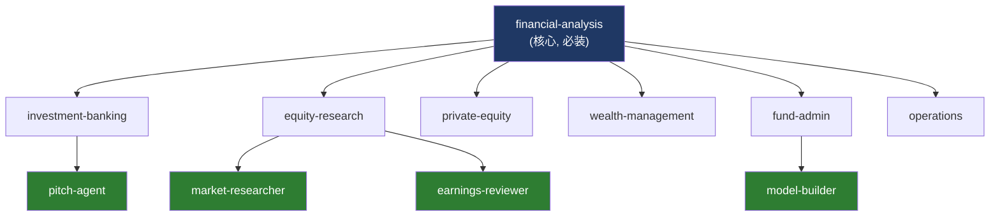

# 05. Verticals — 7 个 FSI Vertical + 2 个 Partner 完整拆解

> **本节定位** [用户向][开发者向] — 每个 vertical/partner 一节,固定模板:定位、命令清单、技能清单、MCP 配置、典型工作流。

> **术语外行?** 本章出现的 finance 术语(DCF / LBO / MOIC / IC memo / CIM / NAV / AUM / GP / LP / carry / KYC 等)详见 [`00.5-finance-primer.md`](./00.5-finance-primer.md)。

## TL;DR

- **9 个 vertical/partner 插件**:7 个 Anthropic FSI + 2 个外部 partner。
- **必装**:`financial-analysis`(自带 12 个 MCP connector,其他都依赖)。
- **命令差异**:`fund-admin` 与 `operations` **无 slash command**,只有 skill,只能通过 agent 调用。
- **命令最多的 vertical**:`private-equity`(10 个命令)。
- **partner 独有文档**:`lseg` 有 `CONNECTORS.md`,`spglobal` 有额外 README。

## What you'll learn

- 每个 vertical 的定位、命令清单、技能清单
- 每个 vertical 的 MCP 配置(及 .mcp.json 的 JSON bug)
- 各 vertical 之间的依赖关系
- 何时不装某个 vertical
- partner-built 插件的特殊性

## Vertical 依赖与安装顺序



说明:`financial-analysis` 是 12 MCP 的唯一宿主,所有其他 vertical 与 agent 间接依赖它的 MCP server;agent 插件(深绿)在 vertical 上层工作,不直接关联 MCP。

---

## 5.1 [用户向] financial-analysis(核心,必读)

- **版本**: 0.1.1
- **作者**: Anthropic FSI
- **定位**: 核心财务建模 + Excel 自动化 + Deck QC,**所有 12 个 MCP connector 都集中在这里**。其他 vertical 的 skill 调用 MCP 时也是通过这个 vertical 注册的连接器。
- **何时用**:任何场景都至少要装这一个。即使你只用 `/comps` 这一条命令,也必须有它(否则没有 MCP 数据)。

### 命令清单(7)

| 命令 | 描述 | 触发哪个 skill |
|---|---|---|
| `/comps` | Build a comparable company analysis with trading multiples | `comps-analysis` |
| `/dcf` | Build a DCF valuation model with comps-informed terminal | `dcf-model` |
| `/lbo` | Build an LBO model for a PE acquisition | `lbo-model` |
| `/3-statement-model` | Fill out a 3-statement financial model template | `3-statement-model` |
| `/debug-model` | Debug and audit a financial model for errors | `audit-xls` |
| `/competitive-analysis` | Create a competitive landscape analysis | `competitive-analysis` |
| `/ppt-template` | Create reusable PPT template skills from a PowerPoint template | `ppt-template-creator` |

### 技能清单(13)

| Skill | 用途 |
|---|---|
| `3-statement-model` | 完整 IS/BS/CF 模型填充 |
| `audit-xls` | Excel 模型审计(Critical/Warning/Info 三级报告) |
| `clean-data-xls` | 清洗表格数据(空白/大小写/类型/dedupe) |
| `competitive-analysis` | 两阶段竞争格局分析(deck) |
| `comps-analysis` | 机构级可比公司分析(主要 skill) |
| `dcf-model` | 完整 DCF(proj / WAC / TV / sensitivity / exec summary) |
| `deck-refresh` | 在不重建 deck 的前提下更新数字 |
| `ib-check-deck` | 四维度 deck QC(numbers / narrative / language / visual) |
| `lbo-model` | LBO 模板(sources & uses / operating / debt schedule / returns) |
| `ppt-template-creator` | 从 PPT 模板生成可复用 skill |
| `pptx-author` | Headless `.pptx` 生成(Managed Agent 模式,python-pptx) |
| `skill-creator` | Meta-skill:教你怎么写新 skill |
| `xlsx-author` | Headless `.xlsx` 生成(Managed Agent 模式,openpyxl) |

### MCP 配置

`plugins/vertical-plugins/financial-analysis/.mcp.json` 注册了 12 个 server。**注意**:此文件当前**无法被 `json.load()` 解析**(line 46 `egnyte` 块缺逗号),详见 `./13-troubleshooting.md#开发者向-已知-bug`。

| Server | URL |
|---|---|
| `daloopa` | `https://mcp.daloopa.com/server/mcp` |
| `morningstar` | `https://mcp.morningstar.com/mcp` |
| `sp-global` | `https://kfinance.kensho.com/integrations/mcp` |
| `factset` | `https://mcp.factset.com/mcp` |
| `moodys` | `https://api.moodys.com/genai-ready-data/m1/mcp` |
| `mtnewswire` | `https://vast-mcp.blueskyapi.com/mtnewswires` |
| `aiera` | `https://mcp-pub.aiera.com` |
| `lseg` | `https://api.analytics.lseg.com/lfa/mcp` |
| `pitchbook` | `https://premium.mcp.pitchbook.com/mcp` |
| `chronograph` | `https://ai.chronograph.pe/mcp` |
| `egnyte` | `https://mcp-server.egnyte.com/mcp` |
| `box` | `https://mcp.box.com` |

### 关联 Agent

- `pitch-agent`(用 comps / lbo / dcf / 3-statement / audit-xls / deck-refresh / ib-check-deck / pptx-author / xlsx-author / sector-overview)
- `market-researcher`(用 sector-overview / competitive-analysis / comps-analysis / pptx-author)
- `earnings-reviewer`(用 audit-xls)
- `model-builder`(用 dcf / lbo / 3-statement / comps / audit-xls)
- `gl-reconciler`(用 audit-xls / xlsx-author)
- `month-end-closer`(用 audit-xls / xlsx-author)
- `statement-auditor`(用 audit-xls / xlsx-author)
- `meeting-prep-agent`(用 pptx-author)
- `valuation-reviewer`(用 xlsx-author)

### 典型工作流

```text
1. /comps AAPL              <- 拉 trading comps
2. /dcf AAPL                <- 用 comps 校准终值倍数
3. /lbo "<deal>"            <- 假设 PE bid,看 IRR/MOIC
4. /debug-model model.xlsx  <- 让 audit-xls 校验公式与 BS 平衡
5. /competitive-analysis AAPL <- 把 comps 的对手拉出来做 deck
```

---

## 5.2 [用户向] investment-banking

- **版本**: **0.2.1**(仓库里唯一非 0.1.x 的 Anthropic 自家 vertical)
- **作者**: **Anthropic**(注意不是 "Anthropic FSI")
- **定位**: 投行生产力工具套件:CIM / teaser / buyer-list / merger-model / process-letter / deal-tracker。
- **特殊点**:有 `hooks/hooks.json`(目前空 `{"hooks":{}}`)与 `.claude/investment-banking.local.md.example`(个性化模板)。

### 命令清单(7)

| 命令 | 描述 |
|---|---|
| `/one-pager` | Create a one-page company strip profile |
| `/cim` | Draft a Confidential Information Memorandum |
| `/teaser` | Draft an anonymous one-page teaser |
| `/buyer-list` | Build a buyer universe for a sell-side process |
| `/merger-model` | Build an accretion/dilution merger model |
| `/process-letter` | Draft a process letter or bid instructions |
| `/deal-tracker` | Track and review live deal pipeline |

### 技能清单(9)

| Skill | 用途 |
|---|---|
| `buyer-list` | 战略 + 财务买方 universe |
| `cim-builder` | CIM 结构化起草 |
| `datapack-builder` | 从 CIM/OM/SEC/MCP 建 IC-ready 数据包 |
| `deal-tracker` | 跟踪交易里程碑、deadline、action items |
| `merger-model` | 增值/稀释分析(pro forma EPS / synergies / PPA) |
| `pitch-deck` | 填充 IB pitch deck 模板 |
| `process-letter` | 流程信/投标指引(IOI/final/mgmt meeting) |
| `strip-profile` | 1–4 页信息密集型公司档案(**frontmatter name: fsi-strip-profile**) |
| `teaser` | 匿名一页 teaser |

### 个性化模板

```bash
# 拷贝并定制
cp plugins/vertical-plugins/investment-banking/.claude/investment-banking.local.md.example \
   .claude/investment-banking.local.md

# 然后编辑:
# - name / title / group / firm
# - sectors / verticals (你覆盖的行业)
# - typical_deal_size_range
# - active_mandates / priority_targets
# - default_valuation_methodologies
```

这个文件让你的 agent 知道"我在哪家公司、做什么行业、覆盖哪些 deal"。

### 关联 Agent

- `pitch-agent`(用 pitch-deck)

### 典型工作流

```text
# 卖方 mandate:
1. /source "<criteria>"     <- 但 PE 才用,IB 通常直接从 inbound 开始
2. /screen-deal "<CIM>.pdf" <- 评估 inbound
3. /teaser "<target>"       <- 出 anonymous teaser
4. /cim "<target>"           <- 出 CIM(去掉敏感数据版本)
5. /buyer-list "<target>"    <- 拉战略 + 财务买方
6. /one-pager "<buyer>"      <- 给每家买方一份 strip profile
7. /process-letter "<bid>"   <- 出 IOI/Final 投标信
8. /deal-tracker             <- 跟踪到 close
```

---

## 5.3 [用户向] equity-research

- **版本**: 0.1.2
- **作者**: Anthropic FSI
- **定位**: 股权研究的"覆盖 +发布"工作流 — earnings notes / initiating coverage / model updates / thesis tracking / idea generation。

### 命令清单(9)

| 命令 | 描述 |
|---|---|
| `/earnings` | Analyze quarterly earnings, create earnings update report |
| `/earnings-preview` | Build a pre-earnings preview with scenarios |
| `/initiate` | Create an initiating coverage report |
| `/model-update` | Update a financial model with new data |
| `/morning-note` | Draft a morning meeting note |
| `/screen` | Run a stock screen or generate investment ideas |
| `/sector` | Create a sector overview report |
| `/thesis` | Create or update an investment thesis |
| `/catalysts` | View or update the catalyst calendar |

### 技能清单(9)

| Skill | 用途 |
|---|---|
| `catalyst-calendar` | 跟踪覆盖名册的近期 catalyst(earnings/conference/launch/regulatory/macro) |
| `earnings-analysis` | 8–12 页 earnings 更新报告(3–5K 字,1–3 表,8–12 图) |
| `earnings-preview` | 季报前预览(consensus / scenarios / what-to-watch) |
| `idea-generation` | 系统化选股(quant + thematic + pattern) |
| `initiating-coverage` | 5 任务 initiation 工作流(research / model / valuation / charts / final) |
| `model-update` | 接入新数据(earnings/guidance/macro)重算估值 |
| `morning-note` | 7 点晨会笔记(overnight developments / trade ideas / events) |
| `sector-overview` | 行业 landscape 报告(TAM / structure / players / trends) |
| `thesis-tracker` | 维护/更新投资 thesis |

### 关联 Agent

- `earnings-reviewer`(用 earnings-analysis / model-update / morning-note / earnings-preview)
- `market-researcher`(用 sector-overview / competitive-analysis / comps-analysis / idea-generation)

### 典型工作流

```text
季度节奏:
T-2 周:  /earnings-preview NVDA  <- 出预览 + scenarios
T-1 天:  /morning-note           <- 提到 NVDA earnings
T+0:     earnings 发布
T+0:     earnings-reviewer agent 自动跑(用 earnings-analysis + model-update + morning-note)
T+1 周:  /model-update NVDA     <- 把数字接进估值
持续:     /thesis NVDA            <- 维护 thesis
持续:     /catalysts "next 2 weeks" <- 看近期 catalyst
```

---

## 5.4 [用户向] private-equity

- **版本**: 0.1.2
- **作者**: Anthropic FSI
- **定位**: PE 全周期 — sourcing / screening / DD / IC memo / portfolio monitoring / value creation。**命令最多**(10 个)。

### 命令清单(10)

| 命令 | 描述 |
|---|---|
| `/source` | Discover companies, draft founder outreach |
| `/screen-deal` | Quick pass/fail on CIM / teaser |
| `/dd-checklist` | Generate a due-diligence checklist |
| `/dd-prep` | Prep for a diligence meeting / expert call |
| `/ic-memo` | Draft an investment committee memo |
| `/portfolio` | Review portfolio company performance |
| `/returns` | Build IRR/MOIC sensitivity tables |
| `/unit-economics` | Analyze unit economics(ARR/LTV/CAC/retention) |
| `/value-creation` | Build a post-acquisition value creation plan |
| `/ai-readiness` | Scan portfolio for highest-leverage AI opportunities |

### 技能清单(10)

| Skill | 用途 |
|---|---|
| `ai-readiness` | Portfolio AI 机会扫描(per-portco go/no-go,ranked quick wins) |
| `dd-checklist` | 按行业 + 交易类型 + 复杂度的 DD checklist |
| `dd-meeting-prep` | Mgmt presentation / expert call / customer ref 准备 |
| `deal-screening` | CIM/teaser/broker materials 快筛(pass/fail) |
| `deal-sourcing` | 3 步 sourcing pipeline(discover → CRM check → founder outreach) |
| `ic-memo` | 9 段 IC memo(ExecSum → Recommendation) |
| `portfolio-monitoring` | Portco KPI 跟踪(monthly/quarterly packages / variance / covenant) |
| `returns-analysis` | IRR/MOIC sensitivity(entry / leverage / exit / growth / hold) |
| `unit-economics` | ARR cohorts / LTV-CAC / net retention / payback / revenue quality |
| `value-creation-plan` | 100-day plan + EBITDA bridge + KPI dashboard |

### 关联 Agent

- `valuation-reviewer`(用 returns-analysis / portfolio-monitoring / ic-memo)

### 典型工作流

```text
Sourcing 阶段:
/source "<criteria>"          <- discover companies + draft outreach

Screening 阶段:
/screen-deal "<CIM>.pdf"      <- pass/fail

DD 阶段:
/dd-checklist "<target>"
/dd-prep "<target>" "<meeting type>"
/unit-economics "<target>"
/returns "<deal params>"

IC 阶段:
/ic-memo "<target>"

Close 后:
/value-creation "<target>"
/portfolio "<portco>"

持续:
/ai-readiness "<portfolio folder>"   <- 找 AI 加杠杆机会
```

---

## 5.5 [用户向] wealth-management

- **版本**: 0.1.2
- **作者**: Anthropic FSI
- **定位**: 财富管理顾问的工作流 — client review / financial plan / rebalance / TLH / proposal。

### 命令清单(6)

| 命令 | 描述 |
|---|---|
| `/client-review` | Prep for a client review meeting |
| `/client-report` | Generate a client performance report |
| `/financial-plan` | Build or update a financial plan |
| `/proposal` | Create an investment proposal for a prospect |
| `/rebalance` | Analyze drift and generate rebalancing trades |
| `/tlh` | Identify tax-loss harvesting opportunities |

### 技能清单(6)

| Skill | 用途 |
|---|---|
| `client-report` | Client-facing 业绩报告(quarterly/annual) |
| `client-review` | Pre-meeting prep(performance / allocation / talking points) |
| `financial-plan` | 综合规划(retirement / education / estate / cash flow) |
| `investment-proposal` | 新客户/潜在客户提案(firm / allocation / outcomes / fees) |
| `portfolio-rebalance` | Drift 分析 + tax-aware rebalancing trade |
| `tax-loss-harvesting` | TLH 机会扫描 + replacement + wash sale 窗口 |

### 关联 Agent

- `meeting-prep-agent`(用 client-review / client-report / investment-proposal)

### 典型工作流

```text
新 prospect:
/proposal "<prospect>"

季度 review 周期:
/client-report "<client>" Q4 2026
/client-review "<client>"
/rebalance "<client>"

持续:
/financial-plan "<client>"     <- 每年/事件触发
/tlh "<client>"                <- Q4 tax season
```

---

## 5.6 [用户向] fund-admin

- **版本**: 0.1.0
- **作者**: Anthropic FSI
- **定位**: 基金会计/财务运营的技能套件 — GL 对账、break 溯源、accruals、roll-forwards、variance commentary、NAV tie-out。
- **特殊点**:**无 slash command**。所有 skill 都通过 agent(`gl-reconciler`、`month-end-closer`、`statement-auditor`)调用。

### 命令清单(0)

```text
(无 commands/)
你不能输入 /gl-recon 这种东西。
必须先调度 gl-reconciler agent,然后它会调用 gl-recon skill。
```

### 技能清单(6)

| Skill | 用途 |
|---|---|
| `accrual-schedule` | 期末 accrual schedule(JE drafts) |
| `break-trace` | 对账 break 的根因追溯 |
| `gl-recon` | GL ↔ subledger 对账(match / surface breaks / classify) |
| `nav-tieout` | LP statement 对到 NAV pack,重算 capital account |
| `roll-forward` | BS 科目 roll-forward(begin + activity − reversal = ending) |
| `variance-commentary` | P&L/BS flux commentary(超过阈值) |

### 关联 Agent

- `gl-reconciler`(用 gl-recon / break-trace / audit-xls / xlsx-author)
- `month-end-closer`(用 accrual-schedule / roll-forward / variance-commentary / audit-xls / xlsx-author)
- `statement-auditor`(用 nav-tieout / audit-xls / xlsx-author)

### 典型工作流

```text
日常对账:
1. 调度 gl-reconciler agent
2. 给 steering event: "Reconcile GL vs subledger, trade date 2026-08-01, classes: [Equity, FX]"
3. agent 自动: reader(读数据) → critic(复核) → resolver(出 exception report)
4. resolver 写到 ./out/<date>.xlsx
5. 等 controller sign-off

月结:
1. 调度 month-end-closer agent
2. 给 "Close <entity> for period 2026-07"
3. agent 自动: ledger-reader → rollforward → poster(写 accruals + variance)

季度对账单:
1. 调度 statement-auditor agent
2. 给 "Tie out statement batch <id> against <fund> NAV pack"
3. agent 自动: statement-reader → reconciler → flagger(出 sign-off sheet)
```

---

## 5.7 [用户向] operations

- **版本**: 0.1.0
- **作者**: Anthropic FSI
- **定位**: KYC onboarding 的两条工作流 — 文档解析 + 规则网格评估。
- **特殊点**:**无 slash command**,所有 skill 都通过 `kyc-screener` agent 调用。

### 命令清单(0)

```text
(无 commands/)
通过调度 kyc-screener agent 触发。
```

### 技能清单(2)

| Skill | 用途 |
|---|---|
| `kyc-doc-parse` | 解析 onboarding packet → 结构化字段(identity / ownership / control / SoF / doc inventory) |
| `kyc-rules` | 应用 KYC/AML 规则网格 → risk rating / rule outcomes / gaps / escalations |

### 关联 Agent

- `kyc-screener`(用 kyc-doc-parse / kyc-rules / xlsx-author)

### 典型工作流

```text
1. 调度 kyc-screener agent
2. 给 "Screen onboarding packet <id>"
3. agent 自动:
   a. doc-reader: parse PDF/扫描件,出结构化 entity file
   b. rules-engine: 应用规则网格,出 risk rating + gaps
   c. escalator: 把需要人工的写成 escalation packet
4. compliance officer 复核 escalation,决定 risk rating
```

---

## 5.8 [用户向] lseg(partner,LSEG 官方)

- **版本**: 1.0.0
- **作者**: LSEG
- **定位**: LSEG 数据上的固定收益/外汇/宏观分析 — bond RV / swap curves / FX carry / options vol / macro dashboards。
- **特殊点**:有 `CONNECTORS.md` 与 `README.md`,partner 维护。

### 命令清单(8)

| 命令 | 描述 |
|---|---|
| `/analyze-bond-basis` | Bond futures basis with CTD / implied repo / basis trade |
| `/analyze-bond-rv` | Bond RV vs curves + credit spreads + scenarios |
| `/analyze-fx-carry` | FX carry(spot / forwards / vol / historical) |
| `/analyze-option-vol` | Option vol(surface / Greeks / implied vs realized) |
| `/analyze-swap-curve` | Swap curve with government + inflation overlays |
| `/macro-rates` | Macro + rates dashboard |
| `/research-equity` | Equity research snapshot(IBES consensus + fundamentals) |
| `/review-fi-portfolio` | FI portfolio review(pricing / ref / cashflows / scenarios) |

### 技能清单(8)

| Skill | 用途 |
|---|---|
| `bond-futures-basis` | Bond futures basis(CTD / implied repo / delivery option) |
| `bond-relative-value` | Bond RV(pricing / curve context / credit spreads / stress) |
| `equity-research` | Equity research snapshot(IBES + fundamentals + historicals) |
| `fixed-income-portfolio` | FI portfolio reviews(多 bond pricing / cashflows / scenarios) |
| `fx-carry-trade` | FX carry(spot / forwards / vol surface / carry-to-vol ratio) |
| `macro-rates-monitor` | Macro + rates dashboard(indicators / curves / breakevens) |
| `option-vol-analysis` | Option vol(surface / Greeks / implied vs realized) |
| `swap-curve-strategy` | Swap curve strategy(steepener / flattener / butterfly) |

### MCP 配置

`plugins/partner-built/lseg/.mcp.json` URL 是 `https://api.analytics.lseg.com/lfa/mcp/server-cl`(注意:README 中写 `.../mcp`,**实际配置为准**)。

### 关联 Agent

无(partner 自带的命令直接调 LSEG MCP,不通过 Anthropic agent)。

### 典型工作流

```text
# 看 macro:
/macro-rates US 5Y

# 看 bond RV:
/analyze-bond-rv "US10Y" "vs US2Y"

# 看 FX carry:
/analyze-fx-carry USDUSD 3M

# 看期权 vol:
/analyze-option-vol .SPX 4500 2026-12

# 给 FI portfolio 出 review:
/review-fi-portfolio "US10Y,US30Y,DE10Y" "+100bp"
```

---

## 5.9 [用户向] sp-global(partner,Kensho Technologies 维护)

- **版本**: 1.0.1
- **作者**: Kensho Technologies(email + homepage + repository + keywords)
- **定位**: S&P Global / Capital IQ 上的标准化数据卡 — tearsheets / earnings-preview / funding-digest。
- **特殊点**:**无 slash command**,skill-only,产出是 Word 文档。

### 命令清单(0)

```text
(无 commands/)
通过 skill 直接调(如 tearsheet 触发)。
```

### 技能清单(3)

| Skill | 用途 |
|---|---|
| `earnings-preview-beta` | 4–5 页 earnings preview HTML(transcript + competitor + valuation + news) — **frontmatter name: earnings-preview-single** |
| `funding-digest` | 一页 PPTX 总结近期 funding rounds / 资本市场活动(含黄色 AI 免责声明 footer) |
| `tear-sheet` | 受众定制的公司 tearsheet(equity / IB / corp dev / sales)— 输出 Word 文档 |

### MCP 配置

`plugins/partner-built/spglobal/.mcp.json` 用 Kensho LSEG-ready API: `https://kfinance.kensho.com/integrations/mcp`。

### 关联 Agent

无。

### 典型工作流

```text
给 equity researcher 出 tearsheet:
> tear-sheet AAPL --audience equity-research

给 IB 出 M&A tear sheet:
> tear-sheet <target> --audience m&a

给 corp dev 出 quick look:
> tear-sheet <target> --audience corp-dev

给 sales/BD 出 brief:
> tear-sheet <target> --audience sales

季报前出 preview:
> earnings-preview-beta NVDA

周更 funding digest:
> funding-digest
```


## 重要免责声明

> **!IMPORTANT** 本仓库与本 handbook 都不构成投资、法律、税务或会计建议。这些 agent 起草分析师工作产出(模型、备忘录、研究笔记、对账结果),由合格专业人士复核。它们不做投资建议、不执行交易、不承担风险、不入账、不批准 onboarding。每个产物都待人工签字。你负责验证输出与遵守适用的法律法规。

源: `README.md` L7–9(本 handbook 完整镜像此声明)。

## Cross-references

- 全部 20 插件总览 → `./03-marketplace-catalog.md`
- 每个 vertical 的 skill 详细写法 → `./08-skills.md`
- 每个 vertical 的命令详细工作流 → `./07-commands.md`
- LSEG/SP Global 用的 MCP connector → `./10-mcp-connectors.md`
- 哪个 vertical 配哪个 agent → `./06-agents.md`

## Source files

- 各 vertical/partner `plugin.json` × 9
- 各 vertical/partner `commands/*.md` × 47(总计)
- 各 vertical/partner `skills/*/SKILL.md` × 60(总计,含重复)
- `plugins/vertical-plugins/investment-banking/hooks/hooks.json`(空 hooks 示例)
- `plugins/vertical-plugins/investment-banking/.claude/investment-banking.local.md.example`(个性化模板)
- `plugins/partner-built/lseg/CONNECTORS.md`(partner 独有文档)
- `plugins/partner-built/lseg/README.md`(partner 独有 README)
- `plugins/partner-built/lseg/.mcp.json`(LSEG MCP URL 真实形态)
- `plugins/partner-built/spglobal/.claude-plugin/plugin.json`(rich schema)