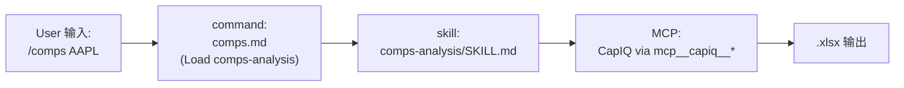

# 07. Commands — 56 个 Slash Command 目录与触发词

> **本节定位** [用户向][开发者向] — 所有 slash command 的目录、按 vertical 分组、两种模板、调用语法。

> **术语外行?** 本章出现的 finance 术语(DCF / LBO / MOIC / IC memo / CIM / NAV / AUM / GP / LP / carry / KYC 等)详见 [`00.5-finance-primer.md`](./00.5-finance-primer.md)。

## TL;DR

- **56 个 slash command**(其中 9 个是独立的 `claude-for-msft-365-install/commands/`,不是 FSI)。
- 调用语法:Cowork / Claude Code 里都是 `/<command> <args>`,**无须 plugin 前缀**(已安装的 plugin 命令直接在 session 里可见)。
- 两种模板:**Slim** (~80%,一句话 "Load X skill") / **Verbose** (frontmatter + Workflow 步骤 + ASCII 输出图 + Quality Checklist)。
- 高频 Top-10:`/comps` `/dcf` `/lbo` `/earnings` `/ic-memo` `/source` `/client-review` `/debug-model` `/catalysts` `/tlh`。
- **fund-admin** 与 **operations** 无 command;**sp-global** 也无 command(LSEG 有 8 个)。

## What you'll learn

- 56 个 slash command 的完整目录
- 调用语法与 `/help` 验证
- Slim vs Verbose 两种 command 模板
- `argument-hint` 与 `allowed-tools` 字段规范
- command vs skill 的核心区别

---

## [用户向] 调用语法

```text
# Cowork / Claude Code session 里直接输入:
/comps AAPL
/dcf MSFT assumptions={"terminal_growth": 0.025}
/ic-memo "<portco name>"
/debug-model ./model.xlsx
```

无需 plugin 前缀:`/comps` 而不是 `/financial-analysis:comps`。

验证安装:输入 `/help` 应该看到新装的 plugin 的所有命令。

---

## [用户向] 两种 command 模板

### Slim(~80%)

最常见的形态。frontmatter + 一句 "Load X skill" + fallback 询问:

```yaml
---
description: Source deals — discover companies and draft founder outreach
argument-hint: "[sector or criteria, e.g. 'industrial services in Texas $10-50M']"
---

Load the `deal-sourcing` skill and run the sourcing pipeline: discover target
companies, check CRM for existing relationships, and draft personalized founder
outreach emails.

If criteria are provided, use them. Otherwise ask the user for sector, size,
geography, and deal parameters.
```

**特征**:

- 整个 body 只有 4–8 行
- 主语统一:"Load the `xxx` skill and run ..."
- fallback 行为统一:"If criteria are provided, use them. Otherwise ask ..."

### Verbose(罕见,~20%)

当 command 内嵌自己的多步流程时用。frontmatter + `# Title` + `## Workflow` + ASCII 输出图 + Quality Checklist:

```yaml
---
description: Analyze quarterly earnings and create an earnings update report
argument-hint: "[company name or ticker] [quarter, e.g. Q3 2024]"
---

# Earnings Analysis Command

[多步流程:Gather Info → Verify Timeliness → Load Skill → Deliver]
[常包含 Quality Layout  + ASCII 输出图]
```

**特征**:

- body 至少 30+ 行
- 有 `### Step 1:` / `### Step 2:` 等分节
- 末尾有 `## Quality Checklist` 章节
- 可能含 `## Output Format` + ASCII 框图(如 `comps.md`)
- 可能含 `## Industry-Specific Metrics` 表格

例子:`comps.md`(read 中看到的 ASCII 框图)、`dcf.md`、`earnings.md`、`ic-memo.md`。

### Partner 风格(LSEG)

```yaml
---
description: Analyze the bond futures basis with CTD identification, implied repo rate, and basis trade assessment
argument-hint: "<bond future RIC e.g. FGBLc1>"
---

# Analyze Bond Futures Basis

> This command uses LSEG bond future pricing, bond pricing, yield curves, and historical data tools.
> See [CONNECTORS.md](../CONNECTORS.md) for available tools.

[多步流程]
```

**特征**:显式引用 partner 文档 `CONNECTORS.md`。

---

## [用户向] 完整命令目录(按 vertical 分组)

### financial-analysis(7 个)

| Command | Argument Hint | 触发 Skill |
|---|---|---|
| `/3-statement-model` | `[path to template file]` | `3-statement-model` |
| `/competitive-analysis` | `[company or industry]` | `competitive-analysis` |
| `/comps` | `[company name or ticker]` | `comps-analysis` |
| `/dcf` | `[company name or ticker]` | `dcf-model` |
| `/debug-model` | `[path to .xlsx model file]` | `audit-xls` |
| `/lbo` | `[company name or deal details]` | `lbo-model` |
| `/ppt-template` | `[path to .pptx or .potx file]` | `ppt-template-creator` |

### investment-banking(7 个)

| Command | Argument Hint | 触发 Skill |
|---|---|---|
| `/buyer-list` | `[company or sector]` | `buyer-list` |
| `/cim` | `[company name]` | `cim-builder` |
| `/deal-tracker` | *(无 args)* | `deal-tracker` |
| `/merger-model` | `[acquirer] acquiring [target]` | `merger-model` |
| `/one-pager` | `[company name or ticker]` | `strip-profile` |
| `/process-letter` | `[IOI or final bid]` | `process-letter` |
| `/teaser` | `[company name]` | `teaser` |

### equity-research(9 个)

| Command | Argument Hint | 触发 Skill |
|---|---|---|
| `/catalysts` | `[timeframe, e.g. 'next 2 weeks']` | `catalyst-calendar` |
| `/earnings` | `[company name or ticker] [quarter, e.g. Q3 2024]` | `earnings-analysis` |
| `/earnings-preview` | `[company ticker]` | `earnings-preview` |
| `/initiate` | `[company ticker]` | `initiating-coverage` |
| `/model-update` | `[company ticker]` | `model-update` |
| `/morning-note` | *(无 args)* | `morning-note` |
| `/screen` | `[screen criteria, e.g. 'undervalued midcap tech']` | `idea-generation` |
| `/sector` | `[sector or industry]` | `sector-overview` |
| `/thesis` | `[company ticker]` | `thesis-tracker` |

### private-equity(10 个)

| Command | Argument Hint | 触发 Skill |
|---|---|---|
| `/ai-readiness` | `[path to quarterly materials folder, or company names]` | `ai-readiness` |
| `/dd-checklist` | `[company name]` | `dd-checklist` |
| `/dd-prep` | `[company name] [meeting type]` | `dd-meeting-prep` |
| `/ic-memo` | `[company name]` | `ic-memo` |
| `/portfolio` | `[company name or path to financial package]` | `portfolio-monitoring` |
| `/returns` | `[company or deal parameters]` | `returns-analysis` |
| `/screen-deal` | `[path to CIM/teaser file]` | `deal-screening` |
| `/source` | `[sector or criteria, e.g. 'industrial services in Texas $10-50M']` | `deal-sourcing` |
| `/unit-economics` | `[company name or path to data]` | `unit-economics` |
| `/value-creation` | `[company name]` | `value-creation-plan` |

### wealth-management(6 个)

| Command | Argument Hint | 触发 Skill |
|---|---|---|
| `/client-report` | `[client name] [period, e.g. Q4 2025]` | `client-report` |
| `/client-review` | `[client name]` | `client-review` |
| `/financial-plan` | `[client name]` | `financial-plan` |
| `/proposal` | `[prospect name]` | `investment-proposal` |
| `/rebalance` | `[client name or account]` | `portfolio-rebalance` |
| `/tlh` | `[client name or account]` | `tax-loss-harvesting` |

### fund-admin(0 个)

```text
(无 commands/)
```

### operations(0 个)

```text
(无 commands/)
```

### lseg(8 个,partner)

| Command | Argument Hint | 触发 Skill |
|---|---|---|
| `/analyze-bond-basis` | `<bond future RIC e.g. FGBLc1>` | `bond-futures-basis` |
| `/analyze-bond-rv` | `<ISIN, RIC, or CUSIP> [vs benchmark]` | `bond-relative-value` |
| `/analyze-fx-carry` | `<currency pair e.g. USDUSD> [tenor e.g. 3M]` | `fx-carry-trade` |
| `/analyze-option-vol` | `<underlying e.g. .SPX or EURUSD> [strike] [expiry]` | `option-vol-analysis` |
| `/analyze-swap-curve` | `<currency e.g. EUR> [index e.g. ESTR]` | `swap-curve-strategy` |
| `/macro-rates` | `<country e.g. US> [timeframe e.g. 5Y]` | `macro-rates-monitor` |
| `/research-equity` | `<ticker e.g. AAPL> [period e.g. FY2024-FY2026]` | `equity-research` |
| `/review-fi-portfolio` | `<ISIN1,ISIN2,...> [scenario e.g. +100bp]` | `fixed-income-portfolio` |

### sp-global(0 个,partner)

```text
(无 commands/ — 通过 tear-sheet / earnings-preview-beta / funding-digest skill 触发)
```

### claude-for-msft-365-install(9 个,独立 admin 族)

| Command | 用途 |
|---|---|
| `/claude-for-msft-365-install:setup` | 交互式 wizard(云资源 / admin consent / manifest) |
| `/claude-for-msft-365-install:manifest` | 生成自定义 add-in manifest XML |
| `/claude-for-msft-365-install:consent` | Azure admin consent URL |
| `/claude-for-msft-365-install:update-user-attrs` | 通过 Graph extension attributes 写 per-user 配置 |
| `/claude-for-msft-365-install:bootstrap` | 构建 bootstrap endpoint |
| `/claude-for-msft-365-install:debug` | 调试部署问题 |
| `/claude-for-msft-365-install:export-data` | 导出聊天历史 / skills / MCP 注册 |
| `/claude-for-msft-365-install:entra-app` | Entra app 配置 |
| `/claude-for-msft-365-install:access-policies` | 访问策略配置(2026-08 新增的 guided command) |

注意:M365 命令用 plugin 前缀(`/claude-for-msft-365-install:setup`),其他 plugin 的命令都直接 `/<command>`。

---

## [用户向] 高频 Top-10

按使用频率估算的 Top-10:

| Rank | Command | 谁用 |
|---|---|---|
| 1 | `/comps AAPL` | 所有分析师 |
| 2 | `/dcf MSFT` | 分析师 / PE |
| 3 | `/lbo "<target>,<deal>"` | PE / IB |
| 4 | `/earnings NVDA Q3 2026` | 股权研究 |
| 5 | `/ic-memo "<portco>"` | PE |
| 6 | `/source "<criteria>"` | PE |
| 7 | `/client-review "<client>"` | WM |
| 8 | `/debug-model ./model.xlsx` | 所有建模者 |
| 9 | `/catalysts "next 2 weeks"` | 股权研究 |
| 10 | `/tlh "<client>"` | WM(年末) |

---

## [用户向] Command vs Skill 的核心区别

| 维度 | Command | Skill |
|---|---|---|
| **触发** | 显式 `/<name>` | 隐式(Claude 自动判断) |
| **写法** | 简短的"Load X skill and run Y" | 完整的 Workflow + Output Format + Quality Checklist |
| **使用门槛** | 用户记得名字 | Claude 根据请求内容判断 |
| **失败处理** | fallback: "ask user" | 通常不让失败,持续推进 |
| **典型场景** | 已知任务、明确触发 | 探索性任务、自动增强 |

一个 Skill **可以被多个 Command 触发**。比如 `comps-analysis` skill 同时被 `/comps`(显式)与"帮我做 comps"(隐式)触发。

### Command vs Skill 的实战选择

| 场景 | 推荐 | 理由 |
|---|---|---|
| 用户已知道想要哪个 analysis | Command | 显式触发,避免 skill 误判 |
| 用户探索性提问 | Skill | 让 Claude 选最合适的 skill |
| 自动化批处理(orchestrator 调) | Skill | 命令需用户输入,skill 可直接调 |
| 一次性临时任务 | Command | 显式比隐式快 |
| 关键合规审计 | Command + Skill | 显式 + 严格 workflow 双重保险 |

### 一个 Command 文件长什么样 — 完整示例

```yaml
---
description: Analyze quarterly earnings and create an earnings update report
argument-hint: "[company name or ticker] [quarter, like Q3 2024]"
allowed-tools: ["Read", "Write", "Glob"]
---

# Earnings Analysis Command

[详细 workflow 段 - Step 1, 2, 3...]
[ASCII 输出框图]
[Quality Checklist]
```

**各字段实战注意**:

- `description`:1 行,在 `/help` 自动补全里显示。短而清晰。
- `argument-hint`:在 `[brackets]` 里,通常带 `like X` 的 example。`/help` 提示用户如何填。
- `allowed-tools`:只在你**真的需要**限制 tool set 时用。大多 command 不加,让 Claude 自由选。
- body:`# Title` + `## Workflow` 多步 + `## Output Format`(ASCII 框图)+ `## Quality Checklist`。

### Slim vs Verbose 怎么选

```text
Slim (~80%):
   - 你想让人"想用某个 skill" -> 显式 trigger
   - skill 已经写得足够详细
   - body < 10 行
   - 例: /source, /screen-deal, /client-review

Verbose (~20%):
   - command 内嵌自己的 workflow(不只 load skill)
   - 含 ASCII 输出框图定义期望形态
   - body 30+ 行,多步
   - 例: /comps, /dcf, /earnings, /ic-memo
```

---

## [开发者向] `argument-hint` 规范

- **始终**在 `[brackets]` 里
- 几乎总是带 example:`[company name or ticker]` / `[quarter, e.g. Q3 2024]`
- 无参数命令用空 hint 或 `(no args)`:`/morning-note`、`/deal-tracker`
- LSEG 用 `<angle brackets>`(特殊风格)
- PE `dd-prep` 用 `[company name] [meeting type]`(多参,空格分隔)

## [开发者向] `allowed-tools` 字段(罕见)

只在 `financial-analysis/commands/ppt-template.md` 等少数命令出现:

```yaml
allowed-tools: ["Read", "Write", "Bash", "Glob"]
```

**用途**:限制该 command 在执行时只能用的工具。白名单以外的 tool 在这次 invocation 里被禁用。

**实战建议**:除非真的需要(比如 PPT 处理需要写文件),否则不要加 `allowed-tools`。大多数命令让 Claude 自由选择工具更灵活。

## [开发者向] Command → Skill → MCP 数据流



调用栈:用户 → command (路由 + 参数解析) → skill (Workflow + 输出格式) → MCP (数据源) → artifact。


## 重要免责声明

> **!IMPORTANT** 本仓库与本 handbook 都不构成投资、法律、税务或会计建议。这些 agent 起草分析师工作产出(模型、备忘录、研究笔记、对账结果),由合格专业人士复核。它们不做投资建议、不执行交易、不承担风险、不入账、不批准 onboarding。每个产物都待人工签字。你负责验证输出与遵守适用的法律法规。

源: `README.md` L7–9(本 handbook 完整镜像此声明)。

## Cross-references

- 完整 20 插件 → `./03-marketplace-catalog.md`
- 每个 vertical 内部细节 → `./05-verticals.md`
- 每个 agent 用什么 skill → `./06-agents.md`
- skill 三种 archetype → `./08-skills.md`

## Source files

- 各 vertical `commands/*.md` × 47
- `plugins/partner-built/lseg/commands/*.md` × 8
- `claude-for-msft-365-install/commands/*.md` × 9
- 抽样读过的:`comps.md` (verbose 模板 + ASCII 框图)、`source.md` (slim 模板)