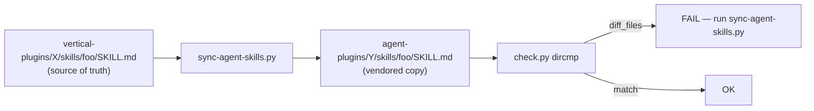

# 08. Skills — 66 个 Skill 目录与三种 archetype(55 vertical + 11 partner)

> **本节定位** [用户向][开发者向] — 全部 skill 的目录、frontmatter 字段、3 种 archetype、触发机制、写作模板。

> **术语外行?** 本章出现的 finance 术语(DCF / LBO / MOIC / IC memo / CIM / NAV / AUM / GP / LP / carry / KYC 等)详见 [`00.5-finance-primer.md`](./00.5-finance-primer.md)。

## TL;DR

- **66 个独特 skill**(55 vertical + 11 partner,总 SKILL.md 文件 ~88,因为 agent bundles 有 vendored 副本)。
- 每个 `SKILL.md` = YAML frontmatter(`name` + `description`) + `# Title` + Workflow + 输出格式 + Quality Checklist。
- **frontmatter `description`** 必须含 **Perfect for** 与 **Not ideal for** 两段,这是 Claude 决定是否加载 skill 的关键。
- **3 种 archetype**:**Research-style**(workflow 多步 + tables 承载 output)、**Audit-style**(Critical/Warning/Info + findings 表格)、**Workflow/agent-style**(pipeline 三步 + `<untrusted_document>` 包裹)。
- **数据源优先级**:**MCP 优先**,绝不 web search 替代(除非 MCP 都不可用)。

## What you'll learn

- SKILL.md frontmatter 字段
- skill 自动触发的原理
- 3 种 archetype 的结构特征与代表
- ASCII 输出框图与环境分支
- vendor 同步机制(vertical → agent bundles)
- 写新 skill 的完整步骤

---

## [用户向] SKILL.md frontmatter 字段

`plugins/vertical-plugins/<v>/skills/<slug>/SKILL.md` 顶部:

```yaml
---
name: comps-analysis
description: |
  Build institutional-grade comparable company analyses with operating
  metrics, valuation multiples, and statistical benchmarking in
  Excel/spreadsheet format.

  **Perfect for:**
  - Public company valuation (M&A, investment analysis)
  - Benchmarking performance vs. industry peers
  - Pricing IPOs or funding rounds
  - Identifying valuation outliers
  - Supporting investment committee presentations
  - Creating sector overview reports

  **Not ideal for:**
  - Private companies without comparable public peers
  - Highly diversified conglomerates
  - Distressed/bankrupt companies
  - Pre-revenue startups
  - Companies with unique business models
---
```

| 字段 | 含义 |
|---|---|
| `name` | 大多数与目录名一致。**已知差异**:`strip-profile/` 目录的 frontmatter 是 `fsi-strip-profile`,`earnings-preview-beta/` 是 `earnings-preview-single` |
| `description` | 多行 `\|` block,**含 Perfect for 与 Not ideal for 两段** + 触发短语列表(隐式,如 "sector overview", "industry report", "market landscape") |
| 可选 `license` | 第三方依赖标注。skill-creator 有 `LICENSE.txt` 文件作为 reference |

**`description` 是触发的关键** — Claude 把它与你 session 里的请求做语义匹配,命中度高就加载整个 SKILL.md。所以写得越具体、列出越多的 Perfect for / 触发短语,被自动触发的概率越高。

## [用户向] skill 触发机制


具体过程:

1. session 开始时,Claude 拿到所有已装 skill 的 frontmatter `description` 文本
2. 用户每次请求都做语义匹配
3. 命中就加载该 SKILL.md 全文,按里面的 Workflow 跑
4. 整个 SKILL.md 加载后才进 context,**所以 description 写得越精确越好**(避免加载太多无关 SKILL.md)

**两种触发路径**:

- **隐式(自动)**:用户说自然语言,Claude 判断
- **显式**:command 文件里 "Load the `xxx` skill and run ..."

```yaml
# command 文件里的显式触发:
Use `skill: "comps-analysis"` to build the analysis:
```

或:

```yaml
Load the `deal-sourcing` skill and run the sourcing pipeline.
```

### 触发匹配的精度权衡

frontmatter `description` 写得越具体,触发越精确;但**太长反而降低召回率**(Claude 找不到精确匹配)。经验值:

```text
理想 description: 1-3 行,含:
   - 一行核心能力
   - 3-5 个 Perfect for 触发短语
   - 3-5 个 Not ideal for 反例
   - 1-3 个 fallback / "Use when..." 触发

反例:
   太短: "Audit spreadsheets"  -- 没指明 scope
   太长: 整段介绍        -- Claude 找不到重点
   太模糊: "Excel helper"  -- 触发不到具体 skill
```

实战:`audit-xls` 的 description 含 `"audit spreadsheets", "formula accuracy", "model integrity", "model review"` 等触发短语 — Claude 看到"帮我审一下 BS 平衡"会同时匹配多个短语,提高命中概率。

### 多个 skill 同时命中怎么办?

有时一次请求会匹配多个 skill。例如"audit my DCF and also pull comps" 同时命中 `audit-xls` + `comps-analysis`。Claude 默认顺序执行(workflow 内一个接一个),但不保证顺序。**实战**:用 command 文件显式编排:

```yaml
# commands/dcf-with-audit.md
description: Build a DCF and audit it
argument-hint: "[ticker]"

# 1. Load comps-analysis to get peer set
# 2. Load dcf-model to build the model
# 3. Load audit-xls to verify
# 4. Produce final .xlsx
```

这样保证顺序与覆盖。

---

## [用户向] 3 种 archetype

### Research-style(`sector-overview` / `earnings-analysis` / `morning-note`)

```text
结构特征:
  - Workflow 多步(### Step 1: ... / ### Step 2: ...)
  - tables 承载 output contract("Operating Statistics" table 等)
  - "Important Notes" / "Guardrails" 收尾
  - 时长/页数目标(如 "8-12 pages, 3,000-5,000 words")
  - 引用机构(JPM / GS / MS)

代表:
  - sector-overview (market-researcher)
  - earnings-analysis (earnings-reviewer)
  - morning-note (equity-research)
  - initiating-coverage (equity-research)
  - cim-builder (investment-banking)
  - pitch-deck (investment-banking)
  - thesis-tracker (equity-research)
  - competitive-analysis (financial-analysis)
```

### Audit / code-review style(`audit-xls`)

```text
结构特征:
  - Critical / Warning / Info 三级 severity
  - findings 表格(severity / sheet / cell / category / issue / fix)
  - statement-by-statement checks
  - "Don't change anything without asking"
  - 明确 refusal("report first, fix on request")

代表:
  - audit-xls (financial-analysis)   <- 唯一原型的"审计"skill,约 157 行
  - ib-check-deck (financial-analysis)
  - gl-recon (fund-admin)
  - break-trace (fund-admin)
  - kyc-rules (operations)
```

`audit-xls` 的标准输出格式:

```text
| # | Sheet   | Cell/Range | Severity  | Category  | Issue                       | Suggested Fix           |
|---|---------|------------|-----------|-----------|------------------------------|-------------------------|
| 1 | BS      | D28         | Critical  | Balance   | Assets != Liab + Equity      | Re-link D28             |
| 2 | CF      | C15         | Warning   | Tie-out   | CF ending != BS cash change  | Adjust WC line D22      |
| 3 | Assump. | B5          | Info      | Hardcode  | Discount rate w/o source     | Add cell comment        |
```

### Workflow / agent style(`deal-sourcing` / `kyc-doc-parse` / `data-puller`)

```text
结构特征:
  - Pipeline 3+ 步(Discover → CRM Check → Draft Outreach)
  - Untrusted boundary 用 <untrusted_document> 标记
  - 严格 approval gates("Never send without explicit user approval")
  - Voice-matching("match prior outreach emails from Gmail")
  - 末尾"Iron Rules"或"Never do"清单

代表:
  - deal-sourcing (private-equity)      <- "Never send emails without explicit user approval"
  - kyc-doc-parse (operations)         <- <untrusted_document>...</untrusted_document>
  - earnings-analysis 接近此 archetype
  - 任何 agent 用的 skill
```

## [用户向] ASCII 输出框图(常见 pattern)

`comps.md`(command)含 ASCII 框图作为期望输出:

```text
+-------------------------------------------------------+
|  [SECTOR] - COMPARABLE COMPANY ANALYSIS              |
|  [Company 1] * [Company 2] * [Company 3] * [Co 4]   |
|  As of [Date] | All figures in USD Millions           |
+-------------------------------------------------------+
|  OPERATING STATISTICS & FINANCIAL METRICS            |
+----------+---------+---------+----------+----------+
| Company  | Revenue | Growth  | Gross    | EBITDA  |
|          | (LTM)   | (YoY)   | Margin   | (LTM)   |
+----------+---------+---------+----------+----------+
| [Data rows for each company]                         |
|                                                      |
| Maximum  | =MAX    | =MAX    | =MAX     | =MAX    |
| 75th %   | =QUART  | =QUART  | =QUART   | =QUART  |
| Median   | =MEDIAN | =MEDIAN | =MEDIAN  | =MEDIAN |
| 25th %   | =QUART  | =QUART  | =QUART   | =QUART  |
| Minimum  | =MIN    | =MIN    | =MIN     | =MIN    |
+----------+---------+---------+----------+----------+
```

这种 ASCII 框图让 Claude 知道期望产出的形态,**不是装饰**。

## [用户向] 环境分支 — 同一 skill 三种环境的写法

同一个 skill 可能需要在三种环境下运行:

```text
环境 A: Office Add-in / Office JS
环境 B: Cowork (chat)
环境 C: Managed Agent (headless, python-pptx / openpyxl)
```

例如 `comps-analysis` skill 顶部:

```text
**Environment — Office JS vs Python:**

- If running inside Excel (Office Add-in / Office JS):
  Use Office JS directly:
    Excel.run(async (context) => {...})
  Write formulas via range.formulas = [["=E7/C7"]], NOT range.values
  No separate recalc step — Excel handles it natively

- If running headless (Managed Agent):
  Use Python with openpyxl:
    from openpyxl import Workbook
    wb = Workbook()
    ws = wb.active
    ws['A1'] = "=E7/C7"  # write formula as string
  Excel opens it and recalcs on open

- If in chat / Cowork:
  Usually uses Python via Bash
```

**关键原则**:

- Office JS:**用 `range.formulas` 而不是 `range.values`**,否则丢失公式
- Headless Python:`=E7/C7` 写为字符串,Excel 打开时重算
- 蓝色 = inputs / 黑色 = formulas(约定)

## [用户向] 数据源优先级(摘自 `comps-analysis`)

```text
1. FIRST: Check for MCP data sources
       (CapIQ / FactSet / Daloopa / Kensho)
       Use them exclusively.

2. DO NOT use web search if MCPs available.

3. ONLY if MCPs unavailable:
       Bloomberg Terminal / SEC EDGAR filings / institutional sources

4. NEVER use web search as PRIMARY data source:
       - Lacks accuracy, audit trails, reliability for institutional work
```

每个 financial skill 都遵循这个优先级。改 skill 时不要绕开它。

## [开发者向] vendor 同步机制



**正确编辑顺序**(铁律):

```text
1. 在 vertical 改 SKILL.md:
       plugins/vertical-plugins/<v>/skills/<slug>/SKILL.md

2. 跑:
       python3 scripts/sync-agent-skills.py

3. 校验:
       python3 scripts/check.py

4. 若 check.py 还在报漂移,看哪个 skill 没同步上,再跑一次
```

不要直接在 `agent-plugins/Y/skills/foo/` 里改 — 会被下次 sync 覆盖。

## [开发者向] 写新 skill 的完整步骤

```text
1. 选 vertical
       plugins/vertical-plugins/<existing-vertical>/skills/<new-slug>/

2. 创建目录
       mkdir -p plugins/vertical-plugins/<v>/skills/<new-slug>/

3. 写 SKILL.md
       frontmatter:
         name: <new-slug>
         description: |
           <一行 trigger-rich description>
           **Perfect for:**
           - <list>
           > **Not ideal for:**
           - <list>
       body:
         # <Title>
         ## Overview
         ## Workflow (### Step 1: ...)
         ## Output Format (with ASCII)
         ## Important Notes

4. 可选:TROUBLESHOOTING.md
5. 可选:requirements.txt (Python deps)
6. 可选:examples/

7. 若 agent 需要捆绑:
       python3 scripts/sync-agent-skills.py

8. 校验:
       python3 scripts/check.py

9. pre-commit hook 自动 patch bump version
10. PR
```

复制现成 skill 做模板:

```bash
# 用 financial-analysis 下的 skill-creator 作为 meta-template
ls plugins/vertical-plugins/financial-analysis/skills/skill-creator/
# 读 SKILL.md 全文 — 它本身就是 "怎么写 skill" 的指南
```

## [开发者向] frontmatter `name` 与目录名不一致的已知案例

| 目录名 | frontmatter `name` | 来源 |
|---|---|---|
| `strip-profile/` | `fsi-strip-profile` | investment-banking(早期 internal name) |
| `earnings-preview-beta/` | `earnings-preview-single` | sp-global partner(目录带 `-beta` 后缀,frontmatter 用单数) |

**根因**:这是历史遗留 — 重命名时改了目录但没同步改 frontmatter。Claude 加载时**用目录名**而非 frontmatter `name`,所以**实际功能不受影响**,只是 metadata 不一致。

新增 skill 时**保持一致**(目录名 = frontmatter `name`)。

## [用户向] 完整 skill 目录(按 vertical 分组)

### financial-analysis(13)

`3-statement-model` · `audit-xls` · `clean-data-xls` · `competitive-analysis` · `comps-analysis` · `dcf-model` · `deck-refresh` · `ib-check-deck` · `lbo-model` · `ppt-template-creator` · `pptx-author` · `skill-creator` · `xlsx-author`

### investment-banking(9)

`buyer-list` · `cim-builder` · `datapack-builder` · `deal-tracker` · `merger-model` · `pitch-deck` · `process-letter` · `strip-profile` · `teaser`

### equity-research(9)

`catalyst-calendar` · `earnings-analysis` · `earnings-preview` · `idea-generation` · `initiating-coverage` · `model-update` · `morning-note` · `sector-overview` · `thesis-tracker`

### private-equity(10)

`ai-readiness` · `dd-checklist` · `dd-meeting-prep` · `deal-screening` · `deal-sourcing` · `ic-memo` · `portfolio-monitoring` · `returns-analysis` · `unit-economics` · `value-creation-plan`

### wealth-management(6)

`client-report` · `client-review` · `financial-plan` · `investment-proposal` · `portfolio-rebalance` · `tax-loss-harvesting`

### fund-admin(6)

`accrual-schedule` · `break-trace` · `gl-recon` · `nav-tieout` · `roll-forward` · `variance-commentary`

### operations(2)

`kyc-doc-parse` · `kyc-rules`

### lseg(8)

`bond-futures-basis` · `bond-relative-value` · `equity-research` · `fixed-income-portfolio` · `fx-carry-trade` · `macro-rates-monitor` · `option-vol-analysis` · `swap-curve-strategy`

### sp-global(3)

`earnings-preview-beta` · `funding-digest` · `tear-sheet`


## 重要免责声明

> **!IMPORTANT** 本仓库与本 handbook 都不构成投资、法律、税务或会计建议。这些 agent 起草分析师工作产出(模型、备忘录、研究笔记、对账结果),由合格专业人士复核。它们不做投资建议、不执行交易、不承担风险、不入账、不批准 onboarding。每个产物都待人工签字。你负责验证输出与遵守适用的法律法规。

源: `README.md` L7–9(本 handbook 完整镜像此声明)。

## Cross-references

- command → skill → MCP 数据流 → `./07-commands.md`
- 每个 vertical 配哪些 skill → `./05-verticals.md`
- 每个 agent 用哪些 skill → `./06-agents.md`
- 加新 skill 的完整流程 → `./12-development-workflow.md`

## Source files

- 各 vertical/partner `skills/*/SKILL.md` × 66(55 vertical + 11 partner)
- `plugins/vertical-plugins/financial-analysis/skills/skill-creator/SKILL.md`(meta-template)
- `plugins/vertical-plugins/financial-analysis/skills/audit-xls/SKILL.md`(audit archetype 原型)
- `plugins/vertical-plugins/financial-analysis/skills/comps-analysis/SKILL.md`(research archetype + ASCII 输出图 + 数据源优先级)
- `plugins/vertical-plugins/financial-analysis/skills/xlsx-author/SKILL.md`(Python openpyxl 模板)
- `plugins/vertical-plugins/financial-analysis/skills/pptx-author/SKILL.md`(Python python-pptx 模板)
- `scripts/sync-agent-skills.py`(vendor 同步实现)
- `scripts/check.py`(L142–159,bundled-skill drift 检测)