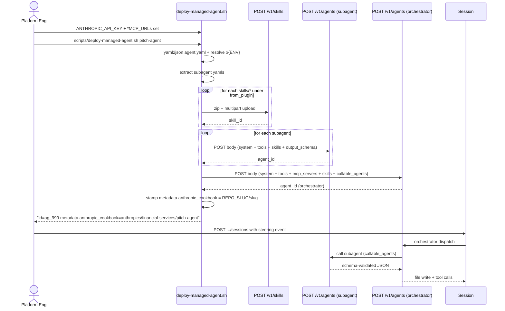
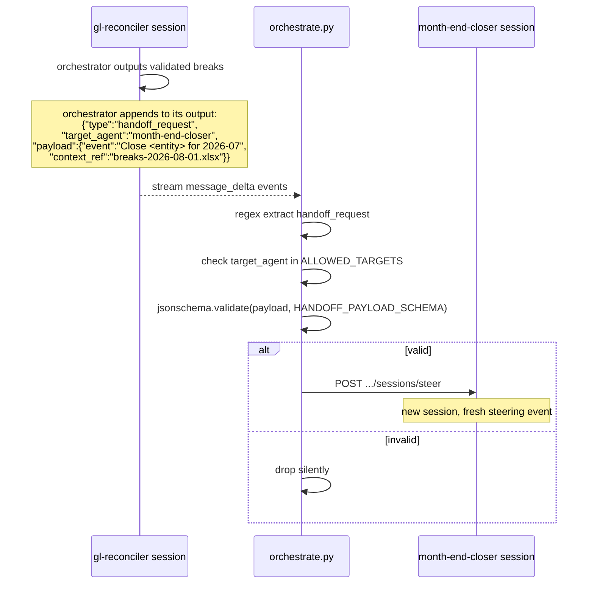

# 09. Managed Agent 部署实战 — Cookbook Schema、subagent、Handoff

> **本节定位** [用户向][开发者向] — cookbook 是仓库的"headless"另一半。这章讲完整 schema、Write-holder 模式、`output_schema` 安全、跨 agent handoff 路由器,以及部署流水线。

> **术语外行?** 本章出现的 finance 术语(DCF / LBO / MOIC / IC memo / CIM / NAV / AUM / GP / LP / carry / KYC 等)详见 [`00.5-finance-primer.md`](./00.5-finance-primer.md)。

## TL;DR

- **10 个 cookbook** = 10 个 agent 的 Managed Agent 部署清单。每个 cookbook = `agent.yaml + subagents/*.yaml + steering-examples.json + README.md`。
- **每个 cookbook 恰好一个 Write-holder subagent**(其他都只读,depth-1 leaf worker)。
- **`output_schema`** 强制 reader 输出 JSON 结构(`additionalProperties: false` + `maxLength` + `pattern` + `maxItems`),防 prompt injection 落地。
- **跨 agent handoff** 经 `handoff_request` JSON 事件 → `scripts/orchestrate.py` allowlist + jsonschema 校验 → 新 session。
- **部署脚本** `scripts/deploy-managed-agent.sh <slug>` 处理 env 变量(字符类 `[A-Za-z0-9._/:@-]`)、skill 上传、subagent 创建、orchestrator 创建、metadata 标记。

## What you'll learn

- cookbook 与 Cowork 插件的核心区别
- `agent.yaml` 字段详解
- `subagents/*.yaml` 字段详解
- `output_schema` 的安全意义
- Write-holder 模式 + 为什么恰好一个
- `steering-examples.json` 结构
- 跨 agent handoff 的完整流程
- 部署脚本的内部步骤
- 10 个 cookbook 的子代理拓扑对比

---

## [用户向] Cookbook 与 Cowork 插件的区别

| 维度 | Cowork 插件 | Managed Agent cookbook |
|---|---|---|
| **运行环境** | SaaS / Cowork UI | 企业后端(`POST /v1/agents`) |
| **交互模式** | 交互式(对话) | Headless(session + steering events) |
| **系统提示词** | `agents/<slug>.md` 直接读 | `system.file: ../../plugins/agent-plugins/<slug>/agents/<slug>.md` |
| **Skills** | 同 vertical 的 skills/ 自动可用 | `skills: [{from_plugin: ...}]` 上传,引用 skill_id |
| **MCP** | `.mcp.json` 自动注册 | `mcp_servers` + `mcp_toolset` 显式声明 |
| **多 agent 编排** | 受限于 session | **原生支持**(`callable_agents` + `handoff_request`) |
| **可观测** | Cowork UI | workflow engine 看 session events |

**一句话区别**:Cowork 插件是 SaaS 化封装,cookbook 是 raw API 部署清单。两者**共享同一份源文件**(`agents/<slug>.md`)。

## [用户向] 完整 walkthrough — 部署 gl-reconciler

```bash
# 1. 设置环境变量
export ANTHROPIC_API_KEY=sk-ant-...
export GL_MCP_URL=https://your-internal-gl-mcp.example/mcp
export SUBLEDGER_MCP_URL=https://your-subledger-mcp.example/mcp

# 2. 跑部署脚本
scripts/deploy-managed-agent.sh gl-reconciler

# 脚本输出(精简):
# [skills] uploading skills/gl-recon ... -> skill_id=sk_aaa
# [skills] uploading skills/break-trace ... -> skill_id=sk_bbb
# [skills] uploading skills/audit-xls ... -> skill_id=sk_ccc
# [skills] uploading skills/xlsx-author ... -> skill_id=sk_ddd
# [subagent] creating reader   -> agent_id=ag_111
# [subagent] creating critic   -> agent_id=ag_222
# [subagent] creating resolver -> agent_id=ag_333
# [orchestrator] POST /v1/agents -> agent_id=ag_999
# [cookbook] anthropics/financial-services/gl-reconciler deployed
#   id=ag_999  model=claude-opus-4-7
#   metadata.anthropic_cookbook=anthropics/financial-services/gl-reconciler

# 3. 从 workflow engine 推一个 steering event
curl -X POST $API/v1/sessions \
  -H "x-api-key: $ANTHROPIC_API_KEY" \
  -H "anthropic-version: 2023-06-01" \
  -H "anthropic-beta: managed-agents-2026-04-01" \
  -H "content-type: application/json" \
  -d '{
    "agent": "ag_999",
    "environment_id": "env_default",
    "initial_events": [
      {"type": "user", "content": "Reconcile GL vs subledger, trade date 2026-08-01, classes: [Equity, FX]"}
    ]
  }'

# 4. 你的 workflow engine 订阅 session events:
#    - message_delta(检查 handoff_request)
#    - tool_call(看 orchestrator 怎么调 subagent)
#    - file_write(看到 resolver 写 ./out/<date>.xlsx)

# 6. 输出文件: ./out/breaks-2026-08-01.xlsx
```

## [开发者向] `agent.yaml` 字段详解

```yaml
name: pitch-agent                       # 必须,slug
model: claude-opus-4-7                  # 必须,模型 ID
system:                                 # 必须,系统提示词
  file: ../../plugins/agent-plugins/pitch-agent/agents/pitch-agent.md
  append: "You are running headless. Produce files in ./out/; do not assume an open Office document."
tools:                                  # 工具白名单
  - type: agent_toolset_20260401        # Claude Code tool
    default_config: { enabled: false }  # 默认禁用所有
    configs:                            # 显式启用
      - { name: read,  enabled: true }
      - { name: grep,  enabled: true }
      - { name: glob,  enabled: true }
  - type: mcp_toolset                   # MCP tool
    mcp_server_name: capiq
    default_config: { enabled: true }
mcp_servers:                            # MCP server 声明
  - { type: url, name: capiq,   url: "${CAPIQ_MCP_URL}" }
  - { type: url, name: daloopa, url: "${DALOOPA_MCP_URL}" }
skills:                                 # Skill 引用
  - { from_plugin: ../../plugins/agent-plugins/pitch-agent }
callable_agents:                        # 可调用的 subagent
  - { manifest: ./subagents/researcher.yaml }
  - { manifest: ./subagents/modeler.yaml }
  - { manifest: ./subagents/deck-writer.yaml }
```

### system 三种写法

```yaml
# A. 引用源文件(常用)
system:
  file: ../../plugins/agent-plugins/<slug>/agents/<slug>.md
  append: "You are running headless..."

# B. 内联文本
system:
  text: |
    You are a senior IB associate...

# C. 引用 + 拼接(最常见)
system:
  file: ...
  append: "..."
```

`scripts/deploy-managed-agent.sh` 在部署时把 `file` 路径的内容读出来,加上 `append`,拼成一个字符串塞到 `POST /v1/agents` 的 `system` 字段。

### skills 两种写法

```yaml
# A. 整个 plugin 目录下的 skills 都上传
skills:
  - { from_plugin: ../../plugins/agent-plugins/pitch-agent }

# B. 单个 skill 路径
skills:
  - { path: ../../plugins/agent-plugins/pitch-agent/skills/dcf-model }
```

部署脚本会把 `skills/*` 下每个 skill 打成 zip,`POST /v1/skills` 上传,记下 `skill_id` 缓存,最后 orchestrator 引用这些 id。

### callable_agents 写法

```yaml
callable_agents:
  - { manifest: ./subagents/researcher.yaml }
```

部署脚本会**先创建 subagent**,记下 agent_id 与 version,然后 orchestrator 用:

```json
{ "type": "agent", "id": "<created-id>", "version": "latest" }
```

引用。

## [开发者向] `subagents/*.yaml` 字段详解

```yaml
name: pitch-researcher                  # 必须
model: claude-opus-4-7                  # 必须
system:
  text: |                               # 内联系统提示词
    You research comps and precedent transactions for a target.
    Pull trading multiples and precedent data from CapIQ/Daloopa.
    Read-only — you do not write files.
tools:                                  # 通常只 read/grep
  - type: agent_toolset_20260401
    default_config: { enabled: false }
    configs:
      - { name: read, enabled: true }
      - { name: grep, enabled: true }
mcp_servers: []                         # [] = no MCP
skills: []                              # [] = no bundled skill
callable_agents: []                     # [] = depth-1 leaf
output_schema:                          # 输出 JSON 强约束
  type: object
  required: [target, comps]
  additionalProperties: false
  properties:
    target: { type: string, maxLength: 64, pattern: "^[A-Za-z0-9 ._-]+$" }
    comps:
      type: array
      maxItems: 30
      items:
        type: object
        additionalProperties: false
        properties:
          ticker:   { type: string, maxLength: 12, pattern: "^[A-Z.]+$" }
          metric:   { type: string, maxLength: 32, pattern: "^[A-Za-z0-9 /_-]+$" }
          value:    { type: number }
```

**关键约束**:

| 字段 | 用途 |
|---|---|
| `mcp_servers: []` | 不接外部数据,降低风险 |
| `skills: []` | 不带 skill,纯任务角色 |
| `callable_agents: []` | depth-1 leaf,**不再调别的 agent** |
| `output_schema` | 强制 JSON 输出(下详) |
| `tools: read+grep only` | 只读,不可写文件、不可 bash |

## [开发者向] `output_schema` 的安全意义

`output_schema` 是**安全 load-bearing 块**。`scripts/validate.py` 在 reader subagent 与 orchestrator 之间做 JSON schema 校验。

防护场景(摘自 `scripts/orchestrate.py` L9–14 注释):

```text
Security note: handoff requests are surfaced in the orchestrator's text output,
which is downstream of untrusted-document readers. An attacker who controls a
processed document could embed a literal handoff_request blob that, if echoed,
would be parsed here. This script mitigates by (a) hard-allowlisting
target_agent against the deployed slugs and (b) schema-validating the payload
before steering.
```

**攻击路径**:reader 读一个 attacker 控制的 PDF → PDF 里藏一个 `{"type":"handoff_request", ...}` 字符串 → reader 把它"原样回显"到 orchestrator → orchestrator 在自己输出里 echo → handoff 路由器 grep 这个 JSON → 触发 attacker 想要的 handoff。

`output_schema` 防御:**reader 的输出 JSON 字段值都是 `^[A-Za-z0-9 ._-]+$` regex + `maxLength`** — 即使 reader 输出被污染,字段值只能含这些字符,无法在 JSON 里塞进完整的 handoff_request 字符串。

**实际 cookbook 中的 output_schema 示例**(gl-reconciler/reader):

```yaml
output_schema:
  type: object
  required: [breaks]
  additionalProperties: false
  properties:
    breaks:
      type: array
      maxItems: 1000
      items:
        type: object
        additionalProperties: false
        properties:
          trade_id:  { type: string, maxLength: 32, pattern: "^[A-Za-z0-9_-]+$" }
          amount:    { type: number }
          source:    { type: string, maxLength: 16, enum: ["gl", "subledger"] }
```

每个 string 字段:`maxLength` + `pattern` / `enum`,数组 `maxItems`,object `additionalProperties: false`。

## [开发者向] Write-holder 模式 — 为什么恰好一个

```text
cookbook 内部三层:
  Tier A: Reader(s)        <- 只读,可以触达 untrusted docs
  Tier B: Critic / Builder  <- 中间层,可以算/批
  Tier C: Write-holder      <- 唯一有 write 权限的 worker

安全理由:
  - Tier A worker 处理 untrusted 输入
  - Tier A 的输出经 output_schema 校验
  - 只有 Tier C 能落地文件
  - 即使 attacker 攻破 Tier A,也只能污染结构化 JSON
  - Tier C 写文件时基于已校验的 JSON,而非原文
```

**Write-holder 名字清单**(每个 cookbook 一个):

| cookbook | Write-holder |
|---|---|
| `pitch-agent` | `deck-writer` |
| `market-researcher` | `note-writer` |
| `earnings-reviewer` | `note-writer` |
| `meeting-prep-agent` | `pack-writer` |
| `model-builder` | `builder` |
| `gl-reconciler` | `resolver` |
| `month-end-closer` | `poster` |
| `statement-auditor` | `flagger` |
| `valuation-reviewer` | `publisher` |
| `kyc-screener` | `escalator` |

写新 cookbook 时也必须遵循这个模式。

## [开发者向] `steering-examples.json` 结构

每个 cookbook 自带:

```json
[
  { "event": "Build pitch book: target CRWD, acquirer PANW, thesis: platform consolidation in security", "description": "Single-target pitch with stated thesis" },
  { "event": "Build pitch book: target SNOW, situation: exploring strategic alternatives", "description": "Sell-side pitch, no named acquirer" },
  { "event": "Refresh comps and football field only for target CRWD", "description": "Follow-up steering event after MD feedback" }
]
```

每个 cookbook 通常有 2–3 个示例:

1. **标准 kickoff**:覆盖常见 happy path
2. **变体**:不同参数(无 acquirer / 部分完成 / 跳过某步骤)
3. **follow-up**:MD feedback 后微调

**实战用法**:

```bash
# 把示例 event 直接 POST 到 session:
curl -X POST $API/v1/sessions \
  -H "x-api-key: $ANTHROPIC_API_KEY" \
  -H "anthropic-version: 2023-06-01" \
  -H "anthropic-beta: managed-agents-2026-04-01" \
  -H "content-type: application/json" \
  -d @managed-agent-cookbooks/pitch-agent/steering-examples.json
```

或在你的 workflow engine 里直接 hardcode 这几个 event 当作 fixture。

## [开发者向] 部署流水线(Mermaid)



## [开发者向] 跨 agent handoff(Mermaid)



`ALLOWED_TARGETS`(`scripts/orchestrate.py` L23–27):

```python
ALLOWED_TARGETS = {
    "pitch-agent", "market-researcher", "earnings-reviewer", "meeting-prep-agent",
    "model-builder", "gl-reconciler", "kyc-screener",
    "valuation-reviewer", "month-end-closer", "statement-auditor",
}
```

**两个互补防线**:

1. **Allowlist**(cheap):即使 JSON 通过 schema,target 必须在已部署的 agent slug 集合里
2. **Schema**(deeper):payload 必须满足 `{"event": str maxLength 2000, "context_ref": str maxLength 256 pattern}`

## [开发者向] 10 Cookbook 子代理拓扑对比

| cookbook | Reader(s) | Critic / Builder | Write-holder |
|---|---|---|---|
| `pitch-agent` | `researcher` (CapIQ/Daloopa) | `modeler` (bash sandbox) | **`deck-writer`** |
| `market-researcher` | `sector-reader` | `comps-spreader` | **`note-writer`** |
| `earnings-reviewer` | `transcript-reader` | `model-updater` | **`note-writer`** |
| `meeting-prep-agent` | `profiler`, `news-reader` | (无) | **`pack-writer`** |
| `model-builder` | `data-puller` | **`builder`** (含 bash) | **`builder`** |
| `gl-reconciler` | `reader` (untrusted docs) | `critic` | **`resolver`** |
| `month-end-closer` | `ledger-reader` (untrusted) | `rollforward` | **`poster`** |
| `statement-auditor` | `statement-reader` (untrusted) | `reconciler` | **`flagger`** |
| `valuation-reviewer` | `package-reader` (untrusted) | `valuation-runner` | **`publisher`** |
| `kyc-screener` | `doc-reader` (untrusted) | `rules-engine` | **`escalator`** |

### untrusted docs 分类

按是否能接触"外部可控文档"分类:

```text
安全输入类 (trusted MCP):
   pitch-agent           researcher 用 CapIQ/Daloopa MCP
   market-researcher     sector-reader 用 CapIQ/Factset MCP
   earnings-reviewer     model-updater 用 FactSet/Daloopa MCP
   model-builder         data-puller 用 CapIQ/Daloopa MCP
   meeting-prep-agent    profiler 用 CRM + CapIQ MCP

不可信文档类 (untrusted, 必须 reader+grep only):
   gl-reconciler         reader 读 custodian/counterparty statements
   month-end-closer      ledger-reader 读 vendor statements
   statement-auditor     statement-reader 读 LP statements
   valuation-reviewer    package-reader 读 GP packages
   kyc-screener          doc-reader 读 onboarding packets
```

后者是安全威胁模型的着力点**:untrusted doc 可能藏 prompt injection。Reader 唯一输出是 schema-validated JSON,不接 MCP 不写文件。

### model-builder 是个例外

`model-builder` 的 builder subagent **同时**有 `write` 与 `bash` 工具,且与 orchestrator 不一样。这是因为 model-builder 的 build 阶段需要用 Python(沙箱内)算估值。`builder` 仍是 Write-holder,但它有 bash 能力来跑 Python 计算 — 其他 cookbook 不允许。

理由:model-builder 处理的是机构数据(MCP),不是 untrusted 文档。bash sandbox 是隔离环境。所以 `builder` 同时是 critic 与 writer,简化拓扑。

## [开发者向] Cookbook 设计的红线

1. **depth-1 严格** — subagent 的 `callable_agents: []` 必须空列表。Orchestrator → worker,**worker 不调 worker**。`scripts/test-cookbooks.sh` 会强制检查。
2. **output_schema 必填** — 任何 reader 角色的 subagent 必须有 `output_schema`,否则 untrusted 输入可以注入恶意 JSON。
3. **Write-holder 唯一** — 整个 cookbook 只有一个 worker 有 `write` 工具。多个 writer 会让 security tier 失效。
4. **orchestrator 无 write** — orchestrator(顶层 agent.yaml)只用 `read/grep/glob`,不直接落文件。所有文件由 Write-holder 出。
5. **untrusted docs 只到 reader** — 只有触达外部文档的 worker 才能 `read + grep`,其他 worker 都通过 schema-validated JSON 接收数据。


## 重要免责声明

> **!IMPORTANT** 本仓库与本 handbook 都不构成投资、法律、税务或会计建议。这些 agent 起草分析师工作产出(模型、备忘录、研究笔记、对账结果),由合格专业人士复核。它们不做投资建议、不执行交易、不承担风险、不入账、不批准 onboarding。每个产物都待人工签字。你负责验证输出与遵守适用的法律法规。

源: `README.md` L7–9(本 handbook 完整镜像此声明)。

## Cross-references

- 每个 agent 的安全 tier 与 Write-holder 名 → `./06-agents.md`
- MCP server 列表与 URL → `./10-mcp-connectors.md`
- 部署脚本源码与参数 → `./01-quickstart.md#用户向-路径-c-部署托管-agent`
- 加新 cookbook 的流程 → `./12-development-workflow.md`
- 排错(deploy 失败 / handoff 被拒 / schema 校验失败)→ `./13-troubleshooting.md`

## Source files

- `managed-agent-cookbooks/<slug>/{agent.yaml, README.md, steering-examples.json}` × 10
- `managed-agent-cookbooks/<slug>/subagents/*.yaml` × 30
- `managed-agent-cookbooks/README.md`(10 agent 总览 + manifest vs API 转换表 + handoff threat model)
- `scripts/deploy-managed-agent.sh`(L1–L182,部署流水线完整实现)
- `scripts/orchestrate.py`(L1–L89,handoff router + ALLOWED_TARGETS + HANDOFF_PAYLOAD_SCHEMA)
- `scripts/validate.py`(L1–L43,子代理 JSON schema 校验)
- `scripts/test-cookbooks.sh`(批量 dry-run,验证 depth-1 与无 output_schema 泄露)