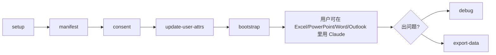

# 11. Claude for Microsoft 365 — IT 管理员部署

> **本节定位** [运维向][开发者向] — 这是给 IT 管理员的,**不是给分析师**。它在企业自己的云(Vertex AI / Bedrock / LLM gateway)上配 Claude Office add-in,不连 Anthropic API。

> **术语外行?** 本章出现的 finance 术语(DCF / LBO / MOIC / IC memo / CIM / NAV / AUM / GP / LP / carry / KYC 等)详见 [`00.5-finance-primer.md`](./00.5-finance-primer.md)。

## TL;DR

- **目标用户**:IT 管理员 / Cloud admin,**不是 FSI 分析师**。
- **解决什么**:让 Claude Office add-in(Excel/PowerPoint/Word/Outlook)调用企业自己的 LLM endpoint,**不**走 Anthropic API。
- **不是 Cowork plugin**:它是 **Claude Code plugin**,装在 IT admin 的 Claude Code session 里跑。
- **9 个 slash command**:`/setup` `/manifest` `/consent` `/update-user-attrs` `/bootstrap` `/debug` `/export-data` `/entra-app` `/access-policies`,**全部用 `:` 前缀**(`/claude-for-msft-365-install:setup`)。
- **典型流水线**:`setup → manifest → consent → update-user-attrs → bootstrap`。

## What you'll learn

- 这个插件与 FSI 工作流插件的核心差异
- 9 个 admin command 的用途
- 完整部署流水线
- Python bootstrap endpoint 的定制点
- 数据生命周期(浏览器本地存储)
- 7 个脚本的用途

---

## [运维向] 与 FSI 插件的核心差异

| 维度 | FSI 工作流插件 | M365 部署插件 |
|---|---|---|
| **使用者** | 分析师 / 运营 | **IT 管理员 / Cloud admin** |
| **类型** | Cowork plugin | **Claude Code plugin** |
| **安装后** | Cowork session | Claude Code session |
| **调用** | `/comps` `/dcf` | `/claude-for-msft-365-install:setup` |
| **目的** | 工作流 | 部署 Office add-in |
| **每 tenant 装一次?** | 每个用户装 | **管理员每 tenant 装一次** |

## [运维向] 安装

```bash
# 1. 注册 marketplace
claude plugin marketplace add anthropics/financial-services

# 2. 装 admin plugin(只 IT 装一次)
claude plugin install claude-for-msft-365-install@claude-for-financial-services

# 3. 升级
claude plugin update claude-for-msft-365-install@claude-for-financial-services

# 4. 进入 session
claude

# 5. 跑 setup wizard
> /claude-for-msft-365-install:setup
```

注意:`setup` 会走交互式 wizard,可能涉及:
- 选择云目标(Vertex AI / Bedrock / LLM gateway)
- 认证(OAuth / service principal)
- 选择 manifest 配置
- 自动生成 manifest XML
- 输出 admin consent URL

## [运维向] 9 个 Command 概览

| Command | 用途 |
|---|---|
| `/claude-for-msft-365-install:setup` | 交互式 wizard — 全流程(云资源 / admin consent / manifest) |
| `/claude-for-msft-365-install:manifest` | 生成自定义 add-in manifest XML |
| `/claude-for-msft-365-install:consent` | Azure admin consent URL(给 Entra 管理员) |
| `/claude-for-msft-365-install:update-user-attrs` | 通过 Graph extension attributes 写 per-user 配置 |
| `/claude-for-msft-365-install:bootstrap` | 构建 bootstrap endpoint — per-user MCP / skills / 动态 config |
| `/claude-for-msft-365-install:debug` | 诊断部署问题(stale config / connect failure / 缺失 add-in) |
| `/claude-for-msft-365-install:export-data` | 导出用户的 chat history / skills / MCP 注册 |
| `/claude-for-msft-365-install:entra-app` | Entra app 配置(补充命令) |
| `/claude-for-msft-365-install:access-policies` | 访问策略(2026-08 新增 guided command) |

### 命令的"何时用"场景

```text
阶段            用哪条
-----------------------------------------------------------
首次部署        :setup    (交互式 wizard,其他都是 sub-step)
租户新增        :manifest 单独生成 manifest 文件
Entra 复核      :consent  重新走 consent 流程
更新用户 routing :update-user-attrs  per-user Graph 写
加动态配置     :bootstrap   建/改 bootstrap endpoint
出故障         :debug       诊断连接/配置问题
迁移用户数据   :export-data  导出 + 在新机器导入
```

**重要**:9 条命令**都用 `:` 前缀**(不是 `/setup` 而是 `/claude-for-msft-365-install:setup`)。这是 M365 命令族的命名约定,与其他 plugin 的 `/comps`、`/dcf` 不同。原因:M365 admin plugin 与 FSI agent plugin 都是 `claude-for-financial-services` marketplace 下的,前缀消歧义。

## [运维向] 典型部署流水线



### 阶段 1:`setup`(交互式 wizard)

```text
Cloud target:
  > Vertex AI / Bedrock / Internal LLM gateway
  > (选哪个取决于你公司买了哪家云)

Auth:
  > OAuth client / Service principal / API key

Manifest options:
  > Tenant ID
  > Allowed users (group / everyone)
  > Routing config (per-user extension attribute mapping)
```

→ 输出:`manifest.xml` + admin consent URL + Graph 写脚本。

### 阶段 2:`consent`

把上一步输出的 consent URL 给 Entra admin(可能不是你),他们点同意后,Entra ID 会签发 token。

### 阶段 3:`update-user-attrs`

用 Microsoft Graph 把 per-user 配置写到 user 对象的 extension attribute:

```text
ext.<your-app>.claudeRoutingConfig = <JSON pointer to per-user bootstrap>
```

每个用户可以有独立的 MCP server / skill 集。

### 阶段 4:`bootstrap`

```bash
# 部署 FastAPI bootstrap endpoint(参考 examples/python-bootstrap/)
# 它会:
# - 验证 Entra ID token
# - 读 user 的 routing config
# - 返回 per-user 的 skills + mcp_servers 列表
# - Claude add-in 在启动时调这个 endpoint 拿配置
```

→ 完整 bootstrap endpoint 模板在 `claude-for-msft-365-install/examples/python-bootstrap/`。

### 阶段 5:用户首次启用

用户在 Office(Excel / PowerPoint / Word / Outlook)里启用 add-in,会触发:

```text
1. add-in 加载,调 bootstrap endpoint
2. bootstrap endpoint 验证 Entra token,查 user routing config
3. 返回 per-user 的 skills + mcp_servers
4. Claude 用企业云(Vertex / Bedrock / gateway)而不是 Anthropic API
5. 用户对话 / 上传文件 / 启用命令
```

如果用户没看到 add-in,检查 Office 版本与 manifest 是否兼容。

## [运维向] M365 与 FSI 插件并存的考量

你**可以**同时装 FSI plugins 与 M365 admin plugin,因为它们在同一 marketplace(`claude-for-financial-services`)下:

```bash
# 终端用户装:
claude plugin install financial-analysis@claude-for-financial-services
claude plugin install pitch-agent@claude-for-financial-services

# 管理员装:
claude plugin install claude-for-msft-365-install@claude-for-financial-services
```

但**角色不同**:FSI plugins 给分析师在 Cowork / Claude Code session 里用;M365 plugin 给 IT admin 在 Claude Code session 里配 add-in。两者**不**直接对话 — admin plugin 配的 add-in 在 Office 里运行,加载的是 LLM 云(企业 Vertex / Bedrock),与 Cowork session 的 LLM 是两个独立 runtime。

**重要**:M365 add-in 加载的 Claude 实例**不一定**带 FSI plugins。FSI plugins 是 Cowork / Claude Code session 级别的,m365 add-in 里 Claude 用的是另一套配置。需要通过 bootstrap endpoint 显式分发:

```python
# examples/python-bootstrap/config.py
USER_ROUTING = {
    "investment-banking-team": {
        "skills": ["comps-analysis", "dcf-model", "lbo-model"],
        "mcp_servers": ["capiq", "daloopa"],
    },
    # ...
}
```

这样 m365 add-in 启动时拉 per-user 的 skills 与 MCP。

### 阶段 5:用户启用

用户在 Office 里启用 add-in → add-in 调 bootstrap endpoint 拿 per-user 配置 → 用企业云的 LLM endpoint 调 Claude。

## [运维向] 排除故障

| Command | 何时用 |
|---|---|
| `/debug` | add-in 加载失败 / 连接不上 / 配置过期 |
| `/export-data` | 用户数据丢失 / 迁移到新机器 / Office 缓存被清 |
| `/consent` | consent URL 过期 / 多 tenant 重新签 |

## [运维向] 数据生命周期(关键)

来自 `claude-for-msft-365-install/README.md` L51–73:

```text
Chat history, uploaded skills, MCP registrations, memory, and settings live in
browser storage on the user's own machine — there is no server-side copy.

The export scripts are READ ONLY: they read Office's storage and write
only to the folder you name. They never modify, move, or delete anything
in Office.

Storage is keyed by the origin the add-in is served from, NOT by add-in ID.

Replacing the manifest, reinstalling, or moving between a sideloaded manifest
and the store listing all LEAVE THE DATA in place.

Export before a machine is rebuilt, or — on Windows especially — before
anyone clears the Office add-in cache, since Wef holds the add-in's storage
as well as the manifest cache.
```

**关键含义**:

- **数据在用户本地**(浏览器存储,Wef 目录)
- **没有 server-side copy**
- **manifest 改动不丢数据**(origin 绑定)
- **Windows 上清 Office 缓存会丢数据**(Wef 也清掉)
- **macOS / Windows 都有 export 脚本**,导出是只读的

## [开发者向] 7 个脚本的用途

```text
build-manifest.mjs              Node 脚本,生成自定义 add-in manifest XML
clear-addin-cache.sh            macOS/Linux:清 Office add-in 缓存
clear-addin-cache.ps1           Windows:清 Office add-in 缓存
export-addin-data.sh            macOS/Linux:导出 add-in 数据(只读)
export-addin-data.ps1           Windows:导出 add-in 数据(只读)
sideload-addin.sh               macOS/Linux:sideload add-in
sideload-addin.ps1              Windows:sideload add-in
```

**重要**:`.ps1` 文件必须纯 ASCII(Windows PowerShell 5.1 解析 bug,见 `./04-plugin-anatomy.md`)。`scripts/check.py` 会强制。

## [开发者向] Python bootstrap endpoint 定制点

`examples/python-bootstrap/` 目录是 FastAPI 参考实现,定制点在 `config.py`:

```python
# config.py - 这是 RBAC 表的核心
# 每个用户进来,bootstrap endpoint 会查他的 routing config,
# 然后决定给他哪些 skills + mcp_servers

# 典型结构:
USER_ROUTING = {
    # group -> skills, mcp_servers, model
    "investment-banking-team": {
        "skills": ["comps-analysis", "dcf-model", "lbo-model", "pitch-deck"],
        "mcp_servers": ["capiq", "daloopa"],
        "model": "claude-opus-4-7",
    },
    "wealth-advisors": {
        "skills": ["client-review", "financial-plan", "rebalance"],
        "mcp_servers": ["internal-crm"],
        "model": "claude-opus-4-7",
    },
    # ...
}
```

**安全要求**:

- 验证 Entra ID token 的 signature + audience + expiry
- 拒绝未在 USER_ROUTING 里的 group
- 用 HTTPS
- 不要在 config.py 里放任何 secret(token 在环境变量)

## [开发者向] Access Policies 新增 guided command(2026-08)

`/claude-for-msft-365-install:access-policies` 是 2026-08 新增的 guided command(commit `3865222`),让你不用手写 manifest 的 access 段。

具体行为参见 `claude-for-msft-365-install/commands/access-policies.md` 与 `manifest.json` 里的 `access_policies` key。


## 重要免责声明

> **!IMPORTANT** 本仓库与本 handbook 都不构成投资、法律、税务或会计建议。这些 agent 起草分析师工作产出(模型、备忘录、研究笔记、对账结果),由合格专业人士复核。它们不做投资建议、不执行交易、不承担风险、不入账、不批准 onboarding。每个产物都待人工签字。你负责验证输出与遵守适用的法律法规。

源: `README.md` L7–9(本 handbook 完整镜像此声明)。

## [运维向] 部署到 M365 Admin Center — 真实步骤

上一节末尾停在 `/claude-for-msft-365-install:bootstrap` 完成。本节补齐 **Step 7**(Admin Center 上传 manifest)+ 实际 propagation 时间 + rollback 流程。

### 前置(prerequisites)

| 类别 | 要求 |
|---|---|
| 工具 | Node.js ≥ 18(`setup` 调用 `npx`)、`az` / `aws` / `gcloud` CLI(任一)、`openssl`(生成 self-signed dev 证书) |
| 权限 | Global Admin(Entra 一次 + Outlook Graph 一次)、`User.ReadWrite.All`(写 Graph extension attributes)、Office Apps Admin(上传 manifest) |
| 网络 | proxy allowlist `pivot.claude.ai` + `api.analytics.lseg.com` + `*.office.com` + `graph.microsoft.com` |
| 时间 | 2 小时不够 — 首次部署需 **24 小时 propagation**(见下文)。告诉 stakeholder 别指望"snapshot deploy"。 |

### Step 7 — Admin Center 上传 manifest

1. 打开 [M365 Admin Center](https://admin.microsoft.com) → **Settings** → **Integrated apps** → **Add-ins**
2. **Add a custom add-in** → 选 **Office Add-in**(不是 Teams app,不是 SharePoint app)
3. **Upload manifest.xml** → 选 `/out/manifest.xml`(由 `:manifest` 生成)
4. **Users** tab:
   - **Entire organization**(500+ 用户慎用)
   - **Specific users / groups** — 见下方"嵌套组警告"
   - **Just me**(调试用)
5. **Accept permissions** → 等 propagation

**嵌套组警告**:Integrated apps **不支持 nested AD groups**。只识别 direct member,nested group 会被静默跳过 — 500-user 部署失败的 **#1 原因**。如果你的组织用 OU / nested group 树,展开成扁平 direct member list 或在 Entra 用 `Get-DistributionGroupMember -Recursive`。

### Propagation SLA(请告诉 stakeholder)

| 事件 | 时间 |
|---|---|
| 首次部署 | **24 小时**(Entra 服务主体复制 + Outlook service cache + Outlook client Wef 重读) |
| 升级 | **72 小时**(`<Version>` 段不变会被 Admin Center 拒绝覆盖) |
| Entra STS claim 缓存 | 1 小时(用户 SSO claim 失效后) |
| Client Wef 缓存 | 重启 Outlook 即可立即生效 |

实战:升级 `<Version>` 是 30 秒操作,但用户看到新版本要等 3 天。请把这条写进变更公告。

### Rollback

**不要直接删 Wef 目录**(ch.11 之前已警告过:`%LOCALAPPDATA%\Microsoft\Office\16.0\Wef\` 删除会**销毁 chat history / skill cache / 本地 MCP config** — 都是用户的本地状态)。

**正确 rollback** 顺序:

1. `:export-data <output-dir>` — 备份用户本地状态
2. `scripts/clear-addin-cache.ps1 -Apply -Id <manifest-id>` — 清 HKCU 注册表项 + Wef 残留 + WebView2 cache
3. Admin Center → Integrated apps → 你的 add-in → **Remove**
4. 24 小时后,所有 client cache 自然过期

**`clear-addin-cache.ps1` 性质**:dry-run-by-default,**只清本地缓存,不动 manifest**。`-Apply` 才实际删 — 永远先 dry-run 一次确认清单。

## Cross-references

- ASCII 红线 → `./04-plugin-anatomy.md#开发者向-ps1-ascii-红线-完整故事`
- 三层 CI 校验 → `./02-architecture.md#开发者向-ci-三道闸`
- plugin 同步 → `./08-skills.md#开发者向-vendor-同步机制`

## Source files

- `claude-for-msft-365-install/README.md`(L1–L77)
- `claude-for-msft-365-install/.claude-plugin/plugin.json`
- `claude-for-msft-365-install/commands/*.md` × 9
  - `setup.md`(15.7 KB,交互式 wizard)
  - `manifest.md`(16.3 KB,生成 manifest XML)
  - `consent.md`(2.7 KB,Azure consent URL)
  - `update-user-attrs.md`(4.8 KB,Graph 写 user)
  - `bootstrap.md`(13.8 KB,FastAPI endpoint)
  - `debug.md`(15.7 KB,诊断)
  - `export-data.md`(9.5 KB,导出数据)
  - `entra-app.md`(5.2 KB,Entra 配置)
  - `access-policies.md`(9.7 KB,2026-08 新增)
- `claude-for-msft-365-install/scripts/`(build-manifest.mjs + sideload + export + clear-cache,`.sh` 与 `.ps1` 双版本)
- `claude-for-msft-365-install/examples/python-bootstrap/`(FastAPI 参考实现)