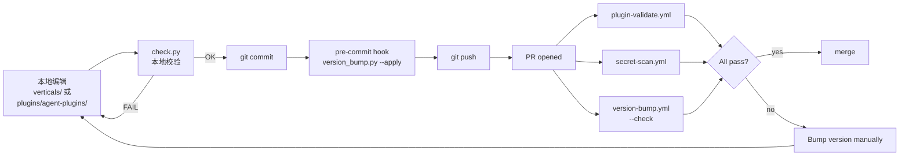

# 12. 开发工作流 — Fork / 加 Skill / 加 Command / 加 Agent / 加 Vertical

> **本节定位** [开发者向] — 想给仓库贡献代码的人必读。完整覆盖仓库设置、加新内容、CI 检查、本地检查。

> **术语外行?** 本章出现的 finance 术语(DCF / LBO / MOIC / IC memo / CIM / NAV / AUM / GP / LP / carry / KYC 等)详见 [`00.5-finance-primer.md`](./00.5-finance-primer.md)。

## TL;DR

- **仓库初始化**:克隆后跑一次 `python3 scripts/check.py`(它自动装 pre-commit hook)。
- **改 skill 的铁律**:在 `vertical-plugins/<v>/skills/<slug>/` 改 → 跑 `sync-agent-skills.py` → 跑 `check.py`。
- **新 agent**:`plugins/agent-plugins/<slug>/` + 平行的 `managed-agent-cookbooks/<slug>/`。
- **新 vertical**:`plugins/vertical-plugins/<slug>/` + 在 `.claude-plugin/marketplace.json` 加条目。
- **CI 四道闸**:`plugin-validate.yml` / `secret-scan.yml` / `version-bump.yml` / `check.py`(本地)。
- **.ps1 ASCII 红线**:写 Windows 脚本时用 `--` 不是 `—`。

## What you'll learn

- 仓库初始化与 pre-commit hook 安装
- 加新 skill 的完整步骤
- 加新 agent(双 wrapper)的完整步骤
- 加新 vertical 的完整步骤
- 版本号管理(patch 自动 / minor 与 major 手动)
- CI 四道闸分别拦什么
- `.ps1` ASCII 红线
- PR review checklist

## 贡献生命周期



四个 CI 闸:manifest 校验、secret 扫描、内部 ref scrub、本地校验脚本会再跑一次。任一失败都要回 `A` 修复。

---

## [开发者向] 仓库初始化

```bash
# 1. 克隆
git clone https://github.com/anthropics/financial-services
cd financial-services

# 2. (可选)装 hooks — 但 check.py 会自动装
git config core.hooksPath .githooks

# 3. 跑首次 check
python3 scripts/check.py

# 4. (预期输出)
# [check.py] installed git hooks (core.hooksPath -> .githooks)
# OK — N file(s) checked, 0 issues.

# 5. 现在 commit 任何改动,pre-commit hook 会自动跑 version_bump.py
```

如果 `core.hooksPath` 没设,跑 `scripts/check.py` 一次后也会自动装(见 `scripts/check.py` L27–46)。

## [开发者向] 编辑 skill 的铁律

```text
NEVER edit:
   plugins/agent-plugins/Y/skills/<slug>/SKILL.md  <- 是 vendored copy,下次 sync 会被覆盖

ALWAYS edit:
   plugins/vertical-plugins/X/skills/<slug>/SKILL.md  <- source of truth
```

**完整流程**:

```bash
# 1. 改 vertical 下的源 SKILL.md
$EDITOR plugins/vertical-plugins/financial-analysis/skills/comps-analysis/SKILL.md

# 2. 跑 sync 把改动复制到所有 agent bundles
python3 scripts/sync-agent-skills.py

# 3. 跑 check 确认无错误
python3 scripts/check.py

# 4. (预期)
# OK — N file(s) checked, 0 issues.
```

## [开发者向] 加一个新 skill

```text
1. 选 vertical
   mkdir -p plugins/vertical-plugins/<v>/skills/<new-slug>/

2. 写 SKILL.md(frontmatter: name + description 含 Perfect for / Not ideal for)
   参考 plugins/vertical-plugins/financial-analysis/skills/skill-creator/SKILL.md

3. (可选)TROUBLESHOOTING.md / requirements.txt / examples/

4. (可选)若要 agent 捆绑:
   python3 scripts/sync-agent-skills.py
   检查 plugins/agent-plugins/<using-agent>/skills/<new-slug>/ 是否被复制

5. 跑 check
   python3 scripts/check.py

6. commit(pre-commit hook 自动 patch bump plugin version)
   git commit -am "Add <new-slug> skill to <v> vertical"

7. PR
```

**frontmatter 模板**(从 `skill-creator` 提炼):

```yaml
---
name: <new-slug>
description: |
  <1 行 trigger-rich 描述>

  **Perfect for:**
  - <list>

  **Not ideal for:**
  - <list>
---
# <Title>

## Overview
<1-2 段>

## Workflow

### Step 1: <name>
<input/output>

### Step 2: <name>
...

## Output Format
<ASCII 框图或 markdown table>

## Important Notes
<护栏、引用、边界条件>
```

## [开发者向] 加一个新 agent

新 agent 需要**两个 wrapper**:

```text
A. plugins/agent-plugins/<slug>/
       .claude-plugin/plugin.json
       agents/<slug>.md           <- 系统提示词(YAML frontmatter + body)
       skills/                    <-  vendored 副本(sync-agent-skills.py 跑一次自动建)

B. managed-agent-cookbooks/<slug>/
       agent.yaml                 <- 部署清单
       README.md                  <- 安全 tier + handoff 说明
       steering-examples.json     <- 示例 steering event
       subagents/<role>.yaml      <- 至少 3 个,其中恰好 1 个 Write-holder
```

**详细步骤**:

### A. Cowork 端(plugins/agent-plugins/<slug>/)

```bash
mkdir -p plugins/agent-plugins/<slug>/.claude-plugin
mkdir -p plugins/agent-plugins/<slug>/agents

# 1. plugin.json
cat > plugins/agent-plugins/<slug>/.claude-plugin/plugin.json <<EOF
{
  "name": "<slug>",
  "version": "0.1.0",
  "description": "<一句话能力>",
  "author": { "name": "Anthropic FSI" }
}
EOF

# 2. 系统提示词
cat > plugins/agent-plugins/<slug>/agents/<slug>.md <<'EOF'
---
name: <slug>
description: |
  <1-2 段 trigger-rich 描述,含 "Use when...">
tools: Read, Write, Edit, mcp__<server>__*
---

# <Title>

## What you produce
<artifact 清单>

## Workflow
1. Step 1
2. Step 2
...

## Guardrails
<安全规则>
EOF

# 3. skills/(空目录,sync 会填)
mkdir -p plugins/agent-plugins/<slug>/skills

# 4. 在 marketplace.json 加条目
$EDITOR .claude-plugin/marketplace.json
# 在 plugins[] 数组加:
# {
#   "name": "<slug>",
#   "displayName": "<Display Name>",
#   "source": "./plugins/agent-plugins/<slug>",
#   "description": "<same as plugin.json>"
# }
```

### C. Managed Agent 端(managed-agent-cookbooks/<slug>/)

```bash
mkdir -p managed-agent-cookbooks/<slug>/subagents

# 1. agent.yaml
cat > managed-agent-cookbooks/<slug>/agent.yaml <<EOF
name: <slug>
model: claude-opus-4-7

system:
  file: ../../plugins/agent-plugins/<slug>/agents/<slug>.md
  append: "You are running headless. Produce files in ./out/; do not assume an open Office document."

tools:
  - type: agent_toolset_20260401
    default_config: { enabled: false }
    configs:
      - { name: read,  enabled: true }
      - { name: grep,  enabled: true }
      - { name: glob,  enabled: true }

mcp_servers:
  - { type: url, name: <server>, url: "${<SERVER>_MCP_URL}" }

skills:
  - { from_plugin: ../../plugins/agent-plugins/<slug> }

callable_agents:
  - { manifest: ./subagents/reader.yaml }
  - { manifest: ./subagents/critic.yaml }
  - { manifest: ./subagents/writer.yaml }
EOF

# 2. 3 个 subagent,template 见各现有 cookbook
#    关键:恰好 1 个 writer 有 write 工具

# 3. README.md(参考 gl-reconciler/README.md)

# 4. steering-examples.json(3 个示例 event)
```

### 5. 校验

```bash
python3 scripts/check.py
python3 scripts/sync-agent-skills.py     # 复制 skills 到 agent bundle
python3 scripts/check.py                 # 再跑一次确认无漂移
python3 scripts/test-cookbooks.sh        # dry-run 部署
```

## [开发者向] 加一个新 vertical

```bash
mkdir -p plugins/vertical-plugins/<new-v>/.claude-plugin
mkdir -p plugins/vertical-plugins/<new-v>/commands
mkdir -p plugins/vertical-plugins/<new-v>/skills

# 1. plugin.json
# 2. commands/<cmd>.md(每个)
# 3. skills/<slug>/SKILL.md(每个)
# 4. (可选).mcp.json / hooks/hooks.json
# 5. 在 marketplace.json 加条目
# 6. python3 scripts/check.py
```

新 vertical **不需要** cookbook — cookbook 是给已有 agent 用的。

## [开发者向] 版本号管理

```text
patch bump (0.1.0 -> 0.1.1)
  触发:pre-commit hook(commit 时)
  算法:scripts/version_bump.py
       只对有 staged改动的 plugin
       只 bump 一次(已在 main 之上就不再 bump)
  使用:修复 / 文案 / 内容刷新

minor bump (0.1.0 -> 0.2.0)
  触发:手动
  使用:新功能(新 skill / 新 command / 新 MCP)

major bump (0.1.0 -> 1.0.0)
  触发:手动
  使用:破坏性变更
```

**手动 bump**:

```bash
# 编辑 plugin.json,把 "0.1.0" 改成 "0.2.0" 或 "1.0.0"
$EDITOR plugins/<type>/<slug>/.claude-plugin/plugin.json

# 跑 check
python3 scripts/check.py
```

**CI backstop**(.github/workflows/version-bump.yml):

```yaml
- name: Check version bumped
  run: python3 scripts/version_bump.py --check --base origin/${{ github.base_ref }}
```

如果你的分支 plugin version 没有严格大于 base ref,**PR 失败**。

## [开发者向] CI 四道闸

```text
PR opened
   |
   +-- .github/workflows/plugin-validate.yml
   |     install pinned: CLAUDE_VERSION: "2.1.143"
   |     run: cla plugin validate
   |            .claude-plugin/marketplace.json
   |            plugins/*/.claude-plugin/plugin.json
   |     抓 manifest schema 错误
   |
   +-- .github/workflows/secret-scan.yml
   |     gitleaks v8.28.0 (sha256-pinned)
   |     grep scrub: .ant.dev / antspace.dev / anthropic-internal / go/<name>
   |     文件类型:.md/.yaml/.yml/.json/.py/.sh
   |
   +-- .github/workflows/version-bump.yml (PR-only)
         python3 scripts/version_bump.py --check --base origin/<base_ref>
         fail if plugin version <= base ref's version

本地 (pre-push):
   python3 scripts/check.py
     - YAML / JSON parse
     - agent.md frontmatter
     - system.file / skills.path / callable_agents.manifest 解析
     - bundled-skill drift(vertical vs agent bundle)
     - agent prose 引用 vs bundled skill
     - marketplace source 路径
     - .ps1 ASCII-only(Windows PowerShell 5.1 bug)
```

## [开发者向] `.ps1` ASCII 红线

来自 `scripts/check.py` L188–211:

```text
Windows PowerShell 5.1 -- 仍为托管 Windows 上的默认 shell -- 在没有
BOM 的情况下读 .ps1 时用机器的 ANSI code page,不是 UTF-8。
一个 em dash 或 curly quote 会解码成含字面 " 的 mojibake,
提前终止字符串,使整个脚本 PARSE 失败。
```

**规则**:

- `.ps1` / `.psm1` / `.psd1` 文件**无 BOM 时**只能含 ASCII 字节(0x00–0x7F)
- 加 UTF-8 BOM(`\xef\xbb\xbf` 开头)可以解除此限制
- `scripts/check.py` 会扫所有 `.ps1` 并对每行检查 `byte > 0x7F`

**实战**:

- 用 `--` 不用 `—`
- 用 `"` 不用 `"`
- 用 `'` 不用 `'`
- 用 `...` 不用 `…`

`claude-for-msft-365-install/scripts/*.ps1` 都遵守此规则。

## [开发者向] PR review checklist

提交前自查:

```text
[ ] python3 scripts/check.py OK(本地)
[ ] git status 只改动了应该改的文件
      + plugins/<type>/<slug>/ 加新内容?
      + managed-agent-cookbooks/<slug>/ 加新内容?
      + .claude-plugin/marketplace.json 加新条目?
[ ] plugins/vertical-plugins/<v>/skills/<slug>/SKILL.md 是 source of truth
[ ] python3 scripts/sync-agent-skills.py 已跑(若改了 vertical skill)
[ ] agents/<slug>.md frontmatter 含 name + description
[ ] managed-agent-cookbooks/<slug>/ 有 agent.yaml + README.md + steering-examples.json
[ ] 每个 subagent 有 output_schema(reader 角色)
[ ] Write-holder 唯一
[ ] callable_agents: [] 严格(不在 subagent 里调 subagent)
[ ] plugin.json author 字段是 "Anthropic FSI"(除 partner 与 investment-banking)
[ ] .ps1 文件纯 ASCII(若有)
[ ] 没有任何 MCP provider API key 硬编码
[ ] 没有任何专有数据(真实公司 / 真实客户)
```

PR 描述模板:

```markdown
## What
<1-2 段描述改了什么>

## Why
<为什么这么做>

## Test
- [ ] `python3 scripts/check.py` OK
- [ ] `python3 scripts/sync-agent-skills.py` 已跑(若改 skill)
- [ ] `python3 scripts/test-cookbooks.sh` OK(若改 cookbook)

## Refs
<关联 issue / 设计 doc>

## Checklist
- [ ] plugin.json author 正确
- [ ] frontmatter 含必需字段
- [ ] .ps1 ASCII(若有)
- [ ] 无专有数据
```

## [开发者向] 决策树 — 我要加什么?

```text
我想加新 workflow 知识
   -> 新 SKILL.md (在某个 vertical 下)

我想加新显式 trigger
   -> 新 command (在某个 vertical 下)

我想给已有 skill 加自动调用机制
   -> 在 agent frontmatter 加 tools,或 在 SKILL.md 调更精确的描述

我想加新端到端工作流
   -> 新 agent(双 wrapper)

我想加新业务领域(投行 / PE / WM 之外)
   -> 新 vertical

我想加新数据源
   -> 改 financial-analysis/.mcp.json(共享)
   或 在 partner plugin 里加新 .mcp.json
```

## [开发者向] 加一个新 MCP server 的步骤

完整 walkthrough — 把"Moody's 信用评级"加入 `financial-analysis/.mcp.json`:

```text
1. 选 MCP server 名(就是 tool 前缀)
   mcp__<name>__<tool>
   例子: mcp__moodys__get_credit_rating

2. 编辑 financial-analysis/.mcp.json
   (注意先修第 46 / 50 行 JSON 语法 bug)
   {
     "mcpServers": {
       "moodys": {
         "type": "http",
         "url": "https://api.moodys.com/genai-ready-data/m1/mcp"
       }
     }
   }

3. 在某 agent 的 agents/<slug>.md frontmatter 加 tools:
   tools: Read, Write, Edit, mcp__moodys__*

4. (若 Managed Agent)在 agent.yaml 加 mcp_servers:
   mcp_servers:
     - { type: url, name: moodys, url: "${MOODYS_MCP_URL}" }
   tools:
     - { type: mcp_toolset, mcp_server_name: moodys, default_config: { enabled: true } }

5. export MCODE_MCP_URL=https://api.moodys.com/genai-ready-data/m1/mcp
   (字符只含 [A-Za-z0-9._/:@-])

6. 跑 check.py
   python3 scripts/check.py
   # 应该 OK,因为 .mcp.json 路径有效

7. 跑 sync-agent-skills.py + deploy(若 Managed Agent)
   python3 scripts/sync-agent-skills.py
   scripts/deploy-managed-agent.sh <using-agent>

8. commit
   git commit -am "Add Moody's MCP to financial-analysis"
   pre-commit hook 自动 patch bump
```

## [开发者向] 加一个新 cookbook 的最小骨架

最小 cookbook 需要 4 个文件:

```text
managed-agent-cookbooks/<new-slug>/
├── agent.yaml                # orchestrator 清单
├── README.md                 # 安全 tier + handoff 说明
├── steering-examples.json    # 2-3 示例 event
└── subagents/
    ├── reader.yaml           # 只读 + output_schema(若 untrusted)
    ├── critic.yaml           # 中间层(可选)
    └── writer.yaml           # Write-holder(唯一)
```

**agent.yaml 最小**:

```yaml
name: <new-slug>
model: claude-opus-4-7

system:
  file: ../../plugins/agent-plugins/<new-slug>/agents/<new-slug>.md
  append: "You are running headless. Produce files in ./out/; do not assume an open Office document."

tools:
  - type: agent_toolset_20260401
    default_config: { enabled: false }
    configs:
      - { name: read, enabled: true }
      - { name: grep, enabled: true }
      - { name: glob, enabled: true }
  - type: mcp_toolset
    mcp_server_name: <server-name>
    default_config: { enabled: true }

mcp_servers:
  - { type: url, name: <server-name>, url: "${<SERVER>_MCP_URL}" }

skills:
  - { from_plugin: ../../plugins/agent-plugins/<new-slug> }

callable_agents:
  - { manifest: ./subagents/reader.yaml }
  - { manifest: ./subagents/critic.yaml }
  - { manifest: ./subagents/writer.yaml }
```

**writer.yaml 最小**(Write-holder 模板):

```yaml
name: <new-slug>-writer
model: claude-opus-4-7

system:
  text: |
    You are the ONLY worker with Write. Receive the verified output
    (already critic-checked and schema-validated), draft the artifact,
    and write it to ./out/. Never read external files; never run bash.

tools:
  - type: agent_toolset_20260401
    default_config: { enabled: false }
    configs:
      - { name: read, enabled: true }
      - { name: write, enabled: true }
      - { name: edit, enabled: true }

mcp_servers: []
skills:
  - { path: ../../../plugins/agent-plugins/<new-slug>/skills/xlsx-author }
callable_agents: []
```


## 重要免责声明

> **!IMPORTANT** 本仓库与本 handbook 都不构成投资、法律、税务或会计建议。这些 agent 起草分析师工作产出(模型、备忘录、研究笔记、对账结果),由合格专业人士复核。它们不做投资建议、不执行交易、不承担风险、不入账、不批准 onboarding。每个产物都待人工签字。你负责验证输出与遵守适用的法律法规。

源: `README.md` L7–9(本 handbook 完整镜像此声明)。

## Cross-references

- 仓库整体架构 → `./02-architecture.md`
- cookbook 字段详解 → `./09-cookbooks.md`
- skill archetype 与 frontmatter 模板 → `./08-skills.md`
- 排错(check.py 报错)→ `./13-troubleshooting.md`

## Source files

- `CLAUDE.md`(L1–L66,ASCII 红线 + 仓库结构 + 贡献规则)
- `README.md`(L250–L258,Contributing 段)
- `scripts/check.py`(L1–L220,所有校验项的 source of truth)
- `scripts/sync-agent-skills.py`(L1–L40,vendor sync 实现)
- `scripts/version_bump.py`(L1–L150,patch bump 算法)
- `.githooks/pre-commit`(L1–L20)
- `.github/workflows/plugin-validate.yml`
- `.github/workflows/secret-scan.yml`
- `.github/workflows/version-bump.yml`
- `plugins/vertical-plugins/financial-analysis/skills/skill-creator/SKILL.md`(meta-template)
- `plugins/vertical-plugins/investment-banking/.claude/investment-banking.local.md.example`(user-personalization 模板)