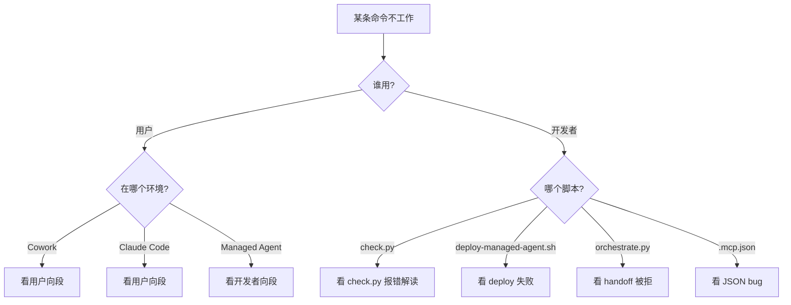

# 13. Troubleshooting — 常见问题与已知 Bug

> **本节定位** [用户向][开发者向] — 当某条命令不工作、某个 skill 不触发、某个 deployment 失败,来这里。

> **术语外行?** 本章出现的 finance 术语(DCF / LBO / MOIC / IC memo / CIM / NAV / AUM / GP / LP / carry / KYC 等)详见 [`00.5-finance-primer.md`](./00.5-finance-primer.md)。

## TL;DR

- **四道闸 = 健康保证**:`check.py`(本地)+ pre-commit hook + 3 个 GitHub Actions。
- **已知 bug**:`plugins/vertical-plugins/financial-analysis/.mcp.json` 第 46 与 50 行缺逗号,**当前无法 JSON 解析**。修正版本在本章给出。
- **常见用户错**:marketplace 没注册 / plugin 没装 / 描述不具体 / MCP 没 URL。
- **常见开发者错**:改 agent bundle 而不是 vertical / 不跑 sync-agent-skills.py / subagent 声明了 `output_schema` 但 schema 字段约束错误 / Write-holder 不唯一。
- **首查位置**:`scripts/check.py`(本地)、`.github/workflows/`(CI)、`scripts/orchestrate.py` 顶部注释(handoff threat model)。

---

## What you'll learn

- 用户级故障排查路径(安装失败 / 命令不触发 / skill 不触发 / MCP 连不上)
- 开发者级故障排查路径(check.py 报错 / deploy 失败 / handoff 被拒 / schema 校验失败)
- 仓库里真实存在的一个已知 bug:`financial-analysis/.mcp.json` 的 JSON 解析失败与修正版本
- 如何阅读 `check.py` 报错信息并定位根因
- 何时应该改 vertical 源 vs agent bundle(vendor sync 的方向)

## [用户向] 安装失败

### `claude plugin marketplace add` 报错

```text
error: marketplace not found
```

**原因**:marketplace URL 拼错或网络问题。

**解决**:

```bash
# 完整命令
claude plugin marketplace add anthropics/financial-services

# 验证
claude plugin marketplace list

# 看输出是否含 "claude-for-financial-services"
```

### `claude plugin install` 报错 "plugin not found"

```text
error: plugin financial-analysis@claude-for-financial-services not found
```

**原因**:`marketplace add` 没跑过,或 marketplace 名字拼错。

**解决**:

```bash
# 确认 marketplace 已注册
claude plugin marketplace list

# 确认 plugin 名字拼写
# 注意 sp-global 用 - 但目录是 spglobal/
claude plugin install sp-global@claude-for-financial-services  # 正确
```

### Cowork 里粘贴 URL 无反应

**原因**:网络不可达 / URL 拼错。

**解决**:

- 确认是 `https://github.com/anthropics/financial-services`
- 浏览器先访问一次确认可达

## [用户向] 命令不触发

### 输入 `/comps` 没有反应

**检查**:

1. plugin 是否已装:在 Cowork / Claude Code 里输入 `/help` 看 `/comps` 是否在列表里
2. session 里有没有 `financial-analysis` plugin 的 commands
3. 拼写:小写,无空格

### 输入命令报 "command not found"

**原因**:命令所属的 plugin 没装。

**解决**:装那个 plugin。例如 `/dcf` 需要 `financial-analysis` plugin。

### M365 命令(`/claude-for-msft-365-install:setup`)无效

**原因**:

- M365 plugin 是 Claude Code plugin,**不是** Cowork plugin
- 在 Cowork 里跑这条命令会失败
- 需要在 Claude Code session 里跑

**解决**:

```bash
claude plugin install claude-for-msft-365-install@claude-for-financial-services
claude
> /claude-for-msft-365-install:setup
```

## [用户向] Skill 没自动触发

### "帮我审 BS 平衡" 没触发 audit-xls

**原因**:

- `audit-xls` 的 description 没命中你的请求
- 或者 skill 没装

**解决**:

1. 用更明确的触发短语:`"audit this Excel"` / `"check formula accuracy"` / `"model integrity"`
2. 显式调:`> Use the audit-xls skill to check my model`
3. 或用 command:`/debug-model ./model.xlsx`

### 触发后输出格式不对

**原因**:skill 在 Cowork / Managed Agent 环境的写法可能不同。

**解决**:

- 检查 `SKILL.md` 里的 "Environment" 段
- 看 `08-skills.md` 的 "环境分支" 节

## [用户向] MCP 连不上

### Claude 报 "MCP server unreachable"

**检查**:

```bash
# 1. .mcp.json 是否能被 json.load 解析
python3 -c "import json; json.load(open('plugins/vertical-plugins/financial-analysis/.mcp.json'))"

# 2. URL 是否可达(本地测)
curl -I https://mcp.daloopa.com/server/mcp

# 3. 鉴权是否需要(Provider 端)
# 大多 MCP 需要订阅或 API key
```

### 已知 bug:`.mcp.json` JSON 解析失败

见下方"开发者向 - 已知 bug"。

## [开发者向] `check.py` 报错解读

```bash
python3 scripts/check.py
```

### `bundled-skill: ... drifted from ... run sync-agent-skills.py`

**原因**:agent bundle 里的 skill 与 vertical source 不一致。

**解决**:

```bash
python3 scripts/sync-agent-skills.py
python3 scripts/check.py
```

### `frontmatter: ... missing 'name' / 'description'`

**原因**:`agents/<slug>.md` 顶部 frontmatter 字段缺失。

**解决**:

```yaml
---
name: <slug>             # 必填
description: |            # 必填,多行
  <trigger-rich desc>
---
```

### `ref: ... system.file -> ... (not found)`

**原因**:`managed-agent-cookbooks/<slug>/agent.yaml` 里的 `system.file` 路径不存在。

**解决**:路径是相对 cookbook 目录的,确认指向 `plugins/agent-plugins/<slug>/agents/<slug>.md`。

### `ref: ... callable_agents.manifest -> ... (not found)`

**原因**:`./subagents/<role>.yaml` 不存在。

**解决**:确认 file 路径正确,或在 `subagents/` 下创建该 yaml。

### `marketplace: <name> source -> ... (no plugin.json)`

**原因**:`.claude-plugin/marketplace.json` 里某条目的 `source` 路径下找不到 `plugin.json`。

**解决**:检查源目录,或修正 `source` 路径。

### `non-ascii: .../foo.ps1:N: byte(s) ... in a .ps1 with no UTF-8 BOM`

**原因**:`.ps1` 含 non-ASCII 字符且无 BOM。

**解决**:

- 把 non-ASCII 字符换 ASCII 版本(`—` → `--`)
- 或在文件头加 UTF-8 BOM(`\xef\xbb\xbf`)

### `missing: managed-agent-cookbooks/<slug>/{agent.yaml | steering-examples.json|README.md}`

**原因**:cookbook 缺必需文件。

**解决**:补齐这三个文件。

## [开发者向] `deploy-managed-agent.sh` 失败

### `ANTHROPIC_API_KEY must be set`

**解决**:`export ANTHROPIC_API_KEY=sk-ant-...`

### `requires jq`

**解决**:`brew install jq` / `apt-get install jq`

### `requires python3 + pyyaml`

**解决**:`pip install pyyaml`

### `refusing ${VAR}: value contains characters outside [A-Za-z0-9._/:@-]`

**原因**:环境变量值含 shell metacharacter(`;`, `|`, `$`, `` ` ``)。

**解决**:MCP URL 只应含 HTTPS URL 字符。检查是否多写了 `;xxx` 之类。

### `POST /v1/skills failed for ...`

**原因**:skill 上传失败。看 stderr 输出。

**常见原因**:

- 网络问题
- API key 无效
- skill 目录没 SKILL.md

### `no manifest at $DIR/agent.yaml`

**原因**:cookbook 路径不存在,或缺 `agent.yaml`。

**解决**:

```bash
ls managed-agent-cookbooks/<slug>/agent.yaml
# 若不存在,说明 cookbook 没建
```

## [开发者向] Cookbook 部署后 worker JSON 不通过 `validate.py`

```bash
python3 scripts/validate.py worker-output.json subagent-schema.yaml
```

**错误**:`INVALID: ... at /properties/breaks/...`

**原因**:worker 的 JSON 输出不符合 `output_schema`。

**常见原因**:

- 字段缺失
- 字段值超 `maxLength`
- 字段值不匹配 `pattern` 或 `enum`
- 数组超 `maxItems`

**解决**:

- 检查 `output_schema` 与 worker 输出
- 必要时调整 `maxLength` / `pattern`(但要小心降低安全约束)
- 或调整 worker 提示词让它输出符合 schema

## [开发者向] `handoff_request` 被 `orchestrate.py` 拒

```python
# scripts/orchestrate.py L23-27
ALLOWED_TARGETS = {
    "pitch-agent", "market-researcher", "earnings-reviewer", "meeting-prep-agent",
    "model-builder", "gl-reconciler", "kyc-screener",
    "valuation-reviewer", "month-end-closer", "statement-auditor",
}
```

**错误**:`target_agent not in ALLOWED_TARGETS`

**解决**:

- 检查 target_agent 拼写
- 确认目标 agent 已部署(否则不会在 allowlist 里)
- 更新 `ALLOWED_TARGETS` 列表(在 `orchestrate.py`)以包含新 agent

**另一个错误**:`jsonschema validate fails`

**原因**:payload 不符合 `HANDOFF_PAYLOAD_SCHEMA`:

```python
HANDOFF_PAYLOAD_SCHEMA = {
    "type": "object",
    "additionalProperties": False,
    "required": ["event"],
    "properties": {
        "event": {"type": "string", "maxLength": 2000},
        "context_ref": {"type": "string", "maxLength": 256,
                        "pattern": r"^[A-Za-z0-9 ._/:#-]+$"},
    },
}
```

**解决**:

- `event` 字符串 ≤ 2000 字符
- `context_ref` 只含 `[A-Za-z0-9 ._/:#-]`
- 不加额外字段(`additionalProperties: false`)

## [开发者向] 已知 Bug:`financial-analysis/.mcp.json` JSON 解析失败

### 现象

```bash
$ python3 -c "import json; json.load(open('plugins/vertical-plugins/financial-analysis/.mcp.json'))"
Traceback (most recent call last):
  ...
json.decoder.JSONDecodeError: ...
```

### 原因

`plugins/vertical-plugins/financial-analysis/.mcp.json` 在 line 46 缺逗号(`egnyte` 块后的 `}` 后面缺 `,`)。注意 line 50 是文件最后一个 server 块,**不能**加逗号(JSON 规范)。

### 当前有问题的版本(节选)

```jsonc
{
  "mcpServers": {
    // ... 前 10 个 server OK ...
    "egnyte": {
      "type": "http",
      "url": "https://mcp-server.egnyte.com/mcp"
    }                              // <-- line 46: 缺 ,
    "box": {
      "type": "http",
      "url": "https://mcp.box.com"
    }                              // <-- line 50: 文件最后一个 server,**不能**加逗号
  }
}
```

### 修正版本

```json
{
  "mcpServers": {
    "daloopa": {
      "type": "http",
      "url": "https://mcp.daloopa.com/server/mcp"
    },
    "morningstar": {
      "type": "http",
      "url": "https://mcp.morningstar.com/mcp"
    },
    "sp-global": {
      "type": "http",
      "url": "https://kfinance.kensho.com/integrations/mcp"
    },
    "factset": {
      "type": "http",
      "url": "https://mcp.factset.com/mcp"
    },
    "moodys": {
      "type": "http",
      "url": "https://api.moodys.com/genai-ready-data/m1/mcp"
    },
    "mtnewswire": {
      "type": "http",
      "url": "https://vast-mcp.blueskyapi.com/mtnewswires"
    },
    "aiera": {
      "type": "http",
      "url": "https://mcp-pub.aiera.com"
    },
    "lseg": {
      "type": "http",
      "url": "https://api.analytics.lseg.com/lfa/mcp"
    },
    "pitchbook": {
      "type": "http",
      "url": "https://premium.mcp.pitchbook.com/mcp"
    },
    "chronograph": {
      "type": "http",
      "url": "https://ai.chronograph.pe/mcp"
    },
    "egnyte": {
      "type": "http",
      "url": "https://mcp-server.egnyte.com/mcp"
    },
    "box": {
      "type": "http",
      "url": "https://mcp.box.com"
    }
  }
}
```

> **重要**:handbook **不**自动修这个 bug。修这个 bug 是仓库维护者的事。handbook 只**记录**当前状态,让用户/开发者知道。

### 如何应用修正

```bash
# 在你本地 fork 里修(供下游用户使用)
$EDITOR plugins/vertical-plugins/financial-analysis/.mcp.json
# 加上那两个逗号

# 验证
python3 -c "import json; json.load(open('plugins/vertical-plugins/financial-analysis/.mcp.json'))"
# 应该 OK

# 跑 check
python3 scripts/check.py
# 应该通过

# PR 回主仓库
```

## [开发者向] 常见排错流程图



## [运维向] M365 部署问题

### Add-in 加载失败

用 `/claude-for-msft-365-install:debug` 看:

- stale config
- connect failure
- missing add-in

### 用户数据丢失

**先导出**:`/claude-for-msft-365-install:export-data` 或 `scripts/export-addin-data.{sh,ps1}`。

**场景**:

- 机器重装
- Windows 上清 Office add-in 缓存(`Wef` 目录)

### 升级后不生效

```bash
claude plugin update claude-for-msft-365-install@claude-for-financial-services
# 重启 session
```

## [用户向] 找不到想装的 plugin

```bash
# 列所有 plugin
claude plugin list

# 看 marketplace 详情
claude plugin marketplace show claude-for-financial-services

# 完整 20 个见 ./03-marketplace-catalog.md
```

## 紧急:仓库不能跑 `check.py`

```bash
# 最常见原因: pyyaml 没装
pip install pyyaml

# 或用 venv
python3 -m venv .venv
source .venv/bin/activate
pip install pyyaml
python3 scripts/check.py
```

## Cookbook 部署后的常见问题

### "agent 调度了但什么都没出来"

排查顺序:

```text
1. 看 session 是否启动
   - Managed Agent: 检查 HTTP response 是否 200 + session_id
   - Cowork: 看左侧 session 列表是否有新 entry

2. 看 orchestrator 是否调了 subagent
   - 应该看到 tool_call 事件 type=Agent(...)
   - 若没有,orchestrator 自己死在中间,看 message_delta 错误

3. 看 subagent 是否有 output
   - 应有 schema-validated JSON
   - 若有 JSON 但 validate.py 失败,通常是 maxLength / pattern / enum 不匹配

4. 看 Write-holder 是否真写了文件
   - 应有 file_write 事件
   - 若没,Writer subagent 的 skill 不存在 / 路径错
```

### "subagent 调成功了但 JSON 是空的"

通常是 reader 触达 untrusted doc 后放弃。检查:

- doc 真的存在吗
- reader 的 prompt 是否说"找不到就返回空数组而不是报错"
- MCP 是否在工作(若 reader 用 MCP)

### "deploy 成功但第一次 session 失败"

通常是 env 变量漏配或字符超界:

```bash
# 1. 重跑 deploy 看警告
scripts/deploy-managed-agent.sh <slug>

# 2. 看 deploy 日志的"refusing"行
grep refusing logs/ | tail

# 3. 修环境变量值,只含 [A-Za-z0-9._/:@-]
export CAPIQ_MCP_URL=https://clean-url.example/mcp
# 不行: export CAPIQ_MCP_URL='https://url; rm -rf /'  <-- 含 ; 与 空格
```

## [运维向] M365 部署常见问题(扩展)

### bootstrap endpoint 401 / 403

bootstrap 端点必须验证 Entra ID token。常见错误:

```text
401  - token 无效(签名 / audience / issuer 不匹配)
403  - token valid 但 user 不在 RBAC 表里
500  - bootstrap endpoint 后端出错(查 server logs)
```

修复:

- 401 → 检查 token validation 库(用 `azure-identity` / `msal` 等)
- 403 → 在 `examples/python-bootstrap/config.py` 加 user 的 group
- 500 → 看 server logs

### 用户看不到 add-in

> **!IMPORTANT** 旧版本本节曾经教你在 `manifest.xml` 里编辑以下 pattern — **那是错的**。`<Scope>` 不是 `manifest.xml` 的合法元素,那是 Graph permission scopes。乱改 manifest.xml 不会修任何问题,且会导致 manifest 上传失败。

```text
# 错误示例(不要照抄)
<Scope>Group.<group-id>.Read.All</Scope>
```

**用户看不到 add-in**(最常见原因,按概率排序):

1. **不在 Users 范围**:Admin Center → Integrated apps → 你的 add-in → **Users** tab。确认目标用户/组被勾选。**Integrated apps 不支持嵌套组** — nested AD groups 静默跳过,500-user 部署失败的 #1 原因。如果你的组是嵌套的,展开成扁平 direct member list 或用 `Get-DistributionGroupMember -Recursive` 在 Entra 里摊平。
2. **Propagation 未完成**:首次部署 24h / 升级 72h(详见 `./11-microsoft-365-install.md#propagation-sla-请告诉-stakeholder`)。等待或 restart Outlook 触发 Wef 重读。
3. **`<Version>` 未变**:Admin Center 拒绝覆盖相同 `<Version>` 段的 manifest。Bump version 重打包 → 重传。
4. **客户端 Wef 缓存**:`HKCU\Software\Microsoft\Office\16.0\Wef\` 残留旧实例。**不要直接删 Wef 目录** — 会销毁 chat history / skill cache / 本地 MCP config(都是用户本地状态)。先跑 `:export-data <output-dir>` 备份,再 `scripts/clear-addin-cache.ps1 -Apply -Id <manifest-id>`。
5. **`<Id>` 未变**:Office cache 按 `<Id>` 索引。如果改了 `<Id>` 但用户没刷新,看到的是旧 add-in。新 `<Id>` = 全新 install(用户需要重新登录 + 重新配 skill)。

**快速诊断**:`/claude-for-msft-365-install:debug` 会输出 manifest 解析 + Entra 服务主体状态 + Wef 残留大小 + 最近 3 次 propagation 时间。


## 重要免责声明

> **!IMPORTANT** 本仓库与本 handbook 都不构成投资、法律、税务或会计建议。这些 agent 起草分析师工作产出(模型、备忘录、研究笔记、对账结果),由合格专业人士复核。它们不做投资建议、不执行交易、不承担风险、不入账、不批准 onboarding。每个产物都待人工签字。你负责验证输出与遵守适用的法律法规。

源: `README.md` L7–9(本 handbook 完整镜像此声明)。

## Cross-references

- `check.py` 完整规则 → `./12-development-workflow.md#开发者向-ci-四道闸`
- cookbook 内部结构 → `./09-cookbooks.md`
- MCP connector 配置 → `./10-mcp-connectors.md`
- M365 部署排错 → `./11-microsoft-365-install.md`
- Skill 触发机制 → `./08-skills.md`
- Command 调用 → `./07-commands.md`

## Source files

- `scripts/check.py`(L1–L220)
- `scripts/deploy-managed-agent.sh`(L1–L182)
- `scripts/orchestrate.py`(L1–L89)
- `scripts/validate.py`(L1–L43)
- `scripts/test-cookbooks.sh`(批量 dry-run)
- `plugins/vertical-plugins/financial-analysis/.mcp.json`(已知 bug)
- `.github/workflows/plugin-validate.yml`
- `.github/workflows/secret-scan.yml`
- `.github/workflows/version-bump.yml`