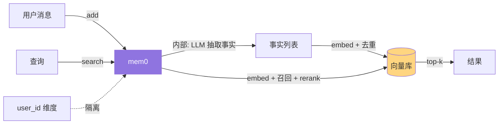

# 01. 快速上手 — 5 分钟体验 Mem0

> **本章视角**: 🧑 用户
> **核心问题**: 不用关心原理,先跑通 add / search / get_all 这三件事。
> **预计阅读**: 8 分钟

---

## 你能用它做什么

Mem0(Mem-for-Zero)是一个**长期记忆层**(Long-term Memory Layer)。把它接进你的 AI 应用后,它会:

- **自动抽取**:用户对话里的关键事实(姓名、偏好、过往任务)
- **自动去重**:重复的事实不会无限堆积
- **跨会话持久化**:同一 `user_id` 下次启动还能"记得"上次说过的话
- **智能检索**:`search(query)` 返回最相关的若干条记忆,直接喂给 LLM

一个最小应用——"记住用户喜欢什么口味的咖啡,下次回答时自动提及"——用 mem0 只需 10 行代码。

---

## 两种使用形态:Hosted vs OSS

Mem0 提供**两条完全平行的路径**:

| 路径 | Python 类 | 数据在哪 | 适合 |
|---|---|---|---|
| **托管云服务**(Hosted) | `MemoryClient` | api.mem0.ai(`m0-...` API key) | 不想运维、追求 SLA |
| **本地自托管**(OSS) | `Memory` | 你自己的向量库(Chroma / pgvector / Qdrant ...) | 数据驻留、成本可控、自定义 Provider |

两者的 API 表面**几乎完全一致**(`add` / `search` / `get` / `update` / `delete` 等),只是在数据所在位置、计费方式、合规边界上不同。详见 [第 10 章](./10-托管服务vs自托管.md)。

---

## 安装 Python SDK

Mem0 核心 SDK 以 `mem0ai` 包名发布到 PyPI。

```bash
# 仅托管云服务(最轻量)
pip install mem0ai

# 本地 OSS(需要向量库)
pip install mem0ai[extras]   # 同时安装 chromadb、sentence-transformers 等可选依赖
```

> Node.js 版 `mem0ai`(npm) 与 Python 版 API 一致,详见 [第 5 章](./05-TypeScript-SDK完整使用.md)。

---

## 最小可运行代码 — 10 行体验

### 形态 A:Hosted(无需任何向量库,一行连接)

```python
from mem0 import MemoryClient

client = MemoryClient(api_key="m0-XXXXXXXXXXXXXXXXXXXX")          # 从 https://app.mem0.ai 获取
result = client.add("我叫德吉,职业是 PostgreSQL DBA,喜欢手冲咖啡",
                    user_id="alice")
print(result)

hits = client.search("德吉的工作", user_id="alice", limit=3)
for m in hits["results"]:
    print("-", m["memory"])
```

### 形态 B:OSS(自带本地向量库)

```python
from mem0 import Memory

memory = Memory()   # 默认用 OpenAI 文本嵌入 + Chroma 本地存储 + OpenAI LLM
memory.add("我叫德吉,职业是 PostgreSQL DBA,喜欢手冲咖啡",
           user_id="alice")

for m in memory.search("德吉的工作", user_id="alice")["results"]:
    print("-", m["memory"])
```

第一次运行会自动下载嵌入模型并把向量落到 `~/.mem0/chroma/`。**确保 `OPENAI_API_KEY` 已设环境变量**。

---

## 核心三连:add / search / get_all



**图 1.1** — 最小调用链路:Python 脚本只看到 add / search 两个入口,内部自动完成抽取、嵌入、存储、检索。

### 关键参数:`user_id` 不可省

Mem0 是一个**多租户记忆系统**(Multi-tenant Memory System)。每次调用必须传入**至少一个**作用域标识:

- `user_id`:按用户隔离(最常见)
- `agent_id`:按智能体隔离(每个 agent 各自一套记忆)
- `run_id`:按会话/任务隔离(单次任务内临时记忆)

如果三者都缺,SDK 会直接报错。详见 [第 14 章](./14-最佳实践与性能调优.md)的"用户标识策略"小节。

### `messages` 接收多种输入

`add()` 的第一个参数最灵活:

```python
# 字符串:等价于 [{"role": "user", "content": "..."}]
memory.add("我今天心情不错", user_id="alice")

# 单个 dict
memory.add({"role": "user", "content": "我今天心情不错"}, user_id="alice")

# 多轮对话 list
memory.add([
    {"role": "user", "content": "推荐一本书"},
    {"role": "assistant", "content": "《代码大全》怎么样?"},
    {"role": "user", "content": "可以,加入我的书单"},
], user_id="alice")
```

LLM 会自动从对话中**抽取多条事实**,而不是原样存储整段对话。

---

## 5 分钟后的下一步

- 想知道 **mem0 与向量数据库/RAG 的本质区别** → [第 2 章](./02-mem0是什么与不是什么.md)
- 想理解 **Memory / Entity / History 三个核心概念** → [第 3 章](./03-核心概念-Memory-Entity-History.md)
- 想知道 **add() 内部到底发生了什么** → [第 6 章](./06-add()写入流程深度解析.md)
- 想知道 **Python / TypeScript SDK 的完整 API** → [第 4 章](./04-Python-SDK完整使用.md) / [第 5 章](./05-TypeScript-SDK完整使用.md)

---

## 延伸阅读

- [Mem0 官方快速开始](https://docs.mem0.ai)
- [第 10 章:托管 vs 自托管](./10-托管服务vs自托管.md) — 决定生产环境该用哪条路径
- [第 14 章:最佳实践](./14-最佳实践与性能调优.md) — 用户标识、批量、过滤器的实战建议