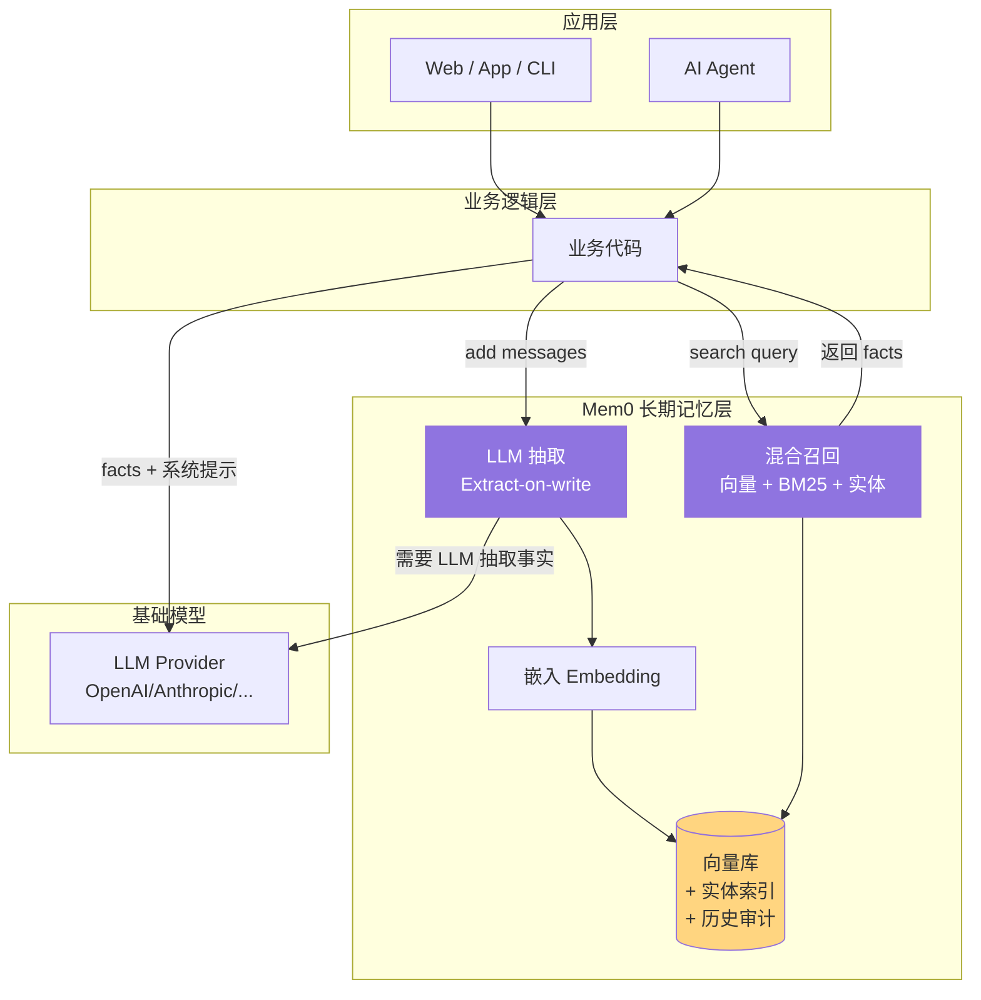
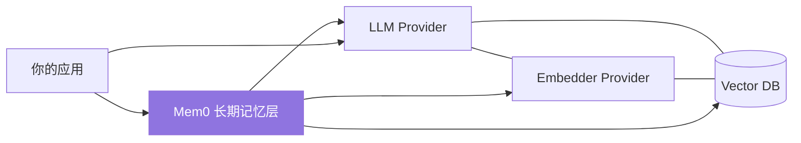

# 02. Mem0 是什么与不是什么

> **本章视角**: 🧑 用户
> **核心问题**: 它到底解决了什么问题,又**不**解决什么问题?
> **预计阅读**: 10 分钟

---

## 一句话定义

**Mem0 是一个"写入即抽取"(Extract-on-write)的长期记忆层(Long-term Memory Layer),把 AI 应用中需要长期保留的事实从对话上下文(Context)中剥离出来,做成可独立检索的二级知识。**

它解决的不是"怎么生成回答",而是"**怎么让 AI 在第 N 次对话时还记得第 1 次对话的细节**"。

---

## 它不是什么:五种常见误解

### ❌ 误解 1:不是向量数据库(Vector DB)

向量数据库(Pinecone / Chroma / Qdrant)是**存储介质**,只管"存进去、能搜出来"。Mem0 是**存储介质 + 智能抽取层 + 混合检索层**的组合。Mem0 内部会**调用**某个向量数据库(由你选),但它本身不是向量库。

### ❌ 误解 2:不是 RAG 框架

RAG(Retrieval-Augmented Generation)的典型流程是:**检索文档 → 塞进 prompt → 让 LLM 回答**。RAG 的检索对象是"知识库文档"(Wikipedia、产品手册、代码仓库),目的是补全知识盲区。Mem0 的检索对象是**用户自身的对话历史中抽取出的事实**,目的是让 LLM 体现"连续性"。两者可以叠加使用:RAG 提供背景,Mem0 提供"对方是谁、聊过什么"。

### ❌ 误解 3:不是 KV 缓存

Mem0 不是 Redis。它不是用 key 查 value,而是**对自然语言查询做语义检索**。"用户喜欢什么口味的咖啡"和"他的饮食偏好"会被视为相关查询;Redis 里这两个 key 风马牛不相及。

### ❌ 误解 4:不是对话状态管理器(Dialogue State Manager)

对话状态管理器关心的是"这次会话走到哪一步了"(比如客服系统的"已下单 → 已支付 → 已发货"状态机)。Mem0 不维护会话状态机;它关心的是"**跨**会话、跨时间的长期事实"。

### ❌ 误解 5:不是 CRM

CRM 关心"客户档案、联系人、销售漏斗",字段是结构化的。Mem0 关心的是"非结构化的事实",抽取自自然语言。两者的存储对象、查询语言、生命周期都不同。

---

## 它是什么:长期记忆层

Mem0 在应用栈中的位置:



**图 2.1** — Mem0 在应用栈中的位置。它是一层独立的"记忆中间件",业务代码与 LLM 之间多了一道语义记忆服务。

---

## 能力矩阵对比

| 能力 | 向量数据库 | RAG 框架 | Mem0 |
|---|---|---|---|
| 存非结构化文本 | ✅ | ✅ | ✅ |
| 自然语言查询 | ✅ | ✅ | ✅ |
| 自动抽取事实 | ❌ | ❌ | ✅ **核心** |
| 自动去重 | ❌ | ❌ | ✅ md5 hash |
| 实体感知(Entity) | ❌ | ❌ | ✅ spaCy + linked_memory_ids |
| 跨会话持久化 | 视实现 | 视实现 | ✅ **默认行为** |
| 混合召回(向量+BM25) | 部分 | 部分 | ✅ **开箱即用** |
| Rerank 精排 | 需自接 | 需自接 | ✅ 5 个 Provider |
| 多租户(user/agent/run) | 需自接 | 需自接 | ✅ **原生** |
| 历史审计(audit trail) | ❌ | ❌ | ✅ SQLite |

**图 2.2** — Mem0 vs Vector DB vs RAG:每个十字都是 Mem0 **预先做好**的事情,自建需要单独接入 5-10 个组件。

---

## 核心差异化:Extract-on-write

**Mem0 的关键设计决策**:在**写入**阶段而不是**读取**阶段做事实抽取。

```
传统做法(Extract-on-read):
  写入:  把对话原文整段塞进向量库
  读取:  检索到原文 → 临时让 LLM 抽取 → 喂给最终 prompt

Mem0 的做法(Extract-on-write):
  写入:  让 LLM 一次性读对话原文,产出结构化事实 → 只存事实
  读取:  直接拿事实,无需再抽取
```

带来的优势:

1. **读取延迟极低**:检索结果已经是干净的"事实条目",不需要在线 LLM 抽取
2. **去重廉价**:对事实文本做 md5 hash,可在向量库层去重
3. **实体链接廉价**:每个事实关联它提到的实体,反向索引可加速相关查询
4. **存储更紧凑**:1 段对话可能产生 3-5 条事实,但每条事实很短,总体远小于原文

代价是**写入延迟较高且依赖 LLM**——这就是为什么 mem0 把 LLM 抽取这一步放在写入而非读取,权衡的正是"写入更慢 vs 读取更快 + 存储更省"。详见 [第 6 章](./06-add()写入流程深度解析.md)。

---

## 典型应用场景

| 场景 | 为什么需要 Mem0 |
|---|---|
| **陪聊机器人**(Companion Chatbot) | 需要"记得"用户的名字、过往经历、情绪模式 |
| **客户支持 Assistant** | 跨多轮、跨工单的对话需要复盘用户历史问题 |
| **学习伴侣 / 私教** | 记录学习进度、薄弱点、目标,动态调整 |
| **个人助理**(Personal Assistant) | 记住用户的日历偏好、联系人关系、长期项目状态 |
| **多 Agent 协作系统** | 让多个 Agent 共享一个"关于用户的共识知识" |

不适合的场景:

- **静态文档问答**(用 RAG 更直接)
- **实时流式对话状态管理**(用 Dialogue State Manager)
- **一次性任务型对话**(无需跨会话)

---

## 它在生态中的位置



Mem0 **不取代** LLM,而是**坐在 LLM 与应用之间**,把需要长期保留的事实沉淀下来。

---

## 本章小结

- Mem0 是**长期记忆层**,不是向量库、不是 RAG、不是 CRM
- 核心创新是 **Extract-on-write**:写入时即抽取事实
- 五大典型场景 + 三类不适用场景已给出
- 它在生态中的位置:你的应用 ↔ Mem0 ↔ (LLM + Embedder + Vector DB)

---

## 延伸阅读

- [第 3 章:核心概念](./03-核心概念-Memory-Entity-History.md) — Memory / Entity / History 三个数据对象
- [第 6 章:add() 流程](./06-add()写入流程深度解析.md) — Extract-on-write 是怎么落地的
- [第 7 章:search() 流程](./07-search()检索流程深度解析.md) — 检索侧的混合融合数学
- [第 10 章:托管 vs 自托管](./10-托管服务vs自托管.md) — 这两种部署形态的对比