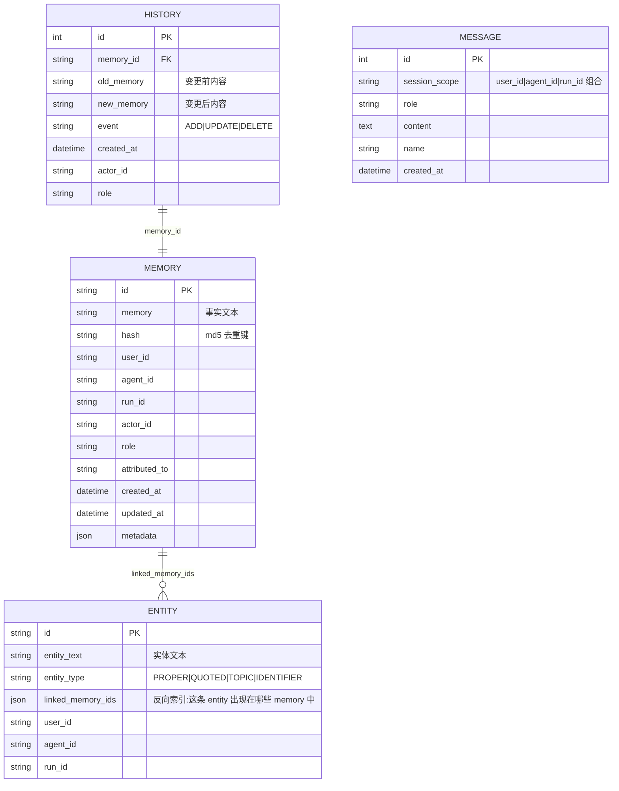
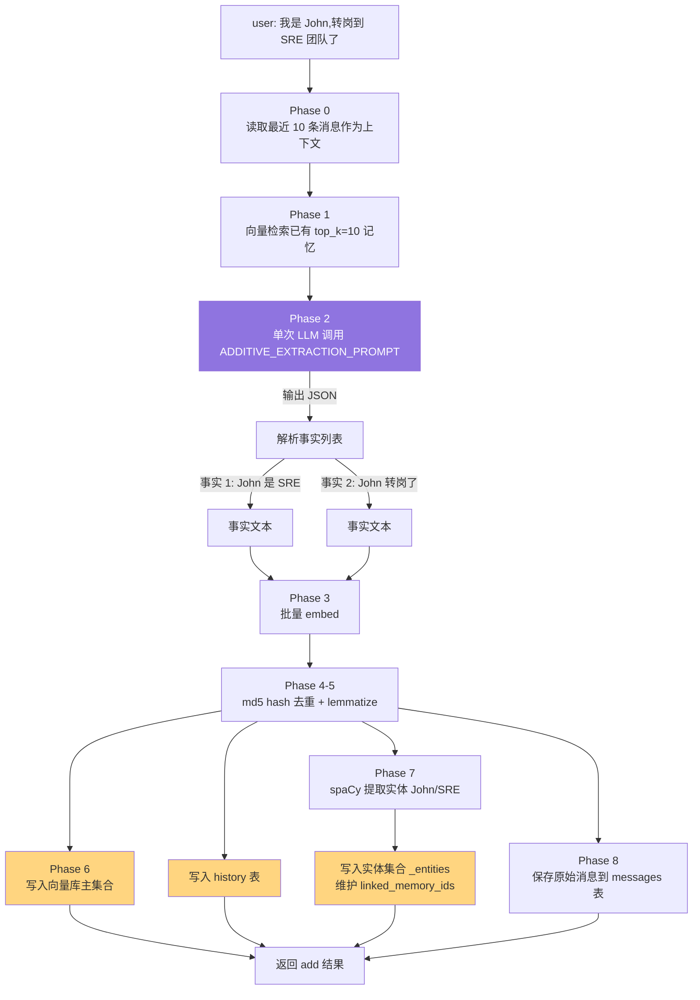

# 03. 核心概念 — Memory / Entity / History

> **本章视角**: 🧑 用户 / 🛠 开发者
> **核心问题**: Mem0 内部到底有几个数据对象?它们如何协作?
> **预计阅读**: 10 分钟

---

## 三个核心数据对象

Mem0 在一次 `add()` 调用中会操作三个数据对象:

| 对象 | 中文 | 存储位置 | 作用 |
|---|---|---|---|
| **Memory** | 记忆条目 | 向量库(主集合) | 事实文本 + 嵌入向量,检索的最小单元 |
| **Entity** | 实体 | 向量库(独立集合 `${collection}_entities`) | 从事实中抽取的命名实体(人/物/概念),用于相关性加权 |
| **History** | 历史 | 本地 SQLite(`history.db`) | 审计通道,记录每次 ADD/UPDATE/DELETE |

它们的关系不是层级,而是**互补索引**:



**图 3.1** — 三表 ER 关系:Memory 与 Entity 是多对多(反向索引);History 是 Memory 的变更日志;Message 是最近 10 条对话原文(供下次 add() 用作上下文)。

---

## Memory(记忆条目)

### 数据结构

`mem0/configs/base.py:16` 定义的 `MemoryItem`:

```python
class MemoryItem(BaseModel):
    id: str              # UUID,vector store 主键
    memory: str          # 事实文本(由 LLM 抽取后的纯净文本)
    hash: str            # md5(memory),用于去重
    metadata: dict       # 用户传入的任意元数据
    score: float | None  # 检索时的相关度分数(仅 search 返回)
    created_at: datetime
    updated_at: datetime
```

### 关键派生字段

每次存储时,Mem0 会自动生成或提升以下字段:

- **`hash`**:`md5(memory)`,确保相同事实只存一次
- **`created_at` / `updated_at`**:ISO 8601 UTC
- **`text_lemmatized`**:`memory` 的词形还原结果,供 BM25 关键词检索使用(不暴露给 API)

提升到 API 响应顶层的字段(从 metadata 中浮出来,方便业务直接用):

- `user_id` / `agent_id` / `run_id`:作用域
- `actor_id`:如果原始 message 有 `name` 字段
- `role`:assistant / user / system
- `attributed_to`:LLM 抽取时判断"这条事实是谁说的"
- `expiration_date`:过期时间(YYYY-MM-DD),过期后默认从搜索中隐藏

---

## Entity(实体)

### 为什么需要实体?

向量检索对"语义相似"很强,但对"是否提到同一个具体的人/物/概念"较弱。例如:

- 查询:"John 的猫叫什么?"
- 候选记忆:"John 养了一只暹罗猫,叫 Whiskers"
- 候选记忆:"John 喜欢咖啡"

向量相似度会让两条都排前面,但**实体链接**(Entity Linking)可以精确告诉检索器:"这条记忆提到了 'John'(实体),而你的查询也提到了 'John',应当加权"。

### 实体类型

`mem0/utils/entity_extraction.py` 用 spaCy 做命名实体识别(NER),把抽取出的实体分四类:

| 类型 | 示例 | 用途 |
|---|---|---|
| `PROPER` | "John", "PostgreSQL" | 专有名词,优先权重 |
| `QUOTED` | `"q3-launch"` | 引号包裹,通常是项目代号或代号 |
| `TOPIC` | "machine learning" | 主题短语 |
| `IDENTIFIER` | "PR #1234", "RFC-9457" | 技术标识符 |

### 实体存储与反向链接

实体也存到向量库,但在**独立集合** `${collectionName}_entities` 中,避免污染主检索。每条实体 payload:

```python
{
    "data": "John",                # 实体文本
    "entity_type": "PROPER",
    "linked_memory_ids": ["mem-uuid-1", "mem-uuid-2"],  # 反向索引
    "user_id": "alice",
    "agent_id": None,
    "run_id": None,
}
```

更新记忆时,Mem0 会同步维护这张反向索引——某条 memory 被删除,所有引用它的实体的 `linked_memory_ids` 都会被修剪(详见 `mem0/memory/main.py:647` 的 `_remove_memory_from_entity_store`)。

### 实体的检索加权

在 `search()` 时,如果 query 里有 "John",Mem0 会:

1. 把 "John" 作为 query entity 提取
2. 在 entity store 里语义搜 "John"(阈值 0.5)
3. 找到 "John" 的 `linked_memory_ids`
4. 给这些 memory 加 **entity boost**(权重 `ENTITY_BOOST_WEIGHT = 0.5`,再除以 `1 + 0.001*(N-1)^2` 抑制过度链接)

详见 [第 7 章](./07-search()检索流程深度解析.md)。

---

## History(历史)

### SQLite 双表

`mem0/memory/storage.py` 的 `SQLiteManager` 管理两张表:

| 表 | 作用 |
|---|---|
| `history` | 每次 ADD/UPDATE/DELETE 的变更日志(audit log) |
| `messages` | 最近 10 条原始对话消息(供 add() Phase 0 作上下文) |

### `history` 表 schema

```sql
CREATE TABLE history (
    id           INTEGER PRIMARY KEY,
    memory_id    TEXT NOT NULL,
    old_memory   TEXT,            -- 变更前内容(UPDATE/DELETE 时)
    new_memory   TEXT,            -- 变更后内容(ADD/UPDATE 时)
    event        TEXT NOT NULL,   -- 'ADD' | 'UPDATE' | 'DELETE'
    created_at   TEXT NOT NULL,
    updated_at   TEXT NOT NULL,
    is_deleted   INTEGER DEFAULT 0,
    actor_id     TEXT,
    role         TEXT
);
```

每次 `add()` 完成后,Mem0 会为每条新 memory 写入一行 `event='ADD'` 的记录;`update()` 同时写一行 `UPDATE`;`delete()` 写一行 `DELETE`。

### `messages` 表 schema

```sql
CREATE TABLE messages (
    id            INTEGER PRIMARY KEY,
    session_scope TEXT NOT NULL,  -- 'user_id=alice|agent_id=None|run_id=None' 形式
    role          TEXT NOT NULL,
    content       TEXT NOT NULL,
    name          TEXT,
    created_at    TEXT NOT NULL
);
```

只保留每个 `session_scope` 下**最近 10 条**消息,超过会被自动覆盖。它的作用是:下次 `add()` 时,Mem0 会把这 10 条历史消息作为"对话上下文"塞进 prompt(Phase 0),让 LLM 抽取时考虑上下文,而不是只看当前轮次。

---

## 三者协作:一条 user message 的完整旅程



**图 3.2** — 一条 user message 从输入到变成 2 条 Memory + 2 条 Entity + 1 条 history + 1 条 message 的完整演变。Phase 2(单次 LLM 调用)是核心创新点,详见 [第 6 章](./06-add()写入流程深度解析.md)。

---

## 为什么需要 Entity?

一个常见疑问:既然向量检索已经能找相似文本,为何还要单独维护实体?**

| 维度 | 仅用向量检索 | 向量 + Entity |
|---|---|---|
| 召回准确率 | 一般 | **高** |
| 跨事实串联 | 弱 | **强**(同一实体多记忆串联) |
| 拼写变体容忍 | 中 | **高**(都用同一实体 ID) |
| 存储成本 | 低 | 中(额外一张 entity 集合) |
| 写入成本 | 低 | 中(多一次 NER) |

在 [examples/graph-db-demo/](https://github.com/mem0ai/mem0/tree/main/examples/graph-db-demo) 中有更激进的"实体关系图"做法,可与 Neo4j / Memgraph / Kuzu 集成,本手册暂不展开。

---

## 本章小结

| 对象 | 类比 | 何时被读取 |
|---|---|---|
| **Memory** | 一条事实 | `search` 主路径 |
| **Entity** | 事实的"标签" | `search` 时计算 boost |
| **History** | 事实的"变更日志" | `history()` API + 调试 |
| **Message** | 最近 10 条对话原文 | 下次 `add()` 时作为 LLM 上下文 |

---

## 延伸阅读

- [第 4 章:Python SDK 完整使用](./04-Python-SDK完整使用.md) — `Memory` 类的 API 表面
- [第 6 章:add() 流程深度解析](./06-add()写入流程深度解析.md) — 8 phases 流水线
- [第 7 章:search() 流程深度解析](./07-search()检索流程深度解析.md) — entity boost 在检索中的运用