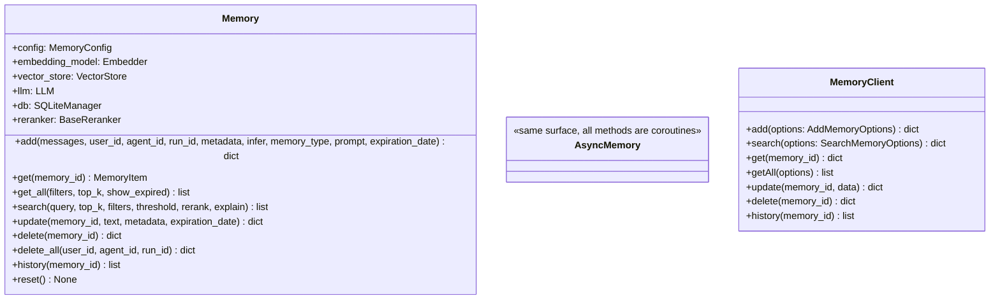
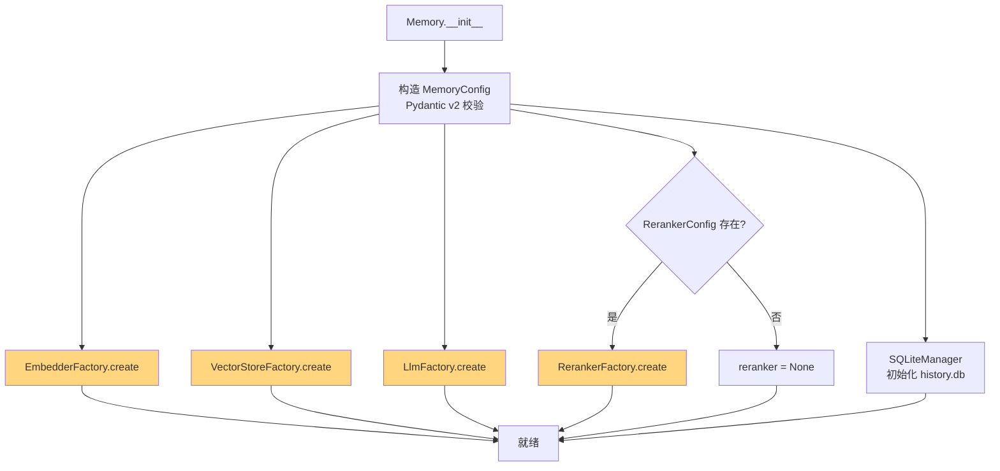

# 04. Python SDK 完整使用

> **本章视角**: 🛠 开发者
> **核心问题**: `Memory` / `AsyncMemory` / `MemoryClient` 三个类的完整 API 表面是怎样的?如何处理异常?
> **预计阅读**: 12 分钟

---

## 安装与依赖

```bash
# 仅托管云服务(最轻量)
pip install mem0ai

# 自托管 OSS(需要向量库 + LLM + 嵌入)
pip install mem0ai[extras]

# 单独补齐某类 Provider
pip install "mem0ai[pgvector]"        # pgvector 后端
pip install "mem0ai[qdrant]"          # Qdrant
pip install "mem0ai[graph]"           # 图数据库(Kuzu / Neo4j)
pip install "mem0ai[anthropic]"       # Anthropic Claude
pip install "mem0ai[cohere]"          # Cohere 嵌入/重排
```

> 版本与 Python 兼容性:**Python 3.9 - 3.12**,SDK 主版本以 `pyproject.toml` 为准。

---

## 顶层 API:`mem0` 包的四个门面类

```python
from mem0 import Memory, AsyncMemory, MemoryClient, AsyncMemoryClient
```

| 类 | 文件 | 异步? | 数据落点 |
|---|---|---|---|
| `Memory` | `mem0/memory/main.py:482` | 否(同步) | 本地向量库 |
| `AsyncMemory` | `mem0/memory/main.py:2161` | 是(`asyncio.to_thread`) | 本地向量库 |
| `MemoryClient` | `mem0/client/main.py:1+` | 否 | api.mem0.ai |
| `AsyncMemoryClient` | `mem0/client/main.py` | 是 | api.mem0.ai |

四者方法名与参数**几乎完全一致**(除少量 scoped options 用 `filters={}` 形式),后文以 `Memory` 为代表展开。

---

## `Memory` 类方法树



**图 4.1** — `Memory` 公开方法树(`AsyncMemory` 同步镜像,所有方法变 coroutine)。

---

## 构造:`Memory(config)`

### 方式 A:从 dict 构造

```python
from mem0 import Memory

memory = Memory.from_config({
    "llm": {
        "provider": "openai",
        "config": {"model": "gpt-4o-mini", "temperature": 0.1},
    },
    "embedder": {
        "provider": "openai",
        "config": {"model": "text-embedding-3-small"},
    },
    "vector_store": {
        "provider": "pgvector",
        "config": {
            "host": "localhost", "port": 5432,
            "user": "postgres", "password": "secret",
            "dbname": "mem0", "collection_name": "memories",
        },
    },
    "history_db_path": "./history.db",
})
```

### 方式 B:从 `MemoryConfig` 实例构造

```python
from mem0 import Memory
from mem0.configs.base import MemoryConfig
from mem0.configs.llms.configs import LlmConfig
from mem0.configs.embeddings.configs import EmbedderConfig
from mem0.configs.vector_stores.configs import VectorStoreConfig

memory = Memory(config=MemoryConfig(
    llm=LlmConfig(provider="anthropic", config={"model": "claude-sonnet-4-6"}),
    embedder=EmbedderConfig(provider="openai", config={"model": "text-embedding-3-small"}),
    vector_store=VectorStoreConfig(provider="qdrant", config={"path": ":memory:"}),
))
```

### 默认值(零配置启动)

```python
memory = Memory()
# llm: openai / gpt-4o-mini(读 OPENAI_API_KEY 环境变量)
# embedder: openai / text-embedding-3-small
# vector_store: qdrant / 本地文件 ~/mem0/default
# history_db_path: ./memory_history.db
# reranker: None
```

---

## 核心方法(行号引用可验证)

| 方法 | 行号 | 关键参数 | 返回 |
|---|---|---|---|
| `add(messages, *, user_id, agent_id, run_id, metadata, infer, memory_type, prompt, expiration_date)` | `main.py:755` | messages: str / dict / list[dict] | `{"results": [{"id", "memory", "event"}]}` |
| `get(memory_id)` | `main.py:1203` | UUID | 单条 `MemoryItem` |
| `get_all(*, filters, top_k=20, show_expired=False)` | `main.py:1250` | `filters={"user_id": "alice"}` | `list[MemoryItem]` |
| `search(query, *, top_k=10, filters, threshold=0.1, rerank=False, explain=False)` | `main.py:1374` | `query` 自然语言 | `{"results": [...], "relations": ...}` |
| `update(memory_id, text, metadata, expiration_date)` | `main.py:1810` | 文本 / 元数据 | `{"id", "memory", "event": "UPDATE"}` |
| `delete(memory_id)` | `main.py:1864` | UUID | `{"message", "id", "event": "DELETE"}` |
| `delete_all(*, user_id, agent_id, run_id)` | `main.py:1885` | 三选一 | `{"message", "deleted": N}` |
| `history(memory_id)` | `main.py:1941` | UUID | `list[dict]` 变更日志 |
| `reset()` | `main.py:2119` | — | 清空所有集合与历史 |

---

## `AsyncMemory`:asyncio 友好版本

```python
from mem0 import AsyncMemory

memory = AsyncMemory(...)  # 构造参数与 Memory 完全相同

async def main():
    result = await memory.add("我叫张三", user_id="alice")
    hits = await memory.search("用户姓名", user_id="alice", limit=3)
```

`AsyncMemory` 的实现关键(见 `mem0/memory/main.py:2161` 起):

- 所有公开方法都是 `async def`
- 同步阻塞调用(vector_store / embedder / db / LLM)统一包在 `asyncio.to_thread(...)` 里
- `delete_all` 用 `asyncio.gather` 并行删除
- `reranker.rerank` 通过 `to_thread` 包装

**好处**:你可以直接 `await`,不会被一个 LLM 阻塞整个事件循环。**坑点**:每次 `await` 都触发一次 GIL 切换,极度高并发场景(数千 qps)需要自己评估吞吐。

---

## 配置加载流程



**图 4.2** — `Memory.__init__` 内部构造顺序:4 个 Factory 并行可调用,但实际是同步顺序执行。失败时立即抛 `LLMError` / `VectorStoreError` / `EmbeddingError`。

---

## 常见模式代码片段

### 模式 1:按 `user_id` 隔离(最常见)

```python
memory.add("我叫张三,职业是 DBA", user_id="alice")
hits = memory.search("姓名", user_id="alice")  # 只能查到 alice 的记忆
```

### 模式 2:按 `agent_id` 隔离(多 Agent 共享用户档案)

```python
# 同一个用户 alice,多个 Agent 各自维护一套记忆
memory.add("我喜欢用 PostgreSQL", agent_id="agent_a", user_id="alice")
memory.add("我今天心情不好", agent_id="agent_b", user_id="alice")
```

### 模式 3:`run_id` 临时会话

```python
# 单次任务内的临时记忆,任务结束可 delete_all
memory.add("Task A 进度: 30%", run_id="run-2026-01-15-task-a", user_id="alice")
memory.delete_all(run_id="run-2026-01-15-task-a")
```

### 模式 4:`filters` 元数据过滤

```python
# 高级过滤器,支持 AND/OR/IN/NOT/wildcard
memory.search("用户偏好", user_id="alice", filters={
    "AND": [
        {"metadata.category": "food"},
        {"metadata.importance": {"gte": 3}},
    ]
})
```

### 模式 5:自定义 prompt

```python
memory.add("...对话内容...", user_id="alice", prompt="""
你是一个用户画像助手,请从对话中抽取以下类型的事实:
- 个人基本信息(姓名、年龄、职业)
- 长期偏好(口味、习惯)
- 重要事件(转岗、搬家、关系变化)
忽略一次性的临时状态(今天天气、当前心情)。
""")
```

---

## 异常体系:8 种类型化错误

`mem0/exceptions.py` 定义了一个继承 `MemoryError` 的类型化错误树,每种异常都带 `error_code / details / suggestion / debug_info`:

| 异常 | 触发场景 | 修复建议 |
|---|---|---|
| `Mem0ValidationError`(`VALIDATION_003` 等) | 输入 messages 格式错 / user_id 缺失 | 检查入参类型 |
| `LLMError` | LLM 调用失败 / 返回无法解析的 JSON | 检查 LLM API key、模型可用性 |
| `EmbeddingError` | embed 调用失败 | 检查 embedder 配置、维度 |
| `VectorStoreError` | 向量库连接失败 / schema 不匹配 | 检查 vector_store 配置、数据库可达性 |
| `DatabaseError` | SQLite 写失败 | 检查 history_db_path 写权限 |
| `RateLimitError` | LLM / Embedder 限流 | 降低 QPS 或升级套餐 |
| `MemoryQuotaExceededError` | 托管平台配额满 | 升级套餐或迁移到 OSS |
| `MemoryNotFoundError` | `get` / `update` / `delete` 不存在的 memory_id | 检查 ID 是否复制错 |

```python
from mem0.exceptions import LLMError, Mem0ValidationError

try:
    memory.add("...", user_id="alice")
except LLMError as e:
    print(f"LLM 失败:{e.message},code={e.error_code}")
    print(f"建议:{e.suggestion}")
except Mem0ValidationError as e:
    print(f"参数错误:{e.details}")
```

---

## 与 `MemoryClient` 的差异

| 维度 | `Memory`(OSS) | `MemoryClient`(Hosted) |
|---|---|---|
| 输入参数 | 关键字参数 `user_id=` | 关键字参数 `user_id=`(一致) |
| 输出字段 | `MemoryItem`(Python 对象) | `dict`(API JSON 响应) |
| 配置 | 运行时传入 | `api_key=` + 平台默认 Provider |
| 网络 | 仅 LLM/Embedder 出网 | 全部走 api.mem0.ai |
| 私有部署 | ✅ | ❌(平台绑定) |

---

## 本章小结

- `Memory` / `AsyncMemory` / `MemoryClient` / `AsyncMemoryClient` 四件套,API 表面 90% 相同
- `Memory` 构造依赖 4 个 Factory:LlmFactory / EmbedderFactory / VectorStoreFactory / RerankerFactory
- 8 个公开方法都在 `main.py:755~2119` 之间,行号可验证
- 8 种类型化异常让错误处理变成 if-elif 树

---

## 延伸阅读

- [第 5 章:TypeScript SDK](./05-TypeScript-SDK完整使用.md) — `mem0ai` npm 包的对应 API
- [第 6 章:add() 流程深度解析](./06-add()写入流程深度解析.md) — 每个方法内部到底做了什么
- [第 9 章:配置系统详解](./09-配置系统详解.md) — `MemoryConfig` 的所有子字段
- [第 14 章:最佳实践](./14-最佳实践与性能调优.md) — 写入/检索策略与异常处理模式