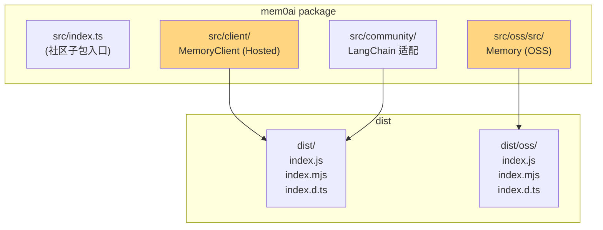

# 05. TypeScript SDK 完整使用

> **本章视角**: 🛠 开发者
> **核心问题**: `mem0ai` npm 包与 `mem0ai` PyPI 包在 API 上有何异同?Hosted 和 OSS 子路径如何切换?
> **预计阅读**: 10 分钟

---

## 安装与子路径导入

```bash
# 仅托管云服务(默认入口)
pnpm add mem0ai

# 同时需要 OSS 自托管能力
pnpm add mem0ai @qdrant/js-client-rest better-sqlite3
```

`mem0ai@3.x` 的 `package.json` 暴露了两个子路径:

| 子路径 | 默认导出 | 用途 |
|---|---|---|
| `mem0ai`(默认,即 `"."`) | `MemoryClient` | Hosted 模式 |
| `mem0ai/oss` | `Memory` | OSS 自托管模式 |

```typescript
// Hosted:连接到 api.mem0.ai
import { MemoryClient } from "mem0ai";

// OSS:本地向量库 + 本地 LLM
import { Memory } from "mem0ai/oss";
```

> 还有一个 `mem0ai/community` 子包,提供 LangChain 集成(`CommunityMem0` 适配器)。

---

## `MemoryClient`(Hosted)

定义在 `mem0-ts/src/client/mem0.ts:1-812`,**所有方法都是 `async`**(返回 Promise),**没有 `AsyncMemoryClient`**——这是 TS SDK 的一个简化:无需再有一个 Async 包装。

### 构造

```typescript
import { MemoryClient } from "mem0ai";

const client = new MemoryClient({
  apiKey: "m0-XXXXXXXXXXXXXXXXXXXX",   // 必填
  host: "https://api.mem0.ai",         // 默认值,自部署时改
});
```

构造时会发起一次 `_resolveIdentity()`(`/v1/ping/`),把 `telemetryId / organizationId / projectId` 写入 `~/.mem0/config.json`(Node 环境)用于 PostHog 身份拼接。

### 主要方法(行号引用可验证)

| 方法 | 行号 | 路由 | 说明 |
|---|---|---|---|
| `add(messages, options?)` | `mem0.ts:316` | `POST /v3/memories/add/` | 添加记忆(平台侧做抽取) |
| `search(query, options?)` | `mem0.ts:420` | `POST /v3/memories/search/` | 检索 |
| `getAll(options?)` | `mem0.ts:395` | `POST /v3/memories/` | 列出记忆 |
| `get(memoryId)` | `mem0.ts:385` | `GET /v1/memories/{id}/` | 单条 |
| `update(memoryId, {text, metadata, expirationDate})` | `mem0.ts:340` | `PUT /v1/memories/{id}/` | 更新 |
| `delete(memoryId, options?)` | `mem0.ts:448` | `DELETE /v1/memories/{id}/` | 删除 |
| `deleteAll(options?)` | `mem0.ts:465` | `DELETE /v1/memories/` | 全删(需要 scope) |
| `history(memoryId)` | `mem0.ts:483` | `GET /v1/memories/{id}/history/` | 审计日志 |
| `users(options?)` | `mem0.ts:494` | `GET /v1/entities/` | 列出实体 |
| `feedback(data)` | `mem0.ts:744` | `POST /v1/feedback/` | 提交反馈 |
| `batchUpdate / batchDelete` | `mem0.ts:592, 612` | `PUT/DELETE /v1/batch/` | 批量 |
| `webhooks.create / list / update / delete` | `mem0.ts:672-742` | `/api/v1/webhooks/...` | Webhook |
| `createMemoryExport / getMemoryExport` | `mem0.ts:758, 783` | `/v1/exports/...` | 异步导出 |

### 关键选项类型

`mem0-ts/src/client/mem0.types.ts` 定义了 Zod 风格的 options:

```typescript
import type {
  AddMemoryOptions,
  SearchMemoryOptions,
  MemoryFilters,
} from "mem0ai";

const opts: AddMemoryOptions = {
  user_id: "alice",
  agent_id: undefined,
  run_id: undefined,
  metadata: { source: "chat" },
  filters: { user_id: "alice" },   // search/getAll 必须用 filters
};
```

---

## `Memory`(OSS)

定义在 `mem0-ts/src/oss/src/memory/index.ts`(2207 行),功能与 Python `Memory` 类同构——**8 phases add pipeline、9 步 search pipeline、entity linking、BM25 hybrid scoring** 全部一致。

### 构造

```typescript
import { Memory } from "mem0ai/oss";

const memory = new Memory({
  llm: {
    provider: "openai",
    config: { model: "gpt-4o-mini", temperature: 0.1 },
  },
  embedder: {
    provider: "openai",
    config: { model: "text-embedding-3-small" },
  },
  vectorStore: {
    provider: "qdrant",
    config: { path: ":memory:", collectionName: "memories" },
  },
  historyStore: {
    provider: "sqlite",
    config: { path: "./memory.db" },
  },
});
```

### `_autoInitialize`:TS 独有特性

`memory/index.ts:256-281` 会在构造后异步探测嵌入维度:

1. 用当前 embedder 嵌入 `"dimension probe"` 字符串
2. 用返回的向量长度创建/确认 collection 维度
3. 失败时重试一次

如果你的 `Memory.fromConfig(dict)` 传入了 `dimensions` 字段,这步会被跳过。

### 主要方法(与 Python 同构)

```typescript
await memory.add(messages: string | Message[] | Message, {
  userId, agentId?, runId?, metadata?, infer?, prompt?, expirationDate?,
});
const item = await memory.get(memoryId);
const list = await memory.getAll({ filters: { userId: "alice" }, topK: 20 });
const hits = await memory.search("query", { filters: { userId: "alice" }, topK: 5 });
await memory.update(memoryId, { text?, metadata?, expirationDate? });
await memory.delete(memoryId);
await memory.deleteAll({ filters: { userId: "alice" } });
const hist = await memory.history(memoryId);
await memory.reset();
```

> TS 参数命名用 **camelCase**(`userId` 而非 `user_id`)。这是与 `MemoryClient`(Hosted,延续 Python 风格 `user_id`)的关键差异。

---

## 历史存储后端(Storage Backend)

TS SDK 把"历史存储"做成**可插拔后端**,在 `src/oss/src/storage/` 下:

| 实现 | 文件 | 何时使用 |
|---|---|---|
| `SQLiteManager` | `storage/SQLiteManager.ts` | 默认,本地文件,better-sqlite3 |
| `SupabaseHistoryManager` | `storage/SupabaseHistoryManager.ts` | 想托管 SQLite 到 Supabase 时 |
| `MemoryHistoryManager` | `storage/MemoryHistoryManager.ts` | 进程内存 `Map`,测试或极小部署 |
| `DummyHistoryManager` | `storage/DummyHistoryManager.ts` | `disableHistory: true` 时使用 |

Python SDK 目前只有 SQLite + Supabase 两种,**`MemoryHistoryManager` 与 `DummyHistoryManager` 是 TS 独有**。

---

## Python ↔ TypeScript 对照表

| 维度 | Python (`mem0ai`) | TypeScript (`mem0ai`) |
|---|---|---|
| **包大小(压缩后)** | ~5 MB(纯 Python) | ~3 MB(纯 JS,更小) |
| **托管入口** | `from mem0 import MemoryClient` | `import { MemoryClient } from "mem0ai"` |
| **OSS 入口** | `from mem0 import Memory` | `import { Memory } from "mem0ai/oss"` |
| **构造参数命名** | `user_id`, `agent_id`, `run_id`(snake) | 同(`MemoryClient`)/ camelCase(`Memory`) |
| **返回类型** | `dict`(Client)/ `MemoryItem`(OSS) | `Promise<dict>` |
| **异步 Client** | 有 `AsyncMemoryClient` | 无(所有方法已 async) |
| **LLM Providers** | 18 种 | 19 种(`minimax` TS 独有) |
| **Vector Stores** | 25+ 种 | 27 种(TS 独有 8 个) |
| **历史后端** | SQLite + Supabase | SQLite + Supabase + 内存 + Dummy |
| **配置 Schema** | Pydantic v2 | Zod |
| **可选依赖处理** | 导入时 import 失败抛错 | `load_peer.ts` 延迟 dynamic import |
| **Build 产物** | wheel / sdist | CJS + ESM + `.d.ts`(tsup) |

### TS 独有的 Provider(8 + 3)

**Vector Store 独有**(Python 暂无):

- `azure_mysql`
- `mongodb`
- `vectorize`(Cloudflare)
- `s3_vectors`(AWS S3 Vectors)
- `turbopuffer`
- `valkey`(Redis fork)
- `oracledb`
- `vertex_ai_vector_search`

**LLM 独有**:

- `minimax`(Minimax)
- `sarvam`(印度语言模型)
- `openai_structured`(OpenAI 带工具调用 + 结构化输出)

如果你要用以上 Provider,TS SDK 是当下唯一选项(部分在 Python 路线图上跟进)。

---

## 包结构与构建产物



**图 5.1** — TypeScript SDK 包结构:`tsup.config.ts` 同时构建 `src/client/index.ts`(默认)与 `src/oss/src/index.ts`(子路径),产物 CJS + ESM + `.d.ts` 三套。

`tsup.config.ts` 的 `external` 列表把所有 Provider SDK 标记为 peer dependencies——**没有用到 OpenAI/Anthropic/Qdrant 时不会强制安装它们**,这是 `load_peer.ts`(`utils/load_peer.ts`)的静态配合。

---

## Python vs TypeScript API 对照

| 操作 | Python | TypeScript |
|---|---|---|
| 构造 | `Memory(config_dict)` | `new Memory(config)` |
| 同步 add | `memory.add(..., user_id=...)` | `await memory.add(..., {userId: ...})` |
| 同步 search | `memory.search(query, user_id=...)` | `await memory.search(query, {filters: {...}})` |
| 异步包装 | `await AsyncMemory(...)` | 不需要(已 async) |
| 异常处理 | `except LLMError as e:` | `try { ... } catch (e) { if (e instanceof LLMError) ... }` |
| 类型 | `MemoryItem` dataclass | `interface MemoryItem` (Zod schema) |
| 高级过滤 | `filters={"AND": [...]}` | `filters={{ AND: [...] }}` |

**图 5.2** — Python/TS API 在语法风格、命名约定、类型系统上的差异。核心语义保持一致。

---

## TypeScript 环境的"陷阱"

### 1. ESM / CJS 互操作

`mem0ai` 默认既导出 CJS 又导出 ESM。如果你的项目是纯 ESM 且 `module: "NodeNext"`,需要:

```json
{
  "compilerOptions": {
    "moduleResolution": "NodeNext"
  }
}
```

### 2. `better-sqlite3` 是 native module

首次 `pnpm install` 时会编译原生模块。如果部署到 AWS Lambda / Vercel Edge,需要选 `MemoryHistoryManager`(纯 JS)。

### 3. Node ≥ 18

`package.json` 的 `engines.node` 强制 ≥ 18。低版本会安装失败。

### 4. Zod 版本对齐

`mem0ai` 内部用 Zod 3.x。如果你的项目用 Zod 4,会出现 `Cannot find module 'zod/v3'` 之类错误,**固定到 Zod 3.23+**。

---

## 本章小结

- `mem0ai` 默认 = `MemoryClient`(Hosted),`mem0ai/oss` = `Memory`(OSS)
- TS SDK **没有** `AsyncMemoryClient`,所有方法已 async
- 8 个 TS 独有 Vector Store + 3 个 TS 独有 LLM 是 TS 优势
- 配置用 Zod Schema(非 Pydantic),参数命名 camelCase
- 历史存储有 4 种后端可选,Python 只有 2 种

---

## 延伸阅读

- [第 4 章:Python SDK](./04-Python-SDK完整使用.md) — 同构 API 的另一侧
- [第 6 章:add() 流程](./06-add()写入流程深度解析.md) — Python/TS 共享同一份 8 phases
- [第 9 章:配置系统详解](./09-配置系统详解.md) — Pydantic 与 Zod 的差异
- [第 13 章:集成生态](./13-集成生态-Vercel-Plugin-Workflow.md) — Vercel AI SDK 用 TS Provider