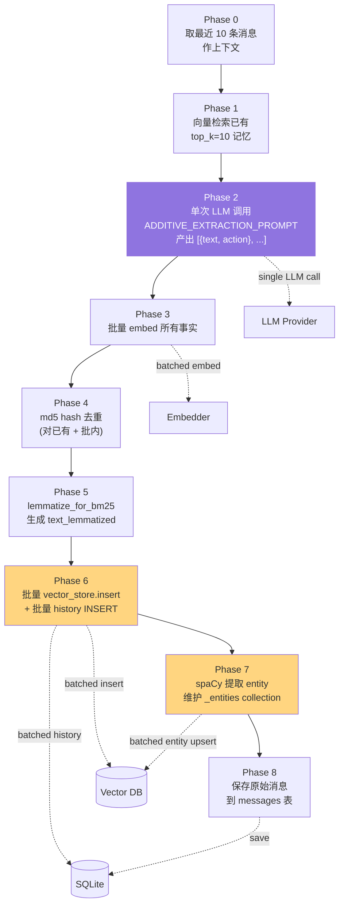
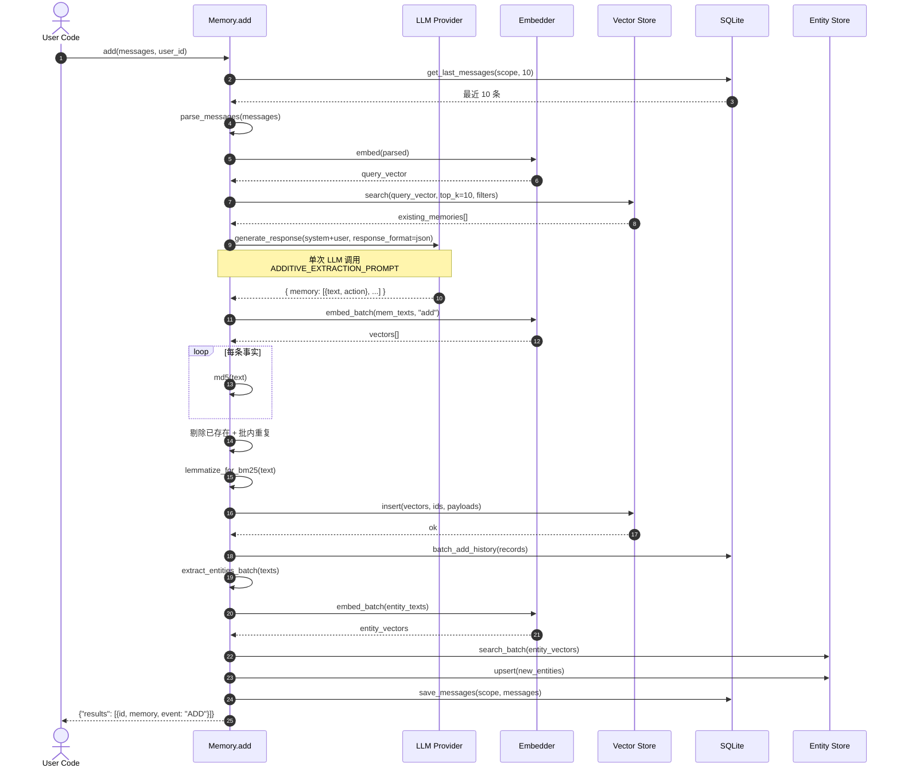

# 06. `add()` 写入流程深度解析

> **本章视角**: 🛠 开发者 / 🏛 架构师
> **核心问题**: `Memory.add(messages)` 到底做了什么?为什么 mem0 是"Extract-on-write"?
> **预计阅读**: 12 分钟

---

## 调用的全貌

```python
memory.add(
    "我今天转岗到 SRE 团队,负责数据库",
    user_id="alice",
)
```

这 1 行 Python 会触发 **`Memory._add_to_vector_store`**(`mem0/memory/main.py:874`),内部有 **8 个 phases**(V3 phased batch pipeline)。Phase 之间的中间结果会进入下一 Phase,**单次调用 1 次 LLM、1 次 batched embed、1 次 batched vector insert**。

> Python 与 TypeScript SDK 在这 8 个 phases 上**完全同构**(对应 `mem0-ts/src/oss/src/memory/index.ts:819` 的 `addToVectorStore`)。

---

## 8 Phases 全景



**图 6.1** — `Memory._add_to_vector_store` 的 8 phases 全景。**紫色 Phase 2 是唯一一次 LLM 调用**(其他 LLM 出现在 rerank 中);**黄色 Phase 6、7 是两次落库**。

---

## 端到端时序图



**图 6.2** — `add()` 从 messages 输入到 results 返回的完整时序(共 4 个外部调用:LLM 1 次、Embed 2 次 batched、Vector insert 1 次 batched、Entity search/upsert、SQLite 多次)。

---

## Phase 详解

### Phase 0:取最近 10 条消息(上下文)

```python
# mem0/memory/main.py:913
session_scope = {"user_id": user_id, "agent_id": agent_id, "run_id": run_id}
last_messages = self.db.get_last_messages(session_scope=session_scope, limit=10)
parsed_last = parse_messages(last_messages)  # "role: content\n" 形式
```

**为什么需要?** LLM 在抽取事实时,要看到最近的对话历史才能判断"这条信息是新事实,还是对之前事实的更新/修正"。

例如,如果 `last_messages` 显示"Alice 是 DBA",而当前输入是"Alice 转岗到 SRE",LLM 应该输出两条动作:
- `{"text": "Alice 是 SRE", "action": "ADD"}`(新事实)
- `{"text": "Alice 是 DBA", "action": "DELETE"}`(旧事实)

### Phase 1:检索已有 top_k=10

```python
# mem0/memory/main.py:920
existing_memories = self.vector_store.search(
    query=parsed_messages_embedding,
    top_k=10,
    filters=effective_filters,
)
```

**为什么需要?** 给 LLM 看"目前数据库里已经有什么",避免重复存储。LLM 据此输出 `action: "ADD" / "UPDATE" / "DELETE"`,这是 mem0 单次 LLM 调用能产出多动作的核心机制。

返回的记忆会按出现顺序编号为 `"0", "1", ..., "9"`(作为 ID 占位),让 LLM 在 prompt 里引用 `memory_3` 这样的位置。

### Phase 2:**单次 LLM 调用**(核心创新)

```python
# mem0/memory/main.py:937
system_prompt = ADDITIVE_EXTRACTION_PROMPT  # ~480 行模板
if agent_id:
    system_prompt += AGENT_CONTEXT_SUFFIX

user_prompt = build_user_prompt(
    existing_memories=numbered_existing,
    new_messages=parsed_last,
    last_k_messages=parsed_last,
    custom_instructions=custom_prompt,
)

response = self.llm.generate_response(
    messages=[
        {"role": "system", "content": system_prompt},
        {"role": "user", "content": user_prompt},
    ],
    response_format={"type": "json_object"},
)
```

`ADDITIVE_EXTRACTION_PROMPT` 的关键指令(`mem0/configs/prompts.py:468`):

> "你是一个记忆抽取助手。请从 `New Messages` 中抽取**新增或更新**的事实,与 `Existing Memories` 比对,**不要重复**。对每条事实,指定 `action`:
>
> - `ADD` — 这是新事实,应存储
> - `UPDATE` — 这修改了 existing memories 中的某条,**给出 `updated_memory_id` 引用编号**
> - `DELETE` — 这使 existing memories 中的某条过时
> - `NONE` — 这不构成事实
>
> 输出严格 JSON:`{"memory": [{"text": "...", "action": "ADD|UPDATE|DELETE|NONE", "updated_memory_id": "..."}]}`"

LLM 的 response 必须能解析为 JSON,失败时抛 `LLMError`。

### Phase 3:批量嵌入

```python
# mem0/memory/main.py:989
mem_texts = [item["text"] for item in extracted_memories]
vectors = self.embedding_model.embed_batch(mem_texts, "add")
```

**关键参数 `"add"`**:某些 Embedder(如 Voyage / OpenAI v3)对"存储用"和"查询用"的嵌入模型不同,mem0 透传 `memoryAction` 参数让 Embedder 自行选择。

### Phase 4:md5 hash 去重

```python
# mem0/memory/main.py:1000
for fact in facts:
    fact["hash"] = hashlib.md5(fact["text"].encode()).hexdigest()

# 对已有 + 批内双重去重
seen = {m["hash"] for m in existing_memories}
deduped = [f for f in facts if f["hash"] not in seen and f["hash"] not in local_seen]
```

两次去重:**对已有**(避免重复 ADD)+ **批内**(避免同次 ADD 中两条相同)。

### Phase 5:词形还原(BM25 用)

```python
# mem0/memory/main.py:1015
for fact in facts:
    fact["text_lemmatized"] = lemmatize_for_bm25(fact["text"])
```

`lemmatize_for_bm25`(`mem0/utils/lemmatization.py`)用 spaCy 做词形还原:

- "running" → "run"
- "databases" → "database"
- 但保留 "-ing" 形式以防歧义("running water" 不还原)

这个字段**不进向量**,只进 BM25 倒排索引,用于 `search()` 时的关键词召回。

### Phase 6:**批量插入** + 批量历史

```python
# mem0/memory/main.py:1045
try:
    self.vector_store.insert(vectors=vectors, ids=ids, payloads=payloads)
except Exception:
    # 失败 fallback:逐条插入(避免一条坏数据污染整批)
    for v, i, p in zip(vectors, ids, payloads):
        self.vector_store.insert([v], [i], [p])

# history 表批量写
self.db.batch_add_history(history_records)
```

**单次落库失败时的 graceful degradation**:整个 batch 失败时,Mem0 不会整体失败,而是**逐条**插入,只丢失真正坏掉的那一条。

Payload 字段(写入向量库):

```python
{
    "data": text,
    "hash": md5_hash,
    "text_lemmatized": lemma,
    "created_at": now_iso,
    "updated_at": now_iso,
    "user_id": user_id,
    "agent_id": agent_id,
    "run_id": run_id,
    "actor_id": actor_id,
    "role": role,
    "attributed_to": attributed_to,
    "metadata": user_metadata,
}
```

### Phase 7:实体提取与链接

```python
# mem0/memory/main.py:1082
entities_per_memory = extract_entities_batch(all_texts)

# 全局 dedup
all_entity_texts = set()
for ents in entities_per_memory:
    for e in ents:
        all_entity_texts.add(e["text"])

# 一次性批量嵌入
entity_vectors = self.embedding_model.embed_batch(list(all_entity_texts), "add")

# 在 entity_store 上做 batch search(找重复实体)
existing_entities = self.entity_store.search_batch(entity_vectors)

# 阈值 ≥ 0.95 视为同一实体;否则新建
# 批量 insert / update 一次
self.entity_store.insert(...)
```

这一步在 `$collectionName_entities` 集合上工作,存储格式:

```python
{
    "data": "John",
    "entity_type": "PROPER",
    "linked_memory_ids": ["mem-uuid-1", "mem-uuid-3"],
    "user_id": "alice",
}
```

### Phase 8:保存原始消息

```python
# mem0/memory/main.py:1188
self.db.save_messages(scope, messages)
```

写入 SQLite `messages` 表,**只保留每个 scope 下最近 10 条**。下次 `add()` 时被 Phase 0 读取。

---

## ADD / UPDATE / DELETE 三类动作的处理

| 动作 | 来源 | 处理 |
|---|---|---|
| `ADD` | Phase 2 LLM 输出 | 分配新 UUID,Phase 6 insert + Phase 7 entity link |
| `UPDATE` | Phase 2 LLM 输出 + `updated_memory_id` | Phase 4-5 跳过(只更新不重存),Phase 6 调用 `vector_store.update(vector_id, new_vector, new_payload)`,并修改 entity 反向索引 |
| `DELETE` | Phase 2 LLM 输出 | Phase 6 调用 `vector_store.delete(vector_id)`,并清理所有相关 entity 的 `linked_memory_ids` |

**幂等性**:连续两次 `add` 完全相同的消息,第二次会因为 md5 已存在而**不会**插入新行——这是 hash 去重的副产物。

---

## 并发与一致性考量

- **单次 add() 是事务性的**:LLM 失败 → 抛 `LLMError`,什么也不写;vector insert 部分失败 → fallback 逐条,只丢坏数据
- **多次 add() 并发**:**不安全**。SQLite 是单写者,向量库若不支持事务,可能产生重复 UUID。Mem0 假设调用方做应用层串行
- **跨进程 add()**:如果两个 Python 进程同时对同一 `user_id` add,Phase 6 的去重用的是"调用开始时"快照,可能短暂重复。生产环境建议 Redis 锁或 `user_id` 级互斥

---

## 性能热点

| Phase | 占比 | 优化方向 |
|---|---|---|
| Phase 2 (LLM) | ~60% | 选快的模型(`gpt-4o-mini`)、缓存 `existing_memories`、减少 prompt 长度 |
| Phase 3 (embed) | ~25% | 用本地模型(`bge-small`)、batched 越大越好 |
| Phase 7 (entity) | ~10% | 关掉 spaCy(`disable_entity_extraction=true`)、降级到简单正则 |
| 其他 | ~5% | — |

LLM 是最大瓶颈。详见 [第 14 章](./14-最佳实践与性能调优.md)的"LLM 成本"小节。

---

## 本章小结

- `add()` 内部是 **8 phases 流水线**:`context → recall → extract → embed → dedup → lemmatize → insert → entity_link → save`
- **唯一一次 LLM 调用**(Phase 2)是 mem0 的核心创新点,产出 `ADD/UPDATE/DELETE/NONE` 多动作
- **批量失败降级**:vector insert 整体失败时退化为逐条,保证最大可用性
- **幂等** + **作用域** + **历史审计** 三件套让 add() 既安全又可追溯

---

## 延伸阅读

- [第 3 章:核心概念](./03-核心概念-Memory-Entity-History.md) — Memory / Entity / Message 三表结构
- [第 7 章:search() 流程](./07-search()检索流程深度解析.md) — 检索侧如何使用 add() 产出的 entity
- [第 8 章:Provider 生态](./08-Provider生态全景.md) — 切换 LLM / Embedder / Vector Store 的影响
- [第 14 章:最佳实践](./14-最佳实践与性能调优.md) — 写入延迟与成本的优化手法