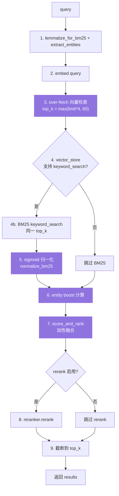
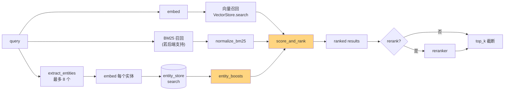

# 07. `search()` 检索流程深度解析

> **本章视角**: 🛠 开发者 / 🏛 架构师
> **核心问题**: `Memory.search(query)` 内部做了什么?为什么 hybrid 召回能比纯向量检索更准?
> **预计阅读**: 12 分钟

---

## 调用签名

```python
hits = memory.search(
    query="用户最近在做什么",
    user_id="alice",
    top_k=5,
    filters={"AND": [{"metadata.category": "task"}]},
    threshold=0.3,         # semantic 分数阈值(默认 0.1)
    rerank=True,          # 是否启用 reranker
)
```

返回结构:

```python
{
    "results": [
        {"id": "...", "memory": "...", "score": 0.87, "metadata": {...}},
        ...
    ],
    "relations": [...],  # 仅当 graph_store 启用时有内容
}
```

> `search()` / `get_all()` 必须用 `filters={...}` 传入 `user_id`/`agent_id`/`run_id`,传顶层 `user_id=` 会抛 `ValueError`(`mem0/memory/main.py:319-325`)。

---

## 9 步检索管线



**图 7.1** — `Memory._search_vector_store`(`mem0/memory/main.py:1623`)的 9 步管线。紫色是核心融合逻辑。

---

## 三路召回与加性融合



**图 7.2** — 检索的三路召回 + 加性融合。向量、BM25、entity boost 三路并行打分,最终线性相加。

---

## 各步骤详解

### Step 1:预处理(并行两件事)

```python
# mem0/memory/main.py:1623
query_lemmatized = lemmatize_for_bm25(query)
query_entities = extract_entities(query)[:8]  # 最多 8 个
```

- **lemmatize**:为后续 BM25 召回准备,匹配 `text_lemmatized` 字段
- **extract_entities**:为 entity boost 准备,只取前 8 个(防 LLM 幻觉)

### Step 2:嵌入 query

```python
# mem0/memory/main.py:1630
query_embedding = self.embedding_model.embed(query, "search")
```

注意 `memory_action="search"`,某些 Embedder(Voyage、Cohere v3)对查询和存储用不同模型。

### Step 3:**Over-fetch**(精排的前提)

```python
# mem0/memory/main.py:1635
over_fetch_k = max(top_k * 4, 60)
semantic_results = self.vector_store.search(
    query=query_embedding,
    top_k=over_fetch_k,
    filters=effective_filters,
)
```

**为什么 over-fetch?** 后续要做 hybrid fusion,需要更多候选才能保证 top_k 里有真正相关的。`top_k=10` 时实际召回 60 条。

### Step 4-5:BM25 关键词召回(可选)

```python
# mem0/memory/main.py:1650
if hasattr(self.vector_store, "keyword_search"):
    keyword_results = self.vector_store.keyword_search(
        query=query_lemmatized,
        top_k=over_fetch_k,
        filters=effective_filters,
    )
    bm25_raw_scores = {r["id"]: r["score"] for r in keyword_results}
else:
    bm25_raw_scores = {}

# 归一化到 [0, 1](sigmoid)
midpoint, steepness = get_bm25_params(query, query_lemmatized)  # query 长度自适应
bm25_scores = {
    id_: normalize_bm25(raw, midpoint, steepness)
    for id_, raw in bm25_raw_scores.items()
}
```

**归一化的关键**:`get_bm25_params` 根据 query 长度调整 sigmoid 的中点和陡度(`mem0/utils/scoring.py:16`):

| Query 长度 | 中点 | 陡度 | 解释 |
|---|---|---|---|
| 1-2 token | 5 | 0.3 | 短查询,BM25 普遍偏高,降权 |
| 3-5 | 9 | 0.4 | 中等 |
| 6-8 | 14 | 0.5 | 长查询,BM25 普遍较低,放宽 |
| ≥ 9 | 18 | 0.6 | 长查询,信号更强 |

### Step 6:Entity boost(核心加分项)

```python
# mem0/memory/main.py:1728
entity_boosts = {}
if query_entities and self._entity_store:
    for ent_text in query_entities:
        ent_vec = self.embedding_model.embed(ent_text, "search")
        matches = self._entity_store.search(ent_vec, top_k=1, filters=filters)
        if matches and matches[0]["score"] >= 0.5:
            entity = matches[0]["payload"]
            weight = ENTITY_BOOST_WEIGHT  # 0.5
            n = len(entity["linked_memory_ids"])
            dampener = 1 / (1 + 0.001 * (n - 1) ** 2)  # 反链接数加权
            for mem_id in entity["linked_memory_ids"]:
                entity_boosts[mem_id] = entity_boosts.get(mem_id, 0) + weight * dampener
```

**示例**:
- query = "John 的项目"
- 提取 entity: `["John"]`
- 搜 entity_store 找到 `John` 的 `linked_memory_ids = ["mem-1", "mem-7", "mem-23"]`
- 每条 memory 加 `0.5 * dampener` 分
- `dampener`:linked_memory_ids 多到 23 条时,每条只拿 0.5 × 0.6 ≈ 0.3,防止热门 entity 刷屏

### Step 7:`score_and_rank` 加性融合

```python
# mem0/utils/scoring.py:60
def score_and_rank(
    semantic_results,      # [{id, score, payload}]
    bm25_scores,           # {id: 0..1}
    entity_boosts,         # {id: 0..N*0.5}
    threshold,             # 仅对 semantic 打分
    top_k,
    explain=False,
):
    candidates = build_candidates(semantic_results)  # 三路对齐到同一组 ID
    for c in candidates:
        sem = c["score"]
        bm = bm25_scores.get(c["id"], 0)
        eb = entity_boosts.get(c["id"], 0)

        # adaptive max_possible
        max_possible = 1.0 + (1.0 if bm else 0) + (0.5 if eb else 0)

        c["final_score"] = (sem + bm + eb) / max_possible

    # 仅对 semantic 分数做阈值门控
    candidates = [c for c in candidates if c["score"] >= threshold]
    candidates.sort(key=lambda c: c["final_score"], reverse=True)
    return candidates[:top_k]
```

**自适应 `max_possible`** 的精妙之处:

| 实际召回得分 | `max_possible` | 归一化结果 |
|---|---|---|
| 仅向量(1 路) | 1.0 | `sem / 1.0` |
| 向量 + BM25(2 路) | 2.0 | `(sem + bm) / 2.0` |
| 向量 + BM25 + entity(3 路) | 2.5 | `(sem + bm + eb) / 2.5` |

这意味着**当某条 memory 没拿到 BM25 / entity 分时,不会因为别人拿了三路而被压制**。这是 mem0 的关键设计:让 hybrid 真正"加分"而不是"稀释"。

### Step 8:Rerank(可选)

```python
# mem0/memory/main.py:1497
if rerank and self.reranker is not None:
    try:
        return self.reranker.rerank(query, original_memories, limit=top_k)
    except Exception:
        # rerank 失败静默 fallback,不阻断主流程
        pass
```

**重要**:`rerank` 失败时**不抛异常**,静默返回加性融合的结果——保障线上稳定性。

### Step 9:截断到 top_k + 过期过滤

```python
# mem0/memory/main.py:1730
return [c for c in candidates if not payload_is_expired(c["payload"])][:top_k]
```

`payloadIsExpired` 判断 `expiration_date < today`,默认隐藏过期记忆(可通过 `show_expired=True` 强制返回)。

---

## 过滤器语义:AND / OR / IN / wildcard

`search()` 和 `get_all()` 的 `filters` 支持嵌套逻辑:

```python
filters = {
    "AND": [
        {"metadata.category": "task"},
        {"OR": [
            {"metadata.priority": {"gte": 3}},
            {"metadata.assignee": "alice"},
        ]},
        {"metadata.tags": {"in": ["urgent", "p1"]}},
        {"metadata.title": {"contains": "incident"}},
    ]
}
```

支持的算子:`eq / ne / gt / gte / lt / lte / in / nin / contains / icontains`,以及顶层 `AND / OR / NOT`(对应 `mem0/memory/main.py:1519` 的 `_processMetadataFilters`)。

---

## Hybrid 加性融合的数学直觉

为什么不用 RRF(Reciprocal Rank Fusion)或学习排序?

| 方法 | 优点 | 缺点 |
|---|---|---|
| **RRF**(倒数排名融合) | 无需归一化,对量纲不敏感 | 损失绝对置信度,排名相近的分数无法区分 |
| **学习排序**(LambdaMART) | 精度最高 | 需要训练数据,mem0 是 zero-shot 系统 |
| **加性融合 + 自适应 max**(mem0 用这个) | 无需训练,保留绝对置信度,多路信号清晰 | 极端情况下得分 > 1,需要 max_possible 校正 |

mem0 的选择是**精确性 vs 简洁性**的权衡——加性融合数学透明、易调试,且与"信号增强 vs 信号稀释"的直觉一致。

---

## 关键参数调优

| 参数 | 默认 | 调优建议 |
|---|---|---|
| `top_k` | 10 | 用户实际需要 3-5 条时设 5,再多会被 LLM 拒绝 |
| `threshold` | 0.1 | 向量库里噪声多时调高到 0.3-0.5 |
| `rerank` | False | 启用后准确率 ↑、延迟 ↑、成本 ↑(LLM 调用) |
| `filters` | `{}` | **强制带 `user_id`**(即便只想看某用户,也要写进 filters) |

---

## 性能分解(典型数据)

| 步骤 | 耗时占比 | 备注 |
|---|---|---|
| Step 1-2 预处理 | ~5% | embed 主导 |
| Step 3 向量召回 | ~15% | 数据库 IO |
| Step 4-5 BM25 | ~10% | 若启用 |
| Step 6 entity boost | ~15% | embed + entity_store.search |
| Step 7 加性融合 | < 1% | 内存计算 |
| Step 8 rerank | ~50% | **如启用 rerank,会调用 Cross-Encoder,占大头** |
| Step 9 截断 | < 1% | — |

不启用 rerank 时,Latency 通常 < 50ms(pgvector / Qdrant 本地)。启用后 +50-200ms。

---

## 本章小结

- `search()` 是 **9 步管线**,核心是 over-fetch + hybrid fusion + optional rerank
- **加性融合 + 自适应 max_possible** 是关键设计,保证多路信号"加分而非稀释"
- **Entity boost** 把命名实体的相关性精确化,解决"提到了同一 John"的语义等价问题
- **Rerank 失败静默 fallback** 是稳定性保障
- `threshold` 仅对 **semantic 分数**门控,不会误杀 BM25/boost 的高分

---

## 延伸阅读

- [第 3 章:核心概念](./03-核心概念-Memory-Entity-History.md) — Entity 在 search 中的角色
- [第 6 章:add() 流程](./06-add()写入流程深度解析.md) — search 用到的 entity linking 是 add() 时建好的
- [第 8 章:Provider 生态](./08-Provider生态全景.md) — 切换 Vector Store / Reranker 的影响
- [第 14 章:最佳实践](./14-最佳实践与性能调优.md) — over-fetch、threshold、rerank 的取舍