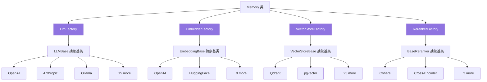
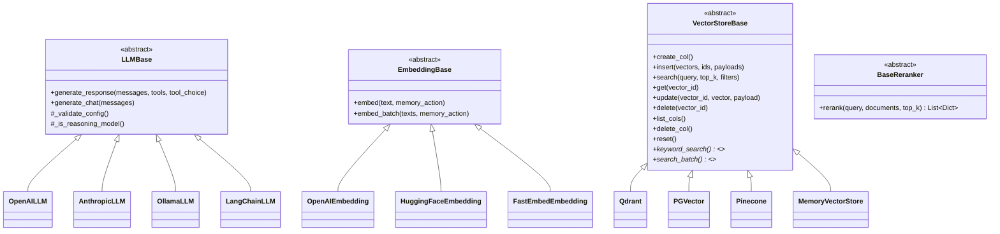
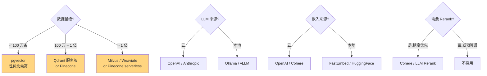

# 08. Provider 生态全景

> **本章视角**: 🛠 开发者 / 🏛 架构师
> **核心问题**: 27 个 Vector Store、18 个 LLM、5 个 Reranker、11 个 Embedder —— 怎么选?怎么扩展?
> **预计阅读**: 12 分钟

---

## 四类 Provider + Factory 模式

Mem0 把所有可替换组件抽象为 **4 类 Provider**,通过 **Factory + 抽象基类 + 配置注入** 模式动态加载:



**图 8.1** — 4 个 Factory 类(`mem0/utils/factory.py`)统一管理所有 Provider,每个 Provider 继承自己的抽象基类。

---

## Provider 类继承树



**图 8.2** — 四类 Provider 的抽象基类与典型实现。注意 `VectorStoreBase.keyword_search` 是**可选**(用 `*` 标记)——只有实现它的后端(如 Qdrant / pgvector / MemoryVectorStore)才支持 BM25 hybrid。

---

## 18 个 LLM Provider

| Provider | 调用方式 | 备注 |
|---|---|---|
| `openai` | OpenAI 官方 SDK | 默认,支持 GPT-5 系列推理模型(`gpt-5*` 用 max_completion_tokens) |
| `openai_structured` | OpenAI + tool/response_format | 强制结构化输出 |
| `azure_openai` / `azure_openai_structured` | Azure 部署 | 同上 Azure 版 |
| `anthropic` | Anthropic SDK | Claude Sonnet/Opus/Haiku,`_enable_sampling_parameters` 自动适配 |
| `groq` | OpenAI 兼容 | 高速推理 |
| `together` | OpenAI 兼容 | 多种开源模型 |
| `aws_bedrock` | AWS Bedrock SDK | Claude / Llama / Titan on AWS |
| `litellm` | LiteLLM 代理 | 200+ 模型统一接口 |
| `gemini` | Google GenAI | Gemini Pro/Flash |
| `deepseek` | OpenAI 兼容 | DeepSeek-V3/R1 |
| `minimax`(TS 独有) | Anthropic 兼容 API | Minimax |
| `xai` | OpenAI 兼容 | Grok |
| `sarvam`(TS 独有) | OpenAI 兼容 | 印度语言模型 |
| `lmstudio` | OpenAI 兼容 | 本地 LM Studio |
| `vllm` | OpenAI 兼容 | 本地 vLLM 部署 |
| `langchain` | LangChain BaseChatModel 透传 | 接入任意 LangChain 兼容模型 |
| `ollama` | Ollama HTTP | 本地 Llama / Qwen / Mistral |

**Python 与 TS 差异**:TS 独有 `minimax / sarvam / openai_structured / litellm / vllm / lmstudio / langchain / minimax / ollama` 等若干,Python 路线图在跟进。

### 选型建议

- **生产首选**:`openai`(gpt-4o-mini 速度 / gpt-4o 精度 / gpt-5-mini 性价比)或 `anthropic`(Claude Sonnet 4 适合长上下文)
- **本地私有化**:`ollama` + `qwen2.5:7b` 或 `llama3.1:8b`
- **极致性能**:`groq`(超快推理)
- **多模型路由**:`langchain` 接入 LangChain 已适配的任意 ChatModel

---

## 11 个 Embedder Provider

| Provider | 模型 | 维度 | 备注 |
|---|---|---|---|
| `openai` | text-embedding-3-small / 3-large | 1536 / 3072 | 默认 |
| `azure_openai` | 同上 | 同上 | Azure 部署 |
| `huggingface` | TEI 服务 | 视模型 | 本地 TEI / HF Inference |
| `gemini` | text-embedding-004 | 768 | |
| `vertexai` | GCP Vertex AI | 视模型 | Google Cloud |
| `together` | OpenAI 兼容 | 视模型 | |
| `lmstudio` | OpenAI 兼容 | 视模型 | 本地 |
| `langchain` | 透传 | 视模型 | LangChain Embeddings |
| `aws_bedrock` | Titan / Cohere | 视模型 | AWS Bedrock |
| `fastembed` | ONNX 本地 | 视模型 | BGE / E5 等 |
| `ollama` | Ollama 本地 | 视模型 | nomic-embed-text 等 |

> **强一致性要求**:同一 `vector_store` 内必须用**同一个** Embedder 和**同一个**维度,中途切换会导致已存向量不可检索。

---

## 27 个 Vector Store Provider

### 推荐组合

| 场景 | 推荐 | 理由 |
|---|---|---|
| **本地开发** | `qdrant`(本地文件)或 `memory`(内嵌) | 零依赖 |
| **生产 + PostgreSQL 已部署** | `pgvector` | 复用 DB,无新增组件 |
| **生产 + 亿级** | `pinecone` / `qdrant` 服务版 / `weaviate` | 成熟托管 |
| **云原生** | `azure_ai_search` / `vertex_ai_vector_search` / `s3_vectors` | 与云生态整合 |
| **多区域** | `turbopuffer` / `upstash_vector` | 全球分布 |

### 全量列表(27 个)

`qdrant` · `chroma` · `pgvector` · `milvus` · `upstash_vector` · `azure_ai_search` · `azure_mysql` · `pinecone` · `mongodb` · `redis` · `valkey` · `databricks` · `elasticsearch` · `vertex_ai_vector_search` · `opensearch` · `supabase` · `weaviate` · `faiss` · `langchain` · `s3_vectors` · `baidu` · `cassandra` · `neptune` · `turbopuffer` · `oracledb`

**TS 独有 8 个**:`azure_mysql / mongodb / vectorize / s3_vectors / turbopuffer / valkey / oracledb / vertex_ai_vector_search`

### 关键能力矩阵

| Vector Store | keyword_search (BM25) | metadata filter | hosted | 备注 |
|---|---|---|---|---|
| **pgvector** | ❌(SQL 可补) | ✅ SQL | ✅ Supabase / Neon | PostgreSQL 生态 |
| **Qdrant** | ✅ (sparse vector) | ✅ | ✅ Qdrant Cloud | 推荐,功能最全 |
| **Pinecone** | ❌ | ✅ | ✅ | 简单但贵 |
| **Chroma** | ❌ | ✅ | ✅ Chroma Cloud | Python 友好 |
| **Weaviate** | ✅ (BM25 内置) | ✅ | ✅ | 混合检索 |
| **Milvus** | ✅ | ✅ | ✅ Zilliz | 大规模 |
| **Redis / Valkey** | ❌ | ✅ | ✅ | 已有 Redis 时用 |
| **Memory**(内嵌) | ✅ (内置) | ✅ | ❌ | 演示 / 测试 |

### 实现细节示例:Qdrant(`mem0/vector_stores/qdrant.py:29`)

```python
class Qdrant(VectorStoreBase):
    def __init__(self, **config):
        if config.get("path"):  # 嵌入式
            self.client = QdrantClient(path=config["path"])
        else:  # 服务
            self.client = QdrantClient(
                host=config["host"], port=config["port"],
                url=config.get("url"), api_key=config.get("api_key"),
            )
        # 懒加载 BM25 encoder(Qdrant ≥ 1.15.2 用 server-side inference)
        self.bm25_encoder = None
        if config.get("enable_bm25", True):
            self.bm25_encoder = TextEmbedding(model_name="Qdrant/bm25")
```

切换 `Qdrant` ↔ `Pinecone` ↔ `pgvector` **只需改 `provider` 字段**——这是 Factory 模式的红利。

---

## 5 个 Reranker Provider

| Provider | 模型 | 速度 | 准确率 | 备注 |
|---|---|---|---|---|
| `cohere` | rerank-english-v3.0 | 快 | 高 | SaaS,按 token 计费 |
| `sentence_transformer` | Cross-Encoder(本地) | 中 | 中高 | 免费,可批量 |
| `huggingface` | BGE / mxbai | 中 | 中 | 本地 transformers |
| `llm` | 任意 LLM 评 0-1 | 慢 | 高 | 用已有 LLM,成本高 |
| `zero_entropy` | 专用 rerank API | 快 | 高 | 较新的 SaaS |

### 何时启用 Rerank

- **不加 Rerank**:10-100 条候选,延迟敏感,准确率够用
- **加 Rerank**:top_k < 5 但要求精确,或向量召回包含明显噪声

详见 [第 14 章](./14-最佳实践与性能调优.md)的"何时启用 Rerank"小节。

---

## Factory 模式实战:自定义 Provider

### 添加自定义 Vector Store

```python
# my_custom_store.py
from mem0.vector_stores.base import VectorStoreBase

class MyCustomStore(VectorStoreBase):
    def __init__(self, **config):
        self.endpoint = config["endpoint"]

    def create_col(self): ...       # 必须实现
    def insert(self, vectors, ids, payloads): ...
    def search(self, query, top_k, filters): ...
    def get(self, vector_id): ...
    def update(self, vector_id, vector, payload): ...
    def delete(self, vector_id): ...
    def list_cols(self): ...
    def delete_col(self): ...
    def col_info(self): ...
    def list(self, filters, top_k): ...
    def reset(self): ...
```

**注册到 Factory**(`mem0/utils/factory.py:181` 起):

```python
# mem0/utils/factory.py
class VectorStoreFactory:
    provider_to_class = {
        ...
        "my_custom": "my_package.my_custom_store.MyCustomStore",
    }
```

> ⚠️ 这种方式需要修改 mem0 源码。更优雅的做法是用**继承覆盖**,参见 [examples/misc/](https://github.com/mem0ai/mem0/tree/main/examples/misc) 里的 `multillm_memory.py` 等示例。

---

## 4 维选型决策树



**总结**:百万级以内 + 已用 PostgreSQL,**pgvector** 是 90% 用户的最佳默认选择。

---

## 本章小结

- **4 类 Provider × Factory 模式**让 mem0 真正"pluggable"
- **27 个 Vector Store** 不是越多越好——选 `pgvector` / `Qdrant` / `Pinecone` 三选一足矣
- **18 个 LLM** 按"快/准/便宜/本地"四象限选
- **自定义 Provider** 需继承基类 + 注册到 Factory

---

## 延伸阅读

- [第 9 章:配置系统详解](./09-配置系统详解.md) — Provider 配置的语法
- [第 11 章:Server 自托管](./11-Server自托管部署.md) — Server 默认 Provider 组合
- [第 14 章:最佳实践](./14-最佳实践与性能调优.md) — Provider 选型的实测对比