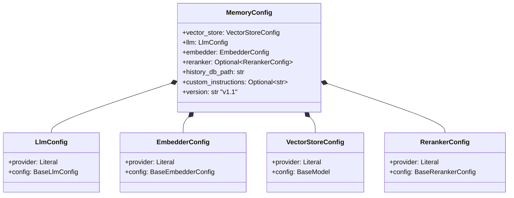
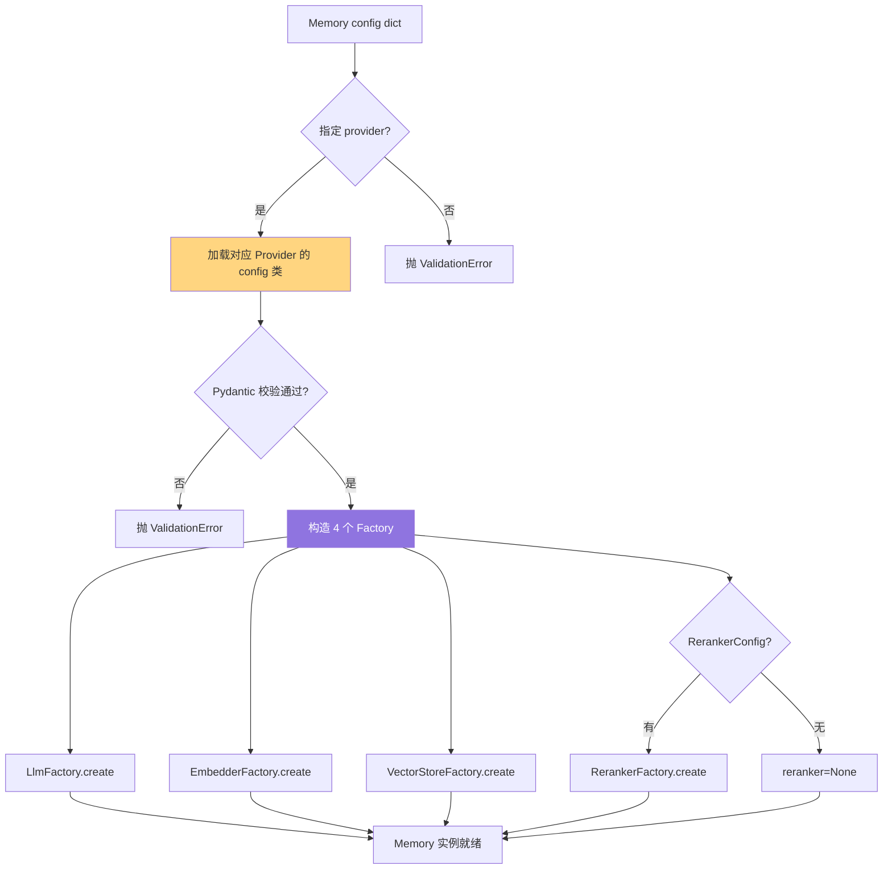

# 09. 配置系统详解

> **本章视角**: 🛠 开发者
> **核心问题**: `MemoryConfig` / `MemoryConfigSchema` 的每个字段什么意思?3 个典型配置示例。
> **预计阅读**: 10 分钟

---

## 配置层级:全局 / 项目 / 调用

Mem0 配置有三个层级:

| 层级 | 谁设置 | 影响 |
|---|---|---|
| **进程级** | `Memory(...)` 构造时传入 | 该实例的所有方法 |
| **环境变量** | `OPENAI_API_KEY` / `ANTHROPIC_API_KEY` 等 | SDK 自动读取,无 key 时报错 |
| **方法级** | `add(..., prompt=)` / `search(..., filters=)` | 仅当次调用 |

本节聚焦**进程级配置**——它决定 LLM、Embedder、Vector Store 的具体行为。

---

## Python 端:`MemoryConfig` (Pydantic v2)

`mem0/configs/base.py:29` 定义:

```python
class MemoryConfig(BaseModel):
    vector_store: VectorStoreConfig
    llm: LlmConfig
    embedder: EmbedderConfig
    history_db_path: str = "./memory_history.db"
    reranker: Optional[RerankerConfig] = None
    version: str = "v1.1"
    custom_instructions: Optional[str] = None
```

四个子配置也都是 Pydantic 模型,每个子配置形如:

```python
# LlmConfig
class LlmConfig(BaseModel):
    provider: Literal["openai", "anthropic", ...]  # 18 个值
    config: BaseLlmConfig  # 各 Provider 子类
```

`BaseLlmConfig`(`mem0/configs/llms/base.py:7`)含通用字段:

```python
class BaseLlmConfig(BaseModel):
    model: str
    temperature: float = 0.1
    api_key: Optional[str] = None
    max_tokens: int = 2000
    top_p: float = 0.1
    top_k: int = 1
    enable_vision: bool = False
    vision_details: Optional[dict] = None
    reasoning_effort: Optional[str] = None
    http_client_proxies: Optional[Any] = None
```

`VectorStoreConfig` 比较特别——它用 `_provider_configs` 字典 + `model_validator(mode="after")` 动态导入对应 Provider 的配置类:

```python
# mem0/configs/vector_stores/configs.py:6
class VectorStoreConfig(BaseModel):
    provider: str
    config: BaseModel  # 运行时校验为 QdrantConfig / PgvectorConfig / ...

    _provider_configs = {
        "qdrant": "mem0.configs.vector_stores.qdrant.QdrantConfig",
        "pgvector": "mem0.configs.vector_stores.pgvector.PGVectorConfig",
        ...
    }
```

---

## TypeScript 端:`MemoryConfigSchema` (Zod)

`mem0-ts/src/oss/src/types/index.ts:186-262` 用 Zod 定义:

```typescript
export const MemoryConfigSchema = z.object({
  llm: LLMConfigSchema,
  embedder: EmbedderConfigSchema,
  vectorStore: VectorStoreConfigSchema,
  historyStore: HistoryStoreSchema.optional(),
  reranker: RerankerConfigSchema.optional(),
  disableHistory: z.boolean().default(false),
  customPrompt: z.string().optional(),
  version: z.literal("v1.1").default("v1.1"),
});
```

`config/manager.ts:5-213` 的 `ConfigManager.mergeConfig` 提供:

- **snake_case → camelCase 自动转换**(让 Python 配置 dict 可以原样传给 TS)
- **缺失字段填充默认值**(`config/defaults.ts:3-35`)
- **运行时 Zod 校验**,失败抛 `ValidationError`

---

## MemoryConfig 嵌套结构



**图 9.1** — `MemoryConfig` 嵌套结构。每个子配置都是一个"provider + 子 config"的二元组。

---

## 配置加载决策树



**图 9.2** — 从配置 dict 到 `Memory` 实例就绪的决策树。最常失败的位置是"Provider 不存在"或"config 子字段缺失"。

---

## `from_config` vs 直接 kwargs

### 方式 1:`from_config(dict)`(推荐)

```python
memory = Memory.from_config({
    "llm": {"provider": "openai", "config": {"model": "gpt-4o-mini"}},
    "embedder": {"provider": "openai", "config": {"model": "text-embedding-3-small"}},
    "vector_store": {"provider": "qdrant", "config": {"path": ":memory:"}},
})
```

### 方式 2:`Memory(MemoryConfig(...))`(类型严格)

```python
from mem0.configs.base import MemoryConfig
memory = Memory(config=MemoryConfig(
    llm=LlmConfig(provider="openai", config=OpenAIConfig(model="gpt-4o-mini")),
    ...
))
```

### 方式 3:`Memory()`(零配置)

```python
memory = Memory()  # 默认值,只读 OPENAI_API_KEY 环境变量
```

**推荐使用方式 1**(dict),因为:

- 与 TS SDK 的 `config/manager.ts` 兼容(同一份 dict 跨 SDK 用)
- 序列化/反序列化简单(可以 YAML / TOML / 环境变量注入)
- IDE 补全友好

---

## 环境变量速查

| 环境变量 | 用途 |
|---|---|
| `OPENAI_API_KEY` | OpenAI LLM / Embedder |
| `ANTHROPIC_API_KEY` | Anthropic Claude |
| `COHERE_API_KEY` | Cohere Rerank |
| `TOGETHER_API_KEY` | Together LLM / Embedder |
| `AWS_ACCESS_KEY_ID` / `AWS_SECRET_ACCESS_KEY` | AWS Bedrock |
| `MEM0_TELEMETRY` | `"true"` 开启 PostHog 遥测,默认 false |
| `OPENROUTER_API_KEY` | 通过 OpenRouter 走多模型(OpenAI LLM 透传) |

---

## 3 个典型配置示例

### 示例 1:本地开发 — Ollama + Chroma

```python
from mem0 import Memory

memory = Memory.from_config({
    "llm": {
        "provider": "ollama",
        "config": {"model": "qwen2.5:7b", "ollama_base_url": "http://localhost:11434"},
    },
    "embedder": {
        "provider": "ollama",
        "config": {"model": "nomic-embed-text", "ollama_base_url": "http://localhost:11434"},
    },
    "vector_store": {
        "provider": "chroma",
        "config": {"path": "./chroma_data", "collection_name": "memories"},
    },
})
```

**适用场景**:笔记本 / 无外网 / 演示。完全离线。

### 示例 2:生产环境 — OpenAI + pgvector + Cohere Rerank

```python
memory = Memory.from_config({
    "llm": {
        "provider": "openai",
        "config": {"model": "gpt-4o-mini", "temperature": 0.1, "max_tokens": 2000},
    },
    "embedder": {
        "provider": "openai",
        "config": {"model": "text-embedding-3-small", "embedding_dims": 1536},
    },
    "vector_store": {
        "provider": "pgvector",
        "config": {
            "host": "db.internal", "port": 5432,
            "user": "mem0", "password": "secret",
            "dbname": "production", "collection_name": "user_memories",
            "embedding_model_dims": 1536,
        },
    },
    "reranker": {
        "provider": "cohere",
        "config": {"model": "rerank-english-v3.0", "api_key": "${COHERE_API_KEY}"},
    },
    "history_db_path": "/var/lib/mem0/history.db",
    "custom_instructions": "你是一个用户画像助手,优先抽取职业、地点、饮食偏好。",
})
```

**适用场景**:Web 应用 + 已有 PostgreSQL 集群 + 准确性优先。

### 示例 3:自托管 / 合规 — vLLM + Qdrant

```python
memory = Memory.from_config({
    "llm": {
        "provider": "vllm",
        "config": {
            "model": "Qwen/Qwen2.5-32B-Instruct",
            "vllm_base_url": "http://gpu-internal:8000/v1",
        },
    },
    "embedder": {
        "provider": "fastembed",
        "config": {"model": "BAAI/bge-small-en-v1.5"},
    },
    "vector_store": {
        "provider": "qdrant",
        "config": {
            "url": "http://qdrant.internal:6333",
            "api_key": "${QDRANT_API_KEY}",
            "collection_name": "memories",
            "embedding_model_dims": 384,
        },
    },
    "history_db_path": "/mnt/shared/mem0/history.db",
})
```

**适用场景**:金融 / 医疗 / 政企,数据不出内网,GPU 自部署大模型。

---

## TypeScript 端相同示例

```typescript
import { Memory } from "mem0ai/oss";

const memory = new Memory({
  llm: {
    provider: "openai",
    config: { model: "gpt-4o-mini", temperature: 0.1 },
  },
  embedder: {
    provider: "openai",
    config: { model: "text-embedding-3-small", dimensions: 1536 },
  },
  vectorStore: {
    provider: "pgvector",
    config: { host: "db.internal", /* ... */ },
  },
  historyStore: {
    provider: "sqlite",
    config: { path: "/var/lib/mem0/history.db" },
  },
});
```

`config/manager.ts` 自动处理 snake_case 兼容,所以 Python 的 `vector_store` 在 TS 里既可以写成 `vectorStore` 也可以写成 `vector_store`。

---

## 常见错误

| 错误 | 原因 | 修复 |
|---|---|---|
| `ValidationError: unknown provider 'xxx'` | provider 拼错 / 不存在 | 检查 `LLM_PROVIDERS` 列表 |
| `Field required: api_key` | 没设环境变量且 config 里没写 | `export OPENAI_API_KEY=sk-...` |
| `embedding dim mismatch` | 切换了 Embedder 但没重建 collection | 删 collection 重建,或保持 Embedder 一致 |
| `vector store connection refused` | 数据库没起 / 端口错 | 检查 host / port / 防火墙 |
| `Pydantic ValidationError: temperature` | `temperature` 超出合理范围(0-2) | 改回 0-2 |

---

## 本章小结

- **Pydantic v2**(Python)vs **Zod**(TypeScript)—— 同一份语义、不同语法
- `MemoryConfig` 是 4 个子配置的容器,每个子配置 = `provider + config` 二元组
- `from_config(dict)` 模式与 TS `config/manager.ts` 跨 SDK 兼容
- 三个典型场景:**本地开发 / 生产 / 自托管合规**各有最佳配置

---

## 延伸阅读

- [第 4 章:Python SDK](./04-Python-SDK完整使用.md) — `Memory(...)` 构造
- [第 5 章:TypeScript SDK](./05-TypeScript-SDK完整使用.md) — `new Memory(...)` 构造
- [第 8 章:Provider 生态](./08-Provider生态全景.md) — 每个 provider 的能力矩阵
- [第 11 章:Server 自托管](./11-Server自托管部署.md) — `server/main.py` 的默认配置