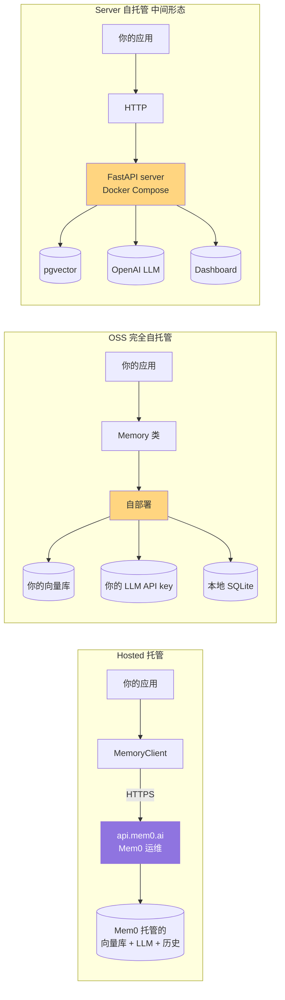
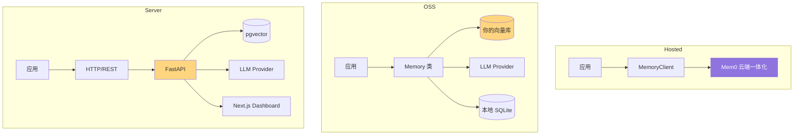
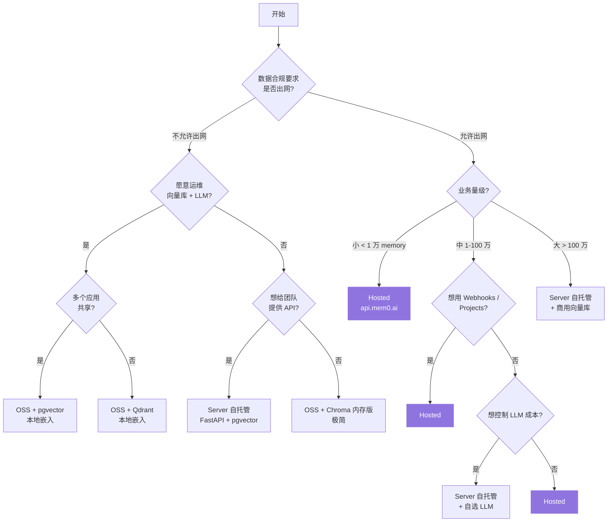

# 10. 托管服务 vs 自托管

> **本章视角**: 🧑 用户 / 🏛 架构师
> **核心问题**: 我应该用 Hosted(api.mem0.ai)还是 OSS 自部署?
> **预计阅读**: 8 分钟

---

## 三种部署形态

Mem0 提供三种部署形态,**API 调用方式几乎完全一致**,差异在于"数据驻留在哪、谁运维":



**图 10.1** — 三种部署形态的组件对比。Hosted = 全部外包;OSS = 全部自有;Server = 自部署但只暴露 HTTP 接口。

---

## 能力对照表

| 维度 | Hosted (api.mem0.ai) | OSS (Memory 类) | Server 自托管 |
|---|---|---|---|
| **数据驻留** | Mem0 云端 | 你的机器 / 你的 DB | 你的 Docker Compose |
| **SLA** | Mem0 提供 | 你自己保证 | 你自己保证 |
| **可用默认 LLM** | OpenAI / Anthropic / Cohere | 任意 Provider | 默认 OpenAI |
| **可用向量库** | Mem0 内部 | 27 种任选 | 默认 pgvector |
| **自定义 Provider** | 仅 Hosted 平台支持的 | 全部开放 | 全部开放 |
| **认证方式** | `m0-...` API Key | 无,本地调用 | JWT + API Key(可选) |
| **Dashboard** | mem0.ai 控制台 | 无 | Next.js Dashboard |
| **Webhook / 异步导出** | ✅ | ❌(需自实现) | ❌ |
| **Webhooks / Exports / Projects** | ✅ 完整 | ❌ | ❌ |
| **运维成本** | 0 | 中(向量库 + LLM key) | 高(多服务) |
| **合规边界** | 出网 | 不出网 | 不出网 |
| **计费** | 按 memory 操作数 | 自付 LLM / 向量库费用 | 自付 LLM / DB 费用 |
| **生产成熟度** | 高(Mem0 SLA) | 中(需自测) | 中(需自测) |

---

## 三种形态的组件对比



**图 10.2** — 三种部署形态的核心组件差异。Hosted 是"一个黑盒";OSS 是"代码嵌入你的应用";Server 是"自托管中间层"。

---

## Hosted 适用场景

✅ **推荐**:
- 团队小、运维能力有限
- 数据敏感度低(用户输入对话)
- 想用 Mem0 的 Webhooks / Exports / Projects 等平台功能
- 快速原型 / MVP 阶段

❌ **不推荐**:
- 数据合规要求严格(医疗 / 金融 / 政企)
- 用户量大、需要控制单位成本
- 已有自建向量库 / LLM 基础设施

---

## OSS 适用场景

✅ **推荐**:
- **数据不出内网**(合规要求)
- 已有向量库 / LLM 基础设施,想复用
- 需要自定义抽取 prompt / Rerank 流程
- 微服务架构,SDK 嵌入业务代码
- 想完全控制数据生命周期

❌ **不推荐**:
- 不想自己运维向量库
- 想用 Webhooks 等 Hosted 独有功能
- 团队对 Embedding 模型 / 向量库无经验

---

## Server 自托管适用场景

✅ **推荐**:
- 想给多个应用/团队共享一套 Mem0 API
- 想用 Dashboard 管理
- 想用 APIKey 鉴权、限流、审计(RequestLog 表)
- 已经熟悉 Docker Compose
- 想"半托管"——LLM 走云(OpenAI / Anthropic),向量库自管

❌ **不推荐**:
- 单体应用,SDK 直接嵌入更简单
- 不想运维 FastAPI + pgvector + Dashboard 三服务

---

## 决策树



**总结一句话**:
- **小团队 / 快速验证** → Hosted
- **数据合规 / 大规模** → Server 自托管
- **极简 / 单体应用** → OSS 嵌入

---

## 迁移路径:OSS → Hosted

Mem0 提供官方迁移 Skill: **`mem0-oss-to-platform`**(`skills/mem0-oss-to-platform/SKILL.md`)。

迁移流程自动化:

1. 检测项目当前使用的是 `Memory` 还是 `MemoryClient`
2. 备份现有数据到本地 JSONL
3. 改造调用代码(从 `Memory` 切换到 `MemoryClient`)
4. 批量灌入历史数据到 Hosted(用 `add()` 循环)
5. 校验迁移完整性

> ⚠️ **反向迁移**(Hosted → OSS)Mem0 也支持,但需要从 Hosted 导出再灌入 OSS,详见 docs/platform/migration/。

详见 [第 13 章](./13-集成生态-Vercel-Plugin-Workflow.md)的"Skills 体系"小节。

---

## 混合策略

实际生产中,**混合部署**也很常见:

```
- 用户对话长期记忆: Hosted(api.mem0.ai)
- 企业内部知识库: 自托管 RAG(Pinecone)
- 一次性任务状态: OSS Memory(本地 SQLite)
```

这三种可以并存,因为它们的 API 接口完全一致。

---

## 本章小结

- **三种部署形态** API 一致,差异在运维与合规
- **Hosted**:最快上手,SLA 有保证,数据出网
- **OSS**:最灵活,数据不出网,需自运维
- **Server**:中间形态,自托管但暴露标准 REST,适合多应用共享
- 迁移有官方 Skill 支持,跨形态切换代价低

---

## 延伸阅读

- [第 1 章:快速上手](./01-快速上手-5分钟体验.md) — Hosted vs OSS 最小代码对比
- [第 11 章:Server 自托管](./11-Server自托管部署.md) — Server 部署详解
- [第 13 章:集成生态](./13-集成生态-Vercel-Plugin-Workflow.md) — `mem0-oss-to-platform` Skill