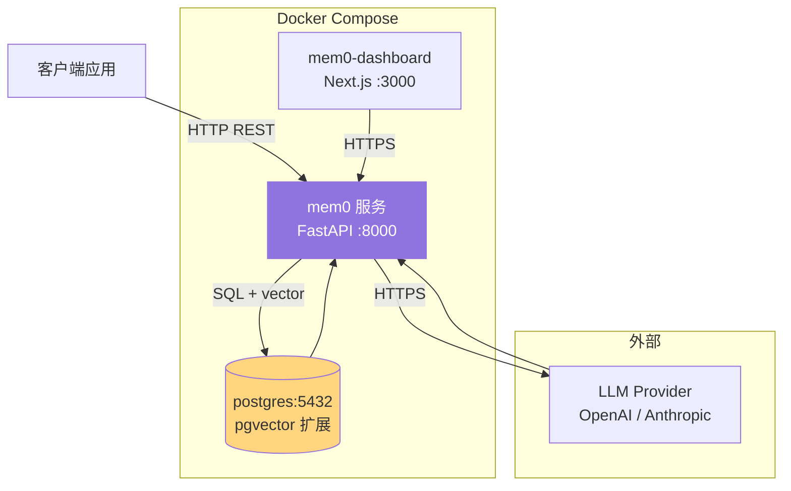
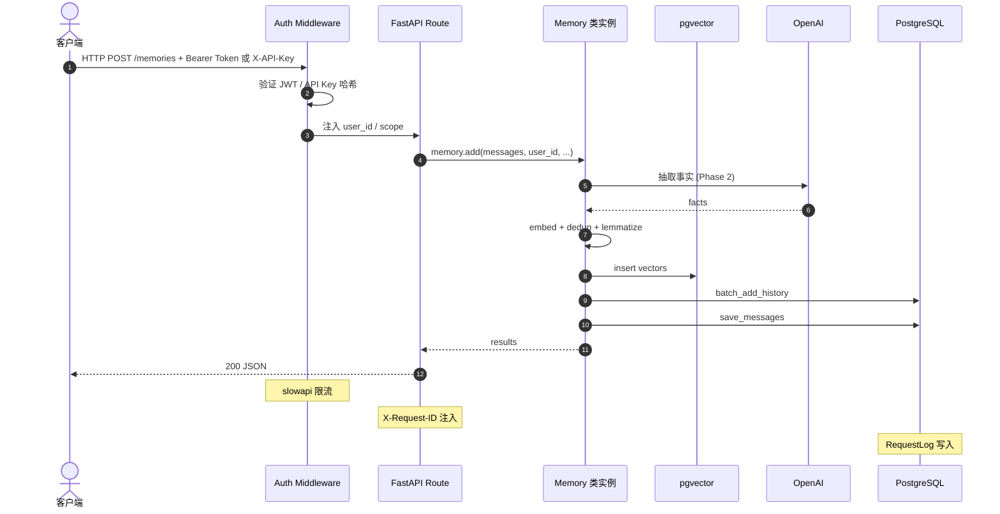

# 11. Server 自托管部署

> **本章视角**: 🏛 架构师
> **核心问题**: FastAPI + pgvector + Dashboard 三件套怎么搭起来?生产化需要改造什么?
> **预计阅读**: 12 分钟

---

## 组件全景

Mem0 Server 是**单进程 FastAPI 应用**,围绕 `mem0` Python 库构建,默认栈:



**图 11.1** — `server/docker-compose.yaml` 三服务拓扑:mem0(FastAPI)+ postgres(含 pgvector 扩展)+ mem0-dashboard(Next.js 控制台)。

> 默认端口:`mem0=8888 → 8000`、`postgres=8432`、`mem0-dashboard=3000`、`pgvector 扩展通过 init-db.sh 启用`。

---

## REST API 端点

`server/main.py`(561 行)定义两类端点:**内联路由** + **子路由**。

### 主路由(`/memories` 等)

| 方法 | 路径 | 行号 | 用途 |
|---|---|---|---|
| GET | `/configure` | `:322` | 读取当前配置(secrets redact) |
| GET | `/configure/providers` | `:327` | 列出 bundled LLM/Embedder |
| POST | `/configure` | `:332` | 管理员更新配置 |
| POST | `/generate-instructions` | `:340` | LLM 派生自定义指令 |
| POST | `/memories` | `:367` | 创建记忆 |
| GET | `/memories` | `:411` | 列表(管理员 unscoped;普通用户 scoped) |
| GET | `/memories/{id}` | `:443` | 单条 |
| POST | `/search` | `:452` | 向量检索 |
| PUT | `/memories/{id}` | `:487` | 更新 |
| GET | `/memories/{id}/history` | `:506` | 变更日志 |
| DELETE | `/memories/{id}` | `:515` | 单条删除 |
| DELETE | `/memories` | `:527` | 管理员批量删除 |
| POST | `/reset` | `:547` | 管理员核弹级重置 |

### 子路由(`server/routers/`)

| 文件 | 端点 | 用途 |
|---|---|---|
| `auth.py` | `/auth/register`, `/auth/login`, `/auth/refresh`, `/auth/setup`, `/auth/onboarding/complete` | JWT 认证、注册、首次设置、引导完成 |
| `api_keys.py` | `/api-keys/*` | 列出 / 创建 / 撤销 API Key(`X-API-Key` 头) |
| `entities.py` | `/entities/*` | 列出 user / agent / run 实体(从 pgvector payloads) |
| `requests.py` | `/requests/*` | 管理员可观测性(`RequestLog` 表) |

---

## API 请求从鉴权到落库的完整路径



**图 11.2** — 一次 `POST /memories` 从鉴权到落库的完整路径,涵盖 4 类组件。

---

## 数据模型(SQLAlchemy + UUID)

`server/models.py` 定义 5 张表,全部 UUID 主键 + tz-aware datetime:

| 模型 | 字段 | 用途 |
|---|---|---|
| `User`(`:18`) | name, email(unique), password_hash, role, created_at, last_login_at | 操作用户 |
| `APIKey`(`:30`) | key_prefix, key_hash, label, created_by → users | 第三方应用访问 |
| `RequestLog`(`:43`) | method, path, status_code, latency_ms, auth_type | 可观测性 |
| `RefreshTokenJti`(`:55`) | jti 黑名单 | 刷新令牌撤销 |
| `Settings`(`:65`) | key, value | 通用 KV 配置 |

记忆数据**本身不存 SQL**,而是在 `DEFAULT_CONFIG` 配置的 pgvector collection `memories` 中,通过 `server/server_state.py` 的 `get_memory_instance()` 单例访问。

---

## 默认配置(`server/main.py:120-139`)

```python
DEFAULT_CONFIG = {
    "llm": {"provider": "openai", "config": {"model": "gpt-5-mini"}},
    "embedder": {"provider": "openai", "config": {"model": "text-embedding-3-small"}},
    "vector_store": {
        "provider": "pgvector",
        "config": {
            "host": "postgres", "port": 5432,
            "collection_name": "memories",
            "embedding_model_dims": 1536,
        },
    },
    "history_db_path": "/tmp/mem0_history.db",
}
```

**这是"零配置启动"组合**:Docker Compose 起来就能用。生产环境通常会替换为:

- LLM 换成 `anthropic` 或自托管 `vllm`
- Embedder 换成 `fastembed` 本地(避免出网)
- pgvector 换成外部托管 PostgreSQL(Neon / Supabase / RDS)

---

## Docker Compose 启动

```bash
cd server
docker compose up
```

`docker-compose.yaml` 关键配置:

```yaml
services:
  mem0:
    build: ./dev.Dockerfile
    ports: ["8888:8000"]
    environment:
      - OPENAI_API_KEY=${OPENAI_API_KEY}
      - JWT_SECRET=${JWT_SECRET}      # 必须,否则启动失败
      - POSTGRES_HOST=postgres
    depends_on:
      postgres:
        condition: service_healthy

  postgres:
    image: pgvector/pgvector:pg17
    ports: ["8432:5432"]
    volumes:
      - ./init-db.sh:/docker-entrypoint-initdb.d/init-db.sh  # 启用 vector 扩展
    healthcheck:
      test: ["CMD-SHELL", "pg_isready -U postgres"]

  mem0-dashboard:
    build: ./dashboard
    ports: ["3000:3000"]
    environment:
      - NEXT_PUBLIC_API_URL=http://localhost:8888
```

启动后访问:
- `http://localhost:8888` — FastAPI(Swagger UI 在 `/docs`)
- `http://localhost:3000` — Next.js Dashboard

`init-db.sh` 在首次启动时执行 `CREATE EXTENSION IF NOT EXISTS vector;`,启用 pgvector。

---

## Dashboard 简介

`server/dashboard/` 是一个独立 Next.js 应用(PNPM workspace),提供:

- **登录 / 注册**(走 FastAPI JWT)
- **Memories 浏览**:按 user_id 筛选、关键字搜索
- **Entities 管理**:列出所有用户/Agent
- **API Keys**:生成、撤销
- **Configuration**:查看 / 修改 Provider
- **Request Logs**:管理员视图

技术上使用 `pnpm-workspace.yaml` 拆分,`tailwindcss` 样式,`components.json` shadcn 组件。

---

## 生产化改造清单

零配置的 Docker Compose 仅适合**演示**,生产环境需要补齐:

### 1. 持久化与备份

- pgvolume:用 named volume,避免容器重启丢数据
- 备份策略:`pg_dump` 定期 + WAL 归档
- `history_db_path`:挂载到 host 持久化(SQLite 重要数据)

### 2. 反向代理 + HTTPS

```nginx
# /etc/nginx/sites-available/mem0
location / {
    proxy_pass http://localhost:8888;
    proxy_set_header Host $host;
    proxy_set_header X-Forwarded-Proto $scheme;
}
```

强烈推荐用 Caddy / Traefik 自动 HTTPS。

### 3. 监控与可观测性

- **PostHog**:`MEM0_TELEMETRY=true` 开启 Mem0 内置遥测
- **Prometheus**:`RequestLog` 表暴露 `/metrics` endpoint
- **日志**:JSON 格式 + `X-Request-ID` 链路追踪
- **Alerting**:latency > 1s、5xx > 1% 报警

### 4. 安全

- **JWT_SECRET**:必须强随机(env var 注入,绝不入仓)
- **AUTH_DISABLED=true**:仅用于本地开发,生产严禁
- **APIKey 哈希**:用 `key_hash`,不存明文
- **CORS**:限制 origin,默认 dashboard 域名

### 5. 水平扩展

- FastAPI 单进程无状态,可以用 **gunicorn -w 4 -k uvicorn.workers.UvicornWorker**
- pgvector 连接池调优(`pool_size=20, max_overflow=10`)
- LLM 调用走**速率限制**(slowapi)+ **重试**(tenacity)
- 监控 `RequestLog.latency_ms`,识别慢请求

### 6. 灾备

- LLM Provider 切换:env var `OPENAI_API_KEY` ↔ `ANTHROPIC_API_KEY`,配合 `/configure` 路由
- 向量库切换:导出 collection → 导入到新后端
- SQLite history 同步到 PostgreSQL:写 `migrate_history_to_pg` 脚本

---

## 反向调用:从 Dashboard 到 FastAPI

`server/dashboard/src/utils/api.ts:113` 的 `api` 函数封装了所有 HTTP 调用,使用:

- `Authorization: Bearer <jwt>` 或 `X-API-Key: <key>`
- camelCase / snake_case 自动转换(与 SDK 一致)
- 错误统一捕获,显示在 toast

> Dashboard 与 FastAPI 必须**同源或配置 CORS**(`server/main.py:161-167`)。

---

## 启动后快速验证

```bash
# 1. 注册管理员(首次启动)
curl -X POST http://localhost:8888/auth/setup \
  -H "Content-Type: application/json" \
  -d '{"name": "Admin", "email": "admin@example.com", "password": "strong-password"}'

# 2. 登录拿 token
TOKEN=$(curl -X POST http://localhost:8888/auth/login \
  -H "Content-Type: application/json" \
  -d '{"email": "admin@example.com", "password": "strong-password"}' \
  | jq -r .access_token)

# 3. 创建一条记忆
curl -X POST http://localhost:8888/memories \
  -H "Authorization: Bearer $TOKEN" \
  -H "Content-Type: application/json" \
  -d '{"messages": "我叫张三,职业 DBA", "user_id": "alice"}'

# 4. 检索
curl -X POST http://localhost:8888/search \
  -H "Authorization: Bearer $TOKEN" \
  -H "Content-Type: application/json" \
  -d '{"query": "DBA 是做什么的", "user_id": "alice", "top_k": 5}'
```

---

## 本章小结

- Server = **FastAPI + pgvector + Dashboard** 三件套,Docker Compose 一键起
- 默认 LLM = `gpt-5-mini`,默认 Embedder = `text-embedding-3-small`,默认向量库 = `pgvector`
- 主路由 + 4 个子路由(auth / api_keys / entities / requests)
- 生产化需要补齐持久化、HTTPS、监控、安全、灾备 5 件事

---

## 延伸阅读

- [第 10 章:托管 vs 自托管](./10-托管服务vs自托管.md) — 选型决策
- [第 9 章:配置系统详解](./09-配置系统详解.md) — 如何修改 `DEFAULT_CONFIG`
- [第 14 章:最佳实践](./14-最佳实践与性能调优.md) — Server 性能调优