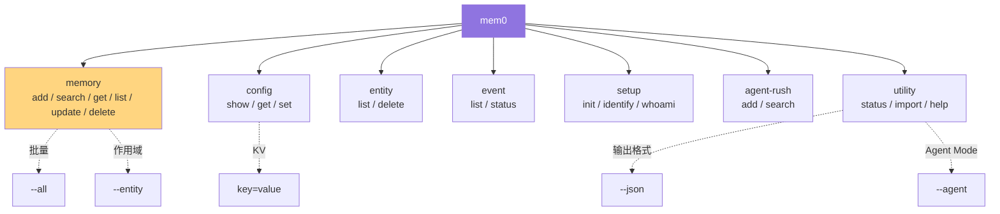
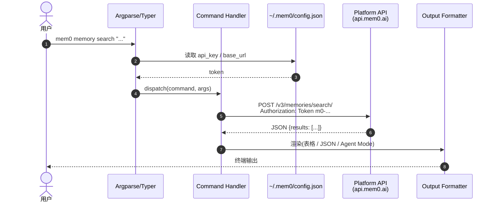

# 12. CLI 双胞胎与脚本化

> **本章视角**: 🛠 开发者
> **核心问题**: 两个 `mem0` 命令行工具(Python 版 + Node 版)怎么用?什么场景用 CLI 而不是 SDK?
> **预计阅读**: 8 分钟

---

## 两个 CLI,完全镜像

| 维度 | `mem0-cli`(PyPI) | `@mem0/cli`(npm) |
|---|---|---|
| **包名** | `mem0-cli` | `@mem0/cli` |
| **版本** | 0.2.11 | 0.2.12 |
| **入口** | `mem0 = "mem0_cli.app:main"` | `mem0 → ./dist/index.js` |
| **底层框架** | Typer + Rich + httpx | Commander + chalk + cli-table3 + ora + boxen |
| **Python / Node** | Python 3.10+ | Node ≥ 18 |
| **默认后端** | Mem0 Platform REST(`api.mem0.ai`) | Mem0 Platform REST(同左) |
| **OSS 路径** | 通过 `--base-url` 指向自托管 | 同左 |
| **二进制名** | `mem0` | `mem0`(同名) |

两个 CLI **共用同一份**命令规范,通过仓库根目录的同步源保持一致:

- `cli/cli-spec.json` — 命令树、参数、返回结构(JSON Schema)
- `cli/CLI_SPECIFICATION.md` — 人类可读的规范

修改 CLI 时必须**同步更新两边**,否则 [ci-gate.yml](../../.github/workflows/ci-gate.yml) 会检测到 spec drift 失败。

---

## 安装与认证

```bash
# Python 版
pip install mem0-cli
mem0 init   # 引导式初始化 API key

# Node 版
npm install -g @mem0/cli
mem0 init   # 同样引导
```

`mem0 init` 会:

1. 询问 API key(`m0-...`)
2. 询问 base URL(默认 `https://api.mem0.ai`)
3. 把配置写到 `~/.mem0/config.json`
4. 发起一次 `whoami` 测试连通性

之后所有命令自动用这套配置。

---

## CLI 命令树



**图 12.1** — CLI 命令树。所有命令子组都遵循"动词 + 名词"结构,便于记忆。

---

## 典型命令示例

### `mem0 memory add`

```bash
# 单条字符串
mem0 memory add "我叫张三,职业是 DBA" --user-id alice

# 从文件读(每行一条)
mem0 memory add --user-id alice < facts.txt

# 带元数据
mem0 memory add "我转岗到 SRE 团队" \
  --user-id alice \
  --metadata '{"source": "chat", "category": "job_change"}'
```

### `mem0 memory search`

```bash
mem0 memory search "用户的工作" --user-id alice --limit 5

# JSON 输出(便于脚本处理)
mem0 memory search "用户的工作" --user-id alice --json | jq '.results[].memory'

# Agent Mode:结构化输出给 LLM 消费
mem0 memory search "用户的工作" --user-id alice --agent
```

### `mem0 memory list`

```bash
# 列出某用户所有记忆
mem0 memory list --user-id alice --limit 100

# 按实体过滤
mem0 memory list --entity user:alice

# 分页
mem0 memory list --user-id alice --page 2 --limit 50
```

### `mem0 memory delete`

```bash
# 单条
mem0 memory delete <memory-id>

# 全部(危险!)
mem0 memory delete --user-id alice --all

# 按实体
mem0 memory delete --entity user:alice
```

### `mem0 config`

```bash
mem0 config show                    # 显示当前所有配置
mem0 config get api_key             # 读单个 key
mem0 config set base_url https://api.mem0.ai   # 改单个 key
```

### `mem0 entity list/delete`

```bash
mem0 entity list --type user       # 列出所有 user 实体
mem0 entity list --type agent
mem0 entity delete user:alice      # 删除某实体的所有 memory
```

### `mem0 agent-rush`(批量灌库)

```bash
# 把对话日志批量灌入 mem0(走平台路径)
mem0 agent-rush add --user-id alice --file conversations.jsonl

# 批量检索
mem0 agent-rush search --user-id alice --query "DBA" --limit 20
```

---

## CLI 调用链



**图 12.2** — CLI 内部调用链。Python CLI 用 Typer/Rich 渲染表格;Node CLI 用 chalk/boxen;两者都支持 `--json` 纯输出。

---

## `--json` 与 `--agent`(Agent Mode)

两个特殊全局开关:

- **`--json`**:所有输出走纯 JSON,适合管道处理
  ```bash
  mem0 memory search "query" --user-id alice --json | jq '.results | length'
  ```

- **`--agent`**:进入 **Agent Mode**,输出格式针对 LLM 消费优化(更精简的字段、稳定排序、避免指令误读)
  ```bash
  mem0 memory search "query" --user-id alice --agent
  # 输出:
  # USER alice's memories about "query":
  # 1. Alice is a PostgreSQL DBA
  # 2. Alice likes pour-over coffee
  # 3. Alice just joined SRE team
  ```

Agent Mode 专为 **AI Agent 自动化** 设计——比如 Claude Code / Cursor / Codex 内部的脚本会调 `mem0 --agent` 拿记忆。

---

## 典型场景

### 1. CI/CD 中灌库

```yaml
# .github/workflows/seed-memories.yml
- name: Seed user memories
  run: |
    echo '{"user_id":"alice","memory":"Alice prefers dark mode"}' | \
    mem0 memory add --json
```

### 2. 数据迁移(平台间搬运)

```bash
# 从 OSS 导出
mem0 --base-url http://localhost:8888 memory list --user-id alice --json > alice.json

# 导入到 Hosted
cat alice.json | jq -c '.results[]' | \
  while read mem; do
    echo "$mem" | jq -r '.memory' | \
      mem0 memory add --user-id alice
  done
```

### 3. 运维巡检

```bash
# 查看所有 entity 的记忆数量
for entity in $(mem0 entity list --type user --json | jq -r '.[].id'); do
  count=$(mem0 memory list --entity user:$entity --json | jq '.results | length')
  echo "user:$entity has $count memories"
done
```

### 4. 调试与日志

```bash
# 看一次操作的事件
mem0 event list --limit 20
mem0 event status <event-id>   # 看异步事件状态
```

---

## Python CLI vs Node CLI 实现差异

| 关注点 | Python (`cli/python/`) | Node (`cli/node/`) |
|---|---|---|
| 入口 | `src/mem0_cli/app.py` (1417 行) | `src/index.ts` (933 行) |
| 子命令注册 | Typer 子 App | Commander `.command()` |
| 表格渲染 | Rich | cli-table3 |
| 进度条 | Rich Progress | ora |
| 框线 | Rich Panel | boxen |
| HTTP 客户端 | httpx | fetch / axios |
| TOML/JSON 配置 | 自带读写 | 同 |
| stdin 管道 | `_stdin_is_piped()` | `process.stdin` 流 |
| Agent Mode | `--agent` | `--agent` |

两个 CLI 的**功能与命令完全对等**,只在工程实现上略有差异。

---

## 何时用 CLI 而不是 SDK?

✅ **用 CLI**:
- 一次性运维(灌库、迁移、清理)
- CI/CD 流水线
- Shell 脚本批量处理
- 让非工程师也能操作记忆
- AI Agent 脚本调 `--agent`

❌ **用 SDK**:
- 嵌入到应用代码(响应用户请求)
- 需要精细控制 LLM / Embedder 配置
- 需要 async / 并发
- 需要 stream / 大消息批处理

---

## 本章小结

- 两个 CLI(`mem0-cli` / `@mem0/cli`)是同一份规范的两种实现
- 共用 `cli/cli-spec.json` 同步,改一处必须改两边
- 命令结构:`memory / config / entity / event / setup / agent-rush / utility`
- 特殊开关:`--json`(机器读)、`--agent`(LLM 读)
- 适合一次性运维 / CI/CD / 脚本化场景

---

## 延伸阅读

- [第 1 章:快速上手](./01-快速上手-5分钟体验.md) — 替代 SDK 的轻量入口
- [第 4 章:Python SDK](./04-Python-SDK完整使用.md) — 何时用 SDK
- [第 13 章:集成生态](./13-集成生态-Vercel-Plugin-Workflow.md) — 编辑器插件如何用 CLI