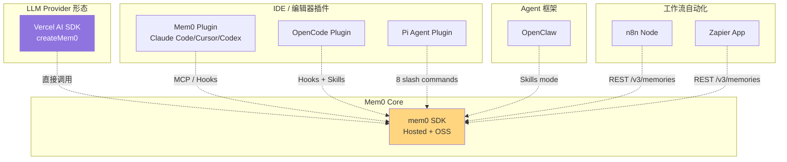
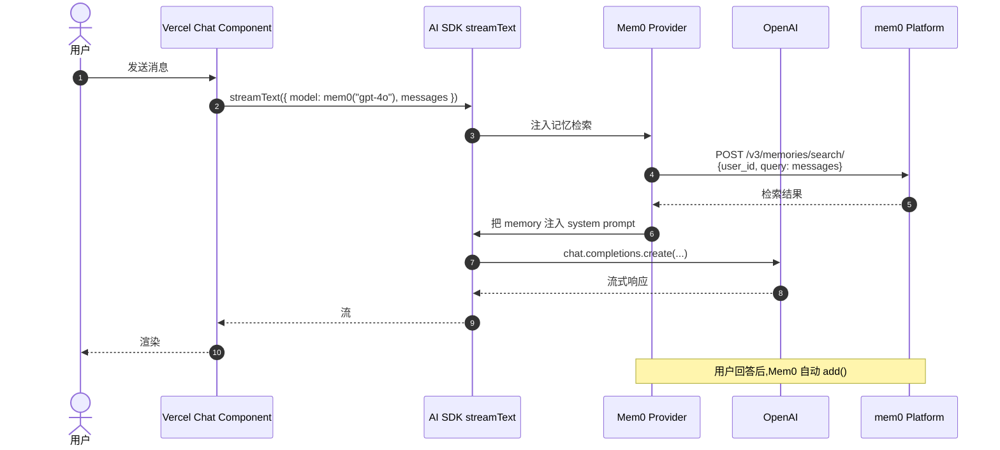
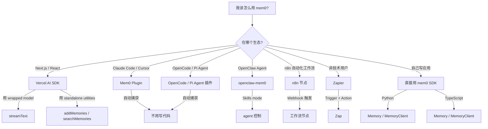

# 13. 集成生态 — Vercel / Plugin / Workflow

> **本章视角**: 🛠 开发者
> **核心问题**: 7 类集成包 + 6 个 Skills,怎么组合用?
> **预计阅读**: 10 分钟

---

## 总览:7 类集成包

Mem0 通过**集成包**(integrations/)把 SDK 能力暴露到不同生态:

| 包 | 包名 | 用途 | 典型用户 |
|---|---|---|---|
| **Vercel AI SDK** | `@mem0/vercel-ai-provider` v3.0.1 | AI SDK v5 兼容的 LLM Provider | Web/Next.js 开发者 |
| **OpenClaw** | `@mem0/openclaw-mem0` v1.0.15 | OpenClaw Agent 长期记忆 | AI Agent 框架 |
| **Mem0 Plugin** | `mem0-plugin` v0.1.6 | Claude Code / Cursor / Codex / Antigravity | AI 编程助手用户 |
| **OpenCode Plugin** | `@mem0/opencode-plugin` v0.2.2 | OpenCode 编辑器 | OpenCode 用户 |
| **Pi Agent Plugin** | `@mem0/pi-agent-plugin` v0.1.4 | Pi Agent 扩展 | Pi Agent 用户 |
| **n8n Node** | `@mem0/n8n-nodes-mem0` v0.1.3 | n8n 工作流节点 | 自动化工程师 |
| **Zapier App** | `zapier-mem0` v0.1.1 | Zapier 平台 | 非技术用户 |



**图 13.1** — 集成包分类树。LLM Provider 形态(Vercel)、IDE 插件(Mem0 Plugin / OpenCode / Pi Agent)、Agent 框架(OpenClaw)、工作流自动化(n8n / Zapier)四种角色,都最终调用同一个 `mem0` SDK。

---

## Vercel AI SDK:`@mem0/vercel-ai-provider`

`integrations/vercel-ai-sdk/` 提供 AI SDK v5 兼容的 Provider。

### 两种使用模式

#### 模式 A:Wrapped Model(默认)

```typescript
import { createMem0 } from "@mem0/vercel-ai-provider";

const mem0 = createMem0({
  apiKey: process.env.MEM0_API_KEY!,
  provider: "openai",   // 底层用 openai
  mem0Config: { user_id: "alice" },
});

// 像普通 AI SDK 模型一样用
const result = await streamText({
  model: mem0("gpt-4o-mini"),
  prompt: "我叫张三,职业 DBA",
});
```

Mem0 会**自动捕获**对话上下文,记忆"用户说自己是 DBA"。

#### 模式 B:Standalone Utilities

```typescript
import { addMemories, searchMemories, retrieveMemories, getMemories } from "@mem0/vercel-ai-provider";

// 不绑 LLM,纯工具调用
await addMemories({ messages: "...", user_id: "alice" });
const hits = await searchMemories({ query: "DBA", user_id: "alice" });
```

**何时用哪种**:
- 模式 A:大多数 Next.js AI Chat 应用
- 模式 B:需要手动控制 add / search 时序

### Vercel AI SDK 调用 mem0 数据流



**图 13.2** — Vercel AI SDK 调用 mem0 的数据流。每次对话:先检索 → 注入 prompt → 调 LLM → 异步 add 新记忆。

`integrations/vercel-ai-sdk/src/mem0-provider.ts:142` 的 `mem0()` 函数是核心封装。

---

## AI Agent 插件:Claude Code / Cursor / Codex / Antigravity

`integrations/mem0-plugin/` 是**最复杂的集成**——它把 mem0 暴露成 Claude Code 等 AI 编程助手的"原生能力"。

### 能力清单

- **16 个 slash commands**:如 `/mem0-add`、`/mem0-search`、`/mem0-status`
- **生命周期 hooks**:
  - `SessionStart`:启动时加载相关记忆
  - `UserPromptSubmit`:每次提问前自动搜索相关 memory
  - `PreToolUse`:文件写入前自动记录决策
  - `Stop`:会话结束自动写摘要
  - `PostToolUse`:Bash 输出后自动捕获
- **MCP server**:提供 9 个 tool:`add_memory / search_memories / get_memories / get_memory / update_memory / delete_memory / delete_all_memories / delete_entities / list_entities`
- **Marketplace 注册**:根目录的 5 个 `marketplace.json` 都引用它

### 安装

```bash
# Claude Code
/plugin install mem0@mem0
```

安装后所有 Claude Code 会话自动:
- 启动时加载你的长期记忆
- 写文件时自动记录决策
- 结束时自动总结

---

## OpenCode / Pi Agent 插件

类似 Mem0 Plugin,但**构建工具和 API 不同**:

### OpenCode(`@mem0/opencode-plugin`)

- 用 **bun** 构建(不是 tsup)
- Hook 命名:`chat.message` / `tool.execute.before` / `tool.execute.after` / `experimental.chat.messages.transform`
- 9 个 skills:`mem0-context-loader` / `mem0-dream` / `mem0-forget` / `mem0-pin` / `mem0-remember` / `mem0-scope` / `mem0-search` / `mem0-status` / `mem0-tour`

### Pi Agent(`@mem0/pi-agent-plugin`)

- tsup 构建,ESM
- 8 个 slash commands(`context-loader` / `dream` / `forget` / `pin` / `remember` / `search` / `status` / `tour`)
- "Dream consolidation":定期把短期记忆合并成长期事实
- 作用域分 `project` / `session` / `global`

---

## 工作流自动化:n8n / Zapier

### n8n(`@mem0/n8n-nodes-mem0`)

6 个操作:

| 操作 | 端点 |
|---|---|
| Add(默认 async + 轮询) | `POST /v3/memories/add/` |
| Search | `POST /v3/memories/search/` |
| Get Many | `POST /v3/memories/` |
| Get | `GET /v1/memories/{id}/` |
| Update | `PUT /v1/memories/{id}/` |
| Delete | `DELETE /v1/memories/{id}/` |

n8n 节点自动处理 async 抽取的 polling(`pollEvent` 每 2s 查一次状态直到完成)。

**典型工作流**:Webhook(新客服对话)→ n8n 节点 Add memory → Slack 通知。

### Zapier(`zapier-mem0`)

部署到 Zapier 平台(非 npm),4 个 Actions:

- Add Memory
- Search Memories
- Get Memories(支持 Page/Limit)
- Delete Memory

异步抽取行为与 n8n 一致。

---

## OpenClaw:`@mem0/openclaw-mem0`

OpenClaw 是一种**多 Agent 协作框架**,`@mem0/openclaw-mem0` 提供长期记忆后端。

- 默认 **Skills mode**(Agent 控制 triage / recall / dream)
- 依赖 `mem0ai@3.0.7`(TS SDK)
- 兼容 `openclaw.pluginApi >= 2026.4.24`

**`dream-gate.ts`** 是核心组件:定期(默认每 24h)把多个相似记忆合并成更精炼的事实,类似人脑的"睡眠记忆巩固"。

---

## Skills 体系

`skills/` 目录提供**面向 AI 编程助手**的能力声明(SKILL.md),分两类:

### Reference Skills(永远加载)

| Skill | 内容 |
|---|---|
| `mem0` v3.0.0 | 默认 mem0 技能,覆盖 Platform SDK(Python `MemoryClient` / TS `mem0ai`)和 OSS `Memory`,框架集成 LangChain / CrewAI / OpenAI Agents SDK / Pipecat / LlamaIndex / AutoGen / LangGraph |
| `mem0-cli` v1.1.0 | 两个 CLI(`mem0-cli` + `@mem0/cli`)的命令参考、Agent Mode bootstrap |
| `mem0-vercel-ai-sdk` v1.1.0 | `@mem0/vercel-ai-provider` 两种模式 |

### Pipeline Skills(按需触发)

| Skill | 用途 |
|---|---|
| `mem0-integrate` v0.1.0 | TDD 流程把 mem0 接入现有项目(产出 `.mem0-integration/`) |
| `mem0-test-integration` v0.1.0 | 验证 `mem0-integrate` 的产出(Pass A 关闭 flag / Pass B 开启 flag) |
| `mem0-oss-to-platform` | 迁移 OSS → Hosted(规划 → 用户批准 → 执行) |

> Skills 是给 **Claude Code / Cursor** 等 AI 编程助手读的,人类读者只需知道"项目根目录有这些 .md 文件就够了"。

---

## 集成选择决策树



**大部分用户的简化决策**:
- **Web 应用** → Vercel AI SDK
- **AI 编程** → Mem0 Plugin
- **写代码** → 直接 SDK

---

## Marketplace 注册:5 个文件

如果你是**新编辑器/平台**想做 mem0 集成,需要把这 5 个 `marketplace.json` 都加一行:

- 根目录 `marketplace.json`
- `.claude-plugin/marketplace.json`
- `.cursor-plugin/marketplace.json`
- `.codex-plugin/marketplace.json`
- `.agents/plugins/marketplace.json`

详见 [AGENTS.md](../../AGENTS.md) 的"Adding a New Integration"小节。

---

## 本章小结

- **7 类集成包**覆盖 LLM Provider / IDE Plugin / Agent / Workflow 四种生态
- **Vercel AI SDK** 是最常用的 Web 集成点,两种模式(wrapped / standalone)
- **Mem0 Plugin** 把 mem0 注入 AI 编程助手的 16 个 slash command + 5 个 lifecycle hook
- **Skills 体系**给 AI 编程助手的能力声明,Reference 永远加载,Pipeline 按需
- 集成选型按"在哪个生态"分

---

## 延伸阅读

- [第 4 章:Python SDK](./04-Python-SDK完整使用.md) / [第 5 章:TS SDK](./05-TypeScript-SDK完整使用.md) — 集成包底层调用的 SDK
- [第 12 章:CLI 双胞胎](./12-CLI双胞胎与脚本化.md) — 一些集成通过 CLI 调用 mem0
- [AGENTS.md](../../AGENTS.md) — "Adding a New Integration" 完整步骤