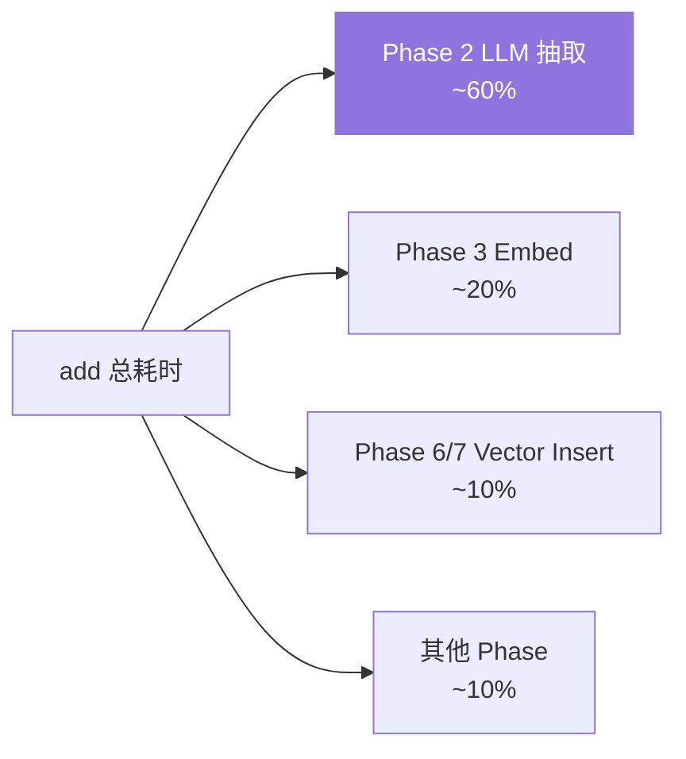
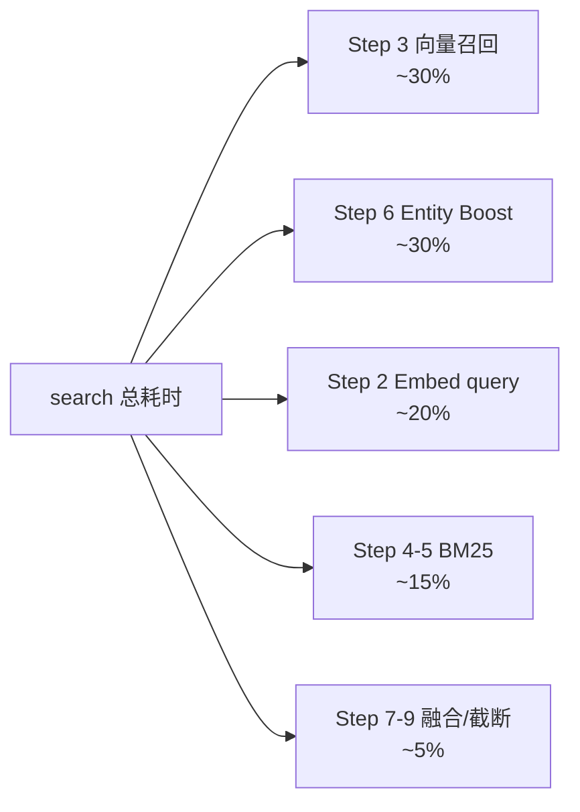
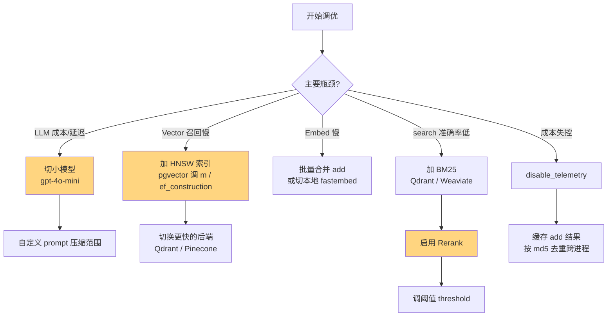

# 14. 最佳实践与性能调优

> **本章视角**: 🛠 开发者 / 🏛 架构师
> **核心问题**: 如何降低延迟、控制成本、提升准确率?
> **预计阅读**: 12 分钟

---

## 写入侧最佳实践

### 用户标识策略

**核心原则**:`user_id` 必填,`agent_id` / `run_id` 按需选填。

| 场景 | 推荐标识 |
|---|---|
| 单一应用、单一用户群 | `user_id=<uuid>` |
| 多 Agent 协作,共享用户档案 | `user_id=<uuid>, agent_id=<agent_name>` |
| 一次性任务,需要可清理 | `run_id=<task_uuid>`(任务结束 `delete_all`) |
| 多租户 SaaS | `user_id=<tenant_user_uuid>`(tenant_id 不进 mem0,自己隔离) |

**常见错误**:用 `user_id="all_users"` 当万能 id——会导致**所有人共享记忆**,严重串台。

```python
# ❌ 错误
memory.add("...", user_id="global")

# ✅ 正确
memory.add("...", user_id=f"user_{request.user.id}")
```

### 批量与异步

```python
import asyncio
from mem0 import AsyncMemory

memory = AsyncMemory.from_config({...})

async def ingest(messages_list):
    tasks = [memory.add(m, user_id="alice") for m in messages_list]
    results = await asyncio.gather(*tasks, return_exceptions=True)
    # 部分失败不影响整体
    return results
```

**注意**:`asyncio.gather` + 高并发时,LLM Provider 速率限制可能触发。需要用 `asyncio.Semaphore` 限流。

### 自定义 Prompt 微调抽取

```python
memory.add(
    conversation,
    user_id="alice",
    prompt="""
你是一个用户偏好抽取助手。请只抽取以下类型的事实:
- 饮食偏好(喜欢的食物、忌口)
- 工作角色与变化
- 长期习惯(早睡、跑步)
忽略一次性的临时状态(今天天气、当前心情)。
""",
)
```

**收益**:降低 LLM token 消耗、减少噪声事实。

---

## 检索侧最佳实践

### `limit` 与 `over-fetch` 的关系

`search()` 内部 over-fetch = `max(limit * 4, 60)`。所以:

| 用户期望 top_k | 实际召回 |
|---|---|
| 3 | 60 |
| 10 | 60 |
| 20 | 80 |
| 50 | 200 |

**建议**:用户要 3-5 条时设 `limit=5`,多给也无意义(LLM 会忽略多余)。

### Filter 设计

**始终带 `user_id`**(即便只查一个用户),即使 `user_id` 已嵌入 payload:

```python
# ✅
memory.search("query", filters={"user_id": "alice"})

# ⚠️ 也可以但失去 scope 优化
memory.search("query")  # 不传 filter,会查所有用户的
```

**复杂 filter**:

```python
filters = {
    "AND": [
        {"user_id": "alice"},
        {"metadata.category": {"in": ["food", "hobby"]}},
        {"OR": [
            {"metadata.importance": {"gte": 4}},
            {"metadata.pinned": True},
        ]},
    ]
}
```

### 何时启用 Rerank

| 场景 | Rerank 建议 |
|---|---|
| `top_k` < 5 + 准确率优先 | ✅ 启用 |
| `top_k` > 20 | ❌ 关闭(over-fetch 足够) |
| 向量库包含明显噪声(命名冲突、误存) | ✅ 启用 |
| 延迟敏感(< 50ms) | ❌ 关闭,改用 BM25 + entity boost |

```python
memory.search(
    query,
    user_id="alice",
    rerank=True,    # 启用
    top_k=3,        # 配合小 top_k
)
```

---

## 向量库选型:实测差异

| 后端 | < 10 万 | 10-100 万 | 100 万 - 1 亿 | > 1 亿 |
|---|---|---|---|---|
| **pgvector**(HNSW) | ⭐⭐⭐⭐⭐ | ⭐⭐⭐⭐ | ⭐⭐ | ⭐ |
| **Qdrant**(本地) | ⭐⭐⭐⭐⭐ | ⭐⭐⭐⭐ | ⭐⭐⭐ | ⭐⭐ |
| **Pinecone** | ⭐⭐⭐⭐ | ⭐⭐⭐⭐⭐ | ⭐⭐⭐⭐⭐ | ⭐⭐⭐⭐⭐ |
| **Weaviate** | ⭐⭐⭐⭐ | ⭐⭐⭐⭐ | ⭐⭐⭐ | ⭐⭐⭐⭐ |
| **Milvus** | ⭐⭐⭐ | ⭐⭐⭐⭐ | ⭐⭐⭐⭐⭐ | ⭐⭐⭐⭐⭐ |

**经验法则**:
- < 100 万条 → **pgvector**(复用 PostgreSQL)
- 100 万-1 亿 → **Qdrant / Pinecone**
- > 1 亿 → **Milvus / Pinecone serverless**

---

## LLM 成本:`ADDITIVE_EXTRACTION` 的 token 估算

每次 `add()` 至少消耗这些 tokens:

| 输入 | Token |
|---|---|
| `ADDITIVE_EXTRACTION_PROMPT`(system) | ~1500 |
| 最近 10 条消息(user) | ~500 |
| 现有 top_k=10 记忆(user) | ~500 |
| **输出**(`{"memory": [...]}`) | ~200-500 |
| **总计** | ~2700-3000 |

**调优方向**:

| 优化 | 节省 |
|---|---|
| 切到 `gpt-4o-mini`(从 `gpt-4o`) | ~15x 成本下降 |
| `custom_prompt` 压缩抽取范围 | 输出减少 ~30% |
| `disable_telemetry=true` | 无 token 节省(纯遥测) |
| `infer=False`(不抽取) | 完全跳过 LLM,token=0 |

### Token 用量监控

```python
from mem0.memory.telemetry import capture_event

# 内部 PostHog 自动捕获;若 disable telemetry,自己 wrap LLM
total_tokens = llm_response.usage.total_tokens
print(f"add() 消耗 {total_tokens} tokens")
```

---

## 延迟分解



**图 14.1** — `add()` 延迟分解(典型数据)。LLM 是最大瓶颈。



**图 14.2** — `search()` 延迟分解。向量召回 + entity boost 几乎对半开。

---

## 调优决策树



---

## 缓存与去重的二次收益

`add()` 内部用 md5 去重,但只在**当前进程**有效。跨进程去重要靠外部缓存:

```python
import hashlib
from functools import lru_cache

@lru_cache(maxsize=10_000)
def cached_add(text: str, user_id: str):
    """同一 (text, user_id) 1 小时内只 add 一次"""
    return memory.add(text, user_id=user_id)

# 业务层调用
cached_add("Alice is a DBA", "alice")  # 实际 add
cached_add("Alice is a DBA", "alice")  # 走缓存,不重复 add
```

更彻底的方案:用 Redis 存 (text, user_id) → memory_id 映射。

---

## 监控与可观测性

### Python SDK 内置

`mem0/memory/telemetry.py` 默认关闭。开启:

```python
import os
os.environ["MEM0_TELMETRY"] = "true"
```

事件类型:`mem0.add` / `mem0.search` / `mem0.get` / `mem0.update` / `mem0.delete`,自动捕获到 PostHog。

### Server 自托管

- **`RequestLog` 表**(`server/models.py:43`):每次请求一行(method / path / status_code / latency_ms / auth_type)
- **Prometheus**:用 `prometheus-fastapi-instrumentator` 暴露 `/metrics`
- **慢查询告警**:`mem0/memory/notices.py` 的 `display_performance_slow_query_notice` 阈值默认 1s

---

## 安全与权限

### API Key 隔离(托管)

| 场景 | Key 类型 |
|---|---|
| 服务端批处理 | `MEM0_API_KEY`(主 key) |
| 终端用户 | 不要给终端用户主 key,**走你自己的后端代理** |

### Server 自托管

- **JWT_SECRET**:`openssl rand -base64 32` 生成,必须 env var 注入
- **AUTH_DISABLED=true**:仅本地开发,生产严禁
- **APIKey 哈希**:用 `key_hash` 字段(BCrypt),不存明文
- **CORS**:限制 origin

### 数据隔离

- **业务层**:mem0 用 `user_id` 隔离,但**应用必须**校验"请求的 user_id 等于当前登录用户"
- **多租户**:mem0 不知道你的 tenant_id,**自己**在应用层隔离(每个 tenant 用独立 API Key 或独立 collection)

```python
# ❌ 危险:接受客户端传来的 user_id
memory.search(query, user_id=request.json["user_id"])

# ✅ 安全:用 session 里的 user_id
memory.search(query, user_id=request.user.id)
```

---

## 监控指标清单

| 指标 | 目标 | 报警阈值 |
|---|---|---|
| `add()` p99 延迟 | < 2s | > 5s |
| `search()` p99 延迟(无 rerank) | < 200ms | > 1s |
| `search()` p99 延迟(有 rerank) | < 1s | > 3s |
| LLM token 用量 / 用户 / 日 | < 5K | > 20K |
| 每次 add 的 LLM 调用数 | = 1 | > 2 |
| Vector store 命中率(top_k 内有相关) | > 80% | < 50% |
| SQLite history 表大小 | < 10GB | > 50GB |

---

## 本章小结

- **写入侧**:用户标识严格、AsyncMemory 并发、自定义 prompt 控范围
- **检索侧**:始终带 `user_id` filter、小 top_k + rerank、阈值与 over-fetch 平衡
- **延迟**:LLM 占 60%,调小模型收益最大
- **成本**:gpt-4o-mini + 自定义 prompt + 跨进程去重缓存
- **可观测性**:PostHog + RequestLog + Prometheus
- **安全**:API Key 不出后端、应用层 user_id 隔离

---

## 延伸阅读

- [第 6 章:add() 流程](./06-add()写入流程深度解析.md) — 延迟分解的源头
- [第 7 章:search() 流程](./07-search()检索流程深度解析.md) — 检索侧调优的原理
- [第 8 章:Provider 生态](./08-Provider生态全景.md) — Provider 选型对成本的影响
- [第 11 章:Server 自托管](./11-Server自托管部署.md) — RequestLog / Prometheus 配置