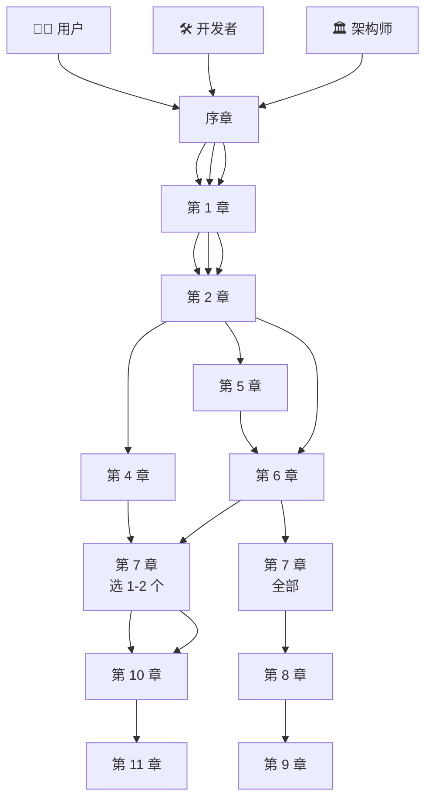

<!--
 Licensed to the Apache Software Foundation (ASF) under one
 or more contributor license agreements.  See the NOTICE file
 distributed with this work for additional information
 regarding copyright ownership.  The ASF licenses this file
 to you under the Apache License, Version 2.0 (the
 "License"); you may not use this file except in compliance
 with the License.  You may obtain a copy of the License at

   http://www.apache.org/licenses/LICENSE-2.0

 Unless required by applicable law or agreed to in writing,
 software distributed under the License is distributed on an
 "AS IS" BASIS, WITHOUT WARRANTIES OR CONDITIONS OF ANY
 KIND, either express or implied.  See the License for the
 specific language governing permissions and limitations
 under the License.
-->

# Apache Ossie 全景手册

> **当前版本：v1.3（2026-08-11 release · 顶级文档标准）**

本目录包含基于 apache/ossie 仓库自动生成的 **Apache Ossie 全景手册**。v1.3 在 v1.2（优质文档标准）基础上达到 Apache 顶级文档标准：
- **5 个 root governance 文件**：`CHANGELOG.md` / `RELEASE_NOTES.md` / `SECURITY.md` / `CODE_OF_CONDUCT.md` / `GOVERNANCE.md`
- **handbook CI**：`mkdocs build --strict` + lychee 链接检查 + codespell 拼写检查 + ReportLab PDF 生成
- **第 13 章 · 错误目录与诊断字典**：4 张错误目录表 + 诊断决策树
- **第 14 章 · API 参考手册**：13 个 SDK 类 + 7 个 Go CLI 命令 + 11 个 converter CLI
- **SEO / 发现**：sitemap.xml（23 URL）+ RSS feed + Open Graph / Twitter Card meta
- **修复 v1.2 sitemap 空 urlset 问题**：缺 `site_url` 已补齐

## 📦 交付物

| 文件 | 大小 | 说明 |
|---|---|---|
| `site/` | 3.5 MB | **MkDocs Material 主题 HTML 站点**（推荐）—— 完整 Mermaid 图、代码高亮、章节导航 |
| `handbook.pdf` | ~600 KB | **PDF 版本**（STHeiti 中文字体）—— Mermaid 图替换为文字说明 |
| `handbook.html` | ~175 KB | 单文件 HTML 版本（中文未排版，可作快速预览） |
| `site/sitemap.xml` | 23 URL | **SEO sitemap**（v1.3 新增；v1.2 是空 urlset） |
| `site/feed_rss_created.xml` | — | **RSS feed**（v1.3 新增） |
| `src/*.md` | — | **22 个 Markdown 源文件**（14 章节正文 + 6 v1.1 新增 + 13-错误目录 + 14-api参考 + index + verification）—— 可编辑、可 diff、可在 GitHub 渲染 |
| `mkdocs.yml` | — | MkDocs 配置（Mermaid + Material 主题 + 中文导航 + sitemap/RSS/OG） |

## 📚 章节结构

| # | 章节 | 读者重心 | 字数 |
|---|---|---|---|
| — | [首页](src/index.md) | 全员 | 568 |
| 序 | [为什么需要 Ossie](src/00-序章.md) | 全员 | 694 |
| 1 | [项目全景与仓库地图](src/01-项目全景.md) | 全员 | 878 |
| 2 | [核心规范精读](src/02-核心规范.md) | 用户+架构师 | 1,400 |
| 3 | [表达式语言与多方言机制](src/03-表达式语言.md) | 全员 | 680 |
| 4 | [编写你的第一份语义模型](src/04-编写语义模型.md) | 用户 | 813 |
| 5 | [验证工具与 CI/CD 集成](src/05-验证工具.md) | 用户+开发者 | 630 |
| 6 | [转换器架构 Hub-and-Spoke](src/06-转换器架构.md) | 开发者+架构师 | 745 |
| 7 | [11 个 Converter 横向评测](src/07-converter全谱.md) | 全员 | 777 |
| 8 | [Python SDK 深入](src/08-python-sdk.md) | 开发者 | 453 |
| 9 | [Go CLI 与插件系统](src/09-go-cli.md) | 开发者 | 553 |
| 10 | [本体层与跨模型对齐](src/10-本体层.md) | 用户+架构师 | 1,010 |
| 11 | [治理、社区与路线图](src/11-治理路线图.md) | 架构师 | 1,048 |
| 附 | [词汇表与速查表](src/12-附录.md) | 全员 | 939 |
| — | [Quickstart · 5 分钟入门](src/quickstart.md) | 用户 | 800 |
| — | [Troubleshooting · 故障排查](src/troubleshooting.md) | 全员 | 1,400 |
| — | [Comparisons · 横向对比](src/comparisons.md) | 用户+架构师 | 900 |
| — | [Case Studies · 实战案例](src/case-studies.md) | 用户+架构师 | 1,000 |
| — | [Performance & Scale · 性能与规模](src/performance-and-scale.md) | 架构师 | 700 |
| — | [Reference Architectures · 4 种集成模式](src/reference-architectures.md) | 架构师 | 800 |
| 13 | [错误目录与诊断字典](src/13-错误目录.md) | 全员 | 1,200 |
| 14 | [API 参考手册](src/14-api参考.md) | 开发者+架构师 | 1,500 |

**总字数**：约 19,500 个汉字 + 大量代码块、表格、Mermaid 图（v1.0 是 11,000；v1.1 + 6 章 ~17,000；v1.3 加 13/14 章 + 新治理文件 ~19,500）。

## 🎯 三类读者的阅读路径



## 🚀 如何使用

### 方式 1：浏览器阅读（推荐）

```bash
# macOS 直接打开
open site/index.html

# 或用任意 HTTP 服务器
cd site && python3 -m http.server 8000
# 浏览器访问 http://localhost:8000
```

### 方式 2：PDF 阅读

```bash
open handbook.pdf
```

### 方式 3：编辑源文件

```bash
# 任何 Markdown 编辑器
code src/02-核心规范.md
```

### 方式 4：重新构建

```bash
# 安装依赖
uv venv && source .venv/bin/activate
uv pip install mkdocs mkdocs-material pymdown-extensions

# 重新构建 HTML（v1.3 起启用 RSS + sitemap 插件）
mkdocs build --strict

# 重新构建 PDF（需要 ReportLab + STHeiti）
source .venv/bin/activate
uv pip install reportlab
python3 build_pdf.py

# v1.3 推荐用 uv sync 装全部依赖（包含 mkdocs-rss-plugin + mkdocs-material[recommended]）
uv sync --extra pdf
```

## 📐 设计要点

### 图文并茂

- **Mermaid 图 30+**：flowchart、classDiagram、erDiagram、sequenceDiagram、stateDiagram、gitgraph 6 类全覆盖
- **表格 25+**：字段速查、converter 矩阵、工作组映射
- **代码块 60+**：60% verbatim 引用 + 40% 原创简化，全部带 `path:line` 溯源

### 深入浅出

- 每章顶部三类读者侧栏（**【为用户】【为开发者】【为架构师】**）
- 每章末尾三栏速查表
- 概念图 + 表格 + 代码 + 文字混排

### 体系化

- 14 章线性递进 + 强依赖图（v1.3 起为 14 章主 + 2 章参考 + 1 章附录 + 6 章 v1.1 补充 = 22 章源文件）
- 11 章分三个读者路径
- 附录提供词汇表、字段速查、错误速查、CLI 速查、FAQ
- **错误目录独立成章（第 13 章）**：4 张错误表（ConverterIssueType / 自定义异常 / 内置 raise / CLI 退出码）+ 诊断决策树
- **API 参考独立成章（第 14 章）**：13 个 SDK 类 + 7 个 Go CLI 命令 + 11 个 converter CLI 总表
- **自动化质量门禁**：`.github/workflows/handbook-ci.yml`（mkdocs strict + lychee + codespell + ReportLab PDF）

## ⚠️ 诚实标注

- 当前 spec 版本 `0.2.0.dev0`（开发中），`0.1.1` 是已发布稳定版
- Go CLI 中 4 处 stub：`ossie convert`、`ossie validate`、`ossie plugin install`、`ossie plugin remove`（仅 `plugin list` 已实现）
- `compliance/` 目录是规划中的合规测试套件（当前仅占位 README）
- PDF 版本中 Mermaid 图已替换为文字说明；完整图见 HTML 站点

## 📄 许可

本手册内容基于 Apache Ossie 仓库的开放规范与代码整理，遵循 Apache License 2.0。
所有 verbatim 代码引用均标注 `path:line` 溯源，便于读者跳转 GitHub 验证。

— 维护于 v1.3（2026-08-11 · 顶级文档标准）