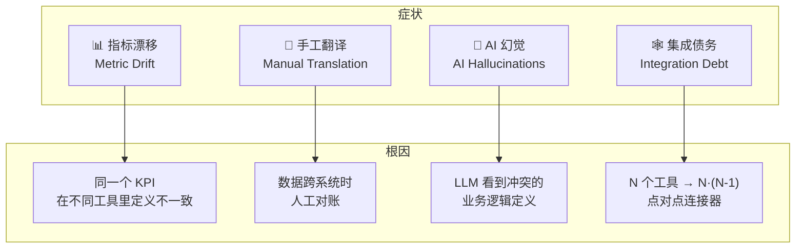
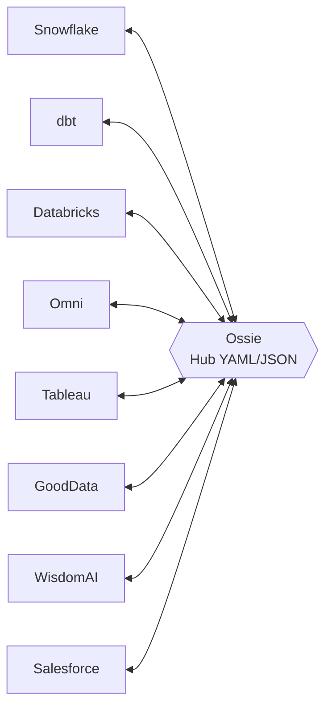

<!--
 Licensed to the Apache Software Foundation (ASF) under one
 or more contributor license agreements.  See the NOTICE file
 distributed with this work for additional information
 regarding copyright ownership.  The ASF licenses this file
 to you under the Apache License, Version 2.0 (the
 "License"); you may not use this file except in compliance
 with the License.  You may obtain a copy of the License at

   http://www.apache.org/licenses/LICENSE-2.0

 Unless required by applicable law or agreed to in writing,
 software distributed under the License is distributed on an
 "AS IS" BASIS, WITHOUT WARRANTIES OR CONDITIONS OF ANY
 KIND, either express or implied.  See the License for the
 specific language governing permissions and limitations
 under the License.
-->

# 序章 · 为什么需要 Ossie

> **Abstract** — Apache Ossie (formerly OSI) is a vendor-neutral, YAML/JSON semantic-model specification designed to end the "semantic fragmentation" problem in modern data stacks. Instead of every tool defining its own metrics, Ossie acts as a hub-and-spoke lingua franca: 11 vendor converters translate between Snowflake, dbt, Salesforce, Databricks, GoodData, and others via a shared core spec. This prologue explains the four symptoms (metric drift, manual translation, AI hallucinations, integration debt) and why OSSIE's approach beats both point-to-point adapters and a unified API.

> **【为用户】** 这一章告诉你：今天你在 BI/AI 数据栈里遇到的"指标漂移""AI 答非所问"等问题，根源是工具间没有共同的语义层。Ossie 试图用一种开源 YAML/JSON 规范终结这场混乱。
>
> **【为开发者】** Ossie 不是替代你熟悉的 dbt 或 LookML，而是它们的**共同语料**。所有 converter 都基于同一份 `osi-schema.json`（`core-spec/osi-schema.json:1-352`），新工具接入只需写一个 converter。
>
> **【为架构师】** "为什么不直接定义一套统一 API？"——因为数据语义远比"调用一个端点"复杂。spec 是**事实标准的载体**：可被文件存储、可被 git 版本化、可被不同语言 SDK 解析。

## 0.1 四个症状：语义碎片化

摘自 [`docs/index.md:32-37`](https://github.com/apache/ossie/blob/main/docs/index.md)，今天的"现代数据栈"普遍存在四个症状：

1. **指标漂移**：同一个"营收"在 Snowflake、Tableau、Looker 里给出三个数，业务方对数据失去信任。
2. **手工翻译**：每当一个新工具接入，需要人工把语义模型重写一遍，昂贵且易错。
3. **AI 幻觉**：LLM agent 读到不一致的业务规则，输出不可靠。
4. **集成债务**：N 个工具意味着 N·(N-1) 个点对点连接器，难以维护。

## 0.2 Hub-and-Spoke：为什么是 Ossie 而不是统一 API

> "With N vendors, a point-to-point strategy would require N·(N-1) converters. With Ossie as the hub, only 2·N converters are needed (one import and one export per vendor), and interoperability with all other vendors comes for free."  
> — [`converters/README.md:47`](https://github.com/apache/ossie/blob/main/converters/README.md)

**经济学**：

| 接入策略 | 工具数 N=5 | N=8 | N=11（当前） |
|---|---|---|---|
| 点对点 | 20 个连接器 | 56 个 | 110 个 |
| Hub-and-Spoke | 10 个 | 16 个 | 22 个 |

Ossie 当前已实现 **11 个** vendor 转换器（2 Java + 9 Python），覆盖：

- **数据仓库**：Snowflake、Databricks、Polaris（Iceberg REST）
- **BI/可视化**：Tableau（via Salesforce）、Omni、GoodData
- **dbt 生态**：dbt Semantic Interface（MetricFlow）
- **AI/LLM**：WisdomAI、NVIDIA Generative Semantic Fabric（GSF）
- **数据建模平台**：Honeydew、OrionBelt

## 0.3 三类读者与你的阅读路径

```mermaid
flowchart TB
  subgraph 用户[🧑‍💻 用户 — Data Engineer / Analyst]
    U1[序章] --> U2[第 1 章] --> U3[第 2 章] --> U4[第 4 章]
    U4 --> U5[第 7 章<br/>选 1-2 个]
    U5 --> U6[第 10 章]
  end

  subgraph 开发者[🛠 开发者 — Converter 作者]
    D1[序章] --> D2[第 1 章] --> D3[第 2 章] --> D4[第 5 章]
    D4 --> D5[第 6 章] --> D6[第 7 章<br/>全部]
    D6 --> D7[第 8 章] --> D8[第 9 章]
  end

  subgraph 架构师[🏛 架构师 — Tech Lead]
    A1[序章] --> A2[第 1 章] --> A3[第 2 章] --> A4[第 6 章]
    A4 --> A5[第 7 章] --> A6[第 10 章] --> A7[第 11 章]
  end
```

## 0.4 本书不承诺什么

为了避免期望偏差，这里坦白几件事：

1. **Ossie 还在演进**。spec 0.2.0.dev0 与已发布的 0.1.1 之间存在破坏性变更；50+ GitHub Discussions 还在讨论中。本手册描述的是**当前仓库**的事实，不是 1.0 的承诺。
2. **Go CLI 仍是骨架**。`ossie convert`、`ossie validate` 是 stub，**今天请用 Python `validation/validate.py`**。第 9 章会如实说明。
3. **本体层 (ontology) 是高级话题**。核心 spec 不强求本体；它是"可选的超集"。第 10 章单独讨论。
4. **合规测试套件是规划中的**。`compliance/` 目录当前只有 20 行占位 README。converter 的测试都在各自 `tests/` 目录里。

## 0.5 📌 章节要点速查

| 读者 | 一句话要点 |
|---|---|
| 用户 | 你的工具栈里如果多个 BI/AI 工具给出不同的"营收"数字，Ossie 是它们的共同语料 |
| 开发者 | 写一个 converter ≈ 9 步流水线（`converters/README.md:232-252`），Python/Java 两种模板 |
| 架构师 | Hub-and-Spoke 把 N·(N-1) 降到 2·N；Ossie 是事实标准的载体 |