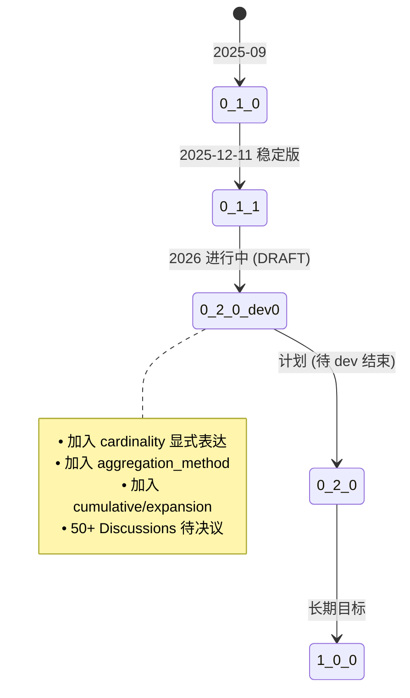

<!--
 Licensed to the Apache Software Foundation (ASF) under one
 or more contributor license agreements.  See the NOTICE file
 distributed with this work for additional information
 regarding copyright ownership.  The ASF licenses this file
 to you under the Apache License, Version 2.0 (the
 "License"); you may not use this file except in compliance
 with the License.  You may obtain a copy of the License at

   http://www.apache.org/licenses/LICENSE-2.0

 Unless required by applicable law or agreed to in writing,
 software distributed under the License is distributed on an
 "AS IS" BASIS, WITHOUT WARRANTIES OR CONDITIONS OF ANY
 KIND, either express or implied.  See the License for the
 specific language governing permissions and limitations
 under the License.
-->

# 第 1 章 · 项目全景与仓库地图

> **Abstract** — This chapter orients you in the Apache Ossie repository: core-spec/, converters/, examples/, ontology/, cli/, python/, validation/, compliance/, and docs/. Each top-level directory has a single responsibility. The repo ships 14 MD files of documentation, 11 vendor converters (9 Python + 2 Java), a Go CLI dispatcher (most subcommands currently stub), a Pydantic v2 SDK, and 12 GitHub Actions workflows. The chapter also documents Apache governance: `dev@ossie.apache.org` is the primary decision channel, spec changes require ≥3 binding +1 votes, and the project is currently an incubating podling.

> **【为用户】** 这章让你 5 分钟看明白 Ossie 仓库的结构，知道哪份文档讲什么、哪段代码做什么——你不必精通仓库每一处，但需要知道从哪里找。
>
> **【为开发者】** 你未来的 PR 入口在 `cli/` 与 `python/`；converter 改动在 `converters/<vendor>/`。每个 converter 是独立包，独立的 CI 流水线。
>
> **【为架构师】** 11 个 converter 各自独立发布、11 条独立 CI 工作流（10 个 converter + CLI）——这是**分布式治理**的设计，意味着加入一个新 vendor 不需要触动核心规范。

## 1.1 一张仓库地图

```text
ossie/                              # 项目根 (Apache 2.0, 孵化中)
├── core-spec/                       # 核心规范三件套
│   ├── spec.md                      # 人类可读规范 (~650 行)
│   ├── spec.yaml                    # YAML 结构 schema 注释版 (~270 行)
│   ├── osi-schema.json              # JSON Schema Draft 2020-12 (~352 行) ★ 权威机器契约
│   ├── expression_language.md       # 表达式语言提案 (~780 行)
│   └── img/                         # 配图目录
├── converters/                      # 11 个 vendor 转换器 (Hub spokes)
│   ├── README.md                    # Hub-and-Spoke 主指南
│   ├── snowflake/  dbt/  gooddata/  databricks/  gsf/
│   ├── honeydew/  omni/  orionbelt/ wisdom/
│   ├── salesforce/  polaris/        # 2 个 Java 转换器
├── examples/                        # 示例
│   ├── tpcds_semantic_model.yaml    # 纯结构 (~631 行)
│   └── flights.yaml                 # 本体 + 映射 (~1111 行)
├── ontology/                        # 本体层（可选超集）
│   ├── ontology.md                  # (~598 行)
│   └── ontology.json                # JSON Schema
├── cli/                             # Go CLI (cobra)
│   ├── main.go                      # ldflags: version/commit/date
│   ├── cmd/{root,convert,validate,plugin/...}.go
│   ├── internal/{plugin,ossiedir}/  # 插件协议 + 目录解析
│   ├── Makefile  go.mod  .goreleaser.yaml
├── python/                          # apache-ossie SDK (Pydantic v2)
│   ├── src/ossie/{__init__,models}.py
│   └── tests/test_models.py
├── validation/                      # Python 验证器 (PEP 723 inline)
│   └── validate.py                  # (~290 行)
├── compliance/                      # 占位 (20 行 README) — 合规测试套件规划中
├── docs/                            # 项目主文档
│   ├── index.md                     # 问题陈述 + 治理 (~377 行)
│   └── working_groups.md
├── ROADMAP.md                       # 路线图 (~443 行)
├── CONTRIBUTING.md                  # 贡献指南 (~287 行)
├── .asf.yaml                        # Apache 治理配置 (squash merge only)
├── .github/workflows/               # 11 条 CI 工作流（CLI 1 条 + 10 个 converter）
└── handbook/                        # ★ 本手册所在位置
    ├── mkdocs.yml
    └── src/                         # 14 个 Markdown 源文件
```

## 1.2 目录职责矩阵

| 目录 | 职责 | 你最该读的文件 |
|---|---|---|
| `core-spec/` | 权威规范定义 | `osi-schema.json`（机器契约）、`spec.md`（人类叙述） |
| `converters/` | Hub spokes：每个 vendor 一个子目录 | `README.md`（主指南）、各 converter 的 `README.md` |
| `examples/` | 真实语义模型示例 | `tpcds_semantic_model.yaml`（入门）、`flights.yaml`（本体案例） |
| `ontology/` | 可选的概念层（Entity/Value Type） | `ontology.md` + `flights.yaml` 的 `ontology:` 块 |
| `cli/` | Go CLI 实现 + 插件发现协议 | `cmd/root.go`、`internal/plugin/plugin.go` |
| `python/` | Pydantic v2 类型 SDK | `src/ossie/models.py`（223 行核心） |
| `validation/` | 4 类校验的 Python 工具 | `validate.py` |
| `docs/` | 项目级人类文档 | `index.md`（问题陈述 + 治理） |
| `compliance/` | **占位** | 仅 `README.md`（20 行） |
| `.github/workflows/` | 11 条 CI | 每条都路径过滤，只在自己目录下改动时触发 |

## 1.3 版本快照与 spec 状态

> ⚠️ **实现状态提醒**：`0.2.0.dev0` 是**开发中的 dev 版本**，schema 在 0.2.0 正式发布前可能继续变更（[`core-spec/spec.md:22-24`](https://github.com/apache/ossie/blob/main/core-spec/spec.md)）。已发布稳定版本是 `0.1.1`（2025-12-11）。本手册所有引用以仓库当前 `0.2.0.dev0` 文件为准。



`spec.yaml` 头部明确写有 "DRAFT version"（声明在 `core-spec/spec.md:22-24` 的 `> **DRAFT version** — in development, schema may change before 0.2.0 is released.` 注释）；如果你在写依赖 Ossie schema 的工具，需要在 CI 里锁版本号。

## 1.4 11 条 GitHub Actions 工作流速览

| Workflow | 触发条件 | 检查内容 | 矩阵 |
|---|---|---|---|
| `cli-ci.yml` | `cli/**` 或自身变更 | `go build` + `go vet` + `go test` | Go 1.26.2 |
| `converter-snowflake-ci.yml` | `converters/snowflake/**` | `uv sync` + `uv run pytest` | Python 3.11–3.14 |
| `converter-databricks-ci.yml` | 同上 | 同上 | Python 3.11–3.14 |
| `converter-dbt-ci.yml` | 同上 | 同上 | Python 3.11–3.14 |
| `converter-gooddata-ci.yml` | 同上 | 同上 | Python 3.12–3.14 |
| `converter-gsf-ci.yml` | 同上 | 同上 | Python 3.11–3.14 |
| `converter-honeydew-ci.yml` | 同上 | 同上 | Python 3.10–3.14 |
| `converter-omni-ci.yml` | 同上 | 同上 | Python 3.10–3.14 |
| `converter-orionbelt-ci.yml` | 同上 | 同上（含 mypy + ruff） | Python 3.12–3.14 |
| `converter-polaris-ci.yml` | 同上 | `mvn -B verify` | JDK 21 (Temurin) |
| `converter-salesforce-ci.yml` | 同上 | 同上 | JDK 21 |
| `converter-wisdom-ci.yml` | — | （当前仓库尚未添加此 workflow） | — |

> ⚠️ **实现状态提醒**：截至本手册生成时，Wisdom converter 还没有独立的 CI workflow。其余 10 个 converter 各自有 `converter-<name>-ci.yml`，加上 `cli-ci.yml` 共 **11 条** GitHub Actions。

**架构含义**：每个 converter 是**独立发布的包**（独立 `pyproject.toml` 或 `pom.xml`），独立 CI 工作流。这意味着：

- 一个 converter 的破坏性改动不会阻塞其他 converter 的发布。
- 添加新 vendor converter 不需要触动核心规范的 CI。
- 跨 converter 的"契约变更"（如 `osi-schema.json` 字段新增）需要单独 PR。

## 1.5 Apache 治理：邮件列表是主渠道

`CONTRIBUTING.md:51-72` 明确指出决策的层级：

| 渠道 | 用途 |
|---|---|
| `dev@ossie.apache.org`（主） | 所有决策、提案讨论、投票 |
| `commits@ossie.apache.org` | 自动 commit/PR 通知 |
| `issues@ossie.apache.org` | 自动 issue 通知 |
| `private@ossie.apache.org` | PPMC 私议（committer 提名） |
| GitHub Issues / Discussions | 辅助；最终仍需在 `dev@` 走正式流程 |

`.asf.yaml` 关键配置（节选）：

```yaml
# 强制 squash merge；rebase 关闭
enabled_merge_buttons:
  squash: true
  merge: false
  rebase: false

# 主分支保护
protected_branches:
  main:
    required_pull_request_reviews:
      required_approving_review_count: 1
      require_code_owner_reviews: false  # 没有 CODEOWNERS
    required_linear_history: true
```

**投票规则**（[`CONTRIBUTING.md:134-158`](https://github.com/apache/ossie/blob/main/CONTRIBUTING.md)）：

- 代码改动：lazy consensus（≥1 binding +1，无 veto）
- **spec 改动**：≥**3** binding +1，无 veto
- Committer/PPMC 提名：`private@` 列表，72 小时窗口

> 这意味着你想影响 spec 演进，需要在 dev@ 发起正式讨论、收集三方共识——这是慢但稳健的治理节奏。

## 1.6 工作组与路线图（高层）

[`docs/working_groups.md`](https://github.com/apache/ossie/blob/main/docs/working_groups.md) 列出了 4 个活跃工作组：

| # | 工作组 | 负责人 | Slack 频道 |
|---|---|---|---|
| 1 | Metric Language and Relationships | Will Pugh | `#ossie-metric-language-wg` |
| 2 | Catalog | Shubham Bhargav (Atlan) | `#ossie-catalog-wg` |
| 3 | Ontology | Kurt (Relational AI) | `#ossie-ontology-wg` |
| 4 | Financial Services Common Semantics | John Heisler (Snowflake) | `#ossie-financial-services-common-semantics` |

第 11 章会深入展开各工作组的当前产出与对 spec 的影响。

## 1.7 📌 章节要点速查

| 读者 | 一句话要点 |
|---|---|
| 用户 | 核心规范三件套是 `core-spec/{spec.md, spec.yaml, osi-schema.json}`；TPC-DS 是入门示例 |
| 开发者 | PR 入口在 `cli/` 与 `python/`；converter 改动在 `converters/<vendor>/`，各自独立 CI |
| 架构师 | 11 条独立 CI（CLI + 10 converter）= 分布式治理；spec 改动需 ≥3 binding +1 投票；`dev@` 是决策主渠道 |