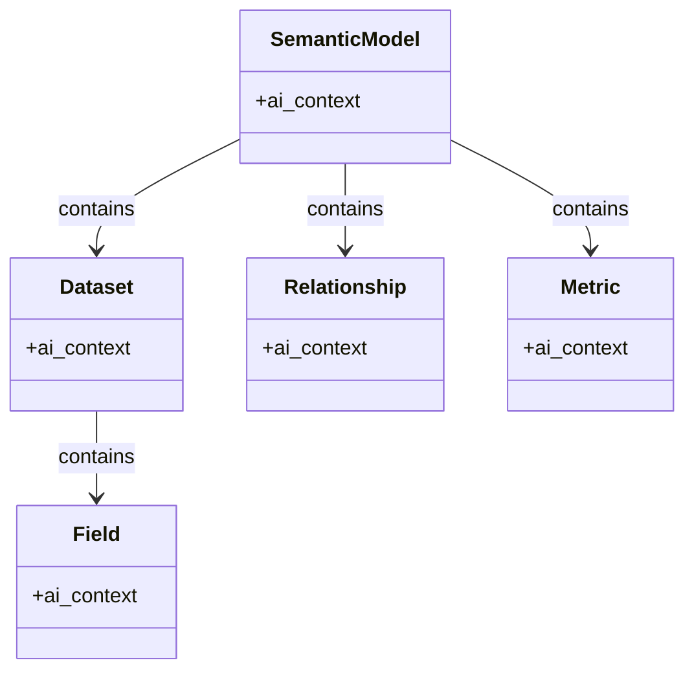
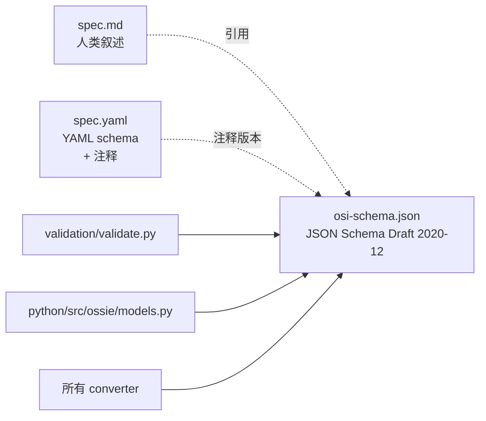

<!--
 Licensed to the Apache Software Foundation (ASF) under one
 or more contributor license agreements.  See the NOTICE file
 distributed with this work for additional information
 regarding copyright ownership.  The ASF licenses this file
 to you under the Apache License, Version 2.0 (the
 "License"); you may not use this file except in compliance
 with the License.  You may obtain a copy of the License at

   http://www.apache.org/licenses/LICENSE-2.0

 Unless required by applicable law or agreed to in writing,
 software distributed under the License is distributed on an
 "AS IS" BASIS, WITHOUT WARRANTIES OR CONDITIONS OF ANY
 KIND, either express or implied.  See the License for the
 specific language governing permissions and limitations
 under the License.
-->

# 第 2 章 · 核心规范精读

> **Abstract** — The Ossie core spec defines five constructs: SemanticModel (top-level container), Dataset (logical table), Field (row-level attribute with optional dimension.is_time and datatype), Relationship (many-to-one foreign key), and Metric (aggregate expression). The normative machine-readable contract is `osi-schema.json` (Draft 2020-12); `spec.md` is the human prose; `spec.yaml` is annotated schema. The chapter covers each field type, required vs optional, and the load-bearing design decisions: `datatype` vs `is_time` separation, composite primary keys, `custom_extensions` round-trip preservation, and the dual-shape `ai_context` (string or object).

> **【为用户】** 这一章是 Ossie 规范 5 大构造（SemanticModel / Dataset / Field / Relationship / Metric）的**字段级速查**。每个字段告诉你"是什么、是否必填、典型取值"。把这一章当字典用。
>
> **【为开发者】** 所有 Python converter 引用的 `apache-ossie` SDK（Pydantic v2 模型，223 行）字段顺序与本章完全对应（`python/src/ossie/models.py:122-203`）。Java converter（Salesforce/Polaris）也用同一组字段。
>
> **【为架构师】** 核心规范只定义"**结构**"，不定义"**概念**"。`datatype` vs `is_time` 的分离、复合主键、复合 relationship 都是这一层的关键设计取舍。

> ⚠️ **实现状态提醒**：以下所有字段引用基于 `core-spec/osi-schema.json`（DRAFT 0.2.0.dev0）。schema 在 0.2.0 正式发布前可能继续微调。

## 2.0 五个核心设计取舍

> v1.2 新增。在字段速查之前，先解释 Ossie 为何这样设计。读完这一节，你理解的是"为什么"，后面 §2.1-§2.8 是"是什么"。

| # | 取舍 | 决定的字段 | 关键约束 |
|---|---|---|---|
| 1 | `datatype` 与 `is_time` 分离 | Field | 类型与角色独立，可 `is_time: true` 同时 `datatype: Integer` |
| 2 | 复合主键方向决定 join | Dataset.primary_key / Relationship.from | 一对多方向由主键端定义 |
| 3 | `custom_extensions` 往返保真 | SemanticModel 任意节点 | SDK `extra="allow"`，converter 用 `vendor_name` 命名空间隔离 |
| 4 | `ai_context` 双形态 | SemanticModel/Dataset/Field | string 或 `{instructions, synonyms, examples}` 对象 |
| 5 | `from_dataset` 别名 | Relationship | Python 关键字规避，`populate_by_name=True` 兼容 |

### 2.0.1 取舍 #1 — `datatype` 与 `is_time` 是两件事

```yaml
- name: d_year       # 字段名
  datatype: Integer  # 数据类型：整数
  dimension:
    is_time: true    # 角色：是时间维度
```

`datatype` 描述"这个值是什么类型"；`is_time` 描述"它扮演什么角色"。两者独立——所以 d_year 是 Integer 但也是时间维度（年）。这与许多 BI 工具把"时间维度 = datetime 类型"绑死的模型相反。代码见 `python/src/ossie/models.py:148-160` `is_time_dimension()` 方法：先看 `dimension.is_time` 显式标记，未设时回退到 `datatype in {Date, DateTime}`（但 v0.2 默认仍是显式优先）。

### 2.0.2 取舍 #2 — 复合主键定义一对多方向

`primary_key` 在 Dataset 上声明（不是 Relationship）。Relationship 引用它：

```yaml
datasets:
  - name: orders      # "多"端
    primary_key: [order_id, line_number]
  - name: customers  # "一"端
    primary_key: [customer_id]
relationships:
  - name: orders_to_customer
    from: orders     # "多"
    to: customers    # "一"
    via: customer_id
```

`Relationship.from` 必须引用一个 `primary_key` 已声明的 Dataset（详见 §2.5 + §4.2 TPC-DS store_sales 实例）。这样连接方向天然唯一，无需额外 `direction` 字段。

### 2.0.3 取舍 #3 — `custom_extensions` 必须往返保真

任何转换器都不能丢失源 vendor 的元数据。机制：

1. SDK 用 Pydantic v2 `extra="allow"`：未知字段全部塞进 `model_extra`，反序列化时保留
2. 每个 entry 有 `vendor_name`（如 `DBT`/`SNOWFLAKE`），converter 只读/写匹配自己 vendor_name 的 entry
3. 转换 N 轮后，所有原始 entry 仍在；新 entry 由新 converter 追加

应用：dbt → Ossie → Snowflake → dbt，原始 dbt `project_name` 还在；新加的 Snowflake `warehouse_size` 也在；二者不冲突。

### 2.0.4 取舍 #4 — `ai_context` 支持 string 与 object 双形态

```yaml
# 简洁形态
description: 销售分析模型
ai_context: "用于销售分析和客户洞察"

# 结构化形态（LLM agent 友好）
ai_context:
  instructions: "用于销售分析和客户洞察"
  synonyms: ["销售分析", "营收模型"]
  examples:
    - "上个月总销售额？"
    - "按地区分组的营收？"
```

SDK 用 `AIContext` union type：`str | AIContextObject`。Validator 自动判别；converter 落地时按目标 vendor 能力选最完整的形态（详见 §2.8 + §B.10）。

### 2.0.5 取舍 #5 — `from_dataset` 别名解决 Python 关键字

YAML 字段名是 `from`（简洁）；但 `from` 是 Python 保留字。SDK 用 Pydantic v2 `Field(alias="from", validation_alias="from")` 暴露为 Python 端的 `from_dataset`：

```python
class OSIRelationship(OSIBaseModel):
    from_dataset: str = Field(alias="from", ...)  # Python 端叫 from_dataset
    to: str
```

读 YAML → `OSI.model_validate(dict)`；写 YAML → `model_dump(by_alias=True)` 用 `from`。SDK 测试在 `python/tests/test_models.py:74-86` 锁定语义。

## 2.1 文档顶层结构

```yaml
version: "0.2.0.dev0"          # 必填：spec 版本（osi-schema.json 限定枚举）
semantic_model:                # 必填：array，可包含多个模型
  - name: ...
    datasets: [...]            # 必填
    relationships: [...]       # 可选
    metrics: [...]             # 可选
    custom_extensions: [...]   # 可选
```

| 顶层字段 | 类型 | 必填 | 说明 |
|---|---|---|---|
| `version` | string | ✅ | 当前 schema 限定为 `"0.2.0.dev0"` 常量 |
| `semantic_model` | array | ✅ | 顶层容器，支持多模型并存 |
| `dialects` | array | — | （SDK 字段）声明的方言列表 |
| `vendors` | array | — | （SDK 字段）自定义扩展命名空间 |

## 2.2 `SemanticModel` 节点

> 来源：`osi-schema.json:304-350`、`spec.md:88-114`

```yaml
- name: sales_analytics
  description: 销售与客户分析模型
  ai_context:
    instructions: "用于销售分析和客户洞察"
    synonyms: ["销售分析", "营收模型"]
    examples:
      - "上个月总销售额？"
      - "按地区分组的营收？"
  datasets: [ ... ]             # 必填
  relationships: [ ... ]
  metrics: [ ... ]
  custom_extensions: [ ... ]
```

| 字段 | 类型 | 必填 | 说明 |
|---|---|---|---|
| `name` | string | ✅ | 文件内唯一 |
| `description` | string | — | 人类可读 |
| `ai_context` | string 或 object | — | AI 注解；见 §2.8 |
| `datasets` | array | ✅ | 至少 1 个 Dataset |
| `relationships` | array | — | 跨数据集的连接 |
| `metrics` | array | — | 跨数据集的度量 |
| `custom_extensions` | array | — | 厂商元数据；见 §2.7 |

### 示例（来自 `spec.md:99-114`，verbatim）

```yaml
semantic_model:
  - name: sales_analytics
    description: Sales and customer analytics model
    ai_context:
      instructions: "Use this model for sales analysis and customer insights"
    datasets:
      - name: orders
        source: sales.public.orders
    relationships: []
    metrics: []
    custom_extensions:
      - vendor_name: DBT
        data: '{"project_name": "tpcds_analytics", "models_path": "models/semantic"}'
```

## 2.3 `Dataset` 节点

> 来源：`osi-schema.json:176-227`、`spec.md:118-173`

| 字段 | 类型 | 必填 | 说明 |
|---|---|---|---|
| `name` | string | ✅ | 数据集内唯一 |
| `source` | string | ✅ | 物理表引用（`database.schema.table` 或子查询） |
| `primary_key` | array | — | 单列或**复合**主键（如 `["order_id", "line_number"]`） |
| `unique_keys` | array of arrays | — | 可选的多组唯一约束 |
| `description` | string | — | 人类可读 |
| `ai_context` | string 或 object | — | AI 注解 |
| `fields` | array | — | 行级属性列表 |
| `custom_extensions` | array | — | 厂商元数据 |

### 复合主键的实际用法（来自 `examples/tpcds_semantic_model.yaml:35-37`）

```yaml
- name: store_sales
  source: tpcds.public.store_sales
  primary_key: [ss_item_sk, ss_ticket_number]   # 复合主键
  unique_keys:
    - [ss_item_sk, ss_ticket_number]            # 唯一约束（与主键同组合）
```

**设计取舍**：`primary_key` 用一维数组还是 `unique_keys` 用二维数组？spec 选择：
- `primary_key` 是一维数组（最长 1 个组合）
- `unique_keys` 是**二维**数组（多个组合，每个组合内部是一维）

为什么？因为 `primary_key` 决定**一对多方向**（见 §2.6 Relationship），所以只允许"主"的那一个组合。

## 2.4 `Field` 节点

> 来源：`osi-schema.json:138-175`、`spec.md:225-356`

Field 是 Ossie 中最丰富的构造——它不是"维度也不是度量"，而是**统一的行级属性**。是否被当维度用、是否被当度量用，由消费者决定。

| 字段 | 类型 | 必填 | 说明 |
|---|---|---|---|
| `name` | string | ✅ | 数据集内唯一 |
| `expression` | `Expression` | ✅ | **标量** SQL（field 级不允许聚合） |
| `dimension` | `Dimension` | — | 当前仅含 `is_time` 标志 |
| `label` | string | — | 分类标签，如 `"filter"` |
| `description` | string | — | 人类可读 |
| `datatype` | `DataType` | — | 逻辑数据类型（见 §3.1） |
| `ai_context` | string 或 object | — | AI 注解 |
| `custom_extensions` | array | — | 厂商元数据 |

### Expression 结构（`osi-schema.json:81-110`）

```yaml
expression:
      dialects:
        - dialect: ANSI_SQL          # 枚举之一（见 §3.2）
          expression: "lower(email)"
        - dialect: SNOWFLAKE
          expression: "lower(email)::varchar"
```

- `Expression.dialects` 是 array，**至少 1 项**
- 每项含 `dialect`（枚举）与 `expression`（字符串）
- 字段级**不允许聚合函数**（`SUM`、`AVG` 等必须在 Metric 中）

### Dimension 与 `is_time`（**关键设计**）

> 来源：`spec.md:330-356`

```yaml
- name: d_year                    # Integer 但作为时间维度
  datatype: Integer
  dimension:
    is_time: true                 # 显式标记
  ai_context:
    synonyms: ["year"]

- name: d_quarter_name            # 无 datatype，作为时间维度
  dimension:
    is_time: true
```

**默认规则**（`spec.md:337` verbatim）：

> *"When `is_time` is not set explicitly, it defaults to `true` if `datatype` is one of `Date`, `Time`, `DateTime`, `DateTimeTz`, and `false` otherwise. Explicit `is_time` always wins."*

| `datatype` | `is_time` | 有效角色 |
|---|---|---|
| `Date` | 未设 | 时间维度（默认 true） |
| `DateTimeTz` | 未设 | 时间维度 |
| `DateTime` | `false` | 普通维度（**显式 opt-out**） |
| `Integer` | `true` | 时间维度（年份 grain） |
| `String` | `true` | 时间维度（季度名） |
| `Integer` | 未设 | 普通维度 |

### 简单字段 vs 计算字段

```yaml
# 简单列引用（来自 spec.md:269-278）
- name: customer_id
  expression:
    dialects:
      - dialect: ANSI_SQL
        expression: customer_id
  description: 客户标识符
  dimension:
    is_time: false                # Integer 普通维度

# 计算字段（来自 spec.md:289-300）
- name: full_name
  expression:
    dialects:
      - dialect: ANSI_SQL
        expression: first_name || ' ' || last_name
  description: 客户全名
  ai_context:
    synonyms:
      - "name"
      - "customer name"

# 多方言字段（来自 spec.md:316-328）
- name: email_normalized
  expression:
    dialects:
      - dialect: ANSI_SQL
        expression: LOWER(email)
      - dialect: SNOWFLAKE
        expression: LOWER(email)::VARCHAR
      - dialect: BIGQUERY
        expression: SAFE_CAST(LOWER(email) AS STRING)
```

## 2.5 `Metric` 节点

> 来源：`osi-schema.json:273-303`、`spec.md:358-416`

```yaml
- name: total_revenue
  expression:
    dialects:
      - dialect: ANSI_SQL
        expression: SUM(orders.amount)
  description: 全部订单的总营收
  datatype: Decimal
  ai_context:
    synonyms:
      - "total sales"
      - "revenue"
```

| 字段 | 类型 | 必填 | 说明 |
|---|---|---|---|
| `name` | string | ✅ | 模型内唯一 |
| `expression` | `Expression` | ✅ | **允许聚合**的 SQL |
| `description` | string | — | 人类可读 |
| `datatype` | `DataType` | — | 输出结果的逻辑类型 |
| `ai_context` | string 或 object | — | AI 注解 |
| `custom_extensions` | array | — | 厂商元数据 |

### 跨数据集度量（来自 `spec.md:403-416`）

```yaml
- name: avg_orders
  expression:
    dialects:
      - dialect: ANSI_SQL
        expression: SUM(orders.amount) / COUNT(DISTINCT customers.id)
```

> 度量表达式引用**全限定字段名**（`dataset.field`），由消费者根据声明的 `Relationship` 决定 JOIN 路径。当前 spec 不在 metric 中直接声明 join——这是"简洁换灵活"的取舍。

### ⚠️ 缺失字段（spec 0.2.0.dev0 尚未定义）

当前 schema **没有**：

- `aggregation_method`（已在 roadmap 中）
- `derived` / `cumulative` 标记
- 度量上的 grain 声明

见第 11 章路线图讨论。

## 2.6 `Relationship` 节点

> 来源：`osi-schema.json:228-272`、`spec.md:177-222`

```yaml
- name: store_sales_to_date
  from: store_sales               # 多端
  to: date_dim                    # 一端
  from_columns: [ss_sold_date_sk] # 外键列
  to_columns: [d_date_sk]         # 主/唯一键列
```

| 字段 | 类型 | 必填 | 说明 |
|---|---|---|---|
| `name` | string | ✅ | 模型内唯一 |
| `from` | string | ✅ | **多端**的数据集名 |
| `to` | string | ✅ | **一端**的数据集名 |
| `from_columns` | array | ✅ | 多端外键列（**列序对应 `to_columns`**） |
| `to_columns` | array | ✅ | 一端主/唯一键列 |
| `ai_context` | string 或 object | — | AI 注解 |
| `custom_extensions` | array | — | 厂商元数据 |

### 复合键（来自 `spec.md:215-221`）

```yaml
- name: order_lines_to_products
  from: order_lines
  to: products
  from_columns: [product_id, variant_id]
  to_columns:   [id, variant_id]            # 长度必须相同
```

> 隐式多对一：spec 当前**不显式声明 cardinality**。如果你的数据集方向标反了，`from` 实际是一端，会产生不一致 join。Roadmap 中讨论 #50 计划在 0.2.0 后引入显式 cardinality。

### Relationship 在 Python SDK 中的别名

> 来源：`python/src/ossie/models.py:165-176`

```python
class OSIRelationship(BaseModel):
    model_config = ConfigDict(frozen=True, populate_by_name=True)
    name: str
    from_dataset: str = Field(..., alias="from")    # Python 属性是 from_dataset
    to: str
    from_columns: list[str]
    to_columns: list[str]
```

Python 关键字 `from` 不能直接做属性名，所以 SDK 引入 `from_dataset` 别名；YAML 仍写 `from`。

## 2.7 `CustomExtension` 机制

> 来源：`osi-schema.json:66-80`、`spec.md:418-496`、`docs/index.md:278-279`

```yaml
custom_extensions:
  - vendor_name: SALESFORCE       # 自由字符串
    data: '{"einstein_enabled": true, "tableau_workbook_id": "abc"}'
  - vendor_name: DBT
    data: '{"project_name": "tpcds_analytics"}'
```

| 字段 | 类型 | 必填 | 说明 |
|---|---|---|---|
| `vendor_name` | string | ✅ | 自由字符串；常用：`SALESFORCE`、`SNOWFLAKE`、`DBT`、`DATABRICKS`、`GOODDATA`、`POLARIS`、`NVIDIA_GSF`、`OMNI`、`WISDOM`、`HONEYDEW`、`ORIONBELT` |
| `data` | string | ✅ | **JSON 字符串**（注意是字符串而非对象） |

### 为什么 `data` 是字符串而非对象？

为了让 JSON Schema 校验简单（`type: string`），厂商自行 parse。转换器要"无损往返"，必须做到：

1. **导出（Ossie → Vendor）**：从所有 `custom_extensions` 中提取 `vendor_name == 目标厂商` 的条目，应用到目标格式；**保留**其他 vendor 的条目
2. **导入（Vendor → Ossie）**：把 vendor 特有但 Ossie 无对应字段的元数据塞进 `custom_extensions[该vendor].data`

> **关键承诺**（`docs/index.md:278-279` verbatim）：
> 
> *"Custom extensions are always preserved during round-trip conversions even by tools that do not understand them."*

这是 Ossie 互操作的"承重墙"——一个不知道 `SALESFORCE` extension 的 Snowflake 转换器也必须原样保留它。

## 2.8 `AIContext`：AI 工具的"用户手册"

> 来源：`osi-schema.json:34-65`、`spec.md:603-635`

```yaml
# 形态一：简单字符串
ai_context: "orders, purchases, sales"

# 形态二：结构化对象
ai_context:
  instructions: "用于销售分析"
  synonyms:
    - "orders"
    - "purchases"
    - "sales"
  examples:
    - "上个月总销售额？"
    - "按地区分组的营收？"
```

`AIContext` 是 `oneOf`：可以是 `string` 或 `object {instructions, synonyms, examples}`。`object` 还允许 `additionalProperties: true`，厂商可加自有键。

`ai_context` 在 5 个构造上都可出现：



这是 Ossie "AI-native" 设计的核心——LLM agent 通过遍历 `ai_context` 的 `synonyms` 和 `examples` 理解每个字段的业务含义。

## 2.9 三件套的关系



| 文件 | 角色 | 谁读它 |
|---|---|---|
| `core-spec/spec.md` | 人类可读规范 | 用户、贡献者 |
| `core-spec/spec.yaml` | YAML 结构 + 注释 | 编辑 spec 的人 |
| `core-spec/osi-schema.json` | **权威机器契约** | validator、SDK、converter |

**黄金法则**：代码层面对 `osi-schema.json` 做校验；规范演进先改 JSON Schema，再同步 `spec.md` 和 `spec.yaml`。

## 2.10 📌 章节要点速查

| 读者 | 一句话要点 |
|---|---|
| 用户 | 5 个构造（SemanticModel/Dataset/Field/Relationship/Metric），`datatype` 与 `is_time` 独立，`custom_extensions` 永远保留 |
| 开发者 | Python SDK 字段顺序与 osi-schema.json 完全一致；`from_dataset` 是 `from` 的别名 |
| 架构师 | `osi-schema.json` 是机器契约的权威；spec 改动要先改 JSON Schema 再同步文档 |