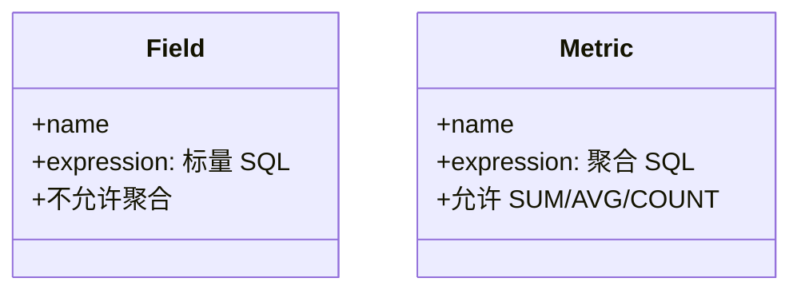
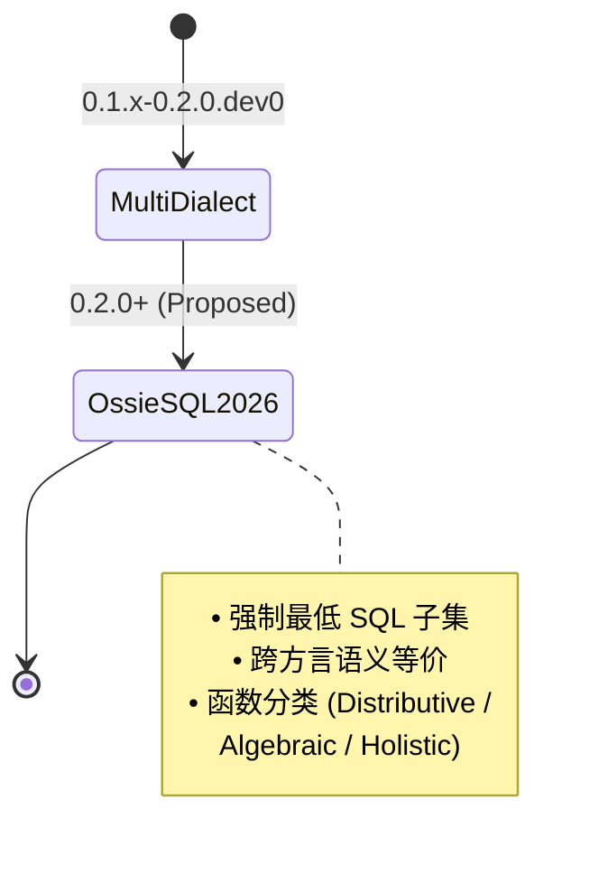

<!--
 Licensed to the Apache Software Foundation (ASF) under one
 or more contributor license agreements.  See the NOTICE file
 distributed with this work for additional information
 regarding copyright ownership.  The ASF licenses this file
 to you under the Apache License, Version 2.0 (the
 "License"); you may not use this file except in compliance
 with the License.  You may obtain a copy of the License at

   http://www.apache.org/licenses/LICENSE-2.0

 Unless required by applicable law or agreed to in writing,
 software distributed under the License is distributed on an
 "AS IS" BASIS, WITHOUT WARRANTIES OR CONDITIONS OF ANY
 KIND, either express or implied.  See the License for the
 specific language governing permissions and limitations
 under the License.
-->

# 第 3 章 · 表达式语言与多方言机制

> **Abstract** — Ossie expressions support 7 SQL dialects (ANSI_SQL, SNOWFLAKE, DATABRICKS, BIGQUERY, MDX, TABLEAU, MAQL) within a single field or metric. The dialect-selection rule is: prefer the target vendor's dialect → fall back to ANSI_SQL → warn-and-skip. Field-level expressions are scalar (no aggregation); metric-level allows aggregation. The Python validator uses sqlglot to parse SQL; MDX/TABLEAU/MAQL are skipped. The proposed `Ossie_SQL_2026` dialect (Proposed Final, 2026-07-15) would unify the 7 dialects into a single normative default.

> **【为用户】** 这一章让你理解 Ossie 如何在"一份模型"里同时支持 7 种 SQL 方言——**总是从最具体的方言往下降级到 ANSI_SQL**。写一份表达式时多写几个方言的版本，你的 Snowflake / Databricks / BigQuery 用户都会感谢你。
>
> **【为开发者】** `validation/validate.py:64-72` 的 `DIALECT_MAP` 是当前的 sqlglot 校验映射；`MDX`、`TABLEAU`、`MAQL` 因为 sqlglot 不支持会跳过。`Ossie_SQL_2026` 提案（`expression_language.md` 第 53-67 行）是即将推出的**新默认方言**。
>
> **【为架构师】** 多方言是 Ossie 与 dbt Semantic Layer、Cube、LookML 的关键差异：Ossie 把方言作为**一等公民**，运行时由 consumer 选；其他方案通常在编译期就锁死。

## 3.1 为什么需要表达式语言

Ossie 是**逻辑层**规范——它描述"营收 = SUM(amount)"，但不规定物理表怎么存。问题来了：同样的语义意图在 Snowflake 和 BigQuery 上写法不同：

```sql
-- ANSI_SQL
DATE_TRUNC('month', order_date)
```

```sql
-- BIGQUERY
DATE_TRUNC(order_date, MONTH)
```

Ossie 选择让**同一字段**携带多种方言版本，由 consumer 选用。`core-spec/expression_language.md:22` 标注当前文档为 **"Proposed Final"**——0.2.0.dev0 还未合并，但 7 个方言已稳定。

## 3.2 7 种方言速查

> 来源：`osi-schema.json:24-28`（`Dialect` 枚举）、`spec.md:48-60`

| 方言 | 描述 | sqlglot 支持 |
|---|---|---|
| `ANSI_SQL` | 标准 SQL | ✅（默认） |
| `SNOWFLAKE` | Snowflake SQL | ✅ |
| `DATABRICKS` | Databricks SQL | ✅ |
| `BIGQUERY` | GoogleSQL | ✅ |
| `MDX` | 多维表达式（SSAS） | ❌ 跳过 |
| `TABLEAU` | Tableau 计算字段 | ❌ 跳过 |
| `MAQL` | GoodData MAQL | ❌ 跳过 |

`validation/validate.py:64-72` 的方言映射：

```python
DIALECT_MAP = {
    "ANSI_SQL": None,            # sqlglot 默认
    "SNOWFLAKE": "snowflake",
    "DATABRICKS": "databricks",
    "BIGQUERY": "bigquery",
    "MDX": None, "TABLEAU": None, "MAQL": None,   # 跳过 SQL 校验
}
```

## 3.3 Fallback 链：目标方言 → ANSI_SQL → 警告

> 来源：`converters/snowflake/src/ossie_snowflake/converter.py:376-414`（典型实现）

```python
# pseudocode of Snowflake converter's dialect selection
def pick_expression(ossie_expression, target_dialect):
    dialects = {d['dialect']: d['expression']
                for d in ossie_expression['dialects']}
    # 1. 首选目标方言
    if target_dialect in dialects:
        return dialects[target_dialect]
    # 2. 回退 ANSI_SQL
    if 'ANSI_SQL' in dialects:
        return dialects['ANSI_SQL']
    # 3. 警告并跳过
    warn(f"field {field_name}: no {target_dialect} or ANSI_SQL expression")
    return None
```

```mermaid
flowchart TD
  Start[消费者需要<br/>target_dialect 表达式] --> Q1{target_dialect<br/>在 dialects[]?}
  Q1 -->|Yes| Return1[返回该方言版本]
  Q1 -->|No| Q2{ANSI_SQL<br/>在 dialects[]?}
  Q2 -->|Yes| Return2[返回 ANSI_SQL<br/>可能语义不等价]
  Q2 -->|No| Warn[发出 warning<br/>跳过或报错]
  Return1 --> End[输出表达式]
  Return2 --> End
  Warn --> End
```

### 多方言声明示例（`spec.md:316-328`）

```yaml
- name: email_normalized
  expression:
    dialects:
      - dialect: ANSI_SQL
        expression: LOWER(email)
      - dialect: SNOWFLAKE
        expression: LOWER(email)::VARCHAR
      - dialect: BIGQUERY
        expression: SAFE_CAST(LOWER(email) AS STRING)
  description: 标准化邮箱
```

## 3.4 字段 vs 度量：聚合边界



| 层级 | 是否允许 `SUM/AVG/COUNT` |
|---|---|
| `Field.expression` | ❌ 否 |
| `Metric.expression` | ✅ 是 |

为什么这样划分？因为字段会被用于**分组 (GROUP BY)** 和**过滤 (WHERE)**，聚合会破坏行级语义；度量天然就是聚合结果。

### 度量表达式例（`examples/tpcds_semantic_model.yaml:600-611`）

```yaml
- name: store_productivity
  expression:
    dialects:
      - dialect: ANSI_SQL
        expression: |
          SUM(store_sales.ss_ext_sales_price) /
          NULLIF(SUM(store.s_number_employees), 0)
  datatype: Decimal
```

注意：

1. 全限定列名（`store_sales.ss_ext_sales_price`）
2. `NULLIF(..., 0)` 防止除零
3. 没有显式 JOIN——由消费者根据 `Relationship` 推导

## 3.5 SQL 校验：sqlglot 在哪用

`validation/validate.py:177-219` 的 `validate_sql` 函数：

```python
def validate_sql(data: dict) -> list[str]:
    errors = []
    for model in data.get("semantic_model", []):
        for dataset in model.get("datasets", []):
            for field in dataset.get("fields", []) or []:
                errors.extend(_check_expr(field, field["name"]))
            for metric in model.get("metrics", []) or []:
                errors.extend(_check_expr(metric, metric["name"]))
    return errors
```

每个 expression 的 dialect 都被 sqlglot 解析一次。失败的 dialect（如未支持的方言）会跳过而非报错。**`sqlglot` 缺失时**整个 SQL 校验被跳过但仍会 warning：

```
[SQL] Warning: sqlglot not installed, skipping SQL validation.
Install with: pip install sqlglot
```

## 3.6 (展望) `Ossie_SQL_2026` 提案

> 来源：`core-spec/expression_language.md`（标记 `Proposed Final`，状态行见文件版本表；基础标准声明在 `:60-67`，方言创建计划在 `:53-55`）

**目标**（综合提案意图）：把 Ossie 当前依赖 7 个方言的现状收敛成一个**新默认方言**——`Ossie_SQL_2026`。



提案涵盖：

- **标识符解析**：`Field` 或 `Field.Field` 形式
- **SQL 子集**：聚合、窗口、CASE、CAST 等
- **函数分类**（关键创新）：

| 类别 | 例子 | 可并行化 |
|---|---|---|
| Distributive（分布） | `SUM`, `COUNT`, `MIN`, `MAX` | ✅ 容易 |
| Algebraic（代数） | `AVG`, `STDDEV`, `VARIANCE` | ✅ 容易 |
| Holistic（整体） | `MEDIAN`, `PERCENTILE`, `COUNT DISTINCT` | ⚠️ 难 |
| Sketch-based（草图） | `APPROX_COUNT_DISTINCT` | ⚠️ 难 |

> 这个分类决定了未来"Analytical Context Extension"如何声明度量的可并行化能力。

## 3.7 📌 章节要点速查

| 读者 | 一句话要点 |
|---|---|
| 用户 | 写多方言时**先 ANSI_SQL** 再写 vendor 变体；`MDX/TABLEAU/MAQL` sqlglot 不校验 |
| 开发者 | `pick_expression()` 三步链：vendor → ANSI_SQL → warn；sqlglot 缺失不阻断 |
| 架构师 | `Ossie_SQL_2026` 提案（Proposed Final）将把 7 方言收敛为 1 默认；函数分类驱动 Analytical Context |