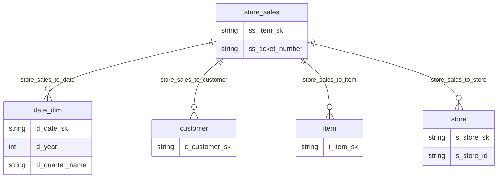

<!--
 Licensed to the Apache Software Foundation (ASF) under one
 or more contributor license agreements.  See the NOTICE file
 distributed with this work for additional information
 regarding copyright ownership.  The ASF licenses this file
 to you under the Apache License, Version 2.0 (the
 "License"); you may not use this file except in compliance
 with the License.  You may obtain a copy of the License at

   http://www.apache.org/licenses/LICENSE-2.0

 Unless required by applicable law or agreed to in writing,
 software distributed under the License is distributed on an
 "AS IS" BASIS, WITHOUT WARRANTIES OR CONDITIONS OF ANY
 KIND, either express or implied.  See the License for the
 specific language governing permissions and limitations
 under the License.
-->

# 第 4 章 · 编写你的第一份语义模型

> **Abstract** — A hands-on tutorial for authoring Ossie semantic models. Walks from a single-dataset minimal YAML through a multi-dataset TPC-DS model (5 tables, 4 relationships, 5 metrics) and the flights.yaml ontology example (44 concepts). Demonstrates composite primary keys, multi-dialect expressions, time-dimension patterns (`is_time` with no datatype, `d_year` as Integer), cross-dataset metrics, multi-vendor `custom_extensions`, and common errors with fixes. Each example includes the verbatim source citation (path:line) so readers can jump to GitHub.

> **【为用户】** 本章是教程：从一份最小可运行 YAML 起步，逐步扩展到 TPC-DS 那种 5 表 + 4 关系 + 5 度量的完整模型。每个示例都给出 verbatim 引用 + 中文注释。
>
> **【为开发者】** 这章展示的是 idiomatic 写法。Python converter 测试里大量使用 `examples/tpcds_semantic_model.yaml` 作为 baseline（`converters/snowflake/tests/`、`converters/orionbelt/tests/`），所以学会这一章意味着能看懂测试。
>
> **【为架构师】** TPC-DS 是纯结构示例（无 ontology），flights.yaml 是带 ontology 的完整示例。两者对比有助于理解"何时需要本体"。

## 4.1 最小可运行模型

> 适用：第 1 个 dataset、1 个 field。

```yaml
version: "0.2.0.dev0"
semantic_model:
  - name: hello_ossie
    description: 你的第一个语义模型
    datasets:
      - name: users
        source: app.public.users
        primary_key: [user_id]
        fields:
          - name: user_id
            expression:
              dialects:
                - dialect: ANSI_SQL
                  expression: user_id
            datatype: Integer
            description: 用户唯一标识
```

把上面这份 YAML 喂给 `validate.py`：

```bash
uv run validation/validate.py hello.yaml
```

如果一切正常，它只输出 warning（如 sqlglot 缺失），不报 error。

## 4.2 加入度量和关系

```yaml
version: "0.2.0.dev0"
semantic_model:
  - name: hello_ossie
    datasets:
      - name: users
        source: app.public.users
        primary_key: [user_id]
        fields:
          - name: user_id
            expression:
              dialects:
                - dialect: ANSI_SQL
                  expression: user_id
            datatype: Integer
          - name: created_at
            expression:
              dialects:
                - dialect: ANSI_SQL
                  expression: created_at
            datatype: DateTime
            dimension:
              is_time: true              # DateTime 默认 true，写不写都行
      - name: orders
        source: app.public.orders
        primary_key: [order_id]
        fields:
          - name: order_id
            expression:
              dialects:
                - dialect: ANSI_SQL
                  expression: order_id
            datatype: Integer
          - name: user_id
            expression:
              dialects:
                - dialect: ANSI_SQL
                  expression: user_id
            datatype: Integer
          - name: amount
            expression:
              dialects:
                - dialect: ANSI_SQL
                  expression: amount
            datatype: Decimal
    relationships:
      - name: orders_to_users
        from: orders
        to: users
        from_columns: [user_id]
        to_columns: [user_id]
    metrics:
      - name: total_amount
        expression:
          dialects:
            - dialect: ANSI_SQL
              expression: SUM(orders.amount)
        datatype: Decimal
        description: 全部订单总金额
```

## 4.3 TPC-DS 示例拆解

> 来源：`examples/tpcds_semantic_model.yaml:1-50`



TPC-DS 是一个**零售业决策支持**基准。仓库里的示例把 5 张核心表塞进一份 Ossie 模型：

| Dataset | 来源 | PK | 角色 |
|---|---|---|---|
| `store_sales` | `tpcds.public.store_sales` | `[ss_item_sk, ss_ticket_number]` | **事实表（复合主键）** |
| `date_dim` | `tpcds.public.date_dim` | `[d_date_sk]` | 时间维度 |
| `customer` | `tpcds.public.customer` | `[c_customer_sk]` | 客户维度 |
| `item` | `tpcds.public.item` | `[i_item_sk]` | 商品维度 |
| `store` | `tpcds.public.store` | `[s_store_sk]` | 门店维度（注意 `unique_keys: [s_store_id]` 不同列） |

### 4.3.1 复合主键的写法

```yaml
# examples/tpcds_semantic_model.yaml:35-37
- name: store_sales
  source: tpcds.public.store_sales
  primary_key: [ss_item_sk, ss_ticket_number]    # 一维，但有两个元素
  unique_keys:
    - [ss_item_sk, ss_ticket_number]            # 二维的"唯一约束组"
```

事实表的"一笔交易"在 TPC-DS 里由 `(商品, 票号)` 共同标识——所以是复合主键。

### 4.3.2 时间维度的多样本

```yaml
# examples/tpcds_semantic_model.yaml:188-200
- name: d_year
  datatype: Integer            # Integer 不是时间类型
  dimension:
    is_time: true              # 但显式标记为时间维度
  ai_context:
    synonyms:
      - "year"

# examples/tpcds_semantic_model.yaml:203-216
- name: d_quarter_name
  dimension:
    is_time: true              # 没有 datatype，也标记为时间维度
```

这是 §2.4 中"`is_time` 与 `datatype` 独立"原则的经典例子：年份用 `Integer`，季度名用 `String`，但**都是时间维度**。

### 4.3.3 跨数据集度量

```yaml
# examples/tpcds_semantic_model.yaml:573-585
- name: customer_lifetime_value
  expression:
    dialects:
      - dialect: ANSI_SQL
        expression: |
          SUM(store_sales.ss_ext_sales_price) /
          COUNT(DISTINCT customer.c_customer_sk)
  datatype: Decimal
  description: 客户终身价值
```

度量引用了 `store_sales` 和 `customer` 两个 dataset 里的字段——consumer 根据 `store_sales_to_customer` 这个 relationship 推导出 JOIN。

### 4.3.4 多厂商 custom_extensions

```yaml
# examples/tpcds_semantic_model.yaml:613-631
custom_extensions:
  - vendor_name: SALESFORCE
    data: |
      {
        "tableau_workbook_id": "tpcds_retail_dashboard",
        "einstein_enabled": true,
        "crm_sync": {
          "enabled": true,
          "sync_frequency": "daily",
          "customer_mapping": "customer.c_customer_id -> Account.AccountNumber"
        }
      }

  - vendor_name: DBT
    data: '{"project_name": "tpcds_analytics", "models_path": "models/semantic"}'
```

注意一个用 `|` block scalar、一个用 flow style，两种都合法。两个 vendor 的 metadata 在同一份模型里并存，Snowflake 转换器会忽略 SALESFORCE、Databricks 转换器会忽略 DBT——但 round-trip 时都保留。

## 4.4 Flights 示例拆解（本体层预览）

> 来源：`examples/flights.yaml:1-100`

flights.yaml 是**唯一**带 ontology 的端到端示例。它包含：

| 块 | 行数 | 含义 |
|---|---|---|
| `ontology:` | 24–539 | 业务概念定义（44 concepts: 12 Entity + 32 Value） |
| `semantic_model:` (嵌在 `ontology_mappings`) | 540+ | 6 个数据集的逻辑模型 |
| `ontology_mappings:` | 540–1111 | 把逻辑字段映射到 ontology 概念 |

ontology 块摘录（`flights.yaml:25-45`）：

```yaml
- concept: NrFeet
  description: "英尺距离单位"
  type: ValueType
  extends: [Decimal]                  # 继承 Decimal 的所有能力

- concept: CancelationCode
  type: ValueType
  extends: [String]
  requires: |
    CancelationCode == 'A' OR
    CancelationCode == 'B' OR
    CancelationCode == 'C' OR
    CancelationCode == 'D'            # 枚举约束
```

这是"业务概念先于物理字段"的本体设计——`NrFeet`、`NrMiles`、`Delay`、`Distance` 这些单位不只是 raw number，而是有语义的 value type。第 10 章深入展开。

## 4.5 风格约定

| 约定 | 推荐 |
|---|---|
| 缩进 | 2 空格（YAML 默认） |
| 字段顺序 | `name` → `expression` → `dimension` → `datatype` → `description` → `ai_context` |
| `expression.dialects` 顺序 | ANSI_SQL 在前，vendor-specific 在后 |
| `ai_context` 何时用 object | 字段/度量层推荐 object；语义模型层可简化为 string |
| 引用 dataset 字段 | `dataset.field_name` 全限定 |
| 多行 SQL | 用 `|` block scalar（保留换行） |
| 注释 | YAML 用 `#`；多行注释用 `#` 起每行 |

## 4.6 常见错误与修复

| 错误消息 | 原因 | 修复 |
|---|---|---|
| `'orders' is not of type 'array'` | 顶层 `semantic_model` 必须是 array | 改为 `- name: ...` 列表 |
| `Duplicate field name 'amount' in dataset 'orders'` | 字段名重复 | 重命名或合并 |
| `Relationship 'x_to_y' references unknown dataset 'y'` | 关系引用了不存在的 dataset | 检查 `from`/`to` |
| `[SQL] Invalid expression` | sqlglot 解析失败 | 用 `uv run validation/validate.py --output json` 看具体 dialect 错误 |
| `'primary_key' is required` | 复合主键必须用 array 形式 | `primary_key: [a, b]` |

### ❌ 错误 vs ✅ 正确

```yaml
# ❌ 错误：primary_key 是字符串
primary_key: "ss_item_sk"

# ✅ 正确：primary_key 是数组（即使是单列）
primary_key: [ss_item_sk]
```

```yaml
# ❌ 错误：relationship.from 是 Python 关键字写法
- name: x_to_y
  from: orders
  to: users

# ✅ 正确：YAML 中 `from` 没问题（这是字符串，不是 Python 属性名）
- name: x_to_y
  from: orders               # YAML 不在乎
  to: users
```

## 4.7 📌 章节要点速查

| 读者 | 一句话要点 |
|---|---|
| 用户 | 从最小模型起步；TPC-DS 是测试 baseline；flights.yaml 是 ontology 完整案例 |
| 开发者 | TPC-DS 被多个 converter 用作测试 fixture；学会它等于看懂所有 converter 的测试 |
| 架构师 | `custom_extensions` 多 vendor 并存是 Ossie 的承重设计；round-trip 永远保留 |