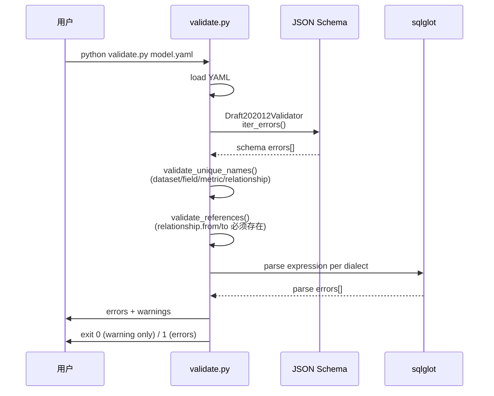

<!--
 Licensed to the Apache Software Foundation (ASF) under one
 or more contributor license agreements.  See the NOTICE file
 distributed with this work for additional information
 regarding copyright ownership.  The ASF licenses this file
 to you under the Apache License, Version 2.0 (the
 "License"); you may not use this file except in compliance
 with the License.  You may obtain a copy of the License at

   http://www.apache.org/licenses/LICENSE-2.0

 Unless required by applicable law or agreed to in writing,
 software distributed under the License is distributed on an
 "AS IS" BASIS, WITHOUT WARRANTIES OR CONDITIONS OF ANY
 KIND, either express or implied.  See the License for the
 specific language governing permissions and limitations
 under the License.
-->

# 第 5 章 · 验证工具与 CI/CD 集成

> **Abstract** — `validation/validate.py` is a PEP 723 inline-script validator (single file, 290 lines) that runs 4 checks against your semantic model: JSON Schema (Draft 2020-12, against `osi-schema.json`), uniqueness of names, reference integrity, and SQL syntax via sqlglot (MDX/TABLEAU/MAQL skipped). The chapter covers installation, error output, dialect mapping, CI integration with GitHub Actions, and pre-commit hooks. The `compliance/` directory is a placeholder for the future cross-converter compliance test suite.

> **【为用户】** `validation/validate.py` 是你写模型时的"实时纠错器"。它做 4 类检查：JSON Schema、唯一性、引用完整性、SQL 语法。本章教你如何安装、运行、解读输出。
>
> **【为开发者】** validator 是 OSSIE 工具链中**最简单也最有用的入口**。它没有 CLI 框架，只是 PEP 723 inline script，可作为库 import。集成到 pre-commit hook 只需 5 行。
>
> **【为架构师】** 当前 validator 是 Python 单进程工具；合规测试套件（`compliance/`）尚在规划。CI 矩阵（12 工作流）已经覆盖每个 converter 独立测试——这是分布式质量保障。

> ⚠️ **实现状态提醒**：`compliance/` 目录仅有 20 行 README 占位（[`compliance/README.md`](https://github.com/apache/ossie/blob/main/compliance/README.md)），合规测试套件**尚未实现**。当前的"合规"保证散落在各 converter 的 `tests/` 目录。

## 5.1 四层校验架构

> 来源：`validation/validate.py:78-219`



| 检查层 | 函数 | 触发错误示例 |
|---|---|---|
| **JSON Schema** | `validate_schema()` | `'orders' is not of type 'array'` |
| **唯一性** | `validate_unique_names()` | `Duplicate field name 'amount'` |
| **引用完整性** | `validate_references()` | `references unknown dataset 'y'` |
| **SQL 语法** | `validate_sql()` | `Invalid expression` |

## 5.2 安装与运行

### 作为 PEP 723 inline script（推荐）

`validate.py` 头部（verbatim）：

```python
#!/usr/bin/env python3
#
# /// script
# requires-python = ">=3.11"
# dependencies = [
#     "jsonschema>=4.26.0",
#     "pyyaml>=6.0.3",
#     "sqlglot>=30.12.0",
# ]
# ///
```

这意味着**无需任何环境配置**，`uv run` 自动处理依赖：

```bash
# 基础运行（自动下载 jsonschema/pyyaml/sqlglot）
uv run validation/validate.py examples/tpcds_semantic_model.yaml

# 用自定义 schema（实验性 spec）
uv run validation/validate.py my_model.yaml --schema /tmp/experimental.json
```

### 作为模块导入

```python
from validate import (
    validate_schema,
    validate_unique_names,
    validate_references,
    validate_sql,
)
import yaml

with open("my_model.yaml") as f:
    data = yaml.safe_load(f)

errors = []
errors.extend(validate_schema(data, SCHEMA))
errors.extend(validate_unique_names(data))
errors.extend(validate_references(data))
errors.extend(validate_sql(data))

if errors:
    for e in errors:
        print(f"  {e}")
    raise SystemExit(1)
```

## 5.3 方言映射与跳过策略

> 来源：`validation/validate.py:64-72`

```python
DIALECT_MAP = {
    "ANSI_SQL": None,            # sqlglot 默认方言
    "SNOWFLAKE": "snowflake",
    "DATABRICKS": "databricks",
    "BIGQUERY": "bigquery",
    # MDX / TABLEAU / MAQL 暂未映射
}

SKIP_SQL_VALIDATION = {"MDX", "TABLEAU", "MAQL"}
```

**两个细节**：

1. **裸表达式 + `SELECT` 包裹双重尝试**（`validate.py:177-219`）：sqlglot 经常需要包一层 `SELECT ... FROM` 才能解析列引用，所以每个 expression 先裸 parse，失败再包 SELECT parse。
2. **sqlglot 缺失不阻断**：如果用户没装 sqlglot，SQL 校验层跳过，但**会发 warning**：

```
[SQL] Warning: sqlglot not installed, skipping SQL validation.
Install with: pip install sqlglot
```

警告不导致 exit code = 1；JSON Schema / 唯一性 / 引用完整性检查**始终运行**。

## 5.4 错误格式与退出码

```text
  [Schema] semantic_model -> 0 -> datasets -> 0 -> name: 'orders' is not of type 'string'
  [Unique] Duplicate field name 'amount' in dataset 'orders'
  [Reference] Relationship 'orders_to_customers' references unknown dataset 'customer'
  [SQL] Field 'orders.amount' in model 'sales' (SNOWFLAKE): Invalid expression

Validation FAILED with 4 error(s):
```

- 每个错误带 `[类别]` 前缀
- Schema 错误包含 JSON pointer 路径（`->` 分隔）
- Warnings（如 sqlglot 缺失）**不会**计为 error
- exit 0 = 仅警告或全部通过；exit 1 = 至少一个 error

## 5.5 集成到 CI

仓库里 **11 条 CI 工作流**（CLI 1 条 + converter 10 条）已经在跑测试，但目前**没有**一条专门跑 `validate.py`。集成方式有两种：

### 方式 A：在 converter CI 里加一步

```yaml
# .github/workflows/converter-snowflake-ci.yml
- name: Validate semantic model examples
  run: |
    cd converters/snowflake
    uv run ../../validation/validate.py ../../examples/tpcds_semantic_model.yaml
```

### 方式 B：单独的 validation workflow

```yaml
# .github/workflows/validate-models.yml
name: Validate Ossie Models
on:
  pull_request:
    paths:
      - 'core-spec/**'
      - 'examples/**'
      - 'converters/**'
      - 'validation/validate.py'
jobs:
  validate:
    runs-on: ubuntu-latest
    steps:
      - uses: actions/checkout@v4
      - uses: actions/setup-python@v5
        with:
          python-version: "3.12"
      - run: |
          cd validation
          curl -LsSf https://astral.sh/uv/install.sh | sh
          echo "${HOME}/.local/bin" >> "${GITHUB_PATH}"
      - run: uv run validation/validate.py examples/*.yaml
```

## 5.6 集成到 pre-commit hook

```yaml
# .pre-commit-config.yaml
repos:
  - repo: local
    hooks:
      - id: ossie-validate
        name: Validate Ossie semantic models
        entry: uv run validation/validate.py
        language: system
        files: '\.(yaml|yml)$'
        pass_filenames: true
```

提交 `*.yaml` 时自动跑 validator。本地开发循环：

```bash
# 改完模型先跑这个
uv run validation/validate.py examples/tpcds_semantic_model.yaml
# 再 git commit
```

## 5.7 与 converter 内部 validator 的关系

Python validator 是**通用入口**；每个 converter 自己也跑校验：

| Converter | 内部 validator | 备注 |
|---|---|---|
| Salesforce | `SchemaValidator.java` | Draft V7（`networknt/schema-validator`） |
| OrionBelt | `validation.py:validate_osi` | 可选 deep OBML validation |
| Wisdom | 测试中通过 `OSIDocument.model_validate()` | 复用 Python SDK 的 Pydantic |

通用 validator 与 converter-specific validator 是**互补**而非冲突：

- **通用 validator**：保证 schema 合规、所有 converter 都能读
- **Converter-specific**：保证自家方言、round-trip 语义

> ⚠️ **实现状态提醒**：目前**没有跨 converter 的一致性测试**。每个 converter 的 round-trip 测试是独立的；规划中的 `compliance/` 套件会解决这个问题。

## 5.8 📌 章节要点速查

| 读者 | 一句话要点 |
|---|---|
| 用户 | `uv run validation/validate.py file.yaml` 一行命令即可；sqlglot 缺失不阻断但会 warning |
| 开发者 | validator 可作为库 import 嵌入流水线；pre-commit hook 5 行可配 |
| 架构师 | `compliance/` 是规划中的合规测试套件；当前各 converter 独立 round-trip 测试 |