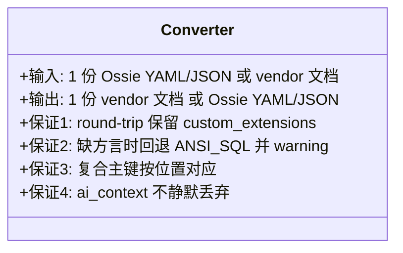
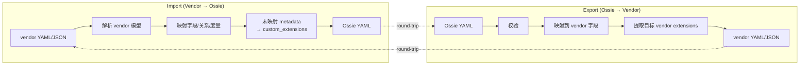
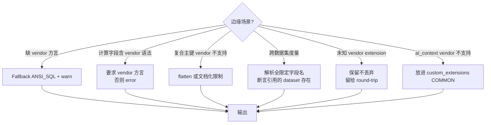
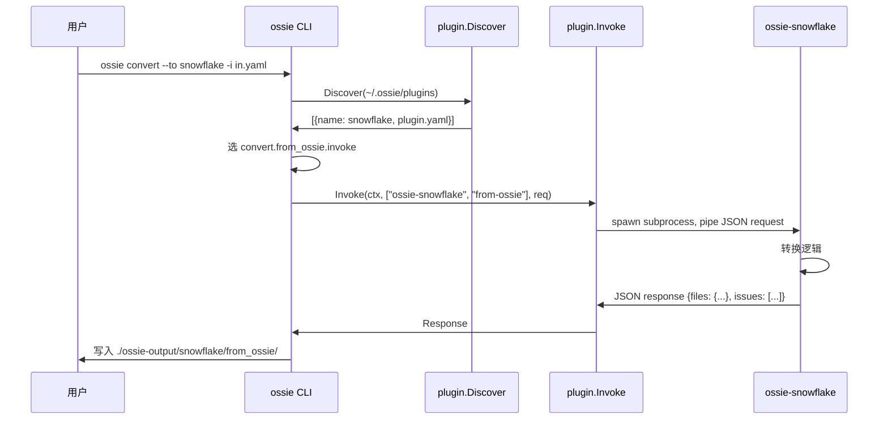

<!--
 Licensed to the Apache Software Foundation (ASF) under one
 or more contributor license agreements.  See the NOTICE file
 distributed with this work for additional information
 regarding copyright ownership.  The ASF licenses this file
 to you under the Apache License, Version 2.0 (the
 "License"); you may not use this file except in compliance
 with the License.  You may obtain a copy of the License at

   http://www.apache.org/licenses/LICENSE-2.0

 Unless required by applicable law or agreed to in writing,
 software distributed under the License is distributed on an
 "AS IS" BASIS, WITHOUT WARRANTIES OR CONDITIONS OF ANY
 KIND, either express or implied.  See the License for the
 specific language governing permissions and limitations
 under the License.
-->

# 第 6 章 · 转换器架构：Hub-and-Spoke 深度解读

> **Abstract** — Hub-and-spoke reduces N·(N-1) point-to-point adapters to 2·N converters (one import + one export per vendor). The chapter derives the cost model, states the converter contract (round-trip fidelity, dialect fallback, composite-key preservation, AI-context preservation), walks the 9-step implementation pipeline, and inspects the CLI plugin protocol (JSON over stdin/stdout, `~/.ossie/plugins/<name>/plugin.yaml` discovery). Worked examples show Snowflake's dialect selection and Databricks's YAML 1.2 boolean workaround.

> **【为用户】** 这一章解释为什么 Ossie 是"中立交换所"而不是另一个 dbt。理解这一章后，你能向团队清楚说明"Ossie 转换器给我们带来了什么"。
>
> **【为开发者】** 这一章是"如何写一个新 converter"的前置。9 步流水线（`converters/README.md:232-252`）是模板；CLI 插件协议（`cli/internal/plugin/plugin.go`）是部署载体。
>
> **【为架构师】** Hub-and-Spoke 是 Ossie 全部架构哲学的核心；lossy vs lossless 转换的设计取舍影响整个生态的可信度。

## 6.1 经济学：N×(N-1) vs 2N

> 来源：`converters/README.md:33-47`

```mermaid
flowchart LR
  subgraph 点对点[N×(N-1) = 110 条]
    SF1[Snowflake]
    SFDBT1[dbt]
    SFDBX1[Databricks]
    SFOMC1[Omni]
    SFTBL1[Tableau]
    SFGDC1[GoodData]
    SFWIS1[WisdomAI]
    SFSF1[Salesforce]
    SF1 -.-> SFDBT1
    SF1 -.-> SFDBX1
    SF1 -.-> SFOMC1
    SFDBT1 -.-> SFDBX1
    SFDBT1 -.-> SFOMC1
    SFDBX1 -.-> SFOMC1
    SFDBT1 -.-> SFTBL1
    SFDBX1 -.-> SFTBL1
    SFOMC1 -.-> SFTBL1
    SFDBT1 -.-> SFGDC1
    SFDBX1 -.-> SFGDC1
    SFDBT1 -.-> SFWIS1
    SFDBT1 -.-> SFSF1
  end

  subgraph Hub[2N = 22 条]
    SF2[Snowflake]
    SFDBT2[dbt]
    SFDBX2[Databricks]
    SFOMC2[Omni]
    SFTBL2[Tableau]
    SFGDC2[GoodData]
    SFWIS2[WisdomAI]
    SFSF2[Salesforce]
    HUB{{Ossie Hub}}

    SF2 <--> HUB
    SFDBT2 <--> HUB
    SFDBX2 <--> HUB
    SFOMC2 <--> HUB
    SFTBL2 <--> HUB
    SFGDC2 <--> HUB
    SFWIS2 <--> HUB
    SFSF2 <--> HUB
  end
```

| 接入策略 | N=5 | N=8 | N=11（当前） | N=20 |
|---|---|---|---|---|
| **点对点** | 20 | 56 | 110 | 380 |
| **Hub-and-Spoke** | 10 | 16 | 22 | 40 |

> 当 N=11（当前规模），点对点需要 **110** 条 converter；Ossie 模式只需 **22** 条——节省 80% 工程量。

## 6.2 转换器的契约

每个 converter 必须满足的隐式契约：



| 契约 | 来源 | 实现位置 |
|---|---|---|
| **Round-trip fidelity** | `docs/index.md:278-279` | 每个 converter 的 `CustomExtensionHandler` |
| **方言回退** | `converters/README.md:241-244` | `_extract_expression` 函数族 |
| **复合主键位置对应** | `converters/README.md:158-165` | 各 converter 的 `_convert_relationship` |
| **AI 上下文保留** | `converters/README.md:262` | 缺 vendor 映射时进 `custom_extensions[COMMON]` |

## 6.3 两方向：Export 与 Import



### 9 步实现流水线（来源：`converters/README.md:232-252`）

| 步骤 | 做什么 | 关键点 |
|---|---|---|
| 1 | **校验输入** | 加载 Ossie YAML，跑 schema 校验 |
| 2 | **解析 Ossie 模型** | 遍历 `semantic_model[]` |
| 3 | **映射 datasets** | `name`/`source`/`primary_key`/`unique_keys`/`fields` |
| 4 | **映射 fields** + **方言选择** | vendor → ANSI_SQL → warn |
| 5 | **映射 relationships** | 复合键按列序对应 |
| 6 | **映射 metrics** | 同样方言选择；解析 dataset 引用 |
| 7 | **应用 custom_extensions** | 提取目标 vendor 的；保留其他 |
| 8 | **保留 AI 上下文** | vendor 支持则映射；不支持则进 `COMMON` |
| 9 | **校验输出** | 用 vendor 自家的 schema/tool 验证 |

## 6.4 边缘场景的 6 种处理范式

> 来源：`converters/README.md:255-262`



### 范例：Snowflake converter 的方言选择（`converters/snowflake/src/ossie_snowflake/converter.py:376-414`）

```python
for d in dialects:
    dialect_name = (d.get("dialect") or "").upper()
    if dialect_name == "SNOWFLAKE":
        snowflake_expr = d.get("expression")
    elif dialect_name == "ANSI_SQL":
        ansi_expr = d.get("expression")

if snowflake_expr is not None:
    return snowflake_expr
if ansi_expr is not None:
    return ansi_expr
# warn + skip
warn(f"field {field_name}: no SNOWFLAKE or ANSI_SQL expression")
return None
```

### 范例：Databricks 的 YAML 1.2 布尔处理（`converters/databricks/src/ossie_databricks/_common.py:113-128`）

```python
class _Yaml12Loader(yaml.SafeLoader):
    pass

# YAML 1.2 把 on/off 视为字符串，不当布尔
# 否则 join `on:` 键会被解析为 True，丢失连接条件
```

这是 Databricks / Omni converter 都遭遇的实战坑：YAML 1.1 的 `on/off/yes/no` 是布尔，但语义模型里 `on:` 是 join 关键字。两种 converter 都强制使用 YAML 1.2 加载器。

## 6.5 插件协议：CLI 如何 dispatch converter

> 来源：`cli/internal/plugin/plugin.go:30-67`、`cli/internal/plugin/discover.go:25-50`



### Plugin manifest（plugin.yaml）格式

```yaml
# ~/.ossie/plugins/snowflake/plugin.yaml
ossie_plugin_spec: "0.1.0"
ossie_spec_version: ">=0.2.0"
name: snowflake
platform: Snowflake
convert:
  to_ossie:
    invoke: ["ossie-snowflake", "to-ossie"]
    accepts: [".yaml", ".json"]
  from_ossie:
    invoke: ["ossie-snowflake", "from-ossie"]
```

发现规则（`discover.go:25-50`）：

- 扫描 `~/.ossie/plugins/` 下每个子目录
- 找 `plugin.yaml`，parse YAML
- 不认识 `ossie_plugin_spec` 字段的目录发出 warning 并跳过
- **未知字段被静默忽略**（forward compatibility）

### IPC 协议（JSON over stdin/stdout）

> 来源：`cli/internal/plugin/invoke.go:13-83`

```go
type Request struct {
    Files map[string]string `json:"files"`     // 文件名 -> 内容
}

type Response struct {
    Files  map[string]string `json:"files"`
    Issues []Issue           `json:"issues,omitempty"`
}

type Issue struct {
    Severity string `json:"severity"`           // "warning" | "error"
    Message  string `json:"message"`
    Path     string `json:"path,omitempty"`
}
```

**关键不变量**（`invoke.go:41-43`）：

> *"Non-empty `Issues` is NOT a Go error. The caller must inspect severities."*

也就是说，plugin 进程 exit code = 0 但 `Issues` 非空时，调用方需要根据 severity 决定是否视为失败。

## 6.6 现状标注

> ⚠️ **实现状态提醒**：
> 
> - `cli/cmd/convert.go:46-48` 当前只打印 `"not yet implemented"`。今天请用各 converter 自带的 CLI（如 `ossie-snowflake -i in -o out`）。
> - `cli/cmd/plugin/install.go` 同样是 stub。需要手动把 converter 的可执行文件放到 `~/.ossie/plugins/<name>/` 下。

## 6.7 📌 章节要点速查

| 读者 | 一句话要点 |
|---|---|
| 用户 | Hub-and-Spoke 把 N=11 的连接器从 110 条降到 22 条；这是 Ossie 的核心经济性 |
| 开发者 | 9 步流水线是写新 converter 的模板；CLI 插件协议已就绪但 stub 待补 |
| 架构师 | Round-trip fidelity 是"承重墙"——custom_extensions 必须永远保留 |