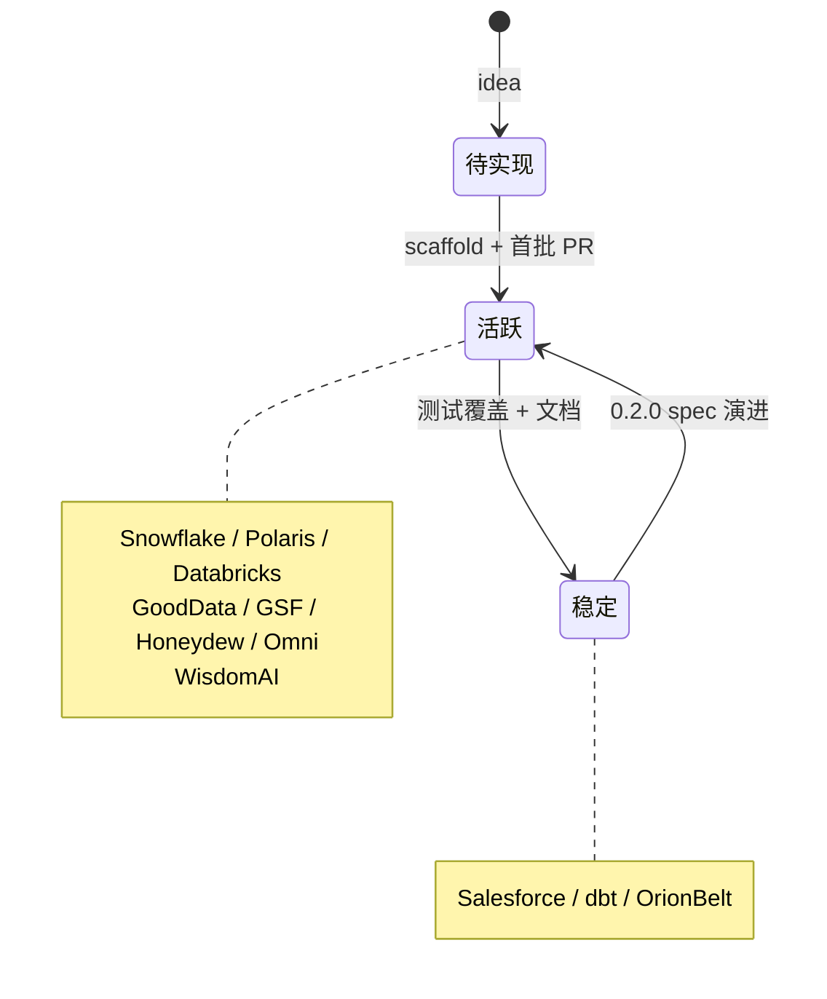

<!--
 Licensed to the Apache Software Foundation (ASF) under one
 or more contributor license agreements.  See the NOTICE file
 distributed with this work for additional information
 regarding copyright ownership.  The ASF licenses this file
 to you under the Apache License, Version 2.0 (the
 "License"); you may not use this file except in compliance
 with the License.  You may obtain a copy of the License at

   http://www.apache.org/licenses/LICENSE-2.0

 Unless required by applicable law or agreed to in writing,
 software distributed under the License is distributed on an
 "AS IS" BASIS, WITHOUT WARRANTIES OR CONDITIONS OF ANY
 KIND, either express or implied.  See the License for the
 specific language governing permissions and limitations
 under the License.
-->

# 第 7 章 · 11 个 Converter 横向评测

> **Abstract** — A vendor-by-vendor survey of Ossie's 11 converters: Snowflake (Python, Export), dbt (Python, bidirectional via MetricFlow), Databricks (Python, bidirectional), GoodData (Python, library), NVIDIA GSF (Python, bidirectional), Honeydew (Python, bidirectional), Omni (Python, bidirectional), OrionBelt (Python, bidirectional, ontology support), WisdomAI (Python, bidirectional), Salesforce (Java, bidirectional), Polaris (Java, bidirectional, live Iceberg catalog). Each converter gets: entrypoint command, datatype mapping table, notable features, test count, and current status. The chapter ends with a selection matrix mapping toolstack to recommended converter.

> **【为用户】** 这一章是"选哪个 converter 接入我的工具栈"的速查表。每家都给：方向、语言、CLI 命令、数据类型映射、测试覆盖、当前状态。
>
> **【为开发者】** 9 个 Python converter 都遵循 `pyproject.toml + src/<package>/cli.py + converter.py` 的统一结构；2 个 Java converter（Salesforce、Polaris）走 Maven pipeline 模式。可以挑最近的一家"克隆-修改"。
>
> **【为架构师】** Java vs Python 选型与目标平台的 SDK 主流语言一致：Snowflake/dbt/Databricks 主用 Python，所以选 Python；Salesforce/Polaris 的官方 SDK 在 JVM，所以选 Java。这是工程层面的"平台匹配"原则。

## 7.1 总览矩阵

| Vendor | 语言 | 版本 | CLI | 方向 | 测试 | 状态 |
|---|---|---|---|---|---|---|
| **Snowflake** | Python | `0.2.0.dev0` | ✅ | 导出 | 84 | 🚧 Active dev |
| **Salesforce** | Java | `0.1.0-SNAPSHOT` | ✅ | 双向 | 28 | ✅ Stable |
| **Polaris** | Java | `0.1.0-SNAPSHOT` | ✅ | 双向 | 14 | 🚧 Active dev |
| **Databricks** | Python | `0.2.0.dev0` | ✅ | 双向 | 77 | 🚧 Active dev |
| **dbt** | Python | `0.2.0.dev0` | ✅ | 双向 | 92 | ✅ Stable |
| **GoodData** | Python | `0.2.0.dev0` | ❌ | 双向 | 46 | 🚧 Active dev |
| **NVIDIA GSF** | Python | `0.1.0.dev0` | ✅ | 双向 | 40 | 🚧 Active dev |
| **Honeydew** | Python | `0.2.0.dev0` | ✅ | 双向 | 50 | 🚧 Active dev |
| **Omni** | Python | `0.2.0.dev0` | ✅ | 双向 | 83 | 🚧 Active dev |
| **OrionBelt** | Python | `0.2.0.dev0` | ✅ | 双向 | 154 | ✅ Stable |
| **WisdomAI** | Python | `0.2.0.dev0` | ✅ | 双向 | 27 | 🚧 Active dev |

> **测试总数**：695，覆盖最广的是 OrionBelt (154)，最小是 Polaris (14)。

## 7.2 Python 转换器群（9 家）

### 7.2.1 Snowflake — `ossie-snowflake`

```bash
ossie-snowflake -i model.yaml -o snowflake_model.yaml
```

**特点**：单模块实现（`converter.py` 546 行），导出方向。方言选择：`SNOWFLAKE` → `ANSI_SQL` → warn。**子查询检测**支持 `WITH`/`SELECT` 前缀（注意必须空白后跟关键字以避免误判 `WITH_TABLE`）。

**数据类型映射**（`converters/snowflake/src/ossie_snowflake/converter.py:38-48`）：

| Ossie | Snowflake |
|---|---|
| `String` | `VARCHAR` |
| `Integer` | `NUMBER(38,0)` |
| `Decimal` | `NUMBER` |
| `Float` | `FLOAT` |
| `Boolean` | `BOOLEAN` |
| `Date` | `DATE` |
| `Time` | `TIME` |
| `DateTime` | `TIMESTAMP_NTZ` |
| `DateTimeTz` | `TIMESTAMP_TZ` |
| `Opaque` | (omit + warn) |

### 7.2.2 dbt — `ossie-dbt`

```bash
# dbt → Ossie
ossie-dbt msi-to-osi -i semantic_manifest.json -o model.yaml

# Ossie → dbt
ossie-dbt osi-to-msi -i model.yaml -o semantic_manifest.json
```

**特点**：通过 `metricflow>=0.209.0` 解析 dbt 的 `semantic_manifest.json`。**字段分类**优先级：PK → UNIQUE entity → FK → TIME → CATEGORICAL。SQLGlot 用来识别 ratio 度量（`(a)/(b)` 自动生成子度量）。**snapshot 测试**用 `syrupy`（`tests/__snapshots__/*.ambr`）。

**已知降级**（4 类 `ConverterIssueType`）：

- `CONVERSION_METRIC_DROPPED`
- `PRIVATE_METRIC_DROPPED`
- `NATURAL_ENTITY_DROPPED`
- `CUMULATIVE_SEMANTICS_LOSS`

### 7.2.3 GoodData — `ossie-gooddata`

**特点**：库形式（无 CLI），导出 + 导入 GoodData LDM JSON。**双方言**：`ANSI_SQL` + `MAQL`。日期日期时识别由 `custom_extensions[GOODDATA].date_dimension: true` 标记。

**类型映射**（`datatype_mapping.py:24-91`）：

| Ossie | GoodData |
|---|---|
| `String` | `STRING` |
| `Integer` | `INT` |
| `Decimal` | `NUMERIC` |
| `Float` | (NUMERIC + warn) |
| `Boolean` | `BOOLEAN` |
| `Date` | `DATE` |
| `DateTime` | `TIMESTAMP` |
| `DateTimeTz` | `TIMESTAMP_TZ` |

> **度量不在转换范围内**（GoodData 度量是 MAQL report-time，Ossie SQL 模型无法表达）。

### 7.2.4 Databricks — `ossie-databricks`

```bash
ossie-databricks export -i model.yaml -o mv.yaml
ossie-databricks import -i mv.yaml -o model.yaml
```

**特点**：**YAML 1.2 强制**（避免 `on:`/`off:` 被当布尔）。**BFS 连接树**构建 Metric View 的 join 结构；**菱形 fan-out**（一个 dataset 两条路径到达）展开为多别名节点。`rely.at_most_one_match` 转 Ossie `unique_keys`；`source.*` 通配列被拒绝（Ossie 无表示）。

**离线**：无外部连接，纯 YAML↔YAML 转换。

### 7.2.5 NVIDIA GSF — `ossie-gsf`

```bash
ossie-gsf export --input model.yaml --output gsf.yaml --database-name tpcds
ossie-gsf import --input gsf.yaml --output model.yaml --name my_model
```

**特点**：2168 行单文件 converter。**SQLGlot 多方言**解析（11 候选），无法解析时原样保留。**确定性 UUIDv5 ID** 保证重复运行字节一致。**完整原生 GSF 文档**塞进 `custom_extensions[NVIDIA_GSF]` 实现 byte-faithful round-trip。

> **GSF 不支持的 Ossie 特性**：`ai_context`、synonyms、expression-dialect variants、`custom_extensions` 槽——全部静默丢失。

### 7.2.6 Honeydew — `honeydew-osi`

```bash
honeydew-osi osi-to-honeydew -i model.yaml -o workspace_dir/
honeydew-osi honeydew-to-osi -i workspace_dir/ -o model.yaml
```

**特点**：转换到 Honeydew **workspace 目录**（`workspace.yml` + `schema/<entity>/` + `datasets/` + `attributes/` + `metrics/`）。**`primary_key` 既双**导出 PK + 一个 `unique_keys`，确保 Honeydew 端 join 不会丢信息。**`ai_context` 映射到 Honeydew 原生字段**；多余 metadata 进 Honeydew `metadata.osi`。

### 7.2.7 Omni — `osi-omni`

```bash
osi-omni export -i model.yaml -o omni_model/ [--base-view NAME] [--dialect DIALECT]
osi-omni import -i omni_model/ [-o model.yaml]
```

**特点**：转换到 Omni **model 目录**（`model.yaml` + `relationships.yaml` + `views/*.view.yaml` + `topics/*.topic.yaml`）。**YAML 1.2** 强制。**Omni 标识符正则**放宽（接受 `_fivetran_id`、`camelCase`）。**`${view.column}` 模板**翻译为 Ossie 字段引用。

> **Omni 视图/主题** 一对一映射；`--base-view` 选 root（默认 FK-sink dataset）。

### 7.2.8 OrionBelt — `ossie-orionbelt`

```bash
ossie-orionbelt obml-to-osi [-i|-o] [--ontology] [--no-validate]
ossie-orionbelt osi-to-obml [-i|-o] [--database NAME] [--schema NAME] [--no-validate]
```

**特点**：OBML YAML ↔ OSI YAML。**本体层导出**（`--ontology`）。**v0.1.x 兼容 shim** 把 `OBSL` 扩展中的 PK/UK 提升到 v0.2 first-class。**第三方 vendor extensions**（`SNOWFLAKE`/`DBT`/`SALESFORCE`/`GOODDATA` 等）在所有层级保留。**未转换的度量**保留进 `OSI` 扩展并打 `LOSSY:` warning。

> **154 测试**——含 property-based round-trip + TPC-DS baseline + "no silent loss" 验证集。

### 7.2.9 WisdomAI — `ossie-wisdom`

```bash
ossie-wisdom wisdom-to-osi -i domain-export.json -o model.yaml
ossie-wisdom osi-to-wisdom -i model.yaml -o domain-export.json
```

**特点**：转换 WisdomAI domain export JSON（`1.0` 格式）。**Per-connection 方言映射**：`snowflake → SNOWFLAKE`、`databricks → DATABRICKS`、`bigquery → BIGQUERY`，其它回退 `ANSI_SQL` + warning。

**Cardinality 处理**：

| Wisdom | Ossie |
|---|---|
| `MANY_TO_ONE` | `from = left, to = right` |
| `ONE_TO_MANY` | `from = right, to = left` |
| `ONE_TO_ONE` | `from = left` + ai_context note |
| `MANY_TO_MANY` | `from = left` + ai_context note + `CARDINALITY_LOSS` warning |

## 7.3 Java 转换器群（2 家）

### 7.3.1 Polaris — `OsiPolarisConverter`

```bash
# 与 live Polaris (Iceberg REST) 通信
java -jar ossie-polaris-converter.jar import \
  --url http://polaris:8181/api/catalog \
  --catalog my_catalog

java -jar ossie-polaris-converter.jar export \
  --url http://polaris:8181/api/catalog \
  --catalog my_catalog \
  -o model.yaml
```

**特点**：**唯一连接活的 catalog 的 converter**。1 Polaris namespace ↔ 1 Ossie semantic_model。`dataset.source` = `catalog.namespace.table`。`identifier-field-ids` → `dataset.primary_key`。**嵌套 Iceberg 类型**重新生成 ID 维持 Iceberg ID-uniqueness。

**类型映射**（`IcebergTypeMapper.java`）：

| Iceberg | Ossie |
|---|---|
| `boolean` | `Boolean` |
| `int` / `long` | `Integer` |
| `float` / `double` | `Float` |
| `decimal(18,2)` | `Decimal` |
| `date` | `Date` |
| `time` | `Time` |
| `timestamp` / `timestamp_ns` | `DateTime` |
| `timestamptz` / `timestamptz_ns` | `DateTimeTz` |
| `string` | `String` |
| 其它 | `Opaque` |

### 7.3.2 Salesforce — `OsiSalesforceConverter`

```bash
# Ossie → Salesforce
java -jar ossie-salesforce-converter.jar toSF -i model.yaml -o sf_model.json

# Salesforce → Ossie
java -jar ossie-salesforce-converter.jar toOSI -i sf_model.json -o model.yaml
```

**特点**：**Pipeline 架构**——handlers 通过 `osi-salesforce-converter-config.yaml` 串联：

```yaml
# converters/salesforce/src/main/resources/osi-salesforce-converter-config.yaml
pipelines:
  osiToSalesforce:
    - DatasetMappingHandler
    - FieldMappingHandler
    - RelationshipMappingHandler
    - MetricMappingHandler
    - SemanticModelMappingHandler
```

每个 Handler 实现 `PipelineStep.execute(sourceData, outputData, mappings)`，按顺序处理。

**类型映射**（`SalesforceDataTypeMapper.java`）：

| Salesforce | Ossie |
|---|---|
| `Text` / `Email` / `PhoneNumber` / `Url` | `String` |
| `Number` / `Currency` / `Percentage` | `Decimal` |
| `Boolean` | `Boolean` |
| `Date` | `Date` |
| `DateTime` | `DateTimeTz`（**lossy**） |
| `Geo` | `Opaque` |

> **Schema validation** 用 `com.networknt/schema-validator` (SpecVersion V7)。**DateTime → DateTimeTz** 是有损转换，会打 warning。

## 7.4 状态图



## 7.5 选型决策表

| 你的工具栈 | 推荐 converter | 理由 |
|---|---|---|
| Snowflake + BI | Snowflake | 导出，覆盖最广 |
| Snowflake + dbt | dbt + Snowflake | dbt 双向 + Snowflake 导出 |
| Databricks 平台 | Databricks | YAML 离线转换 |
| Polaris (Iceberg) | Polaris | 唯一支持 live catalog |
| Salesforce CRM | Salesforce | 双 pipeline、成熟稳定 |
| dbt 全栈 | dbt | 154 测试、最成熟 |
| GoodData BI | GoodData | 双方言 LDM |
| NVIDIA AI / Fabric | GSF | 完整 round-trip 保留 |
| Honeydew 数据建模 | Honeydew | workspace 目录映射 |
| Omni BI | Omni | model 目录 + view/topic |
| 业务建模平台 | OrionBelt | 本体导出 + v0.1.x 兼容 |
| WisdomAI domain | WisdomAI | per-connection 方言 |

## 7.6 📌 章节要点速查

| 读者 | 一句话要点 |
|---|---|
| 用户 | 11 个 converter 中 Snowflake/dbt/Salesforce/Polaris/Databricks 5 个覆盖最主流工具栈 |
| 开发者 | Python converter 模板：`_common.py + cli.py + <vendor>_to_osi.py + osi_to_<vendor>.py`；Java converter 模板：PipelineStep + HandlerFactory |
| 架构师 | Java/Python 选型匹配目标平台 SDK 主流语言；Polaris 是唯一连 live catalog 的 converter |