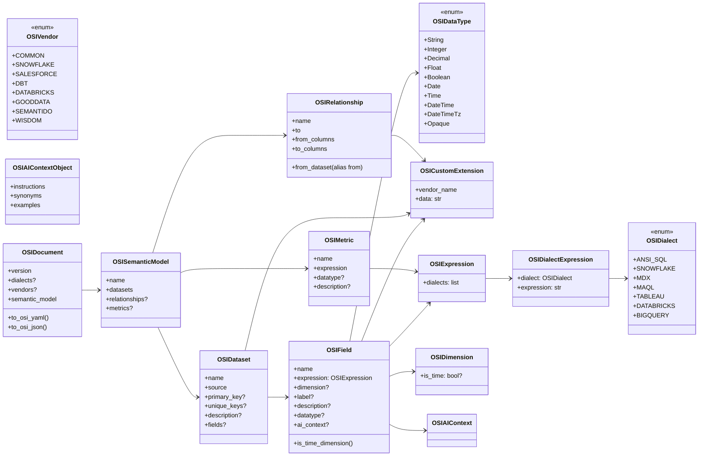

<!--
 Licensed to the Apache Software Foundation (ASF) under one
 or more contributor license agreements.  See the NOTICE file
 distributed with this work for additional information
 regarding copyright ownership.  The ASF licenses this file
 to you under the Apache License, Version 2.0 (the
 "License"); you may not use this file except in compliance
 with the License.  You may obtain a copy of the License at

   http://www.apache.org/licenses/LICENSE-2.0

 Unless required by applicable law or agreed to in writing,
 software distributed under the License is distributed on an
 "AS IS" BASIS, WITHOUT WARRANTIES OR CONDITIONS OF ANY
 KIND, either express or implied.  See the License for the
 specific language governing permissions and limitations
 under the License.
-->

# 第 8 章 · Python SDK（apache-ossie）深入

> **Abstract** — `apache-ossie` is a Pydantic v2 Python SDK (223 lines, 13 model classes + 3 enums) that mirrors `osi-schema.json` 1:1. All models are frozen and immutable. The `OSIDocument.model_validate(yaml_dict)` is the canonical entry point; `to_osi_yaml()` / `to_osi_json()` are the canonical serializers. The `from_dataset` Python attribute is an alias for the YAML `from` key. The `is_time_dimension()` method captures the explicit-over-defaulted rule from §2.4 of the spec. A contract test (`test_data_type_enum_matches_core_schema`) keeps the enum in lock-step with the JSON Schema.

> **【为用户】** 这一章告诉你：当你在 Python 里需要读写 Ossie 文档时，不必手写 YAML/JSON 解析器——`apache-ossie` 包帮你做完了。
>
> **【为开发者】** Python SDK 是所有 Python converter 的**地基**。`OSIDocument.model_validate(yaml.safe_load(open('model.yaml')))` 是标准入口；Pydantic v2 + frozen 模型保证 immutable + 类型安全。
>
> **【为架构师】** SDK 的 223 行 Pydantic 模型是规范的可执行版本。任何 spec 字段新增都会先改 `osi-schema.json`，SDK 必须紧跟——CI 中的 `test_data_type_enum_matches_core_schema`（`python/tests/test_models.py:74-86`）保证这一点。

## 8.1 安装

```bash
# 当前仓库内开发模式（apache-ossie 还未发布到 PyPI）
cd python
uv sync

# 未来 PyPI 发布后
uv add apache-ossie
pip install apache-ossie
```

`pyproject.toml` 关键依赖（verbatim）：

```toml
[project]
name = "apache-ossie"
version = "0.2.0.dev0"
requires-python = ">=3.11"
dependencies = [
    "pydantic>=2.0",
    "PyYAML>=6.0",
]
```

## 8.2 模块全景



## 8.3 三大枚举

```python
# python/src/ossie/models.py:25-72
from ossie import OSIDialect, OSIDataType, OSIVendor

# OSIDialect: 7 种方言
OSIDialect.SNOWFLAKE           # <OSIDialect.SNOWFLAKE: 'SNOWFLAKE'>
str(OSIDialect.SNOWFLAKE)      # 'SNOWFLAKE'  ← 直接当字符串用

# OSIDataType: 10 种类型
OSIDataType.DECIMAL            # <OSIDataType.DECIMAL: 'Decimal'>
str(OSIDataType.DECIMAL)       # 'Decimal'

# OSIVendor: 8 个已知名 + 自定义
OSIVendor.SNOWFLAKE
```

## 8.4 Pydantic 模型族

所有模型都 `frozen=True`（实例不可变）+ `populate_by_name=True`（关系特殊）。`OSIRelationship` 的 `from` 别名处理（`models.py:165-176`）：

```python
class OSIRelationship(BaseModel):
    model_config = ConfigDict(frozen=True, populate_by_name=True)

    name: str
    from_dataset: str = Field(..., alias="from")    # ← Python 属性是 from_dataset
    to: str
    from_columns: list[str]
    to_columns: list[str]
```

为什么？因为 `from` 是 Python 关键字。YAML 写 `from: orders`，SDK 自动映射到 `from_dataset`。

## 8.5 `is_time_dimension()` 方法

> 来源：`models.py:136-147`

```python
class OSIField(BaseModel):
    def is_time_dimension(self) -> bool:
        if self.dimension is None:
            return False
        if self.dimension.is_time is not None:
            return self.dimension.is_time        # 显式优先
        return self.datatype in _TEMPORAL_DATA_TYPES    # 默认从 datatype 推导
```

`_TEMPORAL_DATA_TYPES` 是 frozenset：

```python
_TEMPORAL_DATA_TYPES = frozenset({
    OSIDataType.DATE,
    OSIDataType.TIME,
    OSIDataType.DATE_TIME,
    OSIDataType.DATE_TIME_TZ,
})
```

这实现了 spec.md:337 的默认规则——**显式 `is_time` 永远赢**。

## 8.6 序列化：`to_osi_yaml()` 与 `to_osi_json()`

```python
class OSIDocument(BaseModel):
    def to_osi_yaml(self, **kwargs) -> str:
        data = self.model_dump(
            by_alias=True,         # ← from_dataset 还是 from
            exclude_none=True,     # ← 不输出 null 字段
            mode="json",           # ← 严格 JSON 兼容
            **kwargs,
        )
        return yaml.dump(
            data,
            default_flow_style=False,
            sort_keys=False,
            allow_unicode=True,    # ← 中文不转义
        )

    def to_osi_json(self, **kwargs) -> str:
        return self.model_dump_json(
            by_alias=True,
            exclude_none=True,
            **kwargs,
        )
```

**两个细节**：

1. **`exclude_none=True`**：spec 不要求所有字段，序列化的 YAML 也不应有 None。这让 round-trip 字节级一致。
2. **`by_alias=True`**：序列化时 `from_dataset` 变回 `from`，符合 spec。

## 8.7 完整工作流示例

```python
import yaml
from ossie import OSIDocument, OSISemanticModel, OSIDataset, OSIField, OSIMetric
from ossie import OSIExpression, OSIDialectExpression, OSIDataType, OSIDialect

# 1. 从 YAML 加载并校验
with open("model.yaml") as f:
    data = yaml.safe_load(f)
doc = OSIDocument.model_validate(data)
# ↑ 这一步会自动跑 Pydantic 校验；字段类型错误会抛 ValidationError

# 2. 遍历模型
for sm in doc.semantic_model:
    print(f"Model: {sm.name}")
    for ds in sm.datasets:
        print(f"  Dataset: {ds.name} (source: {ds.source})")
        for field in (ds.fields or []):
            is_time = field.is_time_dimension()
            print(f"    Field: {field.name} | time={is_time}")

# 3. 修改后回写
doc.semantic_model[0].metrics = (
    doc.semantic_model[0].metrics or []
) + [
    OSIMetric(
        name="new_metric",
        expression=OSIExpression(
            dialects=[
                OSIDialectExpression(
                    dialect=OSIDialect.ANSI_SQL,
                    expression="SUM(orders.amount)",
                ),
            ],
        ),
        datatype=OSIDataType.DECIMAL,
    ),
]

# 4. 序列化为 YAML
print(doc.to_osi_yaml())
# 输出会自动 exclude_none + by_alias
```

## 8.8 测试：与 JSON Schema 的契约

> 来源：`python/tests/test_models.py:74-86`

```python
def test_data_type_enum_matches_core_schema():
    import json
    with open("../core-spec/osi-schema.json") as f:
        schema = json.load(f)
    expected = set(schema["$defs"]["DataType"]["enum"])
    actual = {dt.value for dt in OSIDataType}
    assert actual == expected, f"OSIDataType mismatch: {actual ^ expected}"
```

**关键**：每次 spec 字段新增，这个测试会失败，提醒 SDK 维护者同步更新枚举。这就是"spec 是机器契约，SDK 必须紧跟"的自动化保障。

## 8.9 converter 复用模式

每个 Python converter 的标准 import 模式（来自 `converters/wisdom/tests/test_wisdom_to_osi.py:24`）：

```python
from ossie import OSIDialect, OSIDocument
from ossie.models import _TEMPORAL_DATA_TYPES
```

converter 内部通常这样用：

```python
# converter 的输入
with open(input_path) as f:
    raw = yaml.safe_load(f)
doc = OSIDocument.model_validate(raw)        # ← 加载

# 转换逻辑
vendor_doc = convert_osi_to_vendor(doc)

# 写出（用 SDK 的 to_osi_yaml 保持格式一致）
with open(output_path, "w") as f:
    f.write(doc.to_osi_yaml())
```

## 8.10 📌 章节要点速查

| 读者 | 一句话要点 |
|---|---|
| 用户 | `OSIDocument.model_validate(yaml_dict)` 是入口；`to_osi_yaml()` 是出口 |
| 开发者 | `from_dataset` 是 `from` 的 Python 别名；`frozen=True` 强制 immutable |
| 架构师 | `test_data_type_enum_matches_core_schema` 是 spec-SDK 同步的契约测试 |