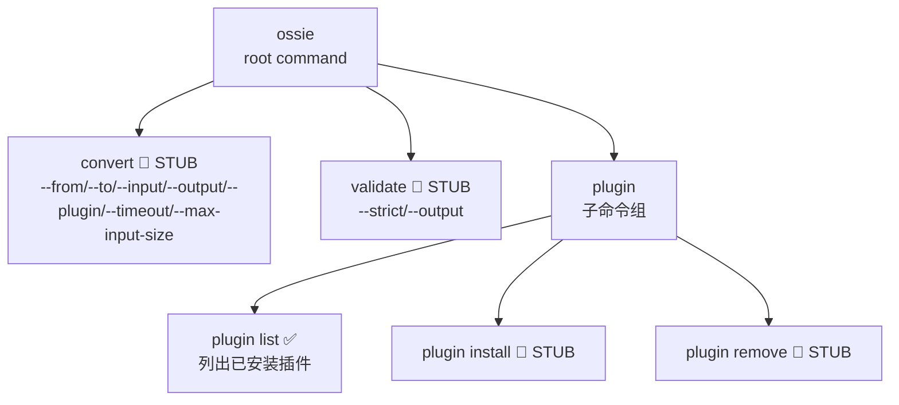
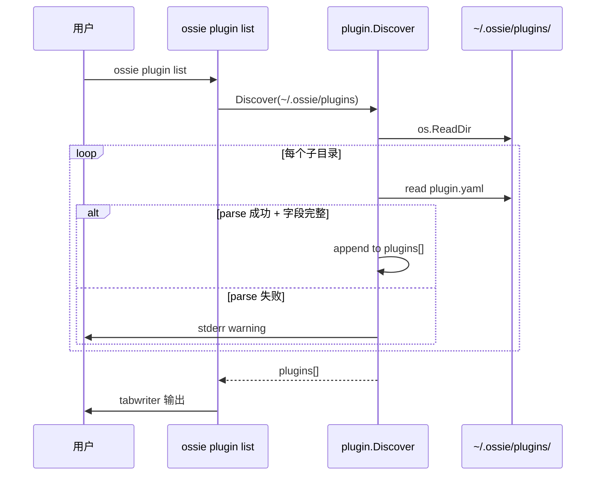

<!--
 Licensed to the Apache Software Foundation (ASF) under one
 or more contributor license agreements.  See the NOTICE file
 distributed with this work for additional information
 regarding copyright ownership.  The ASF licenses this file
 to you under the Apache License, Version 2.0 (the
 "License"); you may not use this file except in compliance
 with the License.  You may obtain a copy of the License at

   http://www.apache.org/licenses/LICENSE-2.0

 Unless required by applicable law or agreed to in writing,
 software distributed under the License is distributed on an
 "AS IS" BASIS, WITHOUT WARRANTIES OR CONDITIONS OF ANY
 KIND, either express or implied.  See the License for the
 specific language governing permissions and limitations
 under the License.
-->

# 第 9 章 · Go CLI 与插件系统

> **Abstract** — The Go CLI (`cli/`, Cobra-based, Go 1.26.2) is a thin dispatcher for installed plugins. Currently only `ossie plugin list` is implemented; `convert`, `validate`, `plugin install`, `plugin remove` print "not yet implemented" (today use the per-vendor CLIs or `validation/validate.py`). The plugin protocol is fully designed: `~/.ossie/plugins/<name>/plugin.yaml` discovery + JSON-over-stdin/stdout IPC. The chapter shows the plugin manifest schema, the Request/Response/Issue types, and a recipe for installing plugins manually.

> **【为用户】** 这一章诚实说明：Go CLI 当前**仍是骨架**——`ossie convert`、`ossie validate`、`ossie plugin install`、`ossie plugin remove` 都是 stub。今天请用各 converter 自带的 CLI 或 Python validator。
>
> **【为开发者】** CLI 的**插件发现与调用协议已经完整实现**（`cli/internal/plugin/plugin.go`、`discover.go`、`invoke.go`）。你要做的只是写一个符合 `plugin.yaml` 规范的二进制文件。Go 学习 cobra + JSON-over-stdin IPC 的样板在此。
>
> **【为架构师】** CLI 的设计已经为"外部 converter 作为插件"铺路（参数 `--plugin` 直通自定义路径），但内部 stub 还没接上。这是 roadmap 上的待办——一旦 plugin registry 落地，CLI 就能成为用户的统一入口。

> ⚠️ **本章实现状态提醒**：本章会多次出现 🚧 标记。`cli/cmd/convert.go`、`cli/cmd/validate.go`、`cli/cmd/plugin/install.go`、`cli/cmd/plugin/remove.go` 当前都只打印 `"not yet implemented"`。`plugin list` 是唯一已实现的命令。

## 9.1 命令树与现状

> 来源：`cli/cmd/root.go:48-54`



| 命令 | 状态 | 路径 |
|---|---|---|
| `ossie` | ✅ | `cli/cmd/root.go` |
| `ossie convert` | 🚧 STUB | `cli/cmd/convert.go:46-48` |
| `ossie validate` | 🚧 STUB | `cli/cmd/validate.go:37-39` |
| `ossie plugin list` | ✅ | `cli/cmd/plugin/list.go:30-61` |
| `ossie plugin install` | 🚧 STUB | `cli/cmd/plugin/install.go:36` |
| `ossie plugin remove` | 🚧 STUB | `cli/cmd/plugin/remove.go:33` |

## 9.2 已实现的部分：`plugin list`

> 来源：`cli/cmd/plugin/list.go:30-61`（verbatim）

```go
var listCmd = &cobra.Command{
    Use:   "list",
    Short: "List installed plugins",
    RunE: runPluginList,
}

func runPluginList(cmd *cobra.Command, args []string) error {
    pluginsDir, err := ossiedir.PluginDir()
    if err != nil { return err }
    plugins, err := plugin.Discover(pluginsDir, os.Stderr)
    if err != nil { return err }
    if len(plugins) == 0 {
        fmt.Fprintln(cmd.OutOrStdout(), "no plugins installed")
        return nil
    }
    w := tabwriter.NewWriter(cmd.OutOrStdout(), 0, 0, 2, ' ', 0)
    fmt.Fprintln(w, "NAME\tPLATFORM\tSPEC")
    for _, p := range plugins {
        fmt.Fprintf(w, "%s\t%s\t%s\n", p.Name, p.Platform, p.OSSIEPluginSpec)
    }
    return w.Flush()
}
```

输出：

```
NAME       PLATFORM     SPEC
snowflake  Snowflake    0.1.0
dbt        dbt Labs     0.1.0
```

## 9.3 `ossie convert` 设计（未实现）

> 来源：`cli/cmd/convert.go:25-43`（命令定义；RunE 是 stub）

```go
var convertCmd = &cobra.Command{
    Use:   "convert --from <platform> --input <path> | --to <platform> --input <path>",
    Short: "Convert a semantic model between Ossie and a platform format",
    RunE:  runConvert,
}

func init() {
    convertCmd.Flags().String("from", "", "Source platform — converts platform → Ossie")
    convertCmd.Flags().String("to", "", "Target platform — converts Ossie → platform")
    convertCmd.Flags().StringP("input", "i", "", "Input file or directory path (required)")
    convertCmd.Flags().StringP("output", "o", "", "Output directory path (default: ./ossie-output/<plugin>/<direction>)")
    convertCmd.Flags().String("plugin", "", "Path to plugin directory (bypasses name-based discovery)")
    convertCmd.Flags().Int("timeout", 60, "Plugin invocation timeout in seconds")
    convertCmd.Flags().String("max-input-size", "100MB", "Maximum total input size")

    _ = convertCmd.MarkFlagRequired("input")
    convertCmd.MarkFlagsMutuallyExclusive("from", "to")    # ← 二选一
    convertCmd.MarkFlagsOneRequired("from", "to")
}
```

**今天请用 converter 自带的 CLI**：

```bash
# ❌ 今日不可用
ossie convert --to snowflake -i model.yaml

# ✅ 等价命令
ossie-snowflake -i model.yaml -o snowflake_model.yaml
```

## 9.4 插件发现协议

> 来源：`cli/internal/plugin/discover.go:25-50`、`cli/internal/plugin/plugin.go:30-67`



### Plugin manifest 规范

```yaml
# ~/.ossie/plugins/<vendor>/plugin.yaml
ossie_plugin_spec: "0.1.0"
ossie_spec_version: ">=0.2.0"
name: snowflake
platform: Snowflake
convert:
  to_ossie:
    invoke: ["ossie-snowflake", "to-ossie"]
    accepts: [".yaml", ".json"]
  from_ossie:
    invoke: ["ossie-snowflake", "from-ossie"]
```

**6 个 required 字段**（`plugin.go:52-67`）：

1. `ossie_plugin_spec`
2. `ossie_spec_version`
3. `name`
4. `convert.to_ossie.invoke`
5. `convert.to_ossie.accepts`
6. `convert.from_ossie.invoke`

> **未知字段被静默忽略**（`discover.go:63-65` 注释）——forward compatibility 设计。

### 插件目录解析

> 来源：`cli/internal/ossiedir/ossiedir.go:25-43`

```go
const (
    defaultOssieDir = ".ossie"
    pluginsSubdir   = "plugins"
    envVar          = "OSSIE_PLUGIN_DIR"
)

func PluginDir() (string, error) {
    if override := os.Getenv(envVar); override != "" {
        return override, nil
    }
    home, err := os.UserHomeDir()
    if err != nil {
        return "", fmt.Errorf("could not determine home directory: %w", err)
    }
    return filepath.Join(home, defaultOssieDir, pluginsSubdir), nil
}
```

- 优先：`$OSSIE_PLUGIN_DIR` 环境变量
- 默认：`~/.ossie/plugins`（Windows 走 `os.UserHomeDir` 跨平台）

## 9.5 IPC 协议（已实现）

> 来源：`cli/internal/plugin/invoke.go:13-83`

```go
type Request struct {
    Files map[string]string `json:"files"`      // 文件名 → 内容
}

type Response struct {
    Files  map[string]string `json:"files"`
    Issues []Issue           `json:"issues,omitempty"`
}

type Issue struct {
    Severity string `json:"severity"`           // "warning" | "error"
    Message  string `json:"message"`
    Path     string `json:"path,omitempty"`
}
```

**调用流程**（verbatim from `invoke.go:44-83`）：

1. `cmd := exec.CommandContext(ctx, invoke[0], invoke[1:]...)`
2. `cmd.Dir = pluginDir`（在 plugin 目录下执行）
3. 序列化 `Request` 写到 stdin
4. 启动 subprocess，捕获 stdout/stderr
5. Parse stdout 为 `Response` JSON
6. 转发 stderr 到 `pluginStderr`
7. 区分 timeout（`ctx.Err() != nil`）和 exit code != 0

**关键不变量**（`invoke.go:41-43`）：

> *"Non-empty `Issues` is NOT a Go error. The caller must inspect severities."*

也就是 subprocess exit 0 + 非空 Issues 时，需要根据 `Severity` 字段决定是否视为失败。

### 测试覆盖

`invoke_test.go` 有 12 个测试（加上 `discover_test.go` 的 11 个、`ossiedir_test.go` 的 4 个），包括 fake-plugin subprocess（用 `GO_TEST_PLUGIN=1` 重新调用自己）来验证 timeout、stderr forwarding、JSON envelope 等。

## 9.6 构建与发布

`cli/Makefile`（verbatim）：

```make
BINARY_NAME := ossie
BUILD_DIR   := dist

build:       go build -o $(BUILD_DIR)/$(BINARY_NAME) .
install:     go build -o $(shell go env GOPATH)/bin/$(BINARY_NAME) .
test:        go test ./...
lint:        go vet ./...
format:      gofmt -w .
release-dry-run: goreleaser release --snapshot --clean --config .goreleaser.yaml
clean:       rm -rf $(BUILD_DIR)
```

`.goreleaser.yaml` 配置矩阵：linux/darwin/windows × amd64/arm64；`CGO_ENABLED=0`；ldflags 注入 `version/commit/date`。

## 9.7 实战：今天能用的插件安装方式

虽然 `ossie plugin install` 是 stub，但你完全可以手工安装：

```bash
# 1. 装 Snowflake converter
uv tool install ossie-snowflake

# 2. 创建 plugin manifest
mkdir -p ~/.ossie/plugins/snowflake
cat > ~/.ossie/plugins/snowflake/plugin.yaml <<EOF
ossie_plugin_spec: "0.1.0"
ossie_spec_version: ">=0.2.0"
name: snowflake
platform: Snowflake
convert:
  to_ossie:
    invoke: ["ossie-snowflake", "to-ossie"]
    accepts: [".yaml", ".json"]
  from_ossie:
    invoke: ["ossie-snowflake", "from-ossie"]
EOF

# 3. 验证发现
ossie plugin list
# 应输出 snowflake 这一行

# 4. ⚠️ ossie convert 仍是 stub，所以转换仍要直接调
ossie-snowflake -i model.yaml -o snowflake_model.yaml
```

## 9.8 Cobra 的"陷阱"

> 来源：`cli/cmd/root.go:30-32`

```go
// NOTE: Cobra does NOT automatically chain PersistentPreRunE from parent to
// child. If any subcommand defines its own PersistentPreRunE or PreRunE, this
// function will not run for that subcommand. Future subcommands that define
// their own must call ossiedir.EnsurePluginDir() explicitly.
```

这是一个**真实陷阱**——Cobra 不会自动从父命令继承 `PersistentPreRunE`。如果未来某个子命令自定义 `PreRunE`，必须显式调用 `ossiedir.EnsurePluginDir()`。源码注释里明确警告了。

## 9.9 📌 章节要点速查

| 读者 | 一句话要点 |
|---|---|
| 用户 | `convert/validate/install/remove` 都是 stub；今天请用 `ossie-<vendor>` 自带 CLI |
| 开发者 | 插件协议已完整实现（discover/invoke/IPC），写 converter 时只需提供 `plugin.yaml` |
| 架构师 | CLI 是 thin dispatcher 设计，stub 状态反映"插件注册中心"尚未成型 |