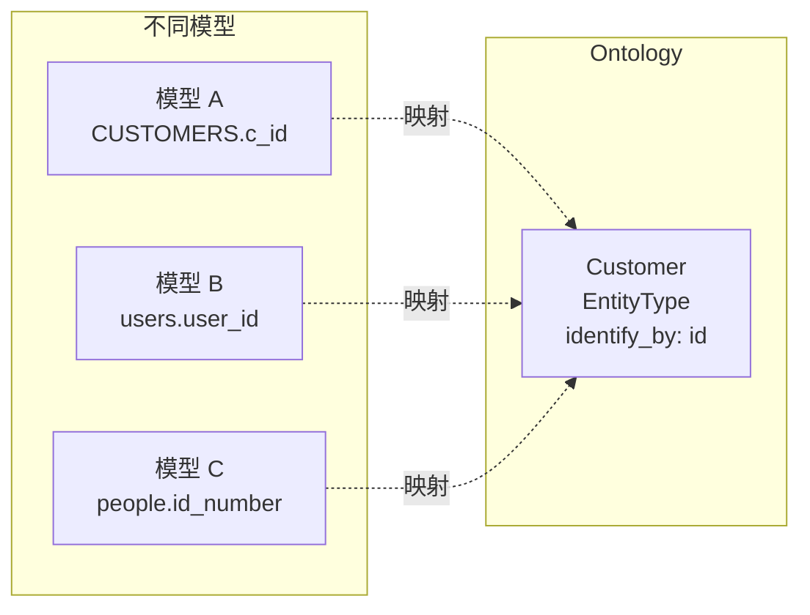
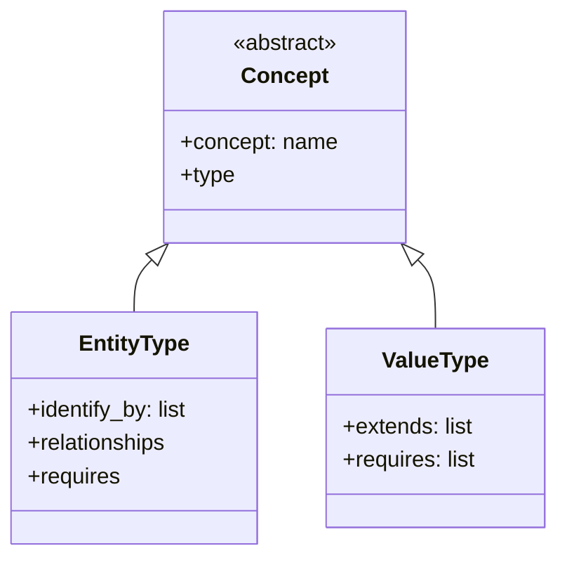
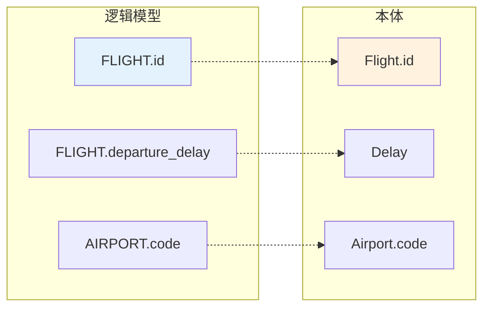
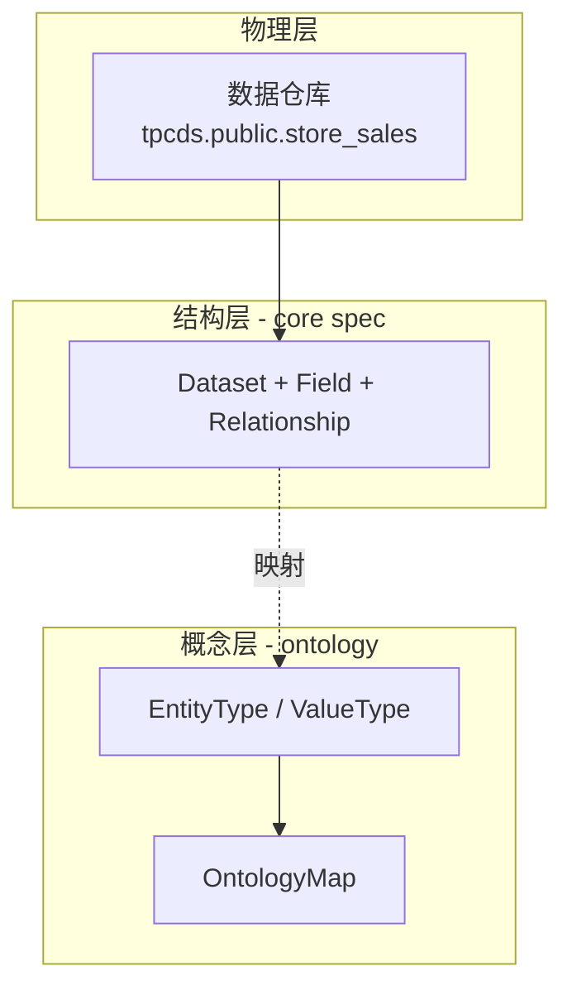

<!--
 Licensed to the Apache Software Foundation (ASF) under one
 or more contributor license agreements.  See the NOTICE file
 distributed with this work for additional information
 regarding copyright ownership.  The ASF licenses this file
 to you under the Apache License, Version 2.0 (the
 "License"); you may not use this file except in compliance
 with the License.  You may obtain a copy of the License at

   http://www.apache.org/licenses/LICENSE-2.0

 Unless required by applicable law or agreed to in writing,
 software distributed under the License is distributed on an
 "AS IS" BASIS, WITHOUT WARRANTIES OR CONDITIONS OF ANY
 KIND, either express or implied.  See the License for the
 specific language governing permissions and limitations
 under the License.
-->

# 第 10 章 · 本体层、跨模型对齐与 AI 上下文

> **Abstract** — The ontology layer is an optional superset above the core spec that solves conceptual (not just structural) interoperability. It defines `EntityType` (real-world objects) and `ValueType` (constrained scalars with semantic meaning, e.g. `NrFeet`, `CancelationCode`) inheriting from 8 built-in types. Relationships have `Multiplicity` (ManyToOne / OneToOne) and `verbalizes` (natural-language templates). The flights.yaml example (44 concepts, 12 entity + 32 value) shows end-to-end ontology + OntologyMap. This is the layer that distinguishes Ossie from dbt Semantic Layer and LookML.

> **【为用户】** 本章讲解 Ossie 的"可选高级特性"——**本体层 (ontology)**。当你需要让多个模型共享业务概念定义（例如"客户"在不同模型里的字段含义要一致），本体层就有用了。TPC-DS 没用本体；flights.yaml 用了。
>
> **【为开发者】** 本体层是 Ossie 区别于 dbt Semantic Layer、Cube、LookML 的**根本差异**。它把"业务概念"与"物理字段"显式分开。OrionBelt 是当前唯一支持 ontology 导出的 converter。
>
> **【为架构师】** 本体层解决的是"**概念互操作**"而非"**结构互操作**"。Core spec 解决结构（任何工具能读写）；ontology 解决概念（不同模型描述同一业务对象时的语义对齐）。这是 Ossie 比竞品更深一层的抽象。

## 10.1 为什么需要本体层



**核心动机**（`ROADMAP.md:96` verbatim）：

> *"The current model solves structural interoperability — any tool can read and write semantic models in a common format. The ontology layer solves conceptual interoperability — different models may describe the same business concept using different names or structures."*

## 10.2 三种概念

> 来源：`ontology/ontology.md:40-78`



| 类型 | 含义 | 例子 |
|---|---|---|
| `EntityType` | 真实世界的对象，可被其他对象引用 | `Person`、`Order`、`Aircraft` |
| `ValueType` | 带约束的 scalar 类型 | `SocialSecurityNr`、`CityName` |
| **内置** | 任何 ontology 隐式拥有 | `Any`、`Boolean`、`Date`、`DateTime`、`Decimal`、`Float`、`Integer`、`String` |

Entity 只能通过其他对象（通常是 identifier）引用；Value 是带语义的 scalar。两者都继承自内置类型。

## 10.3 关系与 cardinality

> 来源：`ontology/ontology.md:74-78, 151-157`

| Multiplicity | 含义 |
|---|---|
| `ManyToOne` | 最后一个 role 由其他 roles 共同函数性确定 |
| `OneToOne` | 双向 ManyToOne（仅二元关系） |

`Relationship` schema（`ontology.md:151-157`）：

| 字段 | 类型 | 必填 | 说明 |
|---|---|---|---|
| `name` | string | ✅ | 关系的本地名；完整标识 `<Concept>.<name>` |
| `description` | string | — | 人类可读 |
| `multiplicity` | enum | — | `ManyToOne` / `OneToOne` |
| `roles` | list | — | 其它 role（第一个 role 是 container concept） |
| `derived_by` | list | — | 派生表达式 |
| `requires` | list | — | 人口约束 |
| `verbalizes` | list | ✅ | 自然语言模式，含 `{Concept}` 占位符 |

**点连接标识约定**（`ontology.md:183-185`）：`Person.earns` 是全局唯一标识；表达式里写 `Person.earns(s)` 可以遍历关系。

## 10.4 内置概念

> 来源：`ontology/ontology.md:60-68`

```python
ANY, BOOLEAN, DATE, DATETIME, DECIMAL, FLOAT, INTEGER, STRING
```

8 个内置类型。**注意**：core spec 的 `OSIDataType` 有 `Time` 和 `DateTimeTz`，但本体内置只有 8 个——这是有意为之的"小而稳"的本体核心。

每个 value type 必须**传递性**继承某个内置；每个 entity 隐式继承 `Any`。

### 10.4.1 为什么只有 8 个内置类型？

> v1.2 新增。

| 维度 | core spec `DataType`（10 种） | ontology `ValueType` 内置（8 种） |
|---|---|---|
| 枚举来源 | `osi-schema.json:34-65` `DataType` 枚举 | `ontology.md:60-68` 内置类型清单 |
| 用途 | 语义模型 Field 的物理类型 | 本体 ValueType 的"基底" |
| 数量 | 10 | 8 |
| 差异 | 多 `Time` / `Timestamp` | 无（本体不需要时区/纯时间） |

**多出来的 2 个**（`Time`、`Timestamp`）只属于语义模型侧：
- `Time`：纯时间（HH:MM:SS），无日期
- `Timestamp`：精确到纳秒的时间戳

本体层为什么不需要？因为本体关心的是"业务概念是什么类型"，而不是"数据库里这列是什么类型"。业务上"航班日期"和"出发时刻"都是 `DateTime`；至于数据库存的是 `TIMESTAMP WITH TIME ZONE` 还是 `TIME(6)`，是 converter 翻译的事，不该污染本体。

**`Decimal` 的精度的语义差**：
- semantic_model `Decimal`：仅表示"这是一个十进制数"
- ontology `Decimal`（继承链）：可携带 `precision`/`scale` 元数据约束（如 `DECIMAL(10,2)` 表示货币）

**ValueType 决策矩阵**：

| 你的需求 | 用什么 | 原因 |
|---|---|---|
| 描述业务字段的物理类型 | `DataType`（core） | converter 直接读取 |
| 定义业务概念的"基底类型" | 内置 8 个之一 | 跨模型可比 |
| 给业务概念加精度约束 | 继承 `Decimal` + precision/scale | 本体侧精确表达 |
| 描述数据库方言特有类型 | `custom_extensions[VENDOR]` | 不污染本体 |

详见 `ontology/ontology.md:60-68` 与 `core-spec/osi-schema.json:34-65`。

## 10.5 Flights 案例深度拆解

> 来源：`examples/flights.yaml:25-540`

flights.yaml 是**唯一**带 ontology 的端到端示例。它先定义业务概念（ontology），再定义逻辑模型（semantic_model），最后用 ontology_mappings 桥接两者。

### 10.5.1 单位型 ValueType（`flights.yaml:25-75`）

```yaml
ontology:
  - concept: NrFeet
    description: "英尺距离单位"
    type: ValueType
    extends: [Decimal]

  - concept: NrPounds
    extends: [Integer]

  - concept: NrMiles
    extends: [Decimal]

  - concept: NrMinutes
    extends: [Decimal]

  - concept: CancelationCode
    type: ValueType
    extends: [String]
    requires: |
      CancelationCode == 'A' OR
      CancelationCode == 'B' OR
      CancelationCode == 'C' OR
      CancelationCode == 'D'
```

这是"业务概念先于物理字段"的本体设计：`NrFeet`、`NrMiles` 不只是 raw decimal，而是"英尺"和"英里"的语义单位。`CancelationCode` 是带枚举约束的 string——Ossie core spec 没有 enum 数据类型，本体层用 `requires` 表达。

### 10.5.2 复合标识 EntityType（`flights.yaml:134-149`）

```yaml
- concept: City
  type: EntityType
  identify_by: [name, state]          # 复合标识
  relationships:
    - name: name
      roles: [{concept: CityName}]
      verbalizes: ['{City} has {CityName}']
      multiplicity: ManyToOne
    - name: state
      roles: [{concept: State}]
      verbalizes: ['{City} is located in {State}']
      multiplicity: ManyToOne
```

`City` 由 `(name, state)` 共同标识。两个 `relationships` 都用 `ManyToOne`，因为 `CityName` 和 `State` 都是 function determined（每个 City 只有一个名字/州）。

### 10.5.3 一元关系（`flights.yaml:375-379`）

```yaml
- name: canceled
  verbalizes: ['{Flight} was canceled']
  # 没有 roles —— 一元关系就是布尔标志
```

### 10.5.4 三元关系（`flights.yaml:401-414`）

```yaml
- name: registers_longitude_series
  roles:
    - concept: DateTime
    - concept: DegreesLongitude
  verbalizes: ['{Flight} at {DateTime} registers {DegreesLongitude}']
  multiplicity: ManyToOne    # 给定 (Flight, DateTime)，最多一个 longitude
```

三个 role：container 是 `Flight`，其它两个是 `DateTime` 和 `DegreesLongitude`。

### 10.5.5 派生关系（`flights.yaml:289-296`）

```yaml
- name: average_departure_delay
  roles: [{concept: Delay}]
  multiplicity: ManyToOne
  derived_by:
      - - 'Delay == AVG[Flight.departure_delay WHERE Airport == Flight.route.departure GROUP BY Airport]'
```

`Delay` 的值通过聚合计算：`AVG(Flight.departure_delay) WHERE Airport == Flight.route.departure GROUP BY Airport`。

## 10.6 Ontology Mapping 桥接

> 来源：`ontology/ontology.md:382-598`、`flights.yaml:540-1111`



`OntologyMap` schema（`ontology.md:382-415`）：

| 字段 | 类型 | 必填 | 说明 |
|---|---|---|---|
| `name` | string | — | 映射名 |
| `description` | string | — | 人类可读 |
| `semantic_model` | object | ✅ | 嵌入的 SemanticModel |
| `concept_mappings` | array | ✅ | 一个概念一个映射 |

每个 `ConceptMapping` 含 `object_mappings`（给 EntityType）或 `link_mappings`（给 Relationship 的 link）。`ReferentMapping` 把逻辑字段绑定到对象的 identifying relationship。

> **声明一次、复用多处**（`ontology.md:583-587`）：把 `Item` 映射到某个 dataset 只需声明一次，即使它参与 4 个 relationship。

## 10.7 与 core spec 的边界



| 层 | 关注 | 文件 |
|---|---|---|
| 物理 | 数据在哪 | （仓库自己） |
| 结构 | 哪些 dataset/field/relationship/metric | `core-spec/` + `examples/tpcds_semantic_model.yaml` |
| 概念 | 业务概念是什么、怎么关联 | `ontology/` + `examples/flights.yaml` 的 `ontology:` 块 |
| 映射 | 物理字段 → 概念 | `examples/flights.yaml` 的 `ontology_mappings:` 块 |

> **关键**：`tpcds_semantic_model.yaml` 是纯结构示例；`flights.yaml` 是结构+概念+映射完整示例。

## 10.8 AI Context：业务语义的载体

> 来源：`spec.md:603-635`、`ontology/ontology.md` 间接相关

`ai_context` 在 5 个核心构造上都可出现（见 §2.8）。它是 Ossie 的"AI-native"标记：

```yaml
ai_context:
  instructions: "用于销售分析"
  synonyms: ["orders", "purchases", "sales"]
  examples:
    - "上个月总销售额？"
    - "按地区分组的营收？"
```

LLM agent 遍历 `ai_context.synonyms` 和 `examples` 即可理解每个字段的业务含义，不需要训练数据。本体层进一步给 AI agent 提供"业务概念图"——`Customer` 是 Entity，`Order` 与 `Customer` 是 ManyToOne 关系。

## 10.9 路线图中的本体层

[`docs/working_groups.md`](https://github.com/apache/ossie/blob/main/docs/working_groups.md) 列出的工作组 #3 (Ontology WG) 由 Relational AI 的 Kurt 领导。当前状态：

- `flights.yaml` 是唯一完整案例
- `ontology.md` 598 行（已较稳定）
- OrionBelt converter 唯一实现 ontology 导出（`converters/orionbelt/src/ossie_orionbelt/ontology.py`）
- `validation/validate.py` 不验证 ontology 块（仅 schema 层面校验）

## 10.10 📌 章节要点速查

| 读者 | 一句话要点 |
|---|---|
| 用户 | TPC-DS 是纯结构示例；flights.yaml 是带本体的完整案例；99% 场景不需要本体 |
| 开发者 | OrionBelt 是唯一导出 ontology 的 converter；本体层是 Pydantic 模型独立分支 |
| 架构师 | 本体层是 Ossie 比 dbt/Cube/LookML 更深一层的"概念互操作" |