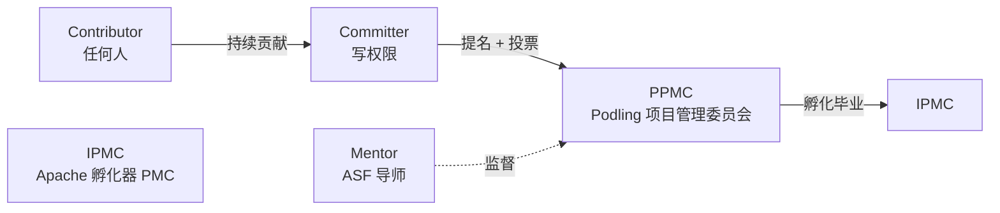
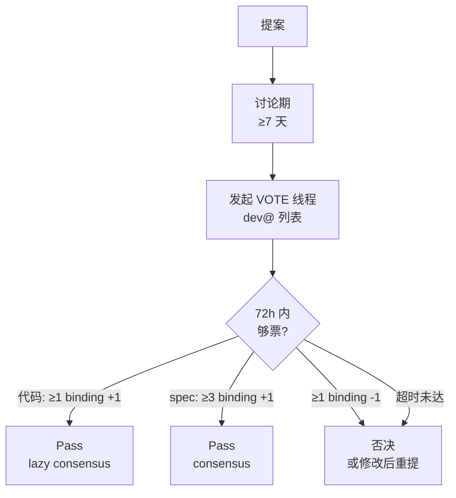
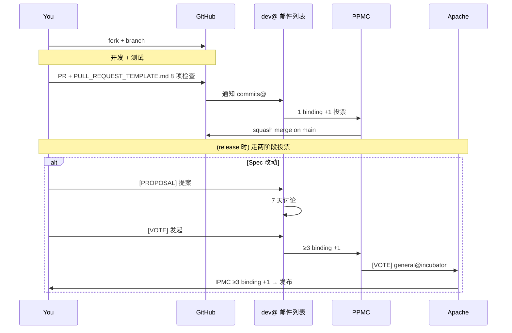
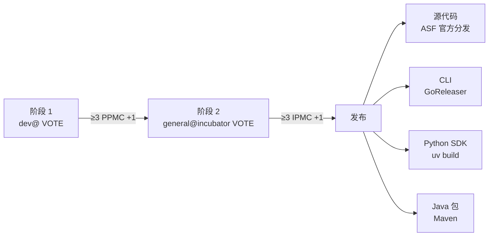

<!--
 Licensed to the Apache Software Foundation (ASF) under one
 or more contributor license agreements.  See the NOTICE file
 distributed with this work for additional information
 regarding copyright ownership.  The ASF licenses this file
 to you under the Apache License, Version 2.0 (the
 "License"); you may not use this file except in compliance
 with the License.  You may obtain a copy of the License at

   http://www.apache.org/licenses/LICENSE-2.0

 Unless required by applicable law or agreed to in writing,
 software distributed under the License is distributed on an
 "AS IS" BASIS, WITHOUT WARRANTIES OR CONDITIONS OF ANY
 KIND, either express or implied.  See the License for the
 specific language governing permissions and limitations
 under the License.
-->

# 第 11 章 · 治理、社区与路线图

> **Abstract** — Apache Ossie is an incubating podling under the Apache Way: meritocracy, peer-based, consensus, public decisions, vendor-neutral. Roles: Contributor → Committer → PPMC → Mentor/IPMC. Spec changes require ≥3 binding +1 votes on `dev@ossie.apache.org`; code changes use lazy consensus. The chapter covers 4 active working groups (Metric Language, Catalog, Ontology, Financial Services), 14 future efforts, and the spec gaps between 0.2.0.dev0 and the community roadmap.

> **【为用户】** 这一章回答三个问题：怎么给 Ossie 提 feedback？怎么参与？怎么判断 Ossie 会不会被某家厂商绑架？
>
> **【为开发者】** 你第一次贡献要走 ICLA；spec 改动需要 ≥3 binding +1 投票；PR 用 GitHub 但决策在 `dev@`。
>
> **【为架构师】** Apache Way 是 Ossie 治理的根基：meritocracy、peer-based、consensus、公开决策。spec 演进不是哪家公司说了算。

## 11.1 Apache Way 的六条价值观

> 来源：`docs/index.md:84-106`

| 价值观 | 含义 |
|---|---|
| **Meritocracy 精英治理** | Merit 永不失效；任何贡献（代码、文档、测试、社区支持、spec 评审）都计 merit |
| **Peer-based 同侪制** | 不论雇主或资历，所有参与者是同侪 |
| **Consensus 共识决策** | 努力达成共识；必要时投票 |
| **Collaborative Development 协作开发** | 所有讨论公开（GitHub/邮件列表），私有决策不被鼓励 |
| **Open Communications 公开沟通** | 决策要在公开资源上发生 |
| **Vendor-neutral 厂商中立** | 任何组织都可贡献，不被单家厂商绑架 |

## 11.2 角色链

> 来源：`CONTRIBUTING.md:195-227`



| 角色 | 谁能做 | 关键权限 |
|---|---|---|
| **Contributor** | 任何人 | 提 PR；非 binding 投票 |
| **Committer** | 已贡献 + PPMC 提名 | 合并 PR；**binding 投票** |
| **PPMC** | Committer 中提名 | 整体方向；**binding 投票**；毕业成为 PMC |
| **Mentor** | ASF 资深成员 | 监督；PPMC 投票 |
| **IPMC** | Apache Incubator PMC | 批准发布；季度审查 |

> **Ossie 当前是 incubating podling**——毕业前所有发布需经 IPMC 二次投票。

## 11.3 投票流程

> 来源：`CONTRIBUTING.md:134-158`



| 事项 | 通过条件 |
|---|---|
| **代码/文档/工具改动** | Lazy consensus（≥1 binding +1，无 veto） |
| **Spec 改动** | ≥**3 binding +1**，无 veto |
| **Committer/PPMC 提名** | `private@` 列表 lazy consensus，72h 窗口 |
| **程序性投票** | 简单多数，不可 veto |

## 11.4 沟通渠道

> 来源：`CONTRIBUTING.md:51-72`

```mermaid
flowchart LR
  subgraph 邮件列表
    dev[dev@ossie.apache.org<br/>主决策渠道]
    commits[commits@<br/>自动通知]
    issues[issues@<br/>自动通知]
    priv[private@<br/>PPMC 私议]
  end
  
  subgraph GitHub
    ghI[Issues]
    ghD[Discussions]
    ghPR[Pull Requests]
  end
  
  subgraph 聊天
    slack[Slack<br/>apache-ossie]
  end
```

| 渠道 | 用途 | 优先级 |
|---|---|---|
| `dev@ossie.apache.org` | **所有决策**、提案讨论、投票 | 🔴 最高 |
| `commits@` | 自动 commit/PR 通知 | 自动 |
| `issues@` | 自动 issue 通知 | 自动 |
| `private@` | PPMC 私议（committer 提名） | 私密 |
| GitHub Issues | 错误/功能请求 | 辅助 |
| GitHub Discussions | 公开讨论 | 辅助 |
| Slack | 实时聊天 | 辅助 |

> **关键**：`dev@` 是**所有**决策的主渠道——GitHub 上热闹但最终要落到 `dev@` 才算数。

## 11.5 贡献流程



### Pull Request 模板的 8 项检查

> 来源：`/.github/PULL_REQUEST_TEMPLATE.md`

1. **Specification** — spec 改动在 `core-spec/`，dev list 讨论过，破坏性变更标注
2. **Ontology** — `ontology/` 与 spec 一致
3. **Converters** — `converters/` 更新，新 converter 有测试
4. **Validation** — `validation/` 更新（如 spec 改）
5. **Documentation** — `docs/`、`CONTRIBUTING.md`、examples 更新
6. **Examples** — `examples/` 增/改
7. **Tests** — 全部现有测试通过；新功能覆盖
8. **Compliance** — ASF license headers；无 PMC 未批准的第三方依赖

## 11.6 路线图（来自 ROADMAP.md）

> 来源：`ROADMAP.md:34-289`

### 11.6.1 当前工作组（4 个）

| # | 工作组 | 负责人 | 核心目标 |
|---|---|---|---|
| 1 | **Metric Semantics & Core Semantic Model** | Will Pugh | 标准度量语言、一阶 aggregation/grain 语义、cumulative 度量、显式 cardinality |
| 2 | **Catalog Integration** | Shubham Bhargav (Atlan) | 与 catalog 集成模式、独立的语义服务/注册中心 |
| 3 | **Ontology** | Kurt (Relational AI) | 本体层、跨模型对齐、`ontology-query` 提案 |
| 4 | **Financial Services Common Semantics** | John Heisler (Snowflake) | 行业特定的语义包 |

### 11.6.2 已规划但未启动工作组

- **Dataset Abstraction & Logical Modeling** — 与物理存储解耦
- **Semantic Query Language & Reference Engine** — 标准查询接口、参考编译器、合规测试套件
- **SQL Dialect, Expressions, Execution Boundaries** — `Ossie_SQL_2026` 落地
- **Dimensions, Hierarchies, Time Semantics** — 维度层次、维度组、`dimension_type` enum
- **AI-Native Semantic Layer** — 标准化 AI context metadata
- **Governance, Identity, Validation** — 稳定标识符、验证/合规标准

### 11.6.3 增量增强

- 字段重命名（`Field` → `Dimension`）
- 数据类型增强：单位、货币、PII 分类
- 扩展元数据：`measurement`、`display_format`、`semantic_type`、`default_aggregation`
- 空间字段、空间关系、地理层次
- 行业特定包（SaaS、零售、金融）

## 11.7 spec 当前缺口 vs 0.2.0 计划

> ⚠️ **实现状态提醒**：以下功能在 spec 0.2.0.dev0 中**尚未实现**，正在各工作组讨论中

| 缺失字段/功能 | 影响 | 跟踪讨论 |
|---|---|---|
| `aggregation_method` on Metric | 度量聚合语义不显式 | Discussion #19 |
| `derived` / `cumulative` Metric | 无法表达派生/累计度量 | Discussions #39, #40 |
| Explicit `cardinality` on Relationship | 隐式多对一 | Discussion #50 |
| Composite relationship definitions | 复合关系不显式 | Discussion #4 |
| Dimension hierarchies/groups | 维度层次缺失 | Discussions #17, #20, #21 |
| Semantic filter definitions | 复用过滤不标准 | Discussion #5 |
| Native units/currencies | 数字字段无单位 | Discussions #42, #43 |
| PII/confidential metadata | 隐私标记缺失 | Issue #58 |
| `Ossie_SQL_2026` as default dialect | 7 方言并存 | Proposal (Proposed Final) |
| Reusable datasets across models | 模型间共享缺失 | Roadmap §Future |

## 11.8 ICLA 与 AI 工具条款

> 来源：`CONTRIBUTING.md:82-99`

首次"非平凡"贡献合并前需要签署：

- **ICLA** (Individual Contributor License Agreement) — 个人贡献
- **CCLA** (Corporate CLA) — 代表雇主贡献

参考 [ASF Generative Tooling Guidance](https://www.apache.org/legal/generative-tooling.html)：

> *"You remain personally responsible for all code you submit, regardless of how it was produced."*

即使用 AI 工具生成代码，贡献者仍对代码负责——AI 生成的代码同样需要 license header、合规审查。

## 11.9 发布流程

> 来源：`CONTRIBUTING.md:160-170`



**两阶段**是因为这是 incubating podling——所有 release 都需 IPMC 二次审核。

## 11.10 📌 章节要点速查

| 读者 | 一句话要点 |
|---|---|
| 用户 | 提 feedback 去 GitHub Discussions；想参与订阅 `dev-subscribe@ossie.apache.org` |
| 开发者 | 第一次贡献要签 ICLA；spec 改动需要 ≥3 binding +1 投票 |
| 架构师 | Apache Way 6 条价值观保证厂商中立；50+ 参与组织、4 个工作组 |