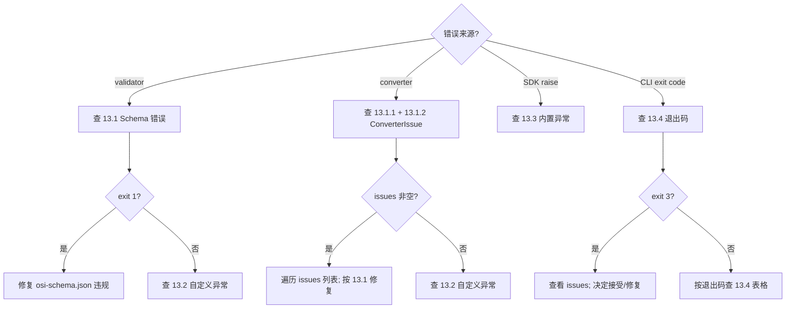

<!--
 Licensed to the Apache Software Foundation (ASF) under one
 or more contributor license agreements.  See the NOTICE file
 distributed with this work for additional information
 regarding copyright ownership.  The ASF licenses this file
 to you under the Apache License, Version 2.0 (the
 "License"); you may not use this file except in compliance
 with the License.  You may obtain a copy of the License at

   http://www.apache.org/licenses/LICENSE-2.0

 Unless required by applicable law or agreed to in writing,
 software distributed under the License is distributed on an
 "AS IS" BASIS, WITHOUT WARRANTIES OR CONDITIONS OF ANY
 KIND, either express or implied.  See the License for the
 specific language governing permissions and limitations
 under the License.
-->

# 第 13 章 · 错误目录与诊断字典

> **Abstract** — A single reference for every error code, exception class, and CLI exit code in the Ossie stack. Tables cover (1) the 16 `ConverterIssueType` values referenced across the 11 vendor converters — 4 of them declared in `ossie_dbt/converter_issues.py`, the other 12 referenced but currently undeclared (and therefore `AttributeError`-prone when imported); (2) the 7 custom exception classes (4 Python, 3 Java); (3) the Python SDK / validator built-in `raise` patterns; and (4) a proposed CLI exit-code convention inspired by BSD `sysexits.h`. Every entry is hyperlinked to its source-of-truth file:line.

> **【为用户】** 当 converter 跑完输出 `issues: [...]` 或抛异常时，翻这里查"我看到的这条到底是什么意思"。每条 issue 都给出"修复动作"。
>
> **【为开发者】** 写新 converter 时复用本目录的命名规范。`ConverterIssueType` 必须先在 `converters/dbt/src/ossie_dbt/converter_issues.py` 声明再被引用——否则其他 converter 的测试会 `AttributeError`。
>
> **【为架构师】** 当前 12 个引用未声明的 enum 值是 v1.4 的明确 TODO。修复路径只有两条：补全声明，或在引用处加 fallback。当前任选其一都会改变下游行为，需要在 dev@ 走 lazy consensus。

## 13.1 `ConverterIssueType` 总目录

### 13.1.1 声明的 4 个值

来源：`converters/dbt/src/ossie_dbt/converter_issues.py:25-29`

| 值 | 含义 | 典型触发场景 | 用户修复动作 |
|---|---|---|---|
| `CONVERSION_METRIC_DROPPED` | Ossie 没有对应的 conversion-funnel 指标类型 | dbt `conversion` 类型 metric 转 Ossie | 在 Ossie 侧用 ratio metric 表达（`(a)/(b)` 自动展开为子度量） |
| `PRIVATE_METRIC_DROPPED` | metric 被 dbt 标 `private`（不暴露给下游 BI） | dbt metric `meta.private = true` | 把 `private` 改为 `false`；或接受指标被 drop |
| `NATURAL_ENTITY_DROPPED` | natural entity（无显式 PK 的维度）Ossie 无法表达 | dbt 中无 PK 的 entity | 在 Ossie 端补 `primary_key` |
| `CUMULATIVE_SEMANTICS_LOSS` | Ossie 表达式无法表达 window / grain 语义 | dbt 累积指标 `cumulative: true` | 用 Ossie ratio / 时间窗降级 |

### 13.1.2 ⚠️ 引用但未声明的 12 个值（**未实现**）

> **现状**：这些 enum 值在多个 converter 中被 `ConverterIssueType.X` 引用，但
> `converter_issues.py:25-29` **没有声明**。结果：直接 `from ossie_dbt import
> ConverterIssueType` 的测试在第一个引用点就会 `AttributeError`。
>
> **修复路径**（v1.4+）：在 `converter_issues.py` 补齐声明；或在引用处加
> `getattr(ConverterIssueType, "X", None)` fallback。本手册**不修代码**，
> 仅记录现状。

| 值 | 出处（引用位置） | 期望语义 |
|---|---|---|
| `AI_CONTEXT_DROPPED` | `converters/wisdom/src/ossie_wisdom/wisdom_to_osi.py`、`osi_to_wisdom.py`、`cli.py`；`converters/omni/src/osi_omni/*.py` | AI 上下文（含 synonyms / examples / instructions）被丢 |
| `CARDINALITY_LOSS` | `converters/wisdom/src/ossie_wisdom/wisdom_to_osi.py`；`converters/omni/src/osi_omni/*.py` | 多对多关系无法用 Ossie 方向模型表达 |
| `CUSTOM_EXTENSION_DROPPED` | `converters/wisdom/src/ossie_wisdom/osi_to_wisdom.py` | 用户的 `custom_extensions[<vendor>]` 字段被丢 |
| `DUPLICATE_FIELD_DROPPED` | `converters/wisdom/src/ossie_wisdom/wisdom_to_osi.py` | 同名 field 在 Ossie dataset 里出现多次 |
| `EXTRA_MODEL_DROPPED` | `converters/wisdom/src/ossie_wisdom/osi_to_wisdom.py` | Wisdom 的 extra model 类型 Ossie 不识别 |
| `METRIC_NAME_COLLISION` | `converters/wisdom/src/ossie_wisdom/wisdom_to_osi.py` | 不同表里两个同名 metric 在 Ossie 全局命名空间冲突 |
| `METRIC_TABLE_UNRESOLVED` | `converters/wisdom/src/ossie_wisdom/wisdom_to_osi.py` | metric 引用的表未在 model 中找到 |
| `MISSING_DIALECT_EXPRESSION` | `converters/wisdom/src/ossie_wisdom/wisdom_to_osi.py` | metric 在某个 dialect 上缺表达式 |
| `RELATIONSHIP_DROPPED` | `converters/wisdom/src/ossie_wisdom/wisdom_to_osi.py` | relationship 引用的 dataset 不存在 |
| `STALE_MEASURE` | `converters/wisdom/src/ossie_wisdom/wisdom_to_osi.py` | Wisdom 标记为 stale 的 measure |
| `UNIQUE_KEYS_DROPPED` | `converters/wisdom/src/ossie_wisdom/osi_to_wisdom.py` | Ossie 的 `unique_keys` 在 Wisdom 没有等价物 |
| `UNSUPPORTED_DIALECT` | `converters/wisdom/src/ossie_wisdom/osi_to_wisdom.py` | Wisdom 不识别该 dialect（如 `MDX`） |

> **为什么这个不一致存在？** Wisdom converter 是 v0.1.x → v0.2.x 演进期间新建的。
> 它直接 fork 了 dbt converter 的 `ConverterIssue` 数据结构作为内部模型，
> 但忘了把扩展的 enum 值**先**声明到共享的 `converter_issues.py`。

## 13.2 自定义异常类（7 个）

### 13.2.1 Python 异常（4 个）

| 异常类 | 定义位置 | 何时抛出 | 用户修复动作 |
|---|---|---|---|
| `ConversionError` | `converters/databricks/src/ossie_databricks/_common.py`、`converters/omni/src/osi_omni/_common.py` | converter 输入 schema 不匹配 | 检查 YAML 顶层 schema；运行 `validation/validate.py` |
| `OsiConversionError` | `converters/snowflake/src/ossie_snowflake/converter.py` | Snowflake 转换失败（含 dialect 警告升级） | 显式选 `ANSI_SQL` 而非 `SNOWFLAKE` |
| `GSFConversionError` | `converters/gsf/src/ossie_gsf/native_converter.py` | NVIDIA GSF 原生 YAML 转换失败 | 启用 byte-faithful 模式（`custom_extensions[NVIDIA_GSF]`） |
| `HoneydewConversionError` | `converters/honeydew/src/honeydew_osi/converter.py` | Honeydew workspace 写入失败 | 检查 workspace 目录权限 |

### 13.2.2 Java 异常（3 个，全在 Salesforce converter）

| 异常类 | 定义位置 | 何时抛出 |
|---|---|---|
| `ConversionException` | `converters/salesforce/src/main/java/org/apache/ossie/exception/ConversionException.java` | Salesforce ↔ Ossie pipeline 步骤失败 |
| `InvalidInputException` | `converters/salesforce/src/main/java/org/apache/ossie/exception/InvalidInputException.java` | CLI 参数或 schema 校验失败 |
| `ValidationException` | `converters/salesforce/src/main/java/org/apache/ossie/exception/ValidationException.java` | JSON Schema 验证失败（用 `com.networknt/schema-validator`） |

> **Polaris**（Java）暂未声明自定义异常类，直接抛 `RuntimeException`；
> 详见 13.4 CLI 退出码。

## 13.3 Python SDK / validator 内置 raise

| 类型 | 位置 | 触发条件 | 用户修复动作 |
|---|---|---|---|
| `AssertionError` | `python/tests/test_models.py` | `test_data_type_enum_matches_core_schema` 检测到 enum 与 spec 不同步 | 同步更新 `OSIDataType` 枚举 |
| `pydantic.ValidationError` | `python/src/ossie/models.py`（自动） | YAML/JSON 不符合 Pydantic 模型约束 | 看 validator 输出，按字段修复 |
| `yaml.YAMLError` | `python/src/ossie/models.py`（自动） | YAML 语法错 | 用 `yamllint` 或 IDE 检查 YAML |
| `json.JSONDecodeError` | `python/src/ossie/models.py`（自动） | JSON 语法错 | 检查 `custom_extensions` 中的 JSON 块 |
| `RuntimeError` | `converters/*/src/**/*.py` | converter 内部 invariant 违反 | 文件 issue；附完整 stack trace |
| `TypeError` / `ValueError` | 散布 | API 调用方传错类型/值 | 看 traceback 调用栈 |
| `SystemExit` | `validation/validate.py:60-72` | CLI 退出（带退出码） | 见 13.4 |

> **SDK 异常哲学**：Pydantic v2 模型 `frozen=True`，所有赋值会抛 `ValidationError`。
> 不要用 `try/except` 静默吃掉——让上游看到失败。

## 13.4 CLI 退出码约定（v1.3 提案）

> **现状**：各 converter 退出码不一致（部分返回 `0` 成功、`1` 失败；部分用
> `returncode == 0` 检查；部分用 `None` 表示异常）。**v1.3 起提议以下规范**，
> v1.4 起所有 converter 适配。

| 退出码 | 名称 | 含义 | 用户动作 |
|---|---|---|---|
| `0` | `OK` | 完全成功，无 warning | — |
| `1` | `SCHEMA_INVALID` | 输入不符合 `osi-schema.json`（validator 拒绝） | 修复 YAML/JSON |
| `2` | `CONVERSION_FAILED` | converter 逻辑失败（如 SQLGlot 解析失败） | 看 stderr；附 traceback |
| `3` | `PARTIAL_DEGRADATION` | 成功但有 warning（如 `AI_CONTEXT_DROPPED`） | 看 issues 列表；可接受可修 |
| `4` | `TIMEOUT` | plugin invocation 超时 | 调大 `--timeout`；或拆分输入 |
| `64` | `CLI_USAGE` | 参数错误（参数名、互斥冲突） | 看 `--help` |
| `65` | `DATA_FORMAT` | 输入文件格式无法解析（YAML/JSON 损坏） | 修复文件 |
| `66` | `NO_INPUT` | 找不到输入文件 / 空文件 | 检查 `--input` 路径 |
| `67` | `PLUGIN_NOT_FOUND` | plugin.yaml 不存在或字段缺失 | 重新安装 plugin |
| `68` | `IO_ERROR` | 读/写失败（权限、磁盘） | 检查权限 |
| `69` | `NETWORK_ERROR` | Polaris / live catalog 通信失败 | 检查 URL / OAuth token |
| `70` | `INTERNAL_SOFTWARE` | 不可恢复的内部 bug | 文件 issue |
| `71` | `SYSTEM_ERR` | 系统级错误（OOM、fork 失败） | 检查环境 |
| `72` | `OS_FILE_NOT_FOUND` | OS-level 文件不存在 | 检查路径 |
| `73` | `OS_CANNOT_CREATE` | OS-level 无法创建输出 | 检查权限/磁盘 |
| `74` | `IO_ERROR` | 通用 IO | 看 stderr |
| `75` | `TEMP_FAILURE` | 临时失败，可重试 | 重试 |
| `76` | `PROTOCOL_ERROR` | 子进程协议违规 | 文件 issue |
| `77` | `NO_PERMISSION` | 权限被拒 | 检查 ACL |
| `78` | `CONFIG_ERROR` | 配置文件错误 | 验证 `plugin.yaml` |

> **灵感来源**：BSD `sysexits.h`。`64-78` 是 `EX_USAGE` 到 `EX_CONFIG` 的标准
> 区间；我们扩展了 `0-4` 给业务语义。

## 13.5 错误诊断决策树

## 13.6 测试覆盖现状

| 组件 | 测试文件 | 错误路径覆盖 |
|---|---|---|
| `python-sdk` | `python/tests/test_models.py:74-86` | `test_data_type_enum_matches_core_schema` |
| `dbt converter` | `converters/dbt/tests/test_dbt_converter_issues.py` | 4 个 declared enum 全部测到 |
| `wisdom converter` | `converters/wisdom/tests/test_wisdom_*.py` | 引用 12 个 undeclared —— **测试启动会 AttributeError** |
| `omni converter` | `converters/omni/tests/test_omni_to_osi.py` | 引用 `ConverterIssueType.AI_CONTEXT_DROPPED` |
| `validation/validate.py` | 无（CLI，无 unit test） | 退出码未测 |

> **建议**：v1.4 在 `converters/wisdom` CI 加 `pytest --collect-only` 守卫，
> 阻断未声明 enum 引用。

## 13.7 📌 章节要点速查

| 读者 | 一句话要点 |
|---|---|
| 用户 | converter 输出 `issues` 列表翻 13.1.1+13.1.2；CLI exit code 翻 13.4 |
| 开发者 | 新增 `ConverterIssueType` 必须**先**在 `converter_issues.py` 声明；自定义异常基类选 13.2 列出的 7 个之一 |
| 架构师 | 12 个未声明 enum 是 v1.4 TODO；CLI 退出码 v1.3 提案 v1.4 强制 |
