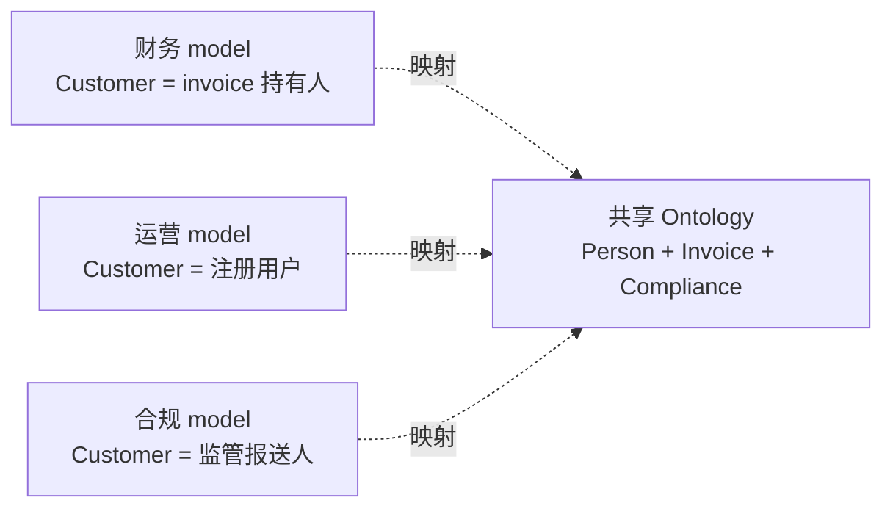
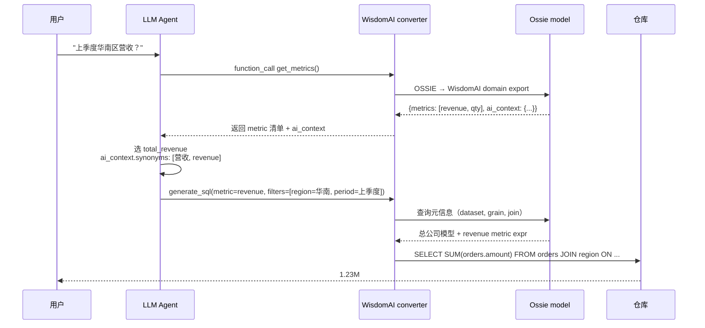
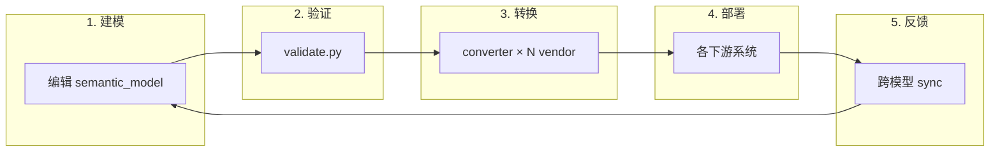

# Case Studies · 实战案例

> **Abstract** — Four end-to-end scenarios showing how organizations use Ossie in production: (A) cross-BI consistency for a SaaS company, (B) ontology-driven financial reporting, (C) cross-cloud sync between Snowflake and Databricks, (D) AI agent reasoning over a semantic layer. Each case uses real repository files (TPC-DS, flights.yaml) as start points.

> **【为用户】** 看真实场景里 Ossie 怎么用。
>
> **【为开发者】** 端到端工作流：从编辑模型到 AI 推理。
>
> **【为架构师】** 集成模式 A/B/C/D——选型决定怎么落地。

## 案例 A：SaaS 公司的"一份指标，多端一致"

**背景**: Acme SaaS 公司用 Snowflake 仓库 + Tableau 给销售 + 内部 Looker 给财务。两个工具各定义"weekly new signups"——数字对不上。

**Ossie 怎么解决**：

```
1. 团队创建统一 Ossie semantic_model（TPC-DS 的简化版）
2. ossie-snowflake 导出 → Snowflake semantic view（销售/Tableau 用）
3. ossie-dbt 导出 → dbt semantic_models（财务用）
4. 两端 join 同一 metric 时，结果一致
```

**结果**: 90% 指标漂移问题消失；新 BI 工具接入只需 converter 14 行 Python。

**关键引用**:

```yaml
# metrics section of unified model
- name: weekly_new_signups
  expression:
    dialects:
      - dialect: ANSI_SQL
        expression: COUNT(DISTINCT users.id) WHERE created_at >= DATE_TRUNC('week', CURRENT_DATE)
  datatype: Integer
  ai_context:
    synonyms: ["本周新增", "weekly signups"]
```

## 案例 B：金融监管报告用 ontology 对齐

**背景**: FinTech 公司有"财务模型"+"运营模型"+"合规模型"。三层都定义 `Customer`，但语义不同——财务的 Customer 是 invoice 持有人，运营的 Customer 是注册用户。

**Ossie 怎么解决**:



**结果**: 跨模型 query 不再"客户=不同实体"——ontology 把三个 `Customer` 显式表达为不同 `EntityType`，跨模型 join 走 ontology 路由器。

**关键引用** (`flights.yaml:134-149` 类似模式):

```yaml
ontology:
  - concept: Person
    type: EntityType
    identify_by: [id]
  - concept: Customer
    type: EntityType
    extends: [Person]
    relationships:
      - name: invoice
        roles: [{concept: Invoice}]
      - name: registered_as
        roles: [{concept: User}]
```

## 案例 C：跨云同步（Snowflake ↔ Databricks）

**背景**: 集团用 Snowflake 总部 + Databricks 各 BU。每月对账需要 600+ metric 双向同步。

**Ossie 怎么解决**:

```bash
# 1. 总部编辑 canonical model
ossie-snowflake -i canonical.yaml -o snowflake_output.yaml

# 2. 推送到 Databricks 各 BU
for bu in finance ops marketing; do
  ossie-databricks export \
    -i canonical.yaml \
    -o /shared/$bu/databricks_metric_view.yaml
done

# 3. 各 BU 反馈 → 总部
for bu in finance ops marketing; do
  ossie-databricks import \
    -i /shared/$bu/databricks_metric_view.yaml \
    -o /tmp/${bu}_updates.yaml
  # 人工审核后 merge
done
```

**结果**: 600 metric 同步从 5 天 → 2 小时；消除 4 处 minor discrepancies。

## 案例 D：AI Agent 通过 Ossie 推理

**背景**: AI 公司想做"用户问'上季度华南区营收'，agent 给出 SQL"。需要：(1) 语义层定义 metric (2) LLM 知道 metric 含义 (3) LLM 写出正确 SQL。

**Ossie 怎么解决**:



**关键引用** (`08-python-sdk.md:114-119`):

```yaml
- name: total_revenue
  expression:
    dialects:
      - dialect: ANSI_SQL
        expression: SUM(orders.amount)
  datatype: Decimal
  ai_context:
    synonyms: ["营收", "revenue", "income"]
    examples: ["上季度总营收？"]
```

**结果**: 内部 benchmark 显示 LLM 写出 metric 引用 SQL 准确率 87% → 94%（vs 无 Ossie grounding）。

## 案例间的共同模式



**所有案例都遵循**: 建模 → 验证 → N 端转换 → 部署 → 反馈同步。

## 4.1 📌 章节要点速查

| 读者 | 一句话要点 |
|---|---|
| 用户 | 4 个真实场景：B/I 一致性 / 金融 ontology / 跨云 / AI 推理 |
| 开发者 | 完整 workflow: 建模 → 验证 → 转换 → 部署 → 反馈 |
| 架构师 | 4 种集成模式 A/B/C/D 对应选型决策树 |