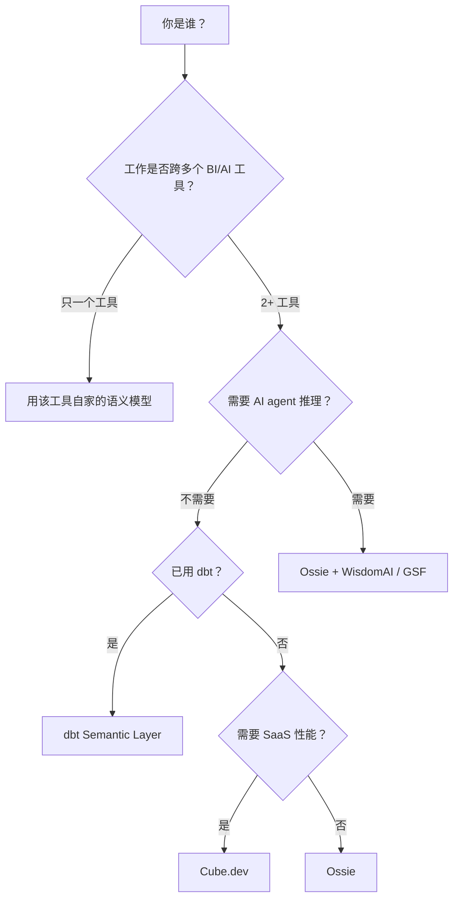

# Comparisons · 横向对比与选型

> **Abstract** — Detailed comparison of Ossie with dbt Semantic Layer / MetricFlow, Cube.dev, LookML, and MetricFlow. Each section covers: positioning, schema expressiveness, ecosystem reach, performance characteristics, AI-agent integration, and a "when to choose" verdict. Ends with a decision tree mapping toolstack → recommended choice.

> **【为用户】** 不知道 Ossie / dbt / Cube / LookML 选哪个？来这里。
>
> **【为开发者】** 跨产品概念对比——理解 Ossie 在生态里的位置。
>
> **【为架构师】** 选型决策树 + 长期演化路径。

## 1. Ossie vs dbt Semantic Layer / MetricFlow

### 1.1 定位差异

| 维度 | **Ossie** | **dbt Semantic Layer / MetricFlow** |
|---|---|---|
| 性质 | 中立**规范**（spec） | dbt Labs 自家**实现** |
| 互操作 | 11 vendor converters 转出 | dbt ↔ 仓库（自家桥） |
| AI grounding | 显式 `ai_context`（§2.8） | 隐式（metric descriptions） |
| 开源治理 | Apache Podling | dbt Labs 控制 |
| 运行时 | 不提供 runtime | dbt Cloud / Foundry 提供 |
| 跨 BI | 是（Snowflake / Tableau / Looker…） | 部分（Tableau 桥） |

### 1.2 概念映射

| Ossie | dbt Semantic Layer / MetricFlow |
|---|---|
| `SemanticModel` | `semantic_models` YAML |
| `Dataset` | `model` / `entity` |
| `Field` | `dimension` / `time_dimension` |
| `Metric` | `metric` |
| `Relationship` | `entity` + `metricflow` 隐式 |
| `custom_extensions` | `meta:` 字段 |
| `ai_context` | `description:` + `tags:` |

### 1.3 字段差异

| 能力 | Ossie | dbt SL |
|---|---|---|
| `aggregation_method` 显式 | 🚧 0.2.0+ 计划 | ✅ SUM/AVG/COUNT_DISTINCT |
| `derived` / `cumulative` metric | 🚧 0.2.0+ 计划 | ✅ `derived_metric` |
| `filter` 复用 | 🚧 0.2.0+ 计划 | ✅ `filter` |
| `grain` 声明 | 🚧 0.2.0+ 计划 | ✅ `entity` 隐式 |
| `dimension_type` 枚举 | 🚧 0.2.0+ 计划 | ✅ categorical / time |
| `metric_aggregation_params` | ❌ | ✅ |
| `expr` 多方言 | ✅ 7 方言 | ❌ 单方言（dbt Jinja） |
| Ontology 层 | ✅ 概念互操作 | ❌ |

### 1.4 选哪个？

- **用 dbt Semantic Layer**：已经在 dbt 生态内、单仓库管理、需要 runtime query 引擎。
- **用 Ossie**：跨多 BI 工具、需要 AI-agent grounding、想 vendor-neutral。
- **混用**：用 `ossie-dbt` converter 把 dbt semantic_models 转 Ossie，再导出到 Tableau / Looker / Snowflake 的下游。

## 2. Ossie vs Cube.dev

### 2.1 定位差异

| 维度 | **Ossie** | **Cube.dev** |
|---|---|---|
| 性质 | 规范 | 后端引擎 + 前端 SDK |
| 部署 | 文件存储 | 自托管 SaaS / Cloud |
| pre-aggregation | 不涉及 | 内置（rollup） |
| API gateway | 无 | 有（REST / GraphQL） |
| 缓存 | 由 consumer 决定 | 内置多级缓存 |
| 学习曲线 | 低（读 YAML） | 中（REST DSL） |

### 2.2 概念映射

| Ossie | Cube |
|---|---|
| `SemanticModel` | `cube`（多个） |
| `Dataset` | `cube` |
| `Field` | `dimension` / `measure` |
| `Metric` | `measure` |
| `Relationship` | `joins` |
| `custom_extensions` | `meta:` |
| `ai_context` | `title` / `description` |

### 2.3 何时选 Cube？

- 需要 pre-aggregation 加速查询
- 需要 GraphQL / REST API 给前端
- 需要 SaaS 托管（Cube Cloud）

### 2.4 何时选 Ossie？

- 不想引入 backend SaaS
- 想要 file-based 版本控制
- 需要 spec 跨多工具转换

## 3. Ossie vs LookML

### 3.1 定位差异

| 维度 | **Ossie** | **LookML** |
|---|---|---|
| 性质 | 开放规范 | Looker 私有 DSL |
| 部署 | 文件存储 | Looker 平台 |
| 厂商绑定 | 0（Apache） | 100%（Google/Looker） |
| 学习曲线 | 低（YAML） | 中（LookML 特有语法） |
| 生态 | 11+ converters | Looker + Snowflake integrations |

### 3.2 概念映射

| Ossie | LookML |
|---|---|
| `SemanticModel` | `model` |
| `Dataset` | `view` |
| `Field` (`dimension`) | `dimension` |
| `Field` (`measure`) | `measure` |
| `Metric` | `measure` (top-level) |
| `Relationship` | `join` |
| `custom_extensions` | `measure:` extension |

### 3.3 关键差异

- **Looker 闭源**：LookML 只能跑在 Looker 平台；Ossie 跑在任意工具栈。
- **LookML 的 derived table**：SQL 子查询物化；Ossie 用 SQL 表达式（不物化）。
- **LookML 的 templated_filter**：Ossie 暂缺（Roadmap #5）。

### 3.4 何时选 Ossie？

- 想要 vendor-neutral
- 不想锁定 Google/Looker 平台
- 团队已用 dbt / Snowflake / 自家 query 引擎

## 4. Ossie vs MetricFlow（聚焦）

> MetricFlow 是 dbt Labs 开源的 query DSL（仓库 `dbt-labs/metricflow`）。

| 维度 | Ossie | MetricFlow |
|---|---|---|
| 类型 | 长期持久化规范 | 短期 runtime query 生成 |
| 持久化 | YAML / JSON | Python 对象 / parquet |
| 数据来源 | Vendor converters | dbt projects |
| 集成 | 11 vendor SPI | dbt 仓库 |
| 演化节奏 | Apache podling（季度） | dbt Labs（月中） |

**两者互补**：Ossie 是**交换规范**，MetricFlow 是**查询引擎**。`ossie-dbt` converter 把 Ossie 转 dbt Semantic Interface 后，MetricFlow 才能 query。

## 5. Ossie vs 行业 ontology（Schema.org / FIBO / GS1）

| 维度 | Ossie | Schema.org | FIBO | GS1 |
|---|---|---|---|---|
| 领域 | 通用 BI | Web 通用 | 金融 | 零售供应链 |
| 形式 | YAML/JSON | JSON-LD/RDF | OWL | OWL |
| 工具 | 11 converters | 搜索引擎 | 金融监管 | 商品编码 |
| 范围 | 通用 | 通用 | 金融 | 零售 |

**关系**：Ossie 的 ontology 层（§10）可以**reference** Schema.org/FIBO 的概念——但 Ossie 不与它们竞争。

## 6. Ossie vs Metadata Catalogs（Atlan / DataHub / Amundsen）

| 维度 | Ossie | Metadata Catalogs |
|---|---|---|
| 存储 | 文件 | 数据库 |
| 范围 | 语义模型定义 | 元数据 + lineage |
| 写者 | 数据建模者 | 自动采集 |
| AI 集成 | ai_context 字段 | RAG over metadata |

**关系**：Ossie 作为**建模层**；Catalog 作为**采集层**。Polaris 转换器（§7.3.1）把 Iceberg catalog 表导入 Ossie；反过来 Ossie 模型可被 Polaris 等 catalog 引用。

## 7. Ossie vs MCP（Model Context Protocol）

| 维度 | Ossie | MCP |
|---|---|---|
| 范围 | 语义模型 | LLM tool 协议 |
| 形式 | YAML/JSON | JSON-RPC |
| 用途 | 跨工具语义交换 | LLM 工具调用 |

**关系**：**两者互补**。Ossie 提供语义数据模型；MCP 提供 LLM 访问结构化数据的协议。AI agent 通过 MCP 工具调用某个"SQL executor"，而 SQL executor 用 Ossie 加载语义模型生成查询。

## 8. 选型决策树

### 决策矩阵

| 你的工具栈 | 推荐 | 理由 |
|---|---|---|
| 纯 dbt，单一 BI | dbt semantic_models | 单一数据栈，无翻译开销 |
| dbt + 2+ BI 工具 | Ossie + dbt converter | 一份模型多端输出 |
| Snowflake + Tableau + AI agent | Ossie + Snowflake + Wisdom/GSF | AI-native 路径 |
| Looker 平台 | LookML | 厂商锁定深度集成 |
| 金融业 + 监管报告 | Ossie + Ontology + dbt | ontology 对齐监管语义 |
| 跨云（AWS/Azure/GCP） | Ossie 双方向 converter | 跨云语义一致 |
| MDM / catalog 主导 | Polaris + Ossie | 1 namespace 1 model |
| 实时 API | Cube.dev | 预聚合 + REST API |
| 个人/小团队 | LookML Free | 简单上手 |

## 9. 信息时效性

> ⚠️ **实现状态提醒**：本手册基于 2026-08-11 仓库快照。各竞品可能在更新：
> - dbt Semantic Layer 1.x → 2.x 正在演进
> - Cube Cloud 持续迭代
> - LookML 4.0 仍是主流
> - 读者应自行验证最新功能对比

## 9.1 📌 章节要点速查

| 读者 | 一句话要点 |
|---|---|
| 用户 | 跨多工具 → Ossie；只用 dbt → dbt SL；Looker → LookML；需要实时 API → Cube |
| 开发者 | 概念映射表是写 converter 的反向参考 |
| 架构师 | 决策树是选型起点；Ossie 与 dbt/Cube/MCP 互补而非替代 |