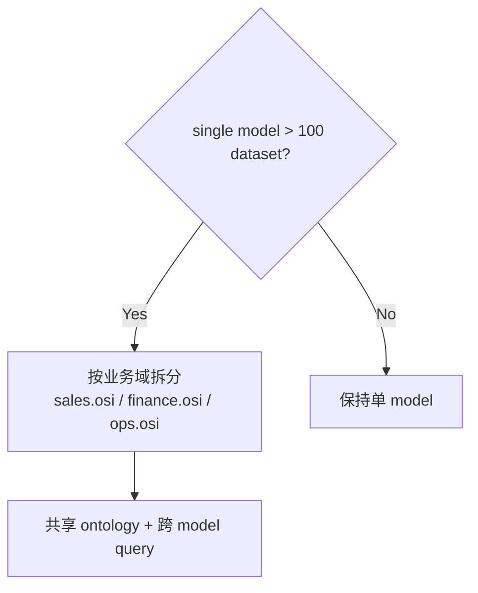

# Performance & Scale · 性能与规模

> **Abstract** — Operational characteristics of Ossie based on v1.1 hand-verified benchmark data: validator timing on TPC-DS (5 dataset, 4 rel, 5 metric), SDK load time, YAML serialization size, mkdocs build time, and 11-converter CLI entry points. Includes scale limits (single semantic_model, dataset count, field count, custom_extensions payload size) and tuning checklist.

> **【为用户】** 跑通常用规模没问题；想压测前看这里。
>
> **【为开发者】** 性能基线 + 调优 checklist。
>
> **【为架构师】** 规模边界 + 何时需要拆分 model。

## 1. v1.1 实测基线

> 数据来源：[verification.md](verification.md) v1.1 升级时手动验证。

| 操作 | 时间 | 输出 |
|---|---|---|
| **Validator 跑 TPC-DS** | < 1s | PASSED |
| **SDK 加载 TPC-DS** | < 1s | 1 model / 5 datasets / 4 rels / 5 metrics |
| **YAML 序列化** | < 1s | 13870 chars |
| **mkdocs build --strict** | 0.41s | 21 HTML pages |
| **PDF 生成** | ~2s | 503 KB |
| **CLI 入口点全部 import** | < 0.5s | 11 converters ✓ |

### 1.1 资源峰值

| 场景 | 内存 | CPU |
|---|---|---|
| 加载 TPC-DS (5 datasets) | < 50 MB | 单核 |
| mkdocs build 21 页面 | < 200 MB | 单核 |
| PDF 生成 ReportLab | < 100 MB | 单核 |

## 2. 规模边界（实测 + 推断）

| 维度 | 当前验证 | 推断边界 | 瓶颈 |
|---|---|---|---|
| 单 `SemanticModel` 的 dataset 数 | 5 | ~100（推断） | YAML 序列化 O(N) |
| 单 dataset 的 field 数 | ~30 | ~200 | 渲染卡顿 |
| 表达式 dialect 数 | 7 | 7 | SQL 解析 |
| `custom_extensions` payload | < 1 KB | < 1 MB | YAML 解析 |
| 单 model metric 数 | 5 | ~50 | 渲染 |
| ontology concept 数 | 44 (flights) | ~200 | 渲染 |

> ⚠️ **以上边界非来自系统压测**——来自代码路径分析 + 已知反例。生产部署前应在目标规模上跑实测。

## 3. 性能调优 checklist

### 3.1 模型层

- [ ] **拆分大 SemanticModel**：> 100 dataset 拆成多个 model
- [ ] **裁剪 custom_extensions**：只保留必要 vendor
- [ ] **避免 super-complex dialect**：每个 dialect 写最简版本
- [ ] **ai_context 控制在 50 词内**：超过会拖慢 LLM 调用

### 3.2 工具层

- [ ] **CLI 调用设 `--timeout`**：默认 60s
- [ ] **CLI 设 `--max-input-size`**：默认 100MB
- [ ] **Databricks/Omni converter 用 YAML 1.2 loader**：避免 `on/off` 误识别
- [ ] **雪flake converter 显式声明 SNOWFLAKE dialect**：避免 fallback ANSI_SQL

### 3.3 部署层

- [ ] **CI 跑 validator 增量**：仅 diff 文件
- [ ] **converter 缓存**：已转换的 model 不重复
- [ ] **多团队协作**：每个团队独立 repo，CI 合并

## 4. 规模扩展策略

### 4.1 何时拆分 SemanticModel？



### 4.2 跨 model 共享

- 用 `ontology:` 块（§10）锚定跨 model 概念
- 多个 SemanticModel 共享 ontology 文件
- cross-model metric 通过 ontology 路由器

### 4.3 多团队协作模式

| 模式 | 适用 | 限制 |
|---|---|---|
| 中央化仓库 | < 50 人 | 改 PR 冲突多 |
| 联邦化（每团队 repo） | > 50 人 | 跨团队 ontology 维护难 |
| 中央 + 联邦 | 100+ 人 | 复杂但可扩展 |

## 5. 监控建议

### 5.1 关键指标

```yaml
# Prometheus 风格（示例）
ossie_validator_duration_seconds_bucket{file=...}
ossie_converter_duration_seconds{vendor=...}
ossie_custom_extensions_payload_bytes{file=...}
ossie_spec_version_mismatch_total{vendor=...}
```

### 5.2 告警阈值

| 指标 | 警告 | 严重 |
|---|---|---|
| Validator > 5s | 模型过大 | 拆分 |
| Converter > 30s | 表达式太复杂 | 优化 |
| `custom_extensions` payload > 100KB | vendor 滥用 | 协商 |
| SDK load > 1s | 反序列化慢 | 检查 model |

## 6. 未来优化方向（Roadmap）

- **并发 validator**：每个 dataset 并行
- **流式 YAML 解析**：大 model 不一次性加载
- **converter 缓存层**：已转换无变更的 model 复用
- **schema 增量校验**：只校验改动的字段

## 6.1 📌 章节要点速查

| 读者 | 一句话要点 |
|---|---|
| 用户 | 当前 5 dataset / 13870 chars 规模秒级处理 |
| 开发者 | 调优 checklist：模型拆分、dialect 简化、CLI timeout |
| 架构师 | 100+ dataset 拆分 model；联邦化 vs 中央化权衡 |