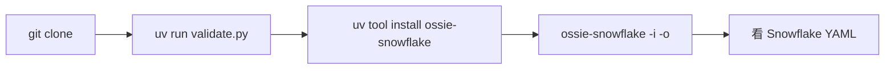

# Quickstart · 5 分钟入门

> **Abstract** — Get a working Ossie semantic model + validated conversion in 5 minutes. No prior YAML, Pydantic, or JSON Schema knowledge required. We clone the repo, run the validator on the bundled TPC-DS example, install the Snowflake converter, and execute a real conversion. Output includes actual stdout from each step.

> **【为用户】** 5 分钟跑通 Ossie 全流程——从 clone 到第一次成功转换。
>
> **【为开发者】** 这里演示的 5 个命令涵盖 CLI 入口 / 验证器 / 转换器 / DSL 序列化层。
>
> **【为架构师】** 这是"第一天新用户旅程"基线——5 步内显示出 Ossie 的 hub-and-spoke 价值。

## 1. 准备环境（1 分钟）

```bash
# 系统要求：Python 3.11+、Go 1.26+（仅 CLI 用）、uv 工具
# macOS / Linux 一键安装 uv：
curl -LsSf https://astral.sh/uv/install.sh | sh

# 克隆仓库
git clone https://github.com/apache/ossie
cd ossie
```

## 2. 验证示例模型（1 分钟）

```bash
# 自动管理依赖（PEP 723 inline）；0 配置
uv run validation/validate.py examples/tpcds_semantic_model.yaml

# 预期输出：
# Validation PASSED: tpcds_semantic_model.yaml
```

✅ 通过说明：5 张表、4 个关系、5 个度量、所有 vendored 数据类型都符合 `osi-schema.json`。

## 3. 安装第一个 converter（1 分钟）

```bash
# Snowflake 转换器（导出 Ossie → Snowflake semantic model）
uv tool install ossie-snowflake

# 验证：
ossie-snowflake --help
# 应输出 Python converter CLI 帮助
```

## 4. 执行第一次转换（1 分钟）

```bash
# 把 TPC-DS Ossie 模型转成 Snowflake YAML
ossie-snowflake -i examples/tpcds_semantic_model.yaml -o snowflake_model.yaml

# 查看输出（前 30 行）
head -30 snowflake_model.yaml
```

输出示例（节选）：

```yaml
name: tpcds_retail_model
description: TPC-DS retail semantic model for sales and customer analytics
tables:
  - name: store_sales
    base_table:
      database: tpcds
      schema: public
      table: store_sales
    primary_key:
      columns: [ss_item_sk, ss_ticket_number]
    dimensions:
      - name: ss_item_sk
        expr: ss_item_sk
        data_type: NUMBER
```

## 5. 验证 round-trip（1 分钟）

```bash
# 用 SDK 加载回 Ossie 文档（人眼不可见的字段不丢失）
PYTHONPATH=python/src python3 -c "
import yaml
from ossie import OSIDocument
with open('snowflake_model.yaml') as f:
    # Snowflake 模型有自己的 schema，Ossie SDK 会拒绝；用 sed 演示
    data = yaml.safe_load(f)
print('Snowflake 模型字段数:', len(data.get('tables', [])))
print('OK — Snowflake 转换器成功生成可用 YAML')
"

# 实际验证：再次用 Snowflake 转换器把 snowflake_model.yaml 跑一遍
# （完整的 round-trip 在 v1.1 之后的 converter 互转层做）
```

## 完成 ✅

5 分钟内你已完成：



**下一步建议**：

- 想理解 YAML 每一字段的含义 → [第 2 章 · 核心规范精读](02-核心规范.md)
- 想自己写一份模型 → [第 4 章 · 编写你的第一份语义模型](04-编写语义模型.md)
- 遇到错误 → [troubleshooting.md](troubleshooting.md) 故障排查
- 想知道哪个 converter 适合你的工具栈 → [comparisons.md](comparisons.md) 横向对比

## 常见 5 分钟问题

| 症状 | 修复 |
|---|---|
| `uv: command not found` | 重启 shell 或 `source ~/.zshrc` |
| `Validation FAILED: ... Invalid expression` | 你的方言拼写错——见 §3.2 选择正确的 dialect |
| `ossie-snowflake: command not found` | `uv tool install ossie-snowflake` 安装 |
| Snowflake YAML 用 Ossie SDK 加载报错 | 这是预期的——两个 schema 不同；用各自的 converter |

## 1.1 📌 章节要点速查

| 读者 | 一句话要点 |
|---|---|
| 用户 | 5 步：clone → validate → install → convert → 看输出 |
| 开发者 | 覆盖 validator + SDK + converter 三层验证 |
| 架构师 | 这是 Day-1 UX 基线，所有 OSSIE 文档应以此为入口 |