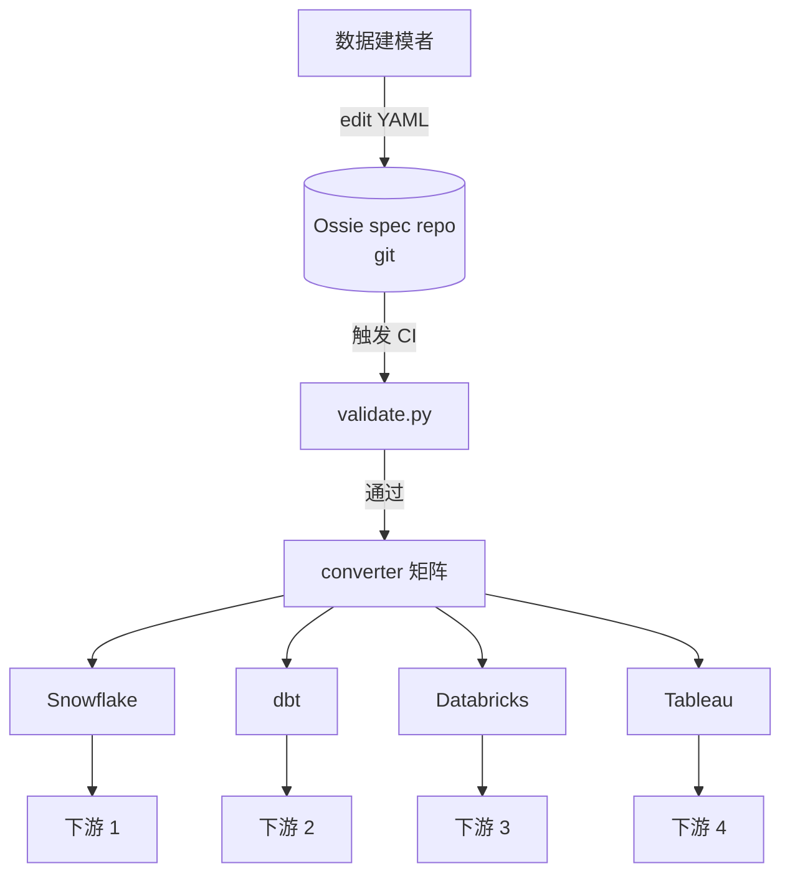
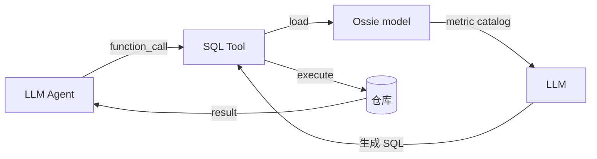
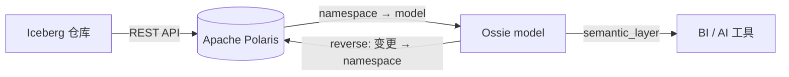
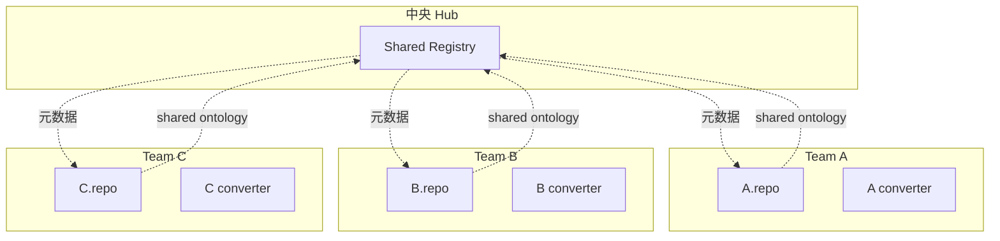
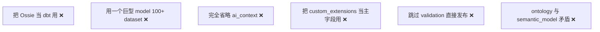

# Reference Architectures · 4 种集成模式

> **Abstract** — Four reference deployment patterns for Ossie: (A) Single Source of Truth, (B) AI Agent with semantic grounding, (C) Catalog integration with Polaris, (D) Multi-team hub. Each pattern includes an ASCII topology diagram, the converter stack required, the maintained contract, and a "when to choose" verdict.

> **【为用户】** 不知道 Ossie 在我的架构里怎么落地？4 个模式选一个。
>
> **【为开发者】** 哪种模式影响 converter 选型。
>
> **【为架构师】** 4 种集成模式 + 选型矩阵 + 维护成本。

## 模式 A：单一真相源（Single Source of Truth）

**应用场景**：
- 单团队管理中央仓库
- 改一次 → 多个下游同步
- 审计和版本控制简单

**converter 选型**：
- 出口：Snowflake / dbt / Databricks / Tableau / Salesforce
- 入口：自上而下（不存在）

**维护成本**：低（中央仓库）
**风险**：单点失败（如果 repo 改坏了）

## 模式 B：AI Agent 推理

**应用场景**：
- 给非技术用户自然语言查询能力
- LLM 需要准确知道 metric 含义

**converter 选型**：
- 出口：WisdomAI / NVIDIA GSF / GoodData（LLM-friendly）
- 入口：Collector 收集 LLM 反馈回 model

**关键技术**：
- `ai_context.synonyms` 让 LLM 识别业务术语
- `ai_context.examples` 提供 few-shot query
- `custom_extensions[LITELLM]` 携带 token budget

**维护成本**：中（需更新 ai_context）
**风险**：LLM hallucination（即使有 grounding）

## 模式 C：Catalog 集成（Polaris）

**应用场景**：
- 已有 Iceberg 仓库
- 想从 Iceberg schema 自动生成 Ossie semantic model
- 双向 sync（schema 变更 → model 变更）

**converter 选型**：
- 入口：Polaris（唯一连 live catalog）
- 出口：取决于下游（Snowflake / dbt / Databricks）

**关键技术**：
- `identifier-field-ids` → `primary_key`
- Iceberg types → Ossie datatypes
- table properties → `custom_extensions[POLARIS]`

**维护成本**：中（需 Polaris 凭据 + 双向 sync）
**风险**：Polaris 故障 → 全链路中断

## 模式 D：多团队 Hub

**应用场景**：
- 50+ 团队组织
- 共享 ontology（Customer / Order / Product）
- 跨团队 cross-model query

**converter 选型**：
- 每个团队独立维护 converter
- 共享 ontology（中央 repo）
- cross-model query 通过 ontology 路由器

**关键技术**：
- 中央仓库放 ontology + 共享 model
- 中心 registry 索引所有团队 model
- 跨团队 query 通过 ontology 锚定

**维护成本**：高（需 governance、PR review、conflict resolution）
**风险**：onboarding 复杂；新团队需学 ontology

## 选型矩阵

| 你的处境 | 推荐模式 | 理由 |
|---|---|---|
| 单团队 / < 20 人 | A 单一真相源 | 简单、可控 |
| LLM 应用 / Agent Builder | B AI Agent | grounding 关键 |
| 已有 Iceberg / 湖仓 | C Catalog 集成 | 复用现有数据 |
| 50+ 团队 / 多 BU | D 多团队 Hub | 治理 + 跨团队 |
| 想试水 | A → 后续升级到 B/C/D | 从小做起 |

## 反模式（不要做）

| 错误 | 后果 |
|---|---|
| 把 Ossie 当 dbt 用 | 失去 hub-and-spoke 价值 |
| 巨型 model | 性能 + 维护双重恶化 |
| 省略 ai_context | AI agent 失去 grounding |
| 滥用 custom_extensions | 失去 spec 约束 |
| 跳过 validation | 下游 converter 异常 |
| ontology 矛盾 | 跨模型 query 错乱 |

## 7.1 📌 章节要点速查

| 读者 | 一句话要点 |
|---|---|
| 用户 | 4 模式对应 4 种组织规模 |
| 开发者 | converter 选型跟模式走 |
| 架构师 | 6 个反模式先记牢 |