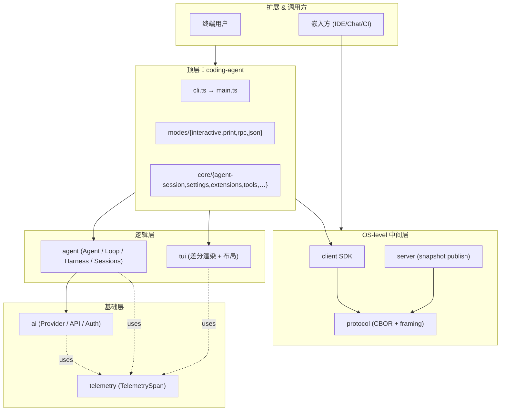

# 01 · 项目全景

> 一句话先答：**pi 是一个自扩展的多 provider LLM 编码代理**，核心极简，所有非核心能力都通过 Extension 接入；同时以独立 `client` / `server` 包把能力外置为远程进程协议。仓库是 `@earendil-works/*` 命名空间下的 npm workspace 单仓多包。

## 1.1 三视角入口

- **如果你想用好 pi**：先看 [02-getting-started.md](02-getting-started.md) 与 [16-print-rpc.md](16-print-rpc.md)，然后跳到 [18-debug-and-recovery.md](18-debug-and-recovery.md) 的 cookbook 节。
- **如果你想给 pi 写扩展 / 修工具 / 排 bug**：从 [03-architecture.md](03-architecture.md) 起，按 [06-extensions.md](06-extensions.md) → [07-tools.md](07-tools.md) → [04-agent-runtime.md](04-agent-runtime.md) 的顺序读；事件契约细节在 [06-extensions.md](06-extensions.md) 第 4 节。
- **如果你想评估 pi 的设计、为团队引入或扩展核心**：从 [03-architecture.md](03-architecture.md) 与 [04-agent-runtime.md](04-agent-runtime.md) 进入，再到 [17-deployment.md](17-deployment.md) 看供应链与发布。所有章的 "架构师视角" 子节会显式标出权衡。

## 1.2 仓库布局

```
pi/                                    # @earendil-works/* 命名空间的 monorepo
├── packages/
│   ├── telemetry/                     # 与厂商无关的可观测性契约；no-op 默认；in-memory 测试适配
│   ├── tui/                           # 终端 UI 库（差分渲染、布局、组件）
│   ├── ai/                            # 多 provider LLM API（OpenAI / Anthropic / Google / Bedrock / …）
│   ├── agent/                         # 代理运行时：Agent / AgentLoop / reducer / tools / sessions / harness
│   ├── session-backends/sqlite-node/  # SQLite 会话存储后端（实际以子目录隐含于本仓示例/内部使用）
│   ├── protocol/                      # 客户端/服务器 wire 协议（CBOR + length-prefixed framing）
│   ├── client/                        # 客户端 SDK
│   ├── server/                        # 服务端实现（多 session、snapshot 发布）
│   ├── coding-agent/                  # `pi` 二进制：CLI、TUI、print、rpc、扩展 host
│   └── evals/                         # 评测 harness
├── scripts/                           # pinned-deps / shrinkwrap / 模型目录生成 / release
├── handbook/                          # 本文档
├── test.sh / pi-test.sh               # 隔离 HOME 的测试 / 从源码启动 CLI
├── AGENTS.md                          # 自动加载的强制项目规则
├── CLAUDE.md / tui-plan.md            # 给 AI agent 的指引 + TUI 长期设计目标
└── README.md / CONTRIBUTING.md / SECURITY.md
```

⚠ **注意**：`packages/session-backends/sqlite-node/` 在本仓内是历史命名；当前 `agent` 包已收编 `session/jsonl/` 与 `memory / search / state` 等模块，真正的"session 持久化"在 `packages/agent/src/harness/session/`。`session-backends` 路径只在 `coding-agent` 的某些 workspace 配置里作为可选 external 出现，第 5 章详解。

## 1.3 设计原则

1. **依赖单向**：下层不知道上层存在；上层依赖下层契约。已知的 3 处例外在 [03-architecture.md](03-architecture.md) 里展开。
2. **接口最小**：跨层只导出少量契约（如 `AgentTool`、`ClientMessage`、`ServerMessage`）；其余通过事件 + reducer 表达。
3. **可观测性内建**：`TelemetrySpan` 不依赖任何运行时，被所有上层共用；默认 no-op。
4. **生成物 / 手写物严格分离**：模型目录、provider 模型定义由脚本生成；手写的只有 schema 与 override 表。
5. **核心极简、扩展承担非核心**：`CONTRIBUTING.md` 的开篇原则——`pi's core is minimal. If your feature does not belong in the core, it should be an extension.`

## 1.4 项目全景图



> 这张图说明什么：**箭头都从上层向下层**——这就是 pi 的设计契约。除 CLIENT/SERVER↔PROT 是对等协议层之外，其他依赖都是单向的。右侧两个 dotted 箭头标识 `telemetry` 被多处横向引用。

## 1.5 版本与约束（项目级速查）

| 维度 | 规则 |
| --- | --- |
| Node 版本 | `>= 22.19.0` |
| 直连依赖 | 全部精确锁版本（`.npmrc`：`save-exact=true`、`min-release-age=2`） |
| Workspace 版本 | 所有包**锁步发布**；`patch` = fix + add，`minor` = breaking；项目另有 `release:major`，详见 [17-deployment.md](17-deployment.md)。 |
| TypeScript | **仅 erasable syntax**（无 `enum` / `namespace` / 参数属性 / `import =`）。 |
| Lint / Format | Biome。 |
| 类型检查 | `tsgo --noEmit`。 |
| 模型数据 | 由 `packages/ai/scripts/generate-models.ts` 生成；不要手编 `models.generated.ts`。 |

## 1.6 仓库协作硬规则

多个 pi session 可能同时在本仓 cwd 工作：

- 只 `git add` 你改过的文件；**不要 `git add -A`**。
- 严禁 `git reset --hard` / `git checkout .` / `git clean -fd` / `git stash` / `git commit --no-verify`。
- rebase 冲突只解决自己改过的文件；非自己引发的冲突先 abort 再问用户。
- 提交消息格式：`{feat,fix,docs}[(ai,tui,agent,coding-agent)]: <commit message>`。本手册提交前缀 `docs(handbook):`。

完整规则见 `AGENTS.md`；本手册不重复。

## 1.7 跳读建议

按从浅到深的三档：

1. **快速了解**：本文 + [02-getting-started.md](02-getting-started.md) + [16-print-rpc.md](16-print-rpc.md)。
2. **会用 pi**：追加 [18-debug-and-recovery.md](18-debug-and-recovery.md) 的 cookbook 节。
3. **会改 pi**：追加 [03-architecture.md](03-architecture.md) → [04-agent-runtime.md](04-agent-runtime.md) → [06-extensions.md](06-extensions.md) → [07-tools.md](07-tools.md) → [08-llm-providers.md](08-llm-providers.md)。
4. **会评估 pi**：追加 [10-client-server.md](10-client-server.md) → [14-settings-and-config.md](14-settings-and-config.md) → [17-deployment.md](17-deployment.md)；每章的 "架构师视角" 子节会标出权衡。
