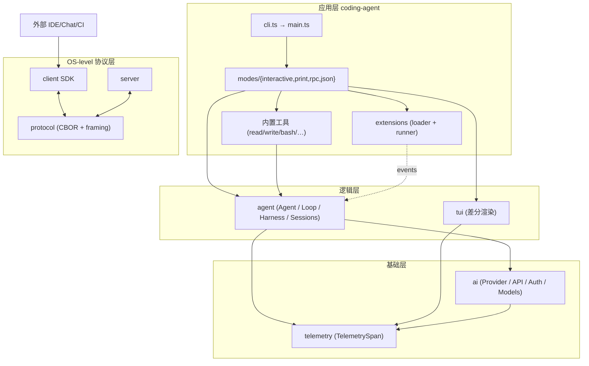
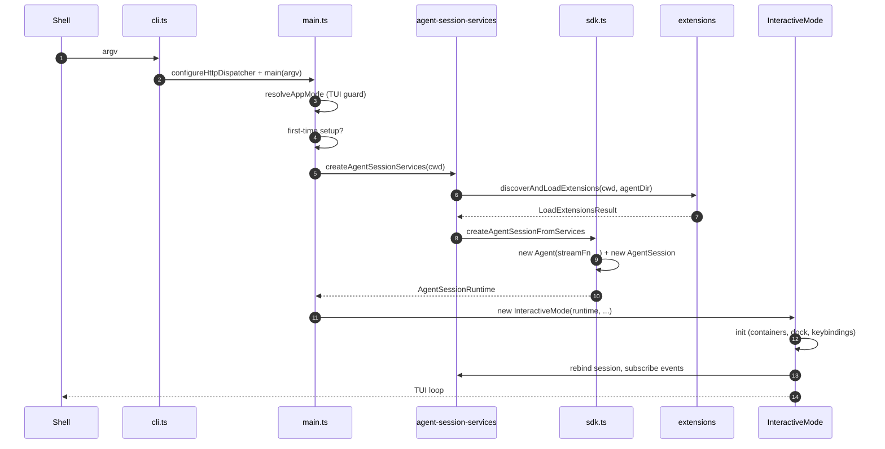

# 03 · 分层架构

> 本章回答两个问题：**pi 是怎么分层的、各层之间的契约是什么、哪里有例外**。
> 跨层只导出少量契约，其余通过事件 + reducer 表达。

## 3.1 设计契约

依赖单向——箭头一律向下，下层对上层一无所知。这是 pi 设计的"宪法"。本章最后一节列出**已知的 3 处局部例外**，方便在评审时不至于把它们当 bug 报告。

## 3.2 9 个包的依赖矩阵

| 包 | 直连三方依赖 | 直连 workspace 依赖 |
| --- | --- | --- |
| `packages/telemetry` | (无) | (无) |
| `packages/tui` | `get-east-asian-width`、`marked` | (无) |
| `packages/ai` | `@anthropic-ai/sdk`、`@aws-sdk/client-bedrock-runtime`、`@opentelemetry/api`、`openai`、`@google/genai`、`@mistralai/mistralai`、`partial-json`、`typebox` 等 | `@earendil-works/pi-telemetry` |
| `packages/agent` | `diff`、`ignore`、`typebox`、`yaml` | `@earendil-works/pi-ai`、`@earendil-works/pi-telemetry` |
| `packages/protocol` | `typebox` | (无) |
| `packages/client` | (无) | `@earendil-works/pi-protocol` |
| `packages/server` | (无) | `@earendil-works/pi-ai`、`@earendil-works/pi-protocol` |
| `packages/coding-agent` | `chalk`、`cross-spawn`、`diff`、`glob`、`grok-mermaid`、`highlight.js`、`hosted-git-info`、`ignore`、`jiti`、`minimatch`、`proper-lockfile`、`semver`、`typebox`、`undici`、`yaml`、`@silvia-odwyer/photon-node` | `@earendil-works/pi-agent-core`、`@earendil-works/pi-ai`、`@earendil-works/pi-client`、`@earendil-works/pi-protocol`、`@earendil-works/pi-tui` |
| `packages/evals` (private) | `vitest-evals` | `@earendil-works/pi-ai`、`@earendil-works/pi-coding-agent` |

来源：`packages/<name>/package.json`。`evals` 是私有 workspace，与 `coding-agent` 平级，不进主链路。

## 3.3 分层图（含请求流）

> 这张图说明什么：**所有箭头都从上层指向下层**。虚线表示事件流——扩展订阅 agent 的事件，但 agent 不知道订阅者是谁。`telemetry` 被横切引用，本身没有依赖。

## 3.4 每一层的边界与职责

| 层 | 入口 | 职责 | 不知道什么 |
| --- | --- | --- | --- |
| `telemetry` | `index.ts`（`TelemetryContext` / `TelemetrySpan`） | 厂商无关 span/event 契约；no-op 默认；in-memory 测试适配 | LLM、UI、agent |
| `tui` | `tui.ts` / `tui-main-screen.ts` / `components/*` | 差分渲染终端；布局节点；组件树；输入；overlay；focus | LLM、agent |
| `ai` | `index.ts`（`streamSimple`、providers） | Provider 适配；OAuth；模型目录；鉴权 | TUI、agent |
| `agent` | `agent.ts` / `agent-loop.ts` / `harness/*` | 状态机；reducer；工具执行；session；compaction | TUI；具体 provider |
| `protocol` | `codec.ts` / `schemas.ts` / `framing.ts` | CBOR 编码 + TypeBox 校验 + length-prefix framing | agent；UI |
| `client` | `client.ts` / `connection.ts` / `transport.ts` | protocol 之上的握手、错误恢复、流控 | UI；agent |
| `server` | `server.ts` / `sessions.ts` / `snapshots.ts` | 对端实现；live session 管理；快照发布 | UI；agent（部分例外，见 §3.7） |
| `coding-agent` | `cli.ts` / `main.ts` / `modes/*` | CLI 装配；模式分发；扩展 host；UI 装配 | （顶层，无上层） |

### 3.4.1 用户视角

你看到的**全部**体验都来自 `coding-agent`。当你在终端敲 prompt 时：

1. `cli.ts:7-20` 配置 undici dispatcher 与 process title，调用 `main(process.argv.slice(2))`。
2. `main.ts:117-128` 决定模式（仅在 stdin+stdout 是 TTY 时选 interactive）；`main.ts:660-665` 做 first-time-setup；`main.ts:672-699` 选中/创建 session；`main.ts:714-840` 的 `createRuntime` 闭包里做 project trust → services → model scope → `createAgentSession`。
3. `main.ts:925-956` 实例化 `InteractiveMode` 并 `run()`。

### 3.4.2 开发者视角

每一层都有非常清晰的子目录布局：

- `packages/agent/src/harness/session/{jsonl,memory,search,state,types}.ts` 是 session 子系统。
- `packages/ai/src/providers/*.ts` 与 `packages/ai/src/api/*.ts` 严格两分——前者负责身份，后者负责 wire。
- `packages/protocol/src/cbor/` 是自实现的 CBOR 编码，不依赖 npm `cbor`。
- `packages/coding-agent/src/core/` 是把上面所有拼起来的运行时。`modes/` 是入口适配层。

### 3.4.3 架构师视角

**契约**：跨层只导出少量类型与函数，如：
- `AgentTool`（agent → coding-agent）
- `AgentMessage` / `AgentEvent`（agent → ai/coding-agent）
- `Provider` / `Model` / `Context` / `Usage`（ai → coding-agent）
- `ClientMessage` / `ServerMessage`（protocol → client/server）
- `Extension` / `HandlerFn` / `RegisteredTool`（extensions types → coding-agent）
- `TelemetrySpan`（telemetry → 任意层）

其余逻辑通过事件 + reducer 表达，避免循环耦合。这是为什么 `agent-loop.ts:152-275` 只发 `AgentEvent`、从不自己保存消息。

## 3.5 启动一次会话的依赖图

> 这张图说明什么：**Extensions 在 AgentSession 构造之前加载**——这是为什么 `extensionRunnerRef` 能在 `Agent` 构造时作为钩子注册。`ModelRuntime` 也在 services 阶段就准备好，便于 `Agent.streamFn` 直接调 `streamSimple`。

## 3.6 三视角的失败模式

| 失败 | 用户视角 | 开发者视角 | 架构师视角 |
| --- | --- | --- | --- |
| 终端不能进 interactive | `pi` 直接走 print | `resolveAppMode` 判 TTY | "无 TTY 时退化"是有意行为 |
| 模型未配置 | `/model` 启动 selector | `ModelResolver` 抛错被 main 截获 | 让用户可显式选择，胜于隐式默认 |
| 项目未信任 | 启动期 `ctx.ui.select` | `resolveProjectTrusted` | trust 是默认 deny；扩展可改 |
| 扩展加载失败 | TUI 写一条 warning | `LoadExtensionsResult.errors` 累积 | 错误隔离——一个坏扩展不应拖垮整个 host |

## 3.7 已知 3 处局部例外（**不是 bug**）

> 这部分明确写出来，是为了减少"分层图明明说单向，这里怎么拐弯了"的困惑。

1. **`packages/agent/src/harness/session/` 实际位于 `packages/agent` 内**，不是独立的 `packages/session-backends`。`packages/session-backends/sqlite-node` 仅是可选的外部 storage 实现（与 `packages/agent/src/harness/session/jsonl` 是同一抽象的两个 backend）。所以**严格说 session 这一层没有独立的 npm 包**。
2. **`packages/server/package.json` 直接依赖 `@earendil-works/pi-ai`，但跳过 `agent`**。原因是当前 `packages/agent/src/harness/agent-harness.ts:347-507` 仍以 `HarnessNotImplemented` 桩形式存在；server 已在 `packages/server/src/server.ts` 重写了 live session 管理、snapshot publisher，并直接用 `ai` 包的 `streamSimple`。等 AgentHarness 落地后，这里会调整为 server → agent → ai。
3. **`packages/coding-agent` 直接依赖 `undici`（`packages/coding-agent/package.json:65`）**——这是顶层故意保留的传输层覆盖，而不是分层违例。它的用途是 raw HTTP 探针与 HTTP 代理注入点。`http-dispatcher.ts` 在 `core/` 里集中维护这个 dispatcher。

旧版 HANDBOOK 把"下层不知道上层"作为绝对原则写出来。这三条例外是设计组有意为之：协议层 vs 逻辑层的缝由 server 维护，session 实现以 backend 形式被选择性注入。理解了这三条，分层图就完整了。

## 3.8 用户视角下的"分层"意味着什么

当你在终端用 `pi`：

- **你跟 `coding-agent` 互动**，从不直接 import `ai` 或 `agent`。
- 当你 `/login` 触发鉴权，最终由 `ai/auth/resolve.ts` 把环境变量、OAuth 持久化、显式 flag 三类凭证归一。
- 当你 `/tree` 切 leaf，最终由 `agent/src/harness/session/jsonl/storage.ts:64-105` 加载 `tree.jsonl` 并校验 record-log 完整性。
- 当你 `/quit`，会经过一次 `session_shutdown` 事件，所有扩展能 hook 收尾——这一行你在终端看不到，但扩展作者会感谢。

## 3.9 小结

- 分层图能用来回答"这个改动应该落在哪一层？"
- 三条例外要记在心，避免误诊"破坏分层"。
- 真正的依赖图比"分层图"复杂——它包含了协议层的对偶（client ↔ server ↔ protocol）和协议对运行时层的偏序（server → ai 而非 server → agent）；这种偏序是**完成度**而非设计目标。
- 跨层接口稳定就是稳定，跨层接口演进靠 release notes 与 lockstep 版本号强同步——见 [17-deployment.md](17-deployment.md)。
